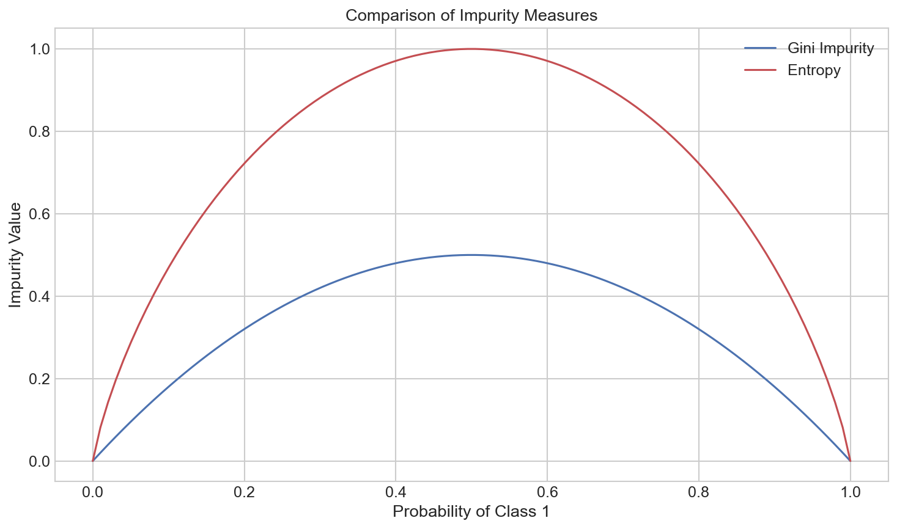
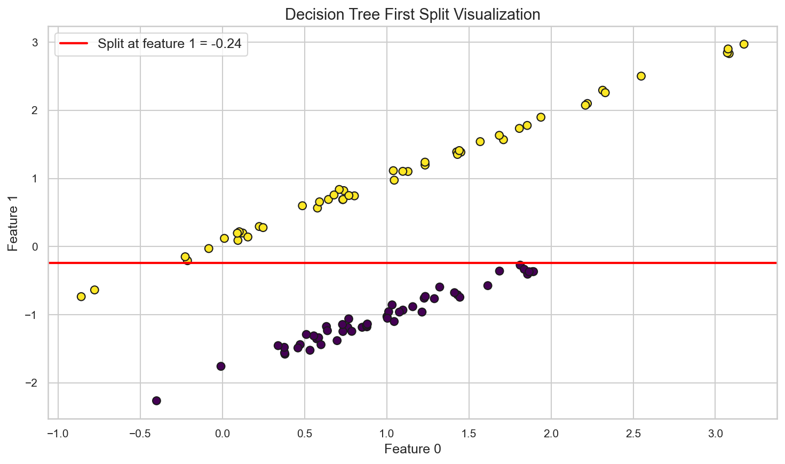
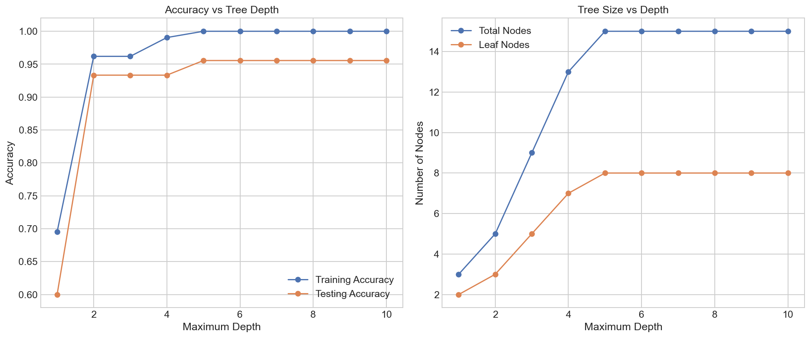
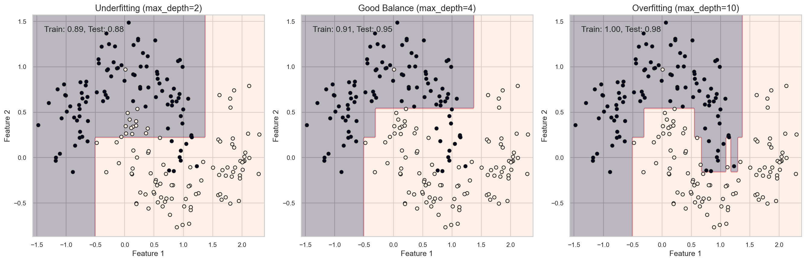
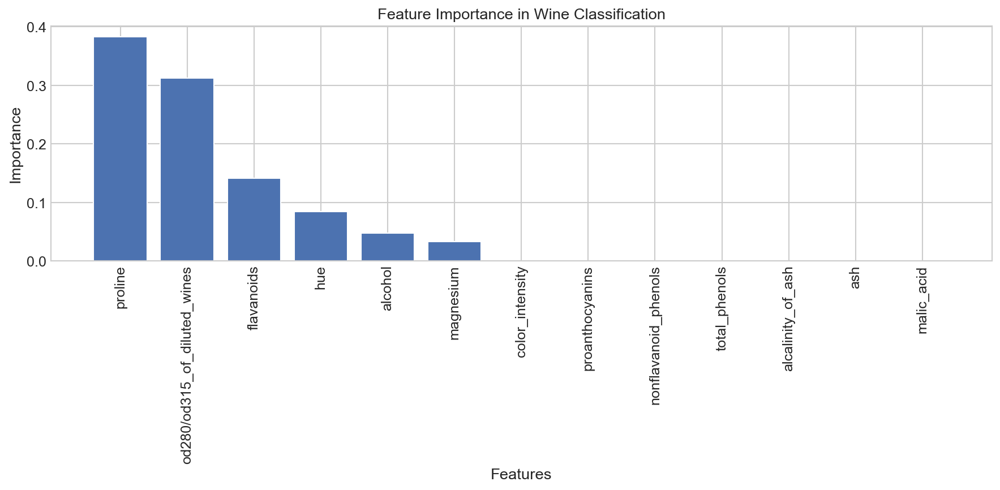
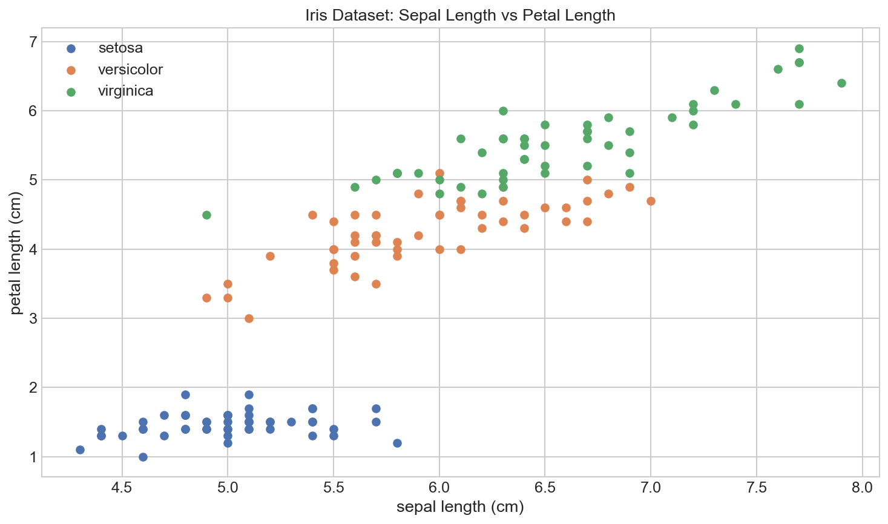

# Understanding How Decision Trees Work

**After this lesson:** you can explain the core ideas in “Understanding How Decision Trees Work” and reproduce the examples here in your own notebook or environment.

## Overview

Here we go deeper on **how** a tree chooses splits: impurity measures (e.g. Gini, entropy), information gain, and how depth and leaf size control the decision surface.

Start from [Introduction](1-introduction.md) if the basic picture is still fuzzy; the submodule hub is [here](../README.md).

## Helpful video

Crash Course AI: supervised learning for classical algorithms.

<iframe width="560" height="315" src="https://www.youtube.com/embed/4qVRBYAdLAo" title="Supervised Learning: Crash Course AI" frameborder="0" allow="accelerometer; autoplay; clipboard-write; encrypted-media; gyroscope; picture-in-picture" allowfullscreen></iframe>

## The Tree Building Process

Think of building a decision tree like organizing a messy room. You want to create a system that helps you find things quickly and efficiently.

### Step-by-Step Example: Organizing Your Clothes

Let's say you want to organize your clothes. You might ask:

1. "Is it a shirt or pants?" (First split)
2. If shirt: "Is it casual or formal?" (Second split)
3. If pants: "Is it jeans or dress pants?" (Second split)

This creates a clear organization system, just like a decision tree!



## How Trees Make Decisions

### The Splitting Process

Imagine you're a teacher trying to group students by their performance. You want to create groups where students in each group are as similar as possible.

1. **First Split**: "Did they complete homework?"
   - Group 1: Completed homework
   - Group 2: Didn't complete homework

2. **Second Split**: For those who completed homework
   - "Did they attend class regularly?"
   - This creates more similar groups

### Measuring Group Similarity

We use special measures to decide how to split the data:

#### 1. Gini Impurity 

Gini impurity measures how "mixed" a group is. A lower Gini value means the group is more "pure" (contains more of one class).

##### Implement Gini from class counts

**Purpose:** See the formula $1 - \sum_k p_k^2$ in code and how purity (one class) vs balance raises impurity.

**Walkthrough:** `np.unique` with `return_counts` gets frequencies; probabilities are `counts / len(y)`.

<div class="code-explainer" data-code-explainer>
<div class="code-explainer__code">


import numpy as np

def calculate_gini(y):
    """Calculate how mixed our groups are using Gini impurity"""
    # If the array is empty, return 0
    if len(y) == 0:
        return 0

    # Count how many of each class we have
    _, counts = np.unique(y, return_counts=True)

    # Calculate the probability of each class
    probabilities = counts / len(y)

    # Calculate Gini (1 - sum of squared probabilities)
    gini = 1 - np.sum(probabilities ** 2)

    return gini

# Let's try some examples
perfect_group = np.array(['A', 'A', 'A', 'A', 'A'])  # All one class
mixed_group = np.array(['A', 'A', 'B', 'B', 'C'])    # Mixed classes
balanced_group = np.array(['A', 'A', 'B', 'B'])      # Perfectly balanced

print(f"Perfect group Gini: {calculate_gini(perfect_group):.4f}")
print(f"Mixed group Gini: {calculate_gini(mixed_group):.4f}")
print(f"Balanced group Gini: {calculate_gini(balanced_group):.4f}")


</div>
<aside class="code-explainer__callouts" aria-label="Code walkthrough">
  <div class="code-callout" data-lines="1-17" data-tint="1">
    <div class="code-callout__meta">
      <span class="code-callout__lines"></span>
      <span class="code-callout__title">Gini Function</span>
    </div>
    <div class="code-callout__body">
      <p><code>np.unique</code> counts each class; dividing by length gives class probabilities; the formula <code>1 − Σp²</code> equals zero for a pure node and peaks at balanced classes.</p>
    </div>
  </div>
  <div class="code-callout" data-lines="19-27" data-tint="2">
    <div class="code-callout__meta">
      <span class="code-callout__lines"></span>
      <span class="code-callout__title">Demo Groups</span>
    </div>
    <div class="code-callout__body">
      <p>Three arrays test the extremes: a pure group (Gini=0), a balanced binary group (Gini=0.5), and a three-class mix (highest impurity).</p>
    </div>
  </div>
</aside>
</div>

**Captured stdout** (from running the snippet above; may be auto-injected on build):

```
Perfect group Gini: 0.0000
Mixed group Gini: 0.6400
Balanced group Gini: 0.5000
```

When we run this code, we'll see:
- Perfect group has Gini = 0 (completely pure)
- Balanced group has higher Gini (more mixed)
- Mixed group has even higher Gini (most mixed)

#### 2. Entropy

Entropy measures "uncertainty" or "disorder" in a group. Lower entropy means more certainty about the class.

##### Shannon entropy for a label vector

**Purpose:** Compare entropy to Gini on the same toy groups; entropy uses $-\sum p_k \log_2 p_k$ with a tiny epsilon for numerical safety.

**Walkthrough:** Same `perfect_group` / `mixed_group` / `balanced_group` as the Gini demo.

<div class="code-explainer" data-code-explainer>
<div class="code-explainer__code">


def calculate_entropy(y):
    """Calculate how uncertain we are about the group using entropy"""
    # If the array is empty, return 0
    if len(y) == 0:
        return 0

    # Count how many of each class we have
    _, counts = np.unique(y, return_counts=True)

    # Calculate the probability of each class
    probabilities = counts / len(y)

    # Calculate entropy (-sum of p * log2(p))
    # Add a small value to avoid log(0)
    entropy = -np.sum(probabilities * np.log2(probabilities + 1e-10))

    return entropy

# Let's try the same examples
print(f"Perfect group entropy: {calculate_entropy(perfect_group):.4f}")
print(f"Mixed group entropy: {calculate_entropy(mixed_group):.4f}")
print(f"Balanced group entropy: {calculate_entropy(balanced_group):.4f}")


</div>
<aside class="code-explainer__callouts" aria-label="Code walkthrough">
  <div class="code-callout" data-lines="1-17" data-tint="1">
    <div class="code-callout__meta">
      <span class="code-callout__lines"></span>
      <span class="code-callout__title">Entropy Function</span>
    </div>
    <div class="code-callout__body">
      <p>Shannon entropy <code>−Σ p log₂p</code>; adding <code>1e-10</code> prevents <code>log(0)</code> when a class is absent without meaningfully affecting the result.</p>
    </div>
  </div>
  <div class="code-callout" data-lines="19-22" data-tint="2">
    <div class="code-callout__meta">
      <span class="code-callout__lines"></span>
      <span class="code-callout__title">Same Group Comparison</span>
    </div>
    <div class="code-callout__body">
      <p>Reusing the three groups from the Gini demo lets you directly compare how the two measures score identical distributions.</p>
    </div>
  </div>
</aside>
</div>

**Captured stdout** (from running the snippet above; may be auto-injected on build):

```
Perfect group entropy: -0.0000
Mixed group entropy: 1.5219
Balanced group entropy: 1.0000
```

When we run this code, we'll see:
- Perfect group has entropy = 0 (complete certainty)
- Balanced group has higher entropy (more uncertainty)
- Mixed group with 3 classes has even higher entropy (most uncertainty)

### Visual Comparison of Impurity Measures

Let's visualize how these measures behave for different class distributions:

##### Plot Gini vs entropy for binary class probability $p$

**Purpose:** Show both impurity curves peak at $p=0.5$ and hit zero at pure nodes—building intuition for split quality.

**Walkthrough:** `gini_values` uses the two-class closed form; `entropy_values` uses the binary entropy formula along `p`.

<div class="code-explainer" data-code-explainer>
<div class="code-explainer__code">


import matplotlib.pyplot as plt

# Create a range of probabilities for a binary classification problem
p = np.linspace(0, 1, 100)  # Probability of class 1
gini_values = 1 - (p**2 + (1-p)**2)  # Gini impurity formula for binary case
entropy_values = -p*np.log2(p+1e-10) - (1-p)*np.log2(1-p+1e-10)  # Entropy formula

# Plot both measures
plt.figure(figsize=(10, 6))
plt.plot(p, gini_values, 'b-', label='Gini Impurity')
plt.plot(p, entropy_values, 'r-', label='Entropy')
plt.xlabel('Probability of Class 1')
plt.ylabel('Impurity Value')
plt.title('Comparison of Impurity Measures')
plt.legend()
plt.grid(True)
plt.show()

# Explain what the plot shows
print("When the split is 50/50 (p=0.5), both measures show maximum impurity.")
print("When the split is pure (p=0 or p=1), both measures show zero impurity.")
print("Entropy penalizes highly imbalanced splits slightly more than Gini.")


</div>
<aside class="code-explainer__callouts" aria-label="Code walkthrough">
  <div class="code-callout" data-lines="1-6" data-tint="1">
    <div class="code-callout__meta">
      <span class="code-callout__lines"></span>
      <span class="code-callout__title">Closed-Form Values</span>
    </div>
    <div class="code-callout__body">
      <p>Both curves are computed analytically over 100 probability values using the two-class formulas—no training required.</p>
    </div>
  </div>
  <div class="code-callout" data-lines="8-17" data-tint="2">
    <div class="code-callout__meta">
      <span class="code-callout__lines"></span>
      <span class="code-callout__title">Overlay Plot</span>
    </div>
    <div class="code-callout__body">
      <p>Plotting both on the same axes shows that entropy has a slightly higher peak and penalizes near-balanced splits more than Gini does.</p>
    </div>
  </div>
  <div class="code-callout" data-lines="19-22" data-tint="3">
    <div class="code-callout__meta">
      <span class="code-callout__lines"></span>
      <span class="code-callout__title">Key Takeaways</span>
    </div>
    <div class="code-callout__body">
      <p>Both measures peak at <code>p=0.5</code> and hit zero at pure nodes; entropy uses a logarithm so its scale differs from Gini's quadratic curve.</p>
    </div>
  </div>
</aside>
</div>




**Captured stdout** (from running the snippet above; may be auto-injected on build):

```
When the split is 50/50 (p=0.5), both measures show maximum impurity.
When the split is pure (p=0 or p=1), both measures show zero impurity.
Entropy penalizes highly imbalanced splits slightly more than Gini.
```

This visualization helps us understand that both measures:
1. Reach their maximum when classes are evenly split (most impure/uncertain)
2. Reach zero when only one class is present (pure/certain)
3. Behave similarly but with slightly different curves

## Finding the Best Split

### The Search Process

How does a decision tree find the best question to ask? It tries all possible features and all possible values for each feature.

Let's implement a simple version of this search:

##### Greedy search for one split (maximize information gain)

**Purpose:** Tie together parent Gini, weighted child Gini, and information gain $= G_{\text{parent}} - G_{\text{weighted children}}$ over all feature/threshold pairs.

**Walkthrough:** Nested loops over features and unique values; skip empty sides; `best_gain` picks the split with largest gain on this toy matrix.

<div class="code-explainer" data-code-explainer>
<div class="code-explainer__code">


import numpy as np

def find_best_split(X, y, feature_names):
    """Find the best way to split the data"""
    n_features = X.shape[1]
    best_gain = -float('inf')
    best_feature = None
    best_threshold = None
    parent_impurity = calculate_gini(y)

    # Try each feature
    for feature in range(n_features):
        # Get unique values for this feature
        values = np.unique(X[:, feature])

        # Try each value as a threshold
        for val in values:
            # Split the data
            left_mask = X[:, feature] <= val
            right_mask = ~left_mask

            # Skip if either group is empty
            if np.sum(left_mask) == 0 or np.sum(right_mask) == 0:
                continue

            # Calculate impurity for each group
            left_impurity = calculate_gini(y[left_mask])
            right_impurity = calculate_gini(y[right_mask])

            # Weight the impurities by group size
            n_left = np.sum(left_mask)
            n_right = np.sum(right_mask)
            n_total = len(y)

            weighted_impurity = (n_left/n_total) * left_impurity + (n_right/n_total) * right_impurity

            # Calculate information gain
            gain = parent_impurity - weighted_impurity

            # Update best split if this one is better
            if gain > best_gain:
                best_gain = gain
                best_feature = feature
                best_threshold = val

    if best_feature is not None:
        return best_feature, best_threshold, best_gain
    else:
        return None, None, 0.0

# Let's create a simple dataset
X = np.array([
    [3, 1],  # Sample 1: temp=3, humidity=1
    [2, 3],  # Sample 2: temp=2, humidity=3
    [1, 2],  # Sample 3: temp=1, humidity=2
    [4, 6],  # Sample 4: temp=4, humidity=6
    [5, 5]   # Sample 5: temp=5, humidity=5
])
y = np.array(['good', 'good', 'bad', 'bad', 'good'])
feature_names = ['temperature', 'humidity']

# Find the best split
best_feature, best_threshold, best_gain = find_best_split(X, y, feature_names)

if best_feature is not None:
    print(f"Best split: {feature_names[best_feature]} <= {best_threshold}")
    print(f"Information gain: {best_gain:.4f}")

    # Show the resulting split
    left_mask = X[:, best_feature] <= best_threshold
    right_mask = ~left_mask

    print("\nLeft group (≤ threshold):")
    for i in range(len(X)):
        if left_mask[i]:
            print(f"  Sample {i+1}: {feature_names[best_feature]}={X[i, best_feature]}, class={y[i]}")

    print("\nRight group (> threshold):")
    for i in range(len(X)):
        if right_mask[i]:
            print(f"  Sample {i+1}: {feature_names[best_feature]}={X[i, best_feature]}, class={y[i]}")


</div>
<aside class="code-explainer__callouts" aria-label="Code walkthrough">
  <div class="code-callout" data-lines="1-42" data-tint="1">
    <div class="code-callout__meta">
      <span class="code-callout__lines"></span>
      <span class="code-callout__title">Greedy Split Search</span>
    </div>
    <div class="code-callout__body">
      <p>Nested loops test every unique threshold for every feature; information gain = parent Gini minus weighted average child Gini; the best is tracked and returned.</p>
    </div>
  </div>
  <div class="code-callout" data-lines="44-59" data-tint="2">
    <div class="code-callout__meta">
      <span class="code-callout__lines"></span>
      <span class="code-callout__title">Toy Dataset</span>
    </div>
    <div class="code-callout__body">
      <p>Five samples with temperature and humidity features give a small matrix where you can verify the winning split by hand.</p>
    </div>
  </div>
  <div class="code-callout" data-lines="61-78" data-tint="3">
    <div class="code-callout__meta">
      <span class="code-callout__lines"></span>
      <span class="code-callout__title">Print Result</span>
    </div>
    <div class="code-callout__body">
      <p>Shows which feature and threshold won, the information gain, and the membership of the left and right child groups after the split.</p>
    </div>
  </div>
</aside>
</div>

**Captured stdout** (from running the snippet above; may be auto-injected on build):

```
Best split: temperature <= 1
Information gain: 0.1800

Left group (≤ threshold):
  Sample 3: temperature=1, class=bad

Right group (> threshold):
  Sample 1: temperature=3, class=good
  Sample 2: temperature=2, class=good
  Sample 4: temperature=4, class=bad
  Sample 5: temperature=5, class=good
```

This example shows:
1. How to calculate information gain for different splits
2. How to find the best split across all features and thresholds
3. How the data gets divided based on the best split

### Visualizing the Split Process

Let's visualize the splitting process on a 2D dataset:

##### First split of a tree (`max_depth=1` stump)

**Purpose:** Read the root split from `tree_.feature` / `tree_.threshold` and overlay it on the scatter; print parent/child Gini to quantify improvement.

**Walkthrough:** `DecisionTreeClassifier(max_depth=1)` is a single split; vertical vs horizontal line uses `feature == 0` vs else.

<div class="code-explainer" data-code-explainer>
<div class="code-explainer__code">


import numpy as np
import matplotlib.pyplot as plt
from sklearn.datasets import make_classification
from sklearn.tree import DecisionTreeClassifier

# Create a simple 2D dataset
X, y = make_classification(
    n_samples=100,
    n_features=2,
    n_redundant=0,
    n_informative=2,
    random_state=42,
    n_clusters_per_class=1
)

# Create and train a decision tree with only one level (stump)
tree_stump = DecisionTreeClassifier(max_depth=1, random_state=42)
tree_stump.fit(X, y)

# Get the split information
feature = tree_stump.tree_.feature[0]  # The feature used for the split
threshold = tree_stump.tree_.threshold[0]  # The threshold used

# Create a meshgrid for plotting
x_min, x_max = X[:, 0].min() - 1, X[:, 0].max() + 1
y_min, y_max = X[:, 1].min() - 1, X[:, 1].max() + 1
xx, yy = np.meshgrid(np.arange(x_min, x_max, 0.1),
                    np.arange(y_min, y_max, 0.1))

# Plot the data points
plt.figure(figsize=(10, 6))
plt.scatter(X[:, 0], X[:, 1], c=y, cmap='viridis', edgecolor='k', s=50)

# Plot the decision boundary
if feature == 0:
    plt.axvline(x=threshold, color='red', linestyle='-', linewidth=2,
               label=f'Split at feature 0 = {threshold:.2f}')
else:
    plt.axhline(y=threshold, color='red', linestyle='-', linewidth=2,
               label=f'Split at feature 1 = {threshold:.2f}')

plt.title('Decision Tree First Split Visualization')
plt.xlabel('Feature 0')
plt.ylabel('Feature 1')
plt.legend()
plt.grid(True)
plt.show()

# Print the split information
print(f"Best split: Feature {feature} <= {threshold:.4f}")
print(f"Gini impurity before split: {1 - np.sum((np.bincount(y) / len(y))**2):.4f}")

# Calculate the impurity of each child
left_mask = X[:, feature] <= threshold
right_mask = ~left_mask
left_gini = 1 - np.sum((np.bincount(y[left_mask]) / len(y[left_mask]))**2)
right_gini = 1 - np.sum((np.bincount(y[right_mask]) / len(y[right_mask]))**2)

print(f"Gini impurity of left child: {left_gini:.4f}")
print(f"Gini impurity of right child: {right_gini:.4f}")


</div>
<aside class="code-explainer__callouts" aria-label="Code walkthrough">
  <div class="code-callout" data-lines="1-18" data-tint="1">
    <div class="code-callout__meta">
      <span class="code-callout__lines"></span>
      <span class="code-callout__title">Generate and Fit</span>
    </div>
    <div class="code-callout__body">
      <p><code>make_classification</code> creates 100 two-feature samples; <code>max_depth=1</code> forces the tree to learn exactly one split (a "stump").</p>
    </div>
  </div>
  <div class="code-callout" data-lines="20-22" data-tint="2">
    <div class="code-callout__meta">
      <span class="code-callout__lines"></span>
      <span class="code-callout__title">Read Split from Tree</span>
    </div>
    <div class="code-callout__body">
      <p><code>tree_.feature[0]</code> and <code>tree_.threshold[0]</code> expose the root node's chosen feature index and threshold value.</p>
    </div>
  </div>
  <div class="code-callout" data-lines="30-46" data-tint="3">
    <div class="code-callout__meta">
      <span class="code-callout__lines"></span>
      <span class="code-callout__title">Visualize Boundary</span>
    </div>
    <div class="code-callout__body">
      <p>A vertical line for feature 0 or horizontal line for feature 1 overlays the data scatter, making the axis-aligned nature of tree boundaries clear.</p>
    </div>
  </div>
  <div class="code-callout" data-lines="48-60" data-tint="4">
    <div class="code-callout__meta">
      <span class="code-callout__lines"></span>
      <span class="code-callout__title">Verify Gini Drop</span>
    </div>
    <div class="code-callout__body">
      <p>Parent Gini and left/right child Gini values are printed; the difference (information gain) should be positive and confirms why this split was chosen.</p>
    </div>
  </div>
</aside>
</div>




**Captured stdout** (from running the snippet above; may be auto-injected on build):

```
Best split: Feature 1 <= -0.2393
Gini impurity before split: 0.5000
Gini impurity of left child: 0.0740
Gini impurity of right child: 0.0000
```

This visualization helps us see:
1. Which feature the tree chose to split on first
2. Where the threshold is placed
3. How the split divides the data into two groups
4. How much each group's impurity is reduced compared to the parent

## When to Stop Growing the Tree

### Stopping Rules

Just like a tree in nature, we need to know when to stop growing our decision tree. Here are some common stopping rules:

##### Iris: train/test accuracy and tree size vs `max_depth`

**Purpose:** Show the classic bias–variance tradeoff—training accuracy rises with depth while test accuracy may peak then drop.

**Walkthrough:** Manual 70/30 shuffle; `tree_.node_count` and `n_leaves` quantify complexity; `argmax(test_scores)` picks a depth (use CV in practice).

<div class="code-explainer" data-code-explainer>
<div class="code-explainer__code">


import numpy as np
from sklearn.datasets import load_iris
from sklearn.tree import DecisionTreeClassifier
import matplotlib.pyplot as plt

# Load the Iris dataset
iris = load_iris()
X = iris.data
y = iris.target

# Function to evaluate different max_depth settings
def evaluate_tree_depths(X, y, max_depths):
    train_scores = []
    test_scores = []
    node_counts = []
    leaf_counts = []

    # Split the data into training (70%) and testing (30%)
    np.random.seed(42)
    indices = np.random.permutation(len(X))
    train_size = int(len(X) * 0.7)
    train_indices = indices[:train_size]
    test_indices = indices[train_size:]

    X_train, X_test = X[train_indices], X[test_indices]
    y_train, y_test = y[train_indices], y[test_indices]

    for depth in max_depths:
        # Create and train tree with specific depth
        tree = DecisionTreeClassifier(max_depth=depth, random_state=42)
        tree.fit(X_train, y_train)

        # Evaluate performance
        train_score = tree.score(X_train, y_train)
        test_score = tree.score(X_test, y_test)

        # Count nodes and leaves
        node_count = tree.tree_.node_count
        leaf_count = tree.tree_.n_leaves

        # Store results
        train_scores.append(train_score)
        test_scores.append(test_score)
        node_counts.append(node_count)
        leaf_counts.append(leaf_count)

    return train_scores, test_scores, node_counts, leaf_counts

# Evaluate trees with different maximum depths
max_depths = range(1, 11)  # Try depths 1 through 10
train_scores, test_scores, node_counts, leaf_counts = evaluate_tree_depths(X, y, max_depths)

# Plot the results
fig, (ax1, ax2) = plt.subplots(1, 2, figsize=(14, 6))

# Plot accuracy vs depth
ax1.plot(max_depths, train_scores, 'o-', label='Training Accuracy')
ax1.plot(max_depths, test_scores, 'o-', label='Testing Accuracy')
ax1.set_xlabel('Maximum Depth')
ax1.set_ylabel('Accuracy')
ax1.set_title('Accuracy vs Tree Depth')
ax1.grid(True)
ax1.legend()

# Plot tree size vs depth
ax2.plot(max_depths, node_counts, 'o-', label='Total Nodes')
ax2.plot(max_depths, leaf_counts, 'o-', label='Leaf Nodes')
ax2.set_xlabel('Maximum Depth')
ax2.set_ylabel('Number of Nodes')
ax2.set_title('Tree Size vs Depth')
ax2.grid(True)
ax2.legend()

plt.tight_layout()
plt.show()

# Find the best depth based on test accuracy
best_depth = max_depths[np.argmax(test_scores)]
print(f"Best maximum depth: {best_depth}")
print(f"Training accuracy at best depth: {train_scores[best_depth-1]:.4f}")
print(f"Testing accuracy at best depth: {test_scores[best_depth-1]:.4f}")
print(f"Number of nodes at best depth: {node_counts[best_depth-1]}")
print(f"Number of leaves at best depth: {leaf_counts[best_depth-1]}")


</div>
<aside class="code-explainer__callouts" aria-label="Code walkthrough">
  <div class="code-callout" data-lines="1-46" data-tint="1">
    <div class="code-callout__meta">
      <span class="code-callout__lines"></span>
      <span class="code-callout__title">Depth Evaluation Helper</span>
    </div>
    <div class="code-callout__body">
      <p>Fits a new tree at each depth on the same 70/30 split, recording accuracy and node/leaf counts so you can directly compare complexity vs generalization.</p>
    </div>
  </div>
  <div class="code-callout" data-lines="48-49" data-tint="2">
    <div class="code-callout__meta">
      <span class="code-callout__lines"></span>
      <span class="code-callout__title">Run Sweep</span>
    </div>
    <div class="code-callout__body">
      <p>Depths 1–10 are evaluated in a single call, returning four parallel lists aligned by depth index.</p>
    </div>
  </div>
  <div class="code-callout" data-lines="51-73" data-tint="3">
    <div class="code-callout__meta">
      <span class="code-callout__lines"></span>
      <span class="code-callout__title">Dual Plot</span>
    </div>
    <div class="code-callout__body">
      <p>Left panel shows train vs test accuracy (reveals overfitting at high depth); right panel shows how node and leaf count grow as the tree deepens.</p>
    </div>
  </div>
  <div class="code-callout" data-lines="75-81" data-tint="4">
    <div class="code-callout__meta">
      <span class="code-callout__lines"></span>
      <span class="code-callout__title">Best Depth Summary</span>
    </div>
    <div class="code-callout__body">
      <p><code>argmax(test_scores)</code> picks the depth that maximized held-out accuracy; in practice use cross-validation rather than a single hold-out for stability.</p>
    </div>
  </div>
</aside>
</div>




**Captured stdout** (from running the snippet above; may be auto-injected on build):

```
Best maximum depth: 5
Training accuracy at best depth: 1.0000
Testing accuracy at best depth: 0.9556
Number of nodes at best depth: 15
Number of leaves at best depth: 8
```

This example demonstrates:

1. **Maximum Depth**: Limits how deep the tree can grow
   - Too shallow: Tree might underfit (not capture important patterns)
   - Too deep: Tree might overfit (memorize training data)

2. **The Overfitting Problem**:
   - Notice how training accuracy keeps increasing with depth
   - But test accuracy usually peaks and then declines
   - This happens because the tree starts memorizing noise in the training data

Let's also explore other stopping criteria:

##### `min_samples_split` and `min_samples_leaf` vs unrestricted tree

**Purpose:** Compare regularization knobs that limit splits without fixing `max_depth` alone.

**Walkthrough:** Uses same `X`/`y` Iris arrays; prints a table of train/test accuracy and tree size for each setting.

<div class="code-explainer" data-code-explainer>
<div class="code-explainer__code">


# Demonstrate other stopping criteria
def explore_stopping_criteria(X, y):
    results = {}

    # Split data
    np.random.seed(42)
    indices = np.random.permutation(len(X))
    train_size = int(len(X) * 0.7)
    train_indices = indices[:train_size]
    test_indices = indices[train_size:]

    X_train, X_test = X[train_indices], X[test_indices]
    y_train, y_test = y[train_indices], y[test_indices]

    # Base case - unrestricted tree
    base_tree = DecisionTreeClassifier(random_state=42)
    base_tree.fit(X_train, y_train)
    results['Unrestricted'] = {
        'train_score': base_tree.score(X_train, y_train),
        'test_score': base_tree.score(X_test, y_test),
        'nodes': base_tree.tree_.node_count,
        'leaves': base_tree.tree_.n_leaves
    }

    # Min samples split
    for min_samples in [2, 5, 10, 20]:
        tree = DecisionTreeClassifier(min_samples_split=min_samples, random_state=42)
        tree.fit(X_train, y_train)
        results[f'Min Samples Split={min_samples}'] = {
            'train_score': tree.score(X_train, y_train),
            'test_score': tree.score(X_test, y_test),
            'nodes': tree.tree_.node_count,
            'leaves': tree.tree_.n_leaves
        }

    # Min samples leaf
    for min_leaf in [1, 5, 10, 20]:
        tree = DecisionTreeClassifier(min_samples_leaf=min_leaf, random_state=42)
        tree.fit(X_train, y_train)
        results[f'Min Samples Leaf={min_leaf}'] = {
            'train_score': tree.score(X_train, y_train),
            'test_score': tree.score(X_test, y_test),
            'nodes': tree.tree_.node_count,
            'leaves': tree.tree_.n_leaves
        }

    return results

# Run the experiment
stopping_results = explore_stopping_criteria(X, y)

# Display the results
print("Stopping Criteria Comparison:\n")
print(f"{'Criterion':<25} {'Train Acc':<10} {'Test Acc':<10} {'Nodes':<10} {'Leaves':<10}")
print('-' * 65)
for name, stats in stopping_results.items():
    print(f"{name:<25} {stats['train_score']:.4f}     {stats['test_score']:.4f}     {stats['nodes']:<10} {stats['leaves']:<10}")


</div>
<aside class="code-explainer__callouts" aria-label="Code walkthrough">
  <div class="code-callout" data-lines="1-22" data-tint="1">
    <div class="code-callout__meta">
      <span class="code-callout__lines"></span>
      <span class="code-callout__title">Baseline Tree</span>
    </div>
    <div class="code-callout__body">
      <p>An unrestricted tree fits until all leaves are pure; its node count and accuracy serve as the upper bound for complexity comparisons.</p>
    </div>
  </div>
  <div class="code-callout" data-lines="24-47" data-tint="2">
    <div class="code-callout__meta">
      <span class="code-callout__lines"></span>
      <span class="code-callout__title">Sweep Two Hyperparameters</span>
    </div>
    <div class="code-callout__body">
      <p>Four values each of <code>min_samples_split</code> and <code>min_samples_leaf</code> are tested; higher values force larger splits and limit leaf size, reducing tree complexity.</p>
    </div>
  </div>
  <div class="code-callout" data-lines="49-57" data-tint="3">
    <div class="code-callout__meta">
      <span class="code-callout__lines"></span>
      <span class="code-callout__title">Tabular Summary</span>
    </div>
    <div class="code-callout__body">
      <p>A formatted table prints all configurations side by side so you can see the accuracy–complexity trade-off at a glance.</p>
    </div>
  </div>
</aside>
</div>

**Captured stdout** (from running the snippet above; may be auto-injected on build):

```
Stopping Criteria Comparison:

Criterion                 Train Acc  Test Acc   Nodes      Leaves    
-----------------------------------------------------------------
Unrestricted              1.0000     0.9556     15         8         
Min Samples Split=2       1.0000     0.9556     15         8         
Min Samples Split=5       0.9810     0.9111     11         6         
Min Samples Split=10      0.9619     0.9333     9          5         
Min Samples Split=20      0.9619     0.9333     9          5         
Min Samples Leaf=1        1.0000     0.9556     15         8         
Min Samples Leaf=5        0.9619     0.9333     9          5         
Min Samples Leaf=10       0.9619     0.9333     9          5         
Min Samples Leaf=20       0.9619     0.9333     5          3
```

This demonstrates two additional stopping criteria:

1. **Minimum Samples Split**: The minimum number of samples required to split a node
   - Higher values prevent the tree from making splits with very few samples
   - This reduces overfitting by ensuring each split is statistically significant

2. **Minimum Samples Leaf**: The minimum number of samples required in a leaf node
   - Higher values ensure that leaf nodes aren't too small
   - This makes predictions more robust and less sensitive to noise

## Common Mistakes and How to Avoid Them

### 1. Overfitting

##### `make_moons`: shallow vs deep decision boundaries

**Purpose:** Visualize underfitting (too shallow), a middle depth, and jagged overfitting on the same noisy data.

**Walkthrough:** `plot_decision_boundary` overlays train/test accuracy in the corner; depths 2, 4, 10 are compared side by side.

<div class="code-explainer" data-code-explainer>
<div class="code-explainer__code">


import numpy as np
import matplotlib.pyplot as plt
from sklearn.datasets import make_moons
from sklearn.tree import DecisionTreeClassifier
from sklearn.model_selection import train_test_split

# Create a noisy dataset
X, y = make_moons(n_samples=200, noise=0.2, random_state=42)
X_train, X_test, y_train, y_test = train_test_split(X, y, test_size=0.3, random_state=42)

# Create meshgrid for plotting decision boundaries
def plot_decision_boundary(ax, model, X, y, title):
    h = 0.02  # Step size
    x_min, x_max = X[:, 0].min() - 0.1, X[:, 0].max() + 0.1
    y_min, y_max = X[:, 1].min() - 0.1, X[:, 1].max() + 0.1
    xx, yy = np.meshgrid(np.arange(x_min, x_max, h),
                         np.arange(y_min, y_max, h))

    # Make predictions on the meshgrid
    Z = model.predict(np.c_[xx.ravel(), yy.ravel()])
    Z = Z.reshape(xx.shape)

    # Plot the decision boundary
    ax.contourf(xx, yy, Z, alpha=0.3)
    ax.scatter(X[:, 0], X[:, 1], c=y, edgecolor='k', s=30)
    ax.set_title(title)
    ax.set_xlabel('Feature 1')
    ax.set_ylabel('Feature 2')

    # Print accuracy
    train_acc = model.score(X_train, y_train)
    test_acc = model.score(X_test, y_test)
    ax.text(0.05, 0.95, f'Train: {train_acc:.2f}, Test: {test_acc:.2f}',
            transform=ax.transAxes, va='top')

# Create and plot three trees with different depths
fig, axes = plt.subplots(1, 3, figsize=(18, 6))

# Shallow tree (underfitting)
shallow_tree = DecisionTreeClassifier(max_depth=2, random_state=42)
shallow_tree.fit(X_train, y_train)
plot_decision_boundary(axes[0], shallow_tree, X, y, 'Underfitting (max_depth=2)')

# Good balance
balanced_tree = DecisionTreeClassifier(max_depth=4, random_state=42)
balanced_tree.fit(X_train, y_train)
plot_decision_boundary(axes[1], balanced_tree, X, y, 'Good Balance (max_depth=4)')

# Deep tree (overfitting)
deep_tree = DecisionTreeClassifier(max_depth=10, random_state=42)
deep_tree.fit(X_train, y_train)
plot_decision_boundary(axes[2], deep_tree, X, y, 'Overfitting (max_depth=10)')

plt.tight_layout()
plt.show()


</div>
<aside class="code-explainer__callouts" aria-label="Code walkthrough">
  <div class="code-callout" data-lines="1-9" data-tint="1">
    <div class="code-callout__meta">
      <span class="code-callout__lines"></span>
      <span class="code-callout__title">Noisy Moons Data</span>
    </div>
    <div class="code-callout__body">
      <p><code>make_moons</code> with <code>noise=0.2</code> creates a two-class dataset with non-linear boundaries and overlapping points — ideal for showing overfitting.</p>
    </div>
  </div>
  <div class="code-callout" data-lines="11-33" data-tint="2">
    <div class="code-callout__meta">
      <span class="code-callout__lines"></span>
      <span class="code-callout__title">Boundary Plot Helper</span>
    </div>
    <div class="code-callout__body">
      <p>A meshgrid is predicted and rendered with <code>contourf</code>; train and test accuracy are embedded as text in the upper-left corner of each panel.</p>
    </div>
  </div>
  <div class="code-callout" data-lines="35-53" data-tint="3">
    <div class="code-callout__meta">
      <span class="code-callout__lines"></span>
      <span class="code-callout__title">Three Depth Comparisons</span>
    </div>
    <div class="code-callout__body">
      <p>Depths 2, 4, and 10 show under-, balanced, and overfitted boundaries side by side; the jagged regions at depth 10 are the hallmark of overfitting.</p>
    </div>
  </div>
</aside>
</div>




This visualization clearly shows:

1. **Underfitting**: The shallow tree is too simple and misses important patterns
2. **Good balance**: The balanced tree captures the main structure without overfitting
3. **Overfitting**: The deep tree follows the noise in the training data too closely

### 2. Feature Selection

Decision trees can help us identify which features are most important:

##### Wine dataset: `feature_importances_` bar chart

**Purpose:** Use the tree’s impurity-based importance to rank physicochemical features for cultivar classification.

**Walkthrough:** `argsort` descending; bar chart uses sorted feature names; top-5 print matches the figure.

<div class="code-explainer" data-code-explainer>
<div class="code-explainer__code">


from sklearn.datasets import load_wine
from sklearn.tree import DecisionTreeClassifier
import numpy as np
import matplotlib.pyplot as plt

# Load the Wine dataset (has many features)
wine = load_wine()
X = wine.data
y = wine.target
feature_names = wine.feature_names

# Train a decision tree
tree = DecisionTreeClassifier(max_depth=5, random_state=42)
tree.fit(X, y)

# Get feature importances
importances = tree.feature_importances_
indices = np.argsort(importances)[::-1]  # Sort in descending order

# Plot feature importances
plt.figure(figsize=(12, 6))
plt.bar(range(X.shape[1]), importances[indices], align='center')
plt.xticks(range(X.shape[1]), [feature_names[i] for i in indices], rotation=90)
plt.xlabel('Features')
plt.ylabel('Importance')
plt.title('Feature Importance in Wine Classification')
plt.tight_layout()
plt.show()

# Print top 5 features
print("Top 5 most important features:")
for i in range(5):
    print(f"{i+1}. {feature_names[indices[i]]}: {importances[indices[i]]:.4f}")


</div>
<aside class="code-explainer__callouts" aria-label="Code walkthrough">
  <div class="code-callout" data-lines="1-13" data-tint="1">
    <div class="code-callout__meta">
      <span class="code-callout__lines"></span>
      <span class="code-callout__title">Load and Train</span>
    </div>
    <div class="code-callout__body">
      <p>Wine has 13 physicochemical features; a depth-5 tree is fit on all 178 samples to produce importances that reflect impurity reduction per feature.</p>
    </div>
  </div>
  <div class="code-callout" data-lines="15-18" data-tint="2">
    <div class="code-callout__meta">
      <span class="code-callout__lines"></span>
      <span class="code-callout__title">Sort Importances</span>
    </div>
    <div class="code-callout__body">
      <p><code>argsort</code> with <code>[::-1]</code> gives descending rank; the indices array reorders both the bars and x-tick labels in the same pass.</p>
    </div>
  </div>
  <div class="code-callout" data-lines="20-33" data-tint="3">
    <div class="code-callout__meta">
      <span class="code-callout__lines"></span>
      <span class="code-callout__title">Bar Chart and Top 5</span>
    </div>
    <div class="code-callout__body">
      <p>The bar chart shows all features ranked; the loop below prints the top five with exact importance scores for quick reference.</p>
    </div>
  </div>
</aside>
</div>




**Captured stdout** (from running the snippet above; may be auto-injected on build):

```
Top 5 most important features:
1. proline: 0.3825
2. od280/od315_of_diluted_wines: 0.3120
3. flavanoids: 0.1414
4. hue: 0.0838
5. alcohol: 0.0473
```

This example demonstrates:
1. How decision trees naturally assign importance to features
2. How to identify which features are most useful for prediction
3. How this can help with feature selection and understanding your data

## Practice Exercise

Try building a simple decision tree by hand:

#### Exercise: Iris 2D scatter + candidate split counts (`5.2-dt-2-structure-exercise`)

**Purpose:** Practice eyeballing splits on real data; the loop prints class histograms left/right for midpoints between sorted feature values.

**Walkthrough:** Uses sepal length and petal length only; extend by computing Gini for each candidate in code.

**Exercise:** `5.2-dt-2-structure-exercise` — compute Gini for each printed split and pick the best first split by hand or in code.

<div class="code-explainer" data-code-explainer>
<div class="code-explainer__code">


# Example dataset: Iris flower features
# Let's simplify to just two features for easy visualization
from sklearn.datasets import load_iris
import numpy as np
import matplotlib.pyplot as plt

# Load data
iris = load_iris()
X = iris.data[:, [0, 2]]  # Sepal length and petal length
y = iris.target
feature_names = [iris.feature_names[0], iris.feature_names[2]]

# Plot the data
plt.figure(figsize=(10, 6))
for target, target_name in enumerate(iris.target_names):
    plt.scatter(X[y == target, 0], X[y == target, 1],
                label=target_name)
plt.xlabel(feature_names[0])
plt.ylabel(feature_names[1])
plt.title('Iris Dataset: Sepal Length vs Petal Length')
plt.legend()
plt.grid(True)
plt.show()

# Manual decision tree exercise
print("Exercise: Try building a decision tree by hand!")
print("1. What would be a good first split?")
print("2. Calculate the Gini impurity for each potential split")
print("3. Draw your decision tree on paper and test it")

# We can provide a hint by showing some possible splits
for feature_idx, feature_name in enumerate(feature_names):
    # Find a few potential thresholds
    values = sorted(set(X[:, feature_idx]))
    thresholds = [np.round((values[i] + values[i+1])/2, 1) for i in range(len(values)-1)][:5]

    print(f"\nPotential thresholds for {feature_name}:")
    for threshold in thresholds:
        left_mask = X[:, feature_idx] <= threshold
        left_counts = np.bincount(y[left_mask], minlength=3)
        right_counts = np.bincount(y[~left_mask], minlength=3)

        print(f"  Split at {threshold}:")
        print(f"    Left:  {left_counts} (total: {sum(left_counts)})")
        print(f"    Right: {right_counts} (total: {sum(right_counts)})")


</div>
<aside class="code-explainer__callouts" aria-label="Code walkthrough">
  <div class="code-callout" data-lines="1-23" data-tint="1">
    <div class="code-callout__meta">
      <span class="code-callout__lines"></span>
      <span class="code-callout__title">Two-Feature Scatter</span>
    </div>
    <div class="code-callout__body">
      <p>Only sepal length and petal length are kept so the split space is 2D and easy to reason about by eye before writing any splitting code.</p>
    </div>
  </div>
  <div class="code-callout" data-lines="25-30" data-tint="2">
    <div class="code-callout__meta">
      <span class="code-callout__lines"></span>
      <span class="code-callout__title">Exercise Prompt</span>
    </div>
    <div class="code-callout__body">
      <p>Three guiding questions direct the learner to manually inspect the scatter, compute Gini, and sketch the tree before running any code.</p>
    </div>
  </div>
  <div class="code-callout" data-lines="32-46" data-tint="3">
    <div class="code-callout__meta">
      <span class="code-callout__lines"></span>
      <span class="code-callout__title">Threshold Hints</span>
    </div>
    <div class="code-callout__body">
      <p>For each feature, five midpoint thresholds are printed with left/right class counts so the learner can compute Gini for each candidate by hand.</p>
    </div>
  </div>
</aside>
</div>




**Captured stdout** (from running the snippet above; may be auto-injected on build):

```
Exercise: Try building a decision tree by hand!
1. What would be a good first split?
2. Calculate the Gini impurity for each potential split
3. Draw your decision tree on paper and test it

Potential thresholds for sepal length (cm):
  Split at 4.4:
    Left:  [4 0 0] (total: 4)
    Right: [46 50 50] (total: 146)
  Split at 4.4:
    Left:  [4 0 0] (total: 4)
    Right: [46 50 50] (total: 146)
  Split at 4.6:
    Left:  [9 0 0] (total: 9)
    Right: [41 50 50] (total: 141)
  Split at 4.6:
    Left:  [9 0 0] (total: 9)
    Right: [41 50 50] (total: 141)
  Split at 4.8:
    Left:  [16  0  0] (total: 16)
    Right: [34 50 50] (total: 134)

Potential thresholds for petal length (cm):
  Split at 1.0:
    Left:  [1 0 0] (total: 1)
    Right: [49 50 50] (total: 149)
  Split at 1.2:
    Left:  [4 0 0] (total: 4)
    Right: [46 50 50] (total: 146)
  Split at 1.2:
    Left:  [4 0 0] (total: 4)
    Right: [46 50 50] (total: 146)
  Split at 1.4:
    Left:  [24  0  0] (total: 24)
    Right: [26 50 50] (total: 126)
  Split at 1.4:
    Left:  [24  0  0] (total: 24)
    Right: [26 50 50] (total: 126)
```

This exercise lets you:
1. Visualize a real dataset
2. See potential splitting points
3. Practice calculating impurity
4. Build a tree by hand to understand the process

## Next Steps

Now that you understand how trees are built, let's learn how to [implement them in Python](3-implementation.md)!
