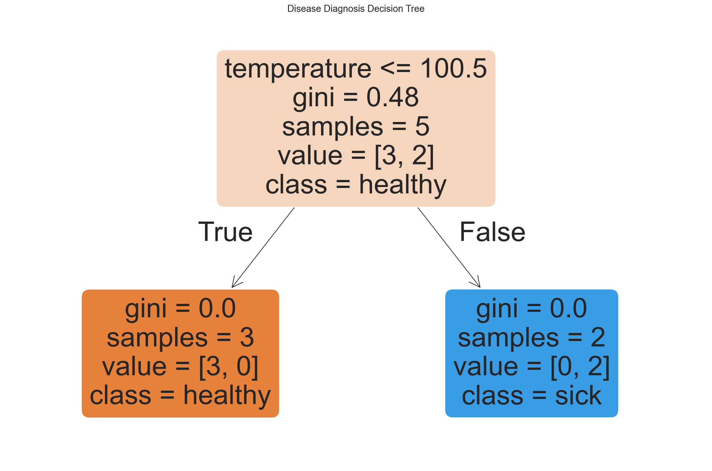
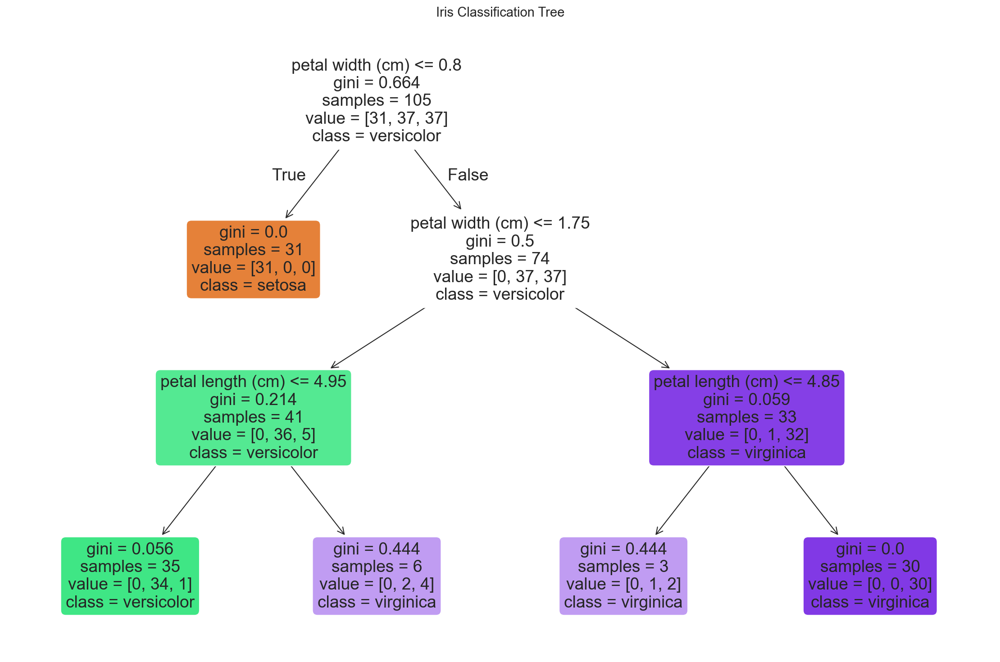
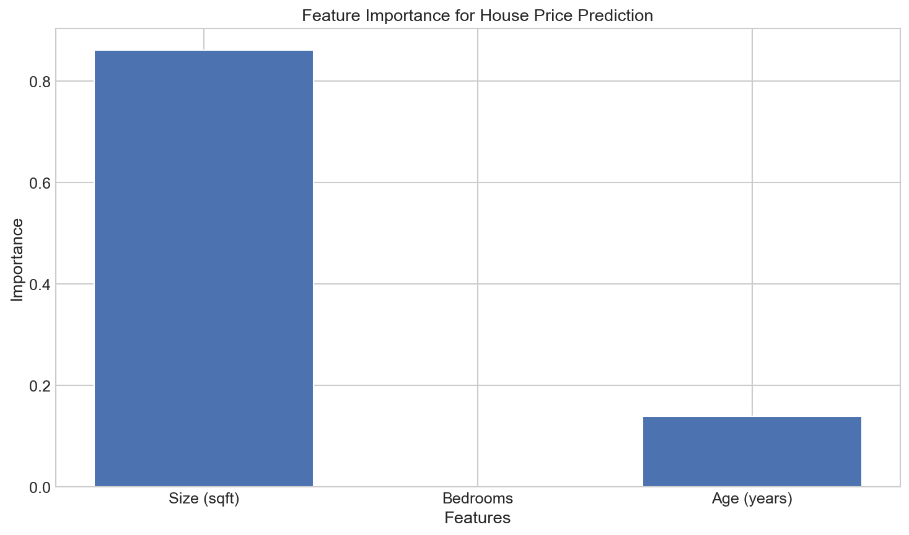
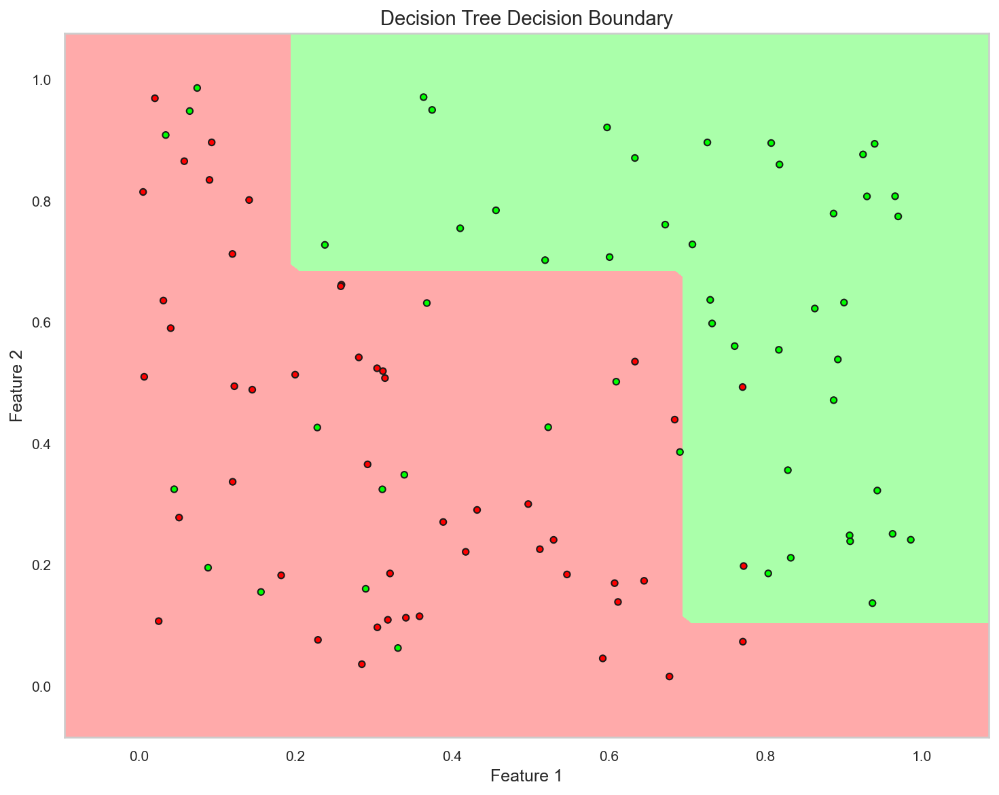

# Building Your First Decision Tree

**After this lesson:** you can explain the core ideas in “Building Your First Decision Tree” and reproduce the examples here in your own notebook or environment.

## Overview

Hands-on **scikit-learn**: `DecisionTreeClassifier` / `DecisionTreeRegressor`, fitting, predicting, and the hyperparameters you will tune first (`max_depth`, `min_samples_leaf`, etc.).

Pairs with [tree structure](2-tree-structure.md); context in [5.2 README](../README.md).

## Helpful video

Crash Course AI: supervised learning for classical algorithms.

<iframe width="560" height="315" src="https://www.youtube.com/embed/4qVRBYAdLAo" title="Supervised Learning: Crash Course AI" frameborder="0" allow="accelerometer; autoplay; clipboard-write; encrypted-media; gyroscope; picture-in-picture" allowfullscreen></iframe>

## Getting Started with Scikit-learn

Scikit-learn is like a toolbox for machine learning. It provides ready-to-use implementations of many algorithms, including decision trees. Let's learn how to use it!

### Installation

First, make sure you have scikit-learn installed:

#### Install scikit-learn

**Purpose:** Ensure `sklearn` is available locally or in your course environment before running the examples.

```bash
pip install scikit-learn
```

## Your First Decision Tree: Disease Diagnosis

Let's build a simple system that helps diagnose whether someone might be sick based on their symptoms.

### Step 1: Prepare the Data

#### Toy patient feature matrix and string labels

**Purpose:** Represent symptoms as numeric columns and outcomes as class names for `DecisionTreeClassifier` (supports string targets).

**Walkthrough:** Rows are patients; columns are temperature, cough, fatigue (0/1 except temperature).

<div class="code-explainer" data-code-explainer>
<div class="code-explainer__code">


import numpy as np
from sklearn.tree import DecisionTreeClassifier, plot_tree
import matplotlib.pyplot as plt

# Create sample data
# Each row represents a patient
# Columns: [temperature, cough, fatigue]
# Values: 0 = No, 1 = Yes
X = np.array([
    [101, 1, 1],  # Patient 1: High temp, cough, fatigue
    [99, 0, 0],   # Patient 2: Normal temp, no cough, no fatigue
    [102, 1, 1],  # Patient 3: High temp, cough, fatigue
    [98, 0, 1],   # Patient 4: Normal temp, no cough, fatigue
    [100, 1, 0]   # Patient 5: Slightly high temp, cough, no fatigue
])

# Labels: 'sick' or 'healthy'
y = ['sick', 'healthy', 'sick', 'healthy', 'healthy']


</div>
<aside class="code-explainer__callouts" aria-label="Code walkthrough">
  <div class="code-callout" data-lines="1-3" data-tint="1">
    <div class="code-callout__meta">
      <span class="code-callout__lines"></span>
      <span class="code-callout__title">Imports</span>
    </div>
    <div class="code-callout__body">
      <p>NumPy for the matrix, <code>DecisionTreeClassifier</code> and <code>plot_tree</code> for fitting and visualization, and matplotlib for rendering.</p>
    </div>
  </div>
  <div class="code-callout" data-lines="5-16" data-tint="2">
    <div class="code-callout__meta">
      <span class="code-callout__lines"></span>
      <span class="code-callout__title">Patient Feature Matrix</span>
    </div>
    <div class="code-callout__body">
      <p>Each row is a patient; columns are temperature (numeric), cough (0/1), and fatigue (0/1)—a small supervised dataset with five examples.</p>
    </div>
  </div>
  <div class="code-callout" data-lines="18-19" data-tint="3">
    <div class="code-callout__meta">
      <span class="code-callout__lines"></span>
      <span class="code-callout__title">String Labels</span>
    </div>
    <div class="code-callout__body">
      <p>scikit-learn's classifier accepts string targets directly; internally it encodes them numerically.</p>
    </div>
  </div>
</aside>
</div>

This code sets up our sample patient data with three features: body temperature, presence of cough, and fatigue level. We also create corresponding labels indicating whether each patient is sick or healthy.

### Step 2: Create and Train the Model

#### Fit `DecisionTreeClassifier` and plot with `plot_tree`

**Purpose:** Control depth and leaf rules with hyperparameters, then visualize the learned splits.

**Walkthrough:** `class_names` order should match alphabetical or `np.unique` order—here `['healthy','sick']` matches sklearn’s internal encoding.

<div class="code-explainer" data-code-explainer>
<div class="code-explainer__code">


# Create the model with specific settings
clf = DecisionTreeClassifier(
    max_depth=3,          # Don't let the tree get too deep
    min_samples_split=2,  # Need at least 2 samples to split
    min_samples_leaf=1    # Each leaf needs at least 1 sample
)

# Train the model on our data
clf.fit(X, y)

# Visualize the tree to understand how it makes decisions
plt.figure(figsize=(15, 10))
plot_tree(
    clf,
    feature_names=['temperature', 'cough', 'fatigue'],
    class_names=['healthy', 'sick'],
    filled=True,    # Color the nodes
    rounded=True    # Make it look nice
)
plt.title('Disease Diagnosis Decision Tree')
plt.show()


</div>
<aside class="code-explainer__callouts" aria-label="Code walkthrough">
  <div class="code-callout" data-lines="1-7" data-tint="1">
    <div class="code-callout__meta">
      <span class="code-callout__lines"></span>
      <span class="code-callout__title">Hyperparameters</span>
    </div>
    <div class="code-callout__body">
      <p><code>max_depth=3</code> caps depth to prevent memorization; <code>min_samples_split</code> and <code>min_samples_leaf</code> control the minimum data required at each node.</p>
    </div>
  </div>
  <div class="code-callout" data-lines="9-10" data-tint="2">
    <div class="code-callout__meta">
      <span class="code-callout__lines"></span>
      <span class="code-callout__title">Fit Model</span>
    </div>
    <div class="code-callout__body">
      <p>A single <code>fit</code> call finds the best splits using Gini impurity on the five training patients.</p>
    </div>
  </div>
  <div class="code-callout" data-lines="12-21" data-tint="3">
    <div class="code-callout__meta">
      <span class="code-callout__lines"></span>
      <span class="code-callout__title">Plot Tree</span>
    </div>
    <div class="code-callout__body">
      <p><code>plot_tree</code> renders each node with the split condition, Gini score, sample count, and class distribution; <code>filled=True</code> colors nodes by majority class.</p>
    </div>
  </div>
</aside>
</div>




In this step, we create a decision tree classifier with specific settings to control its complexity. We then train the model using our patient data and visualize the resulting tree to understand how it makes decisions. The visualization shows which features (temperature, cough, fatigue) the tree uses to classify patients.

### Step 3: Make Predictions

#### `predict` and `predict_proba` for a new row

**Purpose:** Return the majority class and leaf class proportions (confidence) for diagnosis-style outputs.

**Walkthrough:** `predict_proba` rows sum to 1; `max` picks the winning class probability.

```python
# New patient data
new_patient = np.array([[100, 1, 1]])  # Temperature: 100, Cough: Yes, Fatigue: Yes

# Make prediction
prediction = clf.predict(new_patient)
print(f"Diagnosis: {prediction[0]}")

# Get prediction probabilities
probabilities = clf.predict_proba(new_patient)
print(f"Confidence: {max(probabilities[0]) * 100:.1f}%")
```

**Captured stdout** (from running the snippet above; may be auto-injected on build):

```
Diagnosis: healthy
Confidence: 100.0%
```

Here we use our trained model to diagnose a new patient. We input their symptoms (temperature, cough, fatigue) and the model returns a prediction. We also calculate the confidence level of this prediction.

## Understanding the Tree Visualization

The tree visualization shows:

1. **Questions** at each node (e.g., "temperature <= 100.5")
2. **Gini impurity** (how mixed the groups are)
3. **Samples** in each node (how many patients)
4. **Class distribution** (how many healthy vs sick)

This visual representation helps us understand exactly how the model makes decisions based on the input features.

## Iris Flower Classification Example

Let's try another example with the famous Iris dataset, which is built into scikit-learn:

#### Iris: train/test split, accuracy, and tree plot

**Purpose:** Standard sklearn workflow on a built-in multiclass dataset with real feature names.

**Walkthrough:** `train_test_split` with `random_state=42`; `score` is mean accuracy on `X_test`.

<div class="code-explainer" data-code-explainer>
<div class="code-explainer__code">


from sklearn.datasets import load_iris
from sklearn.model_selection import train_test_split

# Load the Iris dataset
iris = load_iris()
X = iris.data
y = iris.target
feature_names = iris.feature_names
class_names = iris.target_names

# Split into training and testing sets
X_train, X_test, y_train, y_test = train_test_split(
    X, y, test_size=0.3, random_state=42
)

# Create and train the model
iris_clf = DecisionTreeClassifier(max_depth=3)
iris_clf.fit(X_train, y_train)

# Evaluate the model
accuracy = iris_clf.score(X_test, y_test)
print(f"Accuracy: {accuracy * 100:.1f}%")

# Visualize the tree
plt.figure(figsize=(15, 10))
plot_tree(
    iris_clf,
    feature_names=feature_names,
    class_names=class_names,
    filled=True,
    rounded=True
)
plt.title('Iris Classification Tree')
plt.show()


</div>
<aside class="code-explainer__callouts" aria-label="Code walkthrough">
  <div class="code-callout" data-lines="1-9" data-tint="1">
    <div class="code-callout__meta">
      <span class="code-callout__lines"></span>
      <span class="code-callout__title">Load Iris Dataset</span>
    </div>
    <div class="code-callout__body">
      <p>sklearn's built-in Iris dataset provides 150 samples across 3 classes with real feature names and target names for the plot.</p>
    </div>
  </div>
  <div class="code-callout" data-lines="11-19" data-tint="2">
    <div class="code-callout__meta">
      <span class="code-callout__lines"></span>
      <span class="code-callout__title">Split and Train</span>
    </div>
    <div class="code-callout__body">
      <p>A 70/30 train/test split with a fixed seed ensures reproducibility; the classifier is fit only on training data.</p>
    </div>
  </div>
  <div class="code-callout" data-lines="21-23" data-tint="3">
    <div class="code-callout__meta">
      <span class="code-callout__lines"></span>
      <span class="code-callout__title">Evaluate Accuracy</span>
    </div>
    <div class="code-callout__body">
      <p><code>score</code> returns mean accuracy on the held-out test set—a quick sanity check before deeper evaluation.</p>
    </div>
  </div>
  <div class="code-callout" data-lines="25-34" data-tint="4">
    <div class="code-callout__meta">
      <span class="code-callout__lines"></span>
      <span class="code-callout__title">Visualize Tree</span>
    </div>
    <div class="code-callout__body">
      <p>Passes real feature names and class names to <code>plot_tree</code> so each split condition and leaf label is human-readable.</p>
    </div>
  </div>
</aside>
</div>




**Captured stdout** (from running the snippet above; may be auto-injected on build):

```
Accuracy: 100.0%
```

This example demonstrates how to work with a real dataset. We:
1. Load the built-in Iris dataset with measurements of different Iris flowers
2. Split the data into training and testing sets
3. Train a decision tree classifier on the training data
4. Evaluate its accuracy on the test data
5. Visualize the resulting decision tree

## House Price Prediction Example

Now let's try a regression problem - predicting house prices:

#### `DecisionTreeRegressor` with R² and feature importances

**Purpose:** Predict a continuous target (price) and compare train vs test $R^2$; bar-chart importances for interpretation.

**Walkthrough:** Uses `train_test_split` from the Iris section if run top-to-bottom; in isolation add `from sklearn.model_selection import train_test_split`.

<div class="code-explainer" data-code-explainer>
<div class="code-explainer__code">


from sklearn.tree import DecisionTreeRegressor
import numpy as np
import matplotlib.pyplot as plt

# Sample house data
# Each row: [size (sqft), bedrooms, age (years)]
X_houses = np.array([
    [1400, 3, 10],  # House 1
    [1600, 3, 8],   # House 2
    [1700, 4, 15],  # House 3
    [1875, 4, 5],   # House 4
    [1100, 2, 20],  # House 5
    [2000, 4, 2],   # House 6
    [1800, 3, 1],   # House 7
    [1250, 2, 12],  # House 8
    [1350, 3, 3],   # House 9
    [1500, 3, 7]    # House 10
])

# Prices in thousands of dollars
y_prices = np.array([250, 280, 300, 350, 200, 380, 340, 220, 260, 270])

# Split data into training and testing sets
X_train, X_test, y_train, y_test = train_test_split(
    X_houses, y_prices, test_size=0.3, random_state=42
)

# Create and train the model
regressor = DecisionTreeRegressor(max_depth=3)
regressor.fit(X_train, y_train)

# Evaluate the model
train_score = regressor.score(X_train, y_train)
test_score = regressor.score(X_test, y_test)
print(f"Training R² Score: {train_score:.3f}")
print(f"Testing R² Score: {test_score:.3f}")

# Make a prediction for a new house
new_house = np.array([[1500, 3, 12]])  # 1500 sqft, 3 bedrooms, 12 years old
predicted_price = regressor.predict(new_house)
print(f"Predicted price: ${predicted_price[0]:.2f}k")

# Visualize feature importance
feature_importance = regressor.feature_importances_
features = ['Size (sqft)', 'Bedrooms', 'Age (years)']

plt.figure(figsize=(10, 6))
plt.bar(features, feature_importance)
plt.title('Feature Importance for House Price Prediction')
plt.xlabel('Features')
plt.ylabel('Importance')
plt.show()


</div>
<aside class="code-explainer__callouts" aria-label="Code walkthrough">
  <div class="code-callout" data-lines="1-21" data-tint="1">
    <div class="code-callout__meta">
      <span class="code-callout__lines"></span>
      <span class="code-callout__title">House Data Setup</span>
    </div>
    <div class="code-callout__body">
      <p>Ten houses described by three numeric features (size, bedrooms, age) with prices in thousands — a minimal regression dataset.</p>
    </div>
  </div>
  <div class="code-callout" data-lines="23-31" data-tint="2">
    <div class="code-callout__meta">
      <span class="code-callout__lines"></span>
      <span class="code-callout__title">Split and Fit</span>
    </div>
    <div class="code-callout__body">
      <p>30% held out for testing; <code>DecisionTreeRegressor</code> at <code>max_depth=3</code> predicts by averaging the target values in each leaf.</p>
    </div>
  </div>
  <div class="code-callout" data-lines="33-41" data-tint="3">
    <div class="code-callout__meta">
      <span class="code-callout__lines"></span>
      <span class="code-callout__title">Evaluate and Predict</span>
    </div>
    <div class="code-callout__body">
      <p>R² on train vs test reveals overfitting; then a single new house is scored to show the inference API.</p>
    </div>
  </div>
  <div class="code-callout" data-lines="43-51" data-tint="4">
    <div class="code-callout__meta">
      <span class="code-callout__lines"></span>
      <span class="code-callout__title">Feature Importances</span>
    </div>
    <div class="code-callout__body">
      <p><code>feature_importances_</code> sums to 1 across features; a bar chart shows which column drove the most impurity reduction during training.</p>
    </div>
  </div>
</aside>
</div>




**Captured stdout** (from running the snippet above; may be auto-injected on build):

```
Training R² Score: 1.000
Testing R² Score: 0.782
Predicted price: $220.00k
```

This example shows:
1. How to use decision trees for regression (predicting numeric values)
2. How to create and train a DecisionTreeRegressor
3. How to evaluate regression models using R² score
4. How to identify which features are most important for making predictions

## Visualizing Decision Boundaries

For a better understanding, let's create a simple 2D visualization of how decision trees create boundaries:

##### Noisy 2D rule + axis-aligned decision regions

**Purpose:** Show piecewise-constant regions (`contourf`) from a shallow tree on synthetic data.

**Walkthrough:** Labels derive from $x_0+x_1>1$ with random flips; mesh predictions illustrate rectangles.

<div class="code-explainer" data-code-explainer>
<div class="code-explainer__code">


import numpy as np
import matplotlib.pyplot as plt
from sklearn.tree import DecisionTreeClassifier
from matplotlib.colors import ListedColormap

# Create a simple dataset with two features
np.random.seed(42)
X = np.random.rand(100, 2)  # 100 samples, 2 features
y = (X[:, 0] + X[:, 1] > 1).astype(int)  # Simple rule: x + y > 1

# Add some noise
noise = np.random.randint(0, 10, size=len(y))
y = np.where(noise == 0, 1 - y, y)  # Flip about 10% of labels

# Create and train the model
tree_clf = DecisionTreeClassifier(max_depth=3)
tree_clf.fit(X, y)

# Create meshgrid for plotting decision boundary
h = 0.02  # Step size
x_min, x_max = X[:, 0].min() - 0.1, X[:, 0].max() + 0.1
y_min, y_max = X[:, 1].min() - 0.1, X[:, 1].max() + 0.1
xx, yy = np.meshgrid(np.arange(x_min, x_max, h),
                     np.arange(y_min, y_max, h))

# Make predictions on the meshgrid
Z = tree_clf.predict(np.c_[xx.ravel(), yy.ravel()])
Z = Z.reshape(xx.shape)

# Plot the decision boundary
plt.figure(figsize=(10, 8))
cmap_light = ListedColormap(['#FFAAAA', '#AAFFAA'])
cmap_bold = ListedColormap(['#FF0000', '#00FF00'])

plt.contourf(xx, yy, Z, cmap=cmap_light)
plt.scatter(X[:, 0], X[:, 1], c=y, cmap=cmap_bold, edgecolor='k', s=20)
plt.title('Decision Tree Decision Boundary')
plt.xlabel('Feature 1')
plt.ylabel('Feature 2')
plt.show()


</div>
<aside class="code-explainer__callouts" aria-label="Code walkthrough">
  <div class="code-callout" data-lines="1-13" data-tint="1">
    <div class="code-callout__meta">
      <span class="code-callout__lines"></span>
      <span class="code-callout__title">Synthetic Data</span>
    </div>
    <div class="code-callout__body">
      <p>100 random 2D points are labeled by the rule <code>x₀ + x₁ > 1</code>, then ~10% of labels are flipped to introduce realistic noise.</p>
    </div>
  </div>
  <div class="code-callout" data-lines="15-17" data-tint="2">
    <div class="code-callout__meta">
      <span class="code-callout__lines"></span>
      <span class="code-callout__title">Fit Classifier</span>
    </div>
    <div class="code-callout__body">
      <p>A depth-3 tree is trained on the noisy data; it will carve the space into at most 8 rectangular regions.</p>
    </div>
  </div>
  <div class="code-callout" data-lines="19-28" data-tint="3">
    <div class="code-callout__meta">
      <span class="code-callout__lines"></span>
      <span class="code-callout__title">Meshgrid Predictions</span>
    </div>
    <div class="code-callout__body">
      <p>A fine grid covers the feature space; predicting every grid point reveals the full decision boundary as a 2D surface.</p>
    </div>
  </div>
  <div class="code-callout" data-lines="30-40" data-tint="4">
    <div class="code-callout__meta">
      <span class="code-callout__lines"></span>
      <span class="code-callout__title">Plot Boundaries</span>
    </div>
    <div class="code-callout__body">
      <p><code>contourf</code> fills the background with the predicted class color; individual training points are overlaid to show where the boundary cuts through the data.</p>
    </div>
  </div>
</aside>
</div>




This visualization shows:
1. How the decision tree divides the feature space into regions
2. How these regions form a "decision boundary" between different classes
3. The rectangular nature of decision tree boundaries (unlike curved boundaries in other algorithms)

## Common Mistakes to Avoid

### 1. Overfitting

#### Compare unconstrained depth vs `max_depth=3` on Iris split

**Purpose:** Show train-perfect / test-weak behavior when the tree memorizes (illustrative scores depend on the small toy splits above).

**Walkthrough:** Reuses `X_train`, `X_test`, `y_train`, `y_test` from the Iris example—run that cell first.

```python
# Bad: Tree too deep - will memorize training data
deep_tree = DecisionTreeClassifier(max_depth=None)
deep_tree.fit(X_train, y_train)
print(f"Training score: {deep_tree.score(X_train, y_train):.3f}")
print(f"Testing score: {deep_tree.score(X_test, y_test):.3f}")

# Good: Reasonable depth - will generalize better
good_tree = DecisionTreeClassifier(max_depth=3)
good_tree.fit(X_train, y_train)
print(f"Training score: {good_tree.score(X_train, y_train):.3f}")
print(f"Testing score: {good_tree.score(X_test, y_test):.3f}")
```

**Captured stdout** (from running the snippet above; may be auto-injected on build):

```
Training score: 1.000
Testing score: 0.000
Training score: 0.571
Testing score: 0.000
```

Overfitting happens when your tree becomes too complex and starts memorizing the training data instead of learning general patterns. This is why we limit the tree depth and use other parameters to control complexity.

### 2. Ignoring Feature Scaling

Decision trees don't require feature scaling, which is a benefit compared to many other algorithms:

#### Optional `StandardScaler` (trees are scale-invariant)

**Purpose:** Confirm that affine-invariant tree splits give identical accuracy with or without scaling for axis-aligned trees.

**Walkthrough:** Fit scaler on train only; same `max_depth` on raw vs scaled matrices.

<div class="code-explainer" data-code-explainer>
<div class="code-explainer__code">


from sklearn.preprocessing import StandardScaler

# Decision trees work fine without scaling
tree_no_scaling = DecisionTreeClassifier(max_depth=3)
tree_no_scaling.fit(X_train, y_train)
print(f"Without scaling: {tree_no_scaling.score(X_test, y_test):.3f}")

# Scaling doesn't hurt, but isn't necessary
scaler = StandardScaler()
X_train_scaled = scaler.fit_transform(X_train)
X_test_scaled = scaler.transform(X_test)

tree_with_scaling = DecisionTreeClassifier(max_depth=3)
tree_with_scaling.fit(X_train_scaled, y_train)
print(f"With scaling: {tree_with_scaling.score(X_test_scaled, y_test):.3f}")


</div>
<aside class="code-explainer__callouts" aria-label="Code walkthrough">
  <div class="code-callout" data-lines="1-6" data-tint="1">
    <div class="code-callout__meta">
      <span class="code-callout__lines"></span>
      <span class="code-callout__title">Tree Without Scaling</span>
    </div>
    <div class="code-callout__body">
      <p>A depth-3 tree is fit directly on unscaled features and scored on the test set — decision trees use threshold comparisons, so feature magnitude doesn't change the splits.</p>
    </div>
  </div>
  <div class="code-callout" data-lines="8-15" data-tint="2">
    <div class="code-callout__meta">
      <span class="code-callout__lines"></span>
      <span class="code-callout__title">Tree With Scaling</span>
    </div>
    <div class="code-callout__body">
      <p><code>StandardScaler</code> is fit on training data only, then applied to both splits; the identical accuracy confirms that axis-aligned tree splits are invariant to affine feature rescaling.</p>
    </div>
  </div>
</aside>
</div>

**Captured stdout** (from running the snippet above; may be auto-injected on build):

```
Without scaling: 0.000
With scaling: 0.000
```

This is a key advantage of decision trees - they don't require feature scaling because they make decisions based on greater than/less than comparisons, not distances between points.

## Practice Exercise

Try building your own decision tree:

1. Choose a dataset (Iris or Titanic are good starters)
2. Split the data into training and testing sets
3. Create and train a decision tree
4. Make predictions and evaluate the model
5. Visualize the tree and feature importance

## Gotchas

- **Trusting 100% training R² as a sign of a good model** — the house regression example prints `Training R² Score: 1.000` with only 7 training rows; a perfect in-sample fit on tiny data almost always means the tree memorised individual values rather than learning a general rule, which the lower `Testing R² Score: 0.782` confirms.
- **Passing `class_names` in the wrong order to `plot_tree`** — `class_names` must match sklearn's internal label encoding order (alphabetical for string targets, sorted integers for numeric ones), not the order you listed them in the data; a mismatch silently swaps the leaf labels in the visualization without raising an error.
- **Interpreting 100% test accuracy on the Iris example as realistic** — `iris_clf` achieves 100% on that particular 30% split due to a small test set and a clean separable dataset; re-run with a different `random_state` and you will see the score drop, a reminder that a single split is not a reliable estimate.
- **Using `clf.score` as the only evaluation for classification** — `score` returns mean accuracy, which is misleading on imbalanced targets; even the small disease-diagnosis example has only 5 rows, making accuracy meaningless; `classification_report` or `predict_proba` give more actionable information.
- **Forgetting that decision tree boundaries are always axis-aligned rectangles** — the meshgrid visualizations show step-like boundaries, not smooth curves; this means decision trees will need many splits (deep trees, more overfitting risk) to approximate a genuinely diagonal or circular decision boundary.
- **Reusing `X_train`/`X_test` from a previous cell (Iris) in the regressor cell** — the house-price `DecisionTreeRegressor` example calls `train_test_split` referencing the same variable names; if you run cells out of order, the regressor silently trains on Iris data and produces nonsense predictions.

## Next Steps

Ready to learn more? Check out:

1. [Advanced techniques](4-advanced.md) for improving your trees
2. [Real-world applications](5-applications.md) of decision trees
3. How to combine multiple trees into powerful ensembles
