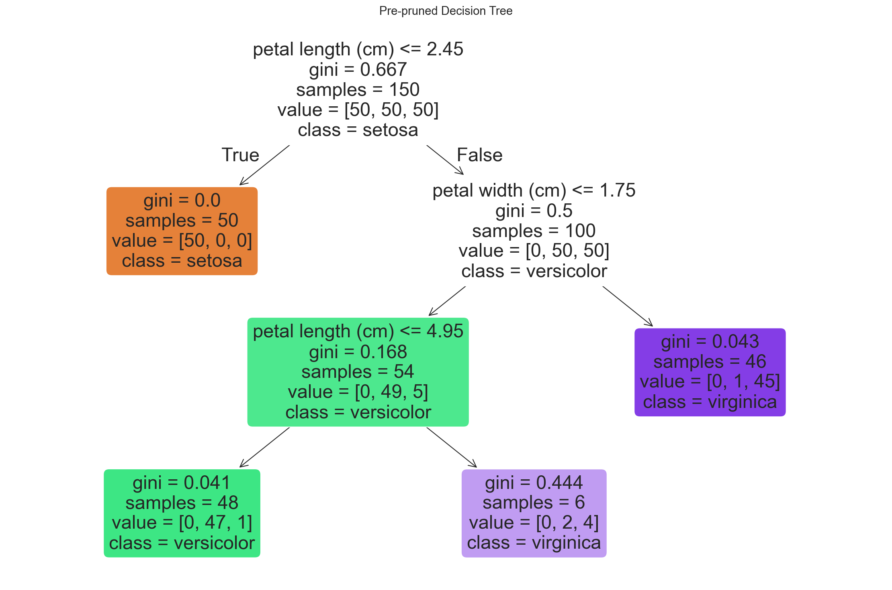
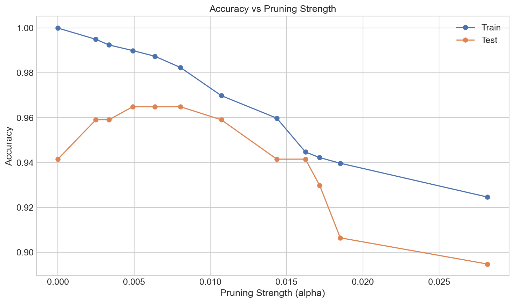
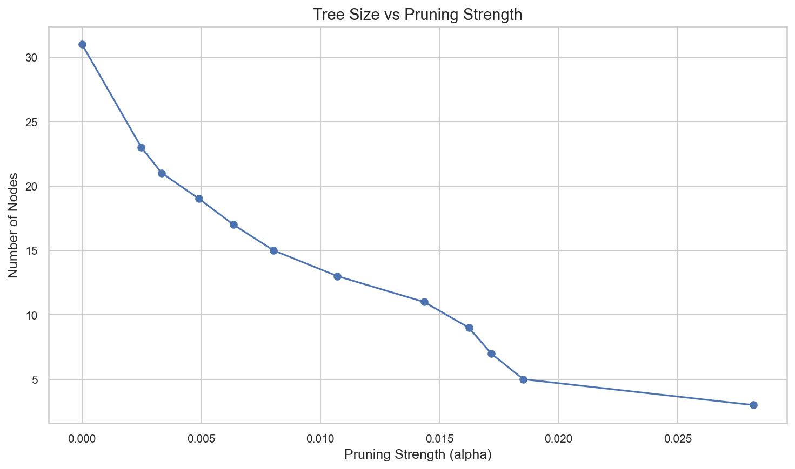
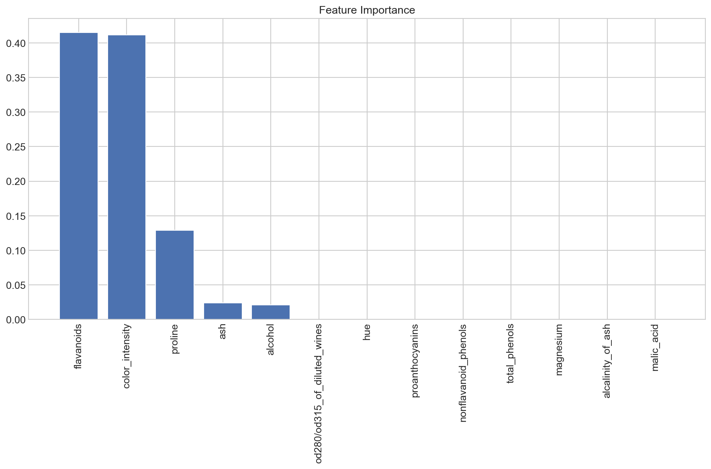
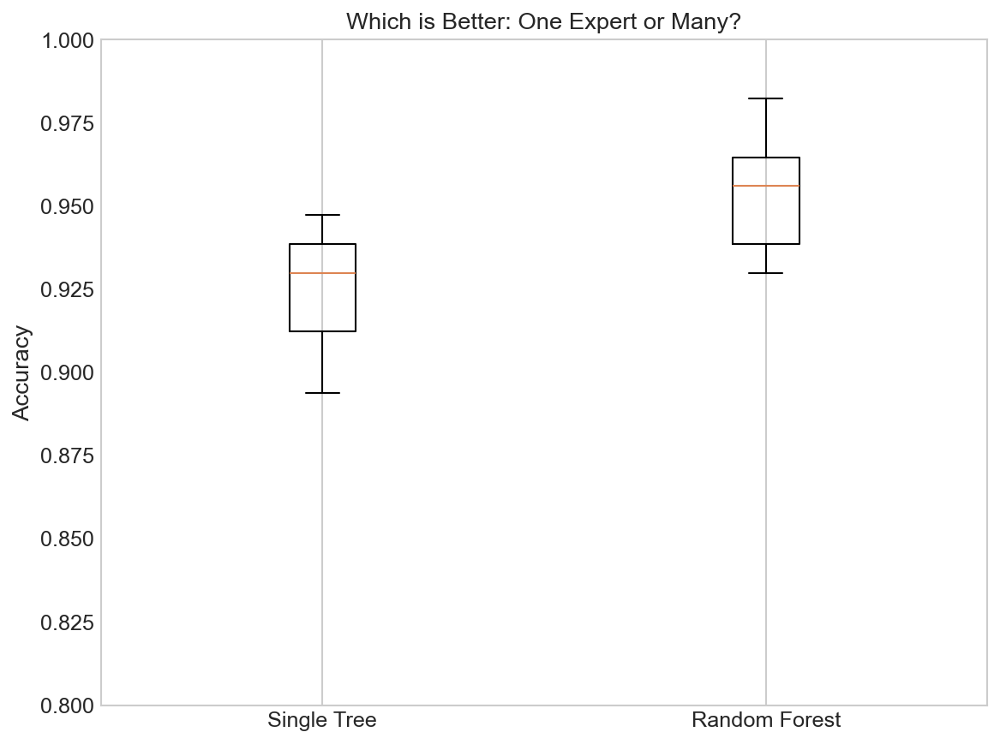
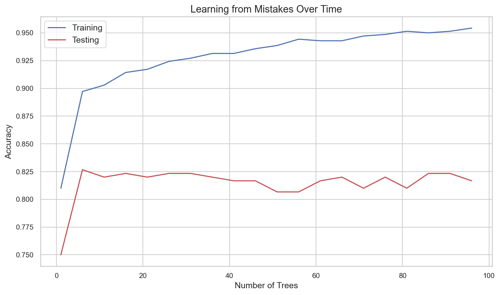
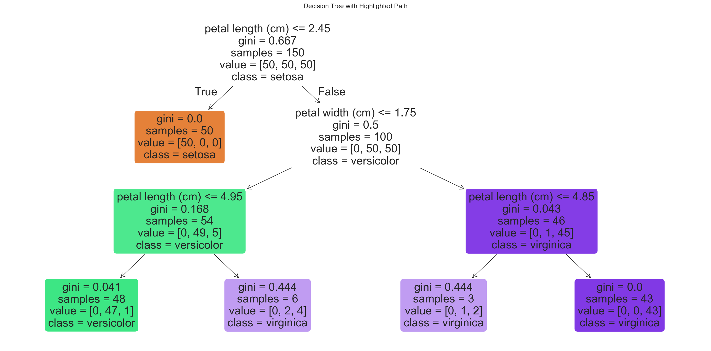

# Advanced Decision Tree Techniques

**After this lesson:** you can explain the core ideas in “Advanced Decision Tree Techniques” and reproduce the examples here in your own notebook or environment.

## Overview

**Pruning**, cost-complexity ideas, and ways to curb overfitting when a single tree is still the right interpretable model.

See [implementation](3-implementation.md) for baseline code paths.

## Helpful video

Crash Course AI: supervised learning for classical algorithms.

<iframe width="560" height="315" src="https://www.youtube.com/embed/4qVRBYAdLAo" title="Supervised Learning: Crash Course AI" frameborder="0" allow="accelerometer; autoplay; clipboard-write; encrypted-media; gyroscope; picture-in-picture" allowfullscreen></iframe>

## Understanding Tree Pruning

Think of pruning like trimming a tree in your garden. You remove unnecessary branches to keep the tree healthy and manageable.

### Why Prune Trees?

1. **Prevent Overfitting**
   - Like removing unnecessary details from a story
   - Keeps the model from memorizing the training data
   - Makes the model more generalizable

2. **Improve Performance**
   - Faster predictions
   - Less memory usage
   - Clearer decision rules

### Types of Pruning

#### 1. Pre-pruning (Early Stopping)

This is like setting rules before the tree starts growing:

##### Pre-pruning hyperparameters on Iris

**Purpose:** Limit growth up front (`max_depth`, `min_samples_*`, `max_features`, `min_impurity_decrease`) and check generalization with CV.

**Walkthrough:** `cross_val_score(..., cv=5)` estimates accuracy; `plot_tree` shows the smaller resulting structure.

```python
import numpy as np
import matplotlib.pyplot as plt
from sklearn.tree import DecisionTreeClassifier
from sklearn.model_selection import cross_val_score
from sklearn.datasets import load_iris

# Load the iris dataset
iris = load_iris()
X = iris.data
y = iris.target

# Create a tree with strict growth rules
tree = DecisionTreeClassifier(
    max_depth=3,              # Don't grow too deep
    min_samples_split=10,     # Need enough samples to split
    min_samples_leaf=5,       # Each leaf needs enough samples
    max_features='sqrt',      # Consider subset of features
    min_impurity_decrease=0.01  # Only split if it helps enough
)

# Fit the tree to our data
tree.fit(X, y)

# Evaluate performance with cross-validation
scores = cross_val_score(tree, X, y, cv=5)
print(f"Average accuracy: {scores.mean():.3f}")

# Visualize the tree
plt.figure(figsize=(15, 10))
from sklearn.tree import plot_tree
plot_tree(
    tree,
    feature_names=iris.feature_names,
    class_names=iris.target_names,
    filled=True,
    rounded=True
)
plt.title('Pre-pruned Decision Tree')
plt.show()
```




**Captured stdout** (from running the snippet above; may be auto-injected on build):

```
Average accuracy: 0.940
```

Pre-pruning is a preventative approach where we set limits before training the tree. This prevents the tree from growing too complex in the first place. The parameters used above control different aspects of tree complexity:

- <code>max_depth</code>: Limits how deep the tree can grow
- <code>min_samples_split</code>: Requires a minimum number of samples to split a node
- <code>min_samples_leaf</code>: Ensures each leaf node has enough samples
- <code>max_features</code>: Limits how many features to consider at each split
- <code>min_impurity_decrease</code>: Only allows splits that improve purity by a certain amount

#### 2. Post-pruning (Cost-Complexity Pruning)

This is like trimming the tree after it's grown:

##### Cost-complexity pruning path (`ccp_alpha`)

**Purpose:** Sweep minimal cost-complexity values, refit trees, and pick `alpha` that maximizes held-out accuracy while shrinking node count.

**Walkthrough:** `cost_complexity_pruning_path` yields `ccp_alphas`; loop stores `train_scores`/`test_scores` and `node_counts`; `argmax(test_scores)` selects `best_alpha`.

```python
import numpy as np
import matplotlib.pyplot as plt
from sklearn.tree import DecisionTreeClassifier
from sklearn.model_selection import train_test_split
from sklearn.datasets import load_breast_cancer

# Load a dataset
cancer = load_breast_cancer()
X = cancer.data
y = cancer.target

# Split into training and testing sets
X_train, X_test, y_train, y_test = train_test_split(
    X, y, test_size=0.3, random_state=42
)

# Create initial tree
tree = DecisionTreeClassifier(random_state=42)
tree.fit(X_train, y_train)

# Get pruning path
path = tree.cost_complexity_pruning_path(X_train, y_train)
ccp_alphas = path.ccp_alphas

# Remove the last element (it's usually too high)
ccp_alphas = ccp_alphas[:-1]

# Try different pruning levels
trees = []
train_scores = []
test_scores = []

for ccp_alpha in ccp_alphas:
    # Create a tree with this pruning parameter
    tree = DecisionTreeClassifier(ccp_alpha=ccp_alpha, random_state=42)
    tree.fit(X_train, y_train)
    
    # Save the tree and scores
    trees.append(tree)
    train_scores.append(tree.score(X_train, y_train))
    test_scores.append(tree.score(X_test, y_test))

# Plot accuracy vs alpha
plt.figure(figsize=(10, 6))
plt.plot(ccp_alphas, train_scores, marker='o', label='Train')
plt.plot(ccp_alphas, test_scores, marker='o', label='Test')
plt.xlabel('Pruning Strength (alpha)')
plt.ylabel('Accuracy')
plt.legend()
plt.title('Accuracy vs Pruning Strength')

# Plot tree size vs alpha
plt.figure(figsize=(10, 6))
node_counts = [tree.tree_.node_count for tree in trees]
plt.plot(ccp_alphas, node_counts, marker='o')
plt.xlabel('Pruning Strength (alpha)')
plt.ylabel('Number of Nodes')
plt.title('Tree Size vs Pruning Strength')
plt.show()

# Find the best alpha
best_alpha_idx = np.argmax(test_scores)
best_alpha = ccp_alphas[best_alpha_idx]
best_tree = trees[best_alpha_idx]

print(f"Best pruning parameter: {best_alpha:.6f}")
print(f"Training accuracy: {train_scores[best_alpha_idx]:.3f}")
print(f"Testing accuracy: {test_scores[best_alpha_idx]:.3f}")
print(f"Tree size: {node_counts[best_alpha_idx]} nodes")
```







**Captured stdout** (from running the snippet above; may be auto-injected on build):

```
Best pruning parameter: 0.004915
Training accuracy: 0.990
Testing accuracy: 0.965
Tree size: 19 nodes
```

Post-pruning is a corrective approach where we first grow a full tree and then trim it back. The `ccp_alpha` parameter controls the strength of pruning:
- Higher values lead to more pruning (smaller trees)
- Lower values lead to less pruning (larger trees)

The optimal pruning strength balances underfitting and overfitting, maximizing performance on unseen data.

## Advanced Tree Growing Techniques

### Custom Impurity Measures

This example shows how to implement and use a custom impurity function:

##### Toy “cubic” impurity vs `gini` / `entropy` trees

**Purpose:** Illustrate that sklearn fixes the splitting criterion—but comparing custom node purity to built-in trees builds intuition.

**Walkthrough:** `calculate_custom_impurity` uses $1-\sum p_k^3$; loop fits full trees with `criterion='gini'|'entropy'` and reports in-sample accuracy and size.

```python
import numpy as np
from sklearn.tree import DecisionTreeClassifier
from sklearn.datasets import make_classification

# Create a synthetic dataset
X, y = make_classification(
    n_samples=1000,
    n_features=10,
    n_informative=5,
    n_redundant=2,
    random_state=42
)

# Custom function to calculate impurity
def calculate_custom_impurity(y_classes):
    """Calculate a custom impurity measure (cubic instead of quadratic)"""
    # Get class probabilities
    _, counts = np.unique(y_classes, return_counts=True)
    probabilities = counts / len(y_classes)
    
    # Custom impurity (1 - sum of cubed probabilities)
    # Standard Gini would use squared probabilities
    return 1 - np.sum(probabilities ** 3)

# Let's manually calculate impurity for some examples
sample1 = np.array([0, 0, 0, 0, 1])  # 80% class 0, 20% class 1
sample2 = np.array([0, 0, 1, 1, 1])  # 40% class 0, 60% class 1
sample3 = np.array([0, 1, 0, 1, 0])  # 60% class 0, 40% class 1

print(f"Sample 1 impurity: {calculate_custom_impurity(sample1):.3f}")
print(f"Sample 2 impurity: {calculate_custom_impurity(sample2):.3f}")
print(f"Sample 3 impurity: {calculate_custom_impurity(sample3):.3f}")

# While we can't directly use this in sklearn's DecisionTreeClassifier,
# we can compare it with the built-in criteria
for criterion in ['gini', 'entropy']:
    tree = DecisionTreeClassifier(criterion=criterion, random_state=42)
    tree.fit(X, y)
    accuracy = tree.score(X, y)
    nodes = tree.tree_.node_count
    print(f"{criterion.capitalize()} criterion - Accuracy: {accuracy:.3f}, Nodes: {nodes}")
```

**Captured stdout** (from running the snippet above; may be auto-injected on build):

```
Sample 1 impurity: 0.480
Sample 2 impurity: 0.720
Sample 3 impurity: 0.720
Gini criterion - Accuracy: 1.000, Nodes: 127
Entropy criterion - Accuracy: 1.000, Nodes: 117
```

While scikit-learn doesn't allow us to directly use custom impurity functions in its implementation, we can understand how different impurity measures affect tree performance. The built-in options are:

- <code>gini</code>: Measures how "mixed" the classes are (based on squared probabilities)
- <code>entropy</code>: Measures how "uncertain" the classes are (based on logarithms)

Different impurity measures can lead to different tree structures and decisions.

## Feature Selection with Decision Trees

Decision trees can help us identify which features are most important:

##### Wine: importances and a reduced feature subset

**Purpose:** Rank features with `feature_importances_`, retrain on top-5 columns, and compare test accuracy (often similar with fewer inputs).

**Walkthrough:** `argsort` descending; slice `X_train[:, top_features]`; same `max_depth` for fair comparison.

```python
import numpy as np
import matplotlib.pyplot as plt
from sklearn.tree import DecisionTreeClassifier
from sklearn.datasets import load_wine
from sklearn.model_selection import train_test_split

# Load a dataset with many features
wine = load_wine()
X = wine.data
y = wine.target
feature_names = wine.feature_names

# Split the data
X_train, X_test, y_train, y_test = train_test_split(
    X, y, test_size=0.3, random_state=42
)

# Train a decision tree
tree = DecisionTreeClassifier(max_depth=4, random_state=42)
tree.fit(X_train, y_train)

# Get feature importance
importances = tree.feature_importances_

# Sort features by importance
indices = np.argsort(importances)[::-1]
sorted_features = [feature_names[i] for i in indices]
sorted_importances = importances[indices]

# Plot feature importance
plt.figure(figsize=(12, 8))
plt.bar(range(X.shape[1]), sorted_importances)
plt.xticks(range(X.shape[1]), sorted_features, rotation=90)
plt.title('Feature Importance')
plt.tight_layout()
plt.show()

# Let's use only the top 5 features
top_features = indices[:5]
X_train_top = X_train[:, top_features]
X_test_top = X_test[:, top_features]

# Train a new tree with only top features
tree_top = DecisionTreeClassifier(max_depth=4, random_state=42)
tree_top.fit(X_train_top, y_train)

# Compare performance
full_accuracy = tree.score(X_test, y_test)
top_accuracy = tree_top.score(X_test_top, y_test)

print(f"Accuracy with all features: {full_accuracy:.3f}")
print(f"Accuracy with top 5 features: {top_accuracy:.3f}")
print(f"Top 5 features: {', '.join([feature_names[i] for i in top_features])}")
```




**Captured stdout** (from running the snippet above; may be auto-injected on build):

```
Accuracy with all features: 0.963
Accuracy with top 5 features: 0.963
Top 5 features: flavanoids, color_intensity, proline, ash, alcohol
```

This technique shows how we can:
1. Identify which features are most important in our decision tree
2. Use this information to create simpler models with fewer features
3. Often maintain similar performance with a much simpler model

Feature importance in decision trees is calculated based on how much each feature improves the purity at each split across the entire tree.

## Introduction to Tree Ensembles

Think of ensembles like a team of experts working together. Each expert (tree) might make mistakes, but together they're more accurate.

### 1. Random Forest Preview

##### Single tree vs `RandomForestClassifier` (CV boxplot)

**Purpose:** Preview why bagging reduces variance: compare 5-fold scores of one shallow tree vs an ensemble of trees.

**Walkthrough:** Same `max_depth=3` cap on base learners; forest adds bootstrap + feature subsampling per split.

```python
import numpy as np
import matplotlib.pyplot as plt
from sklearn.tree import DecisionTreeClassifier
from sklearn.ensemble import RandomForestClassifier
from sklearn.model_selection import cross_val_score
from sklearn.datasets import load_breast_cancer

# Load a dataset
cancer = load_breast_cancer()
X = cancer.data
y = cancer.target

# Compare single tree vs forest
# Single tree
tree = DecisionTreeClassifier(max_depth=3)
tree_scores = cross_val_score(tree, X, y, cv=5)

# Random forest
forest = RandomForestClassifier(
    n_estimators=100,  # Number of trees
    max_depth=3,       # Depth of each tree
    random_state=42
)
forest_scores = cross_val_score(forest, X, y, cv=5)

# Plot comparison
plt.figure(figsize=(8, 6))
plt.boxplot([tree_scores, forest_scores], 
            labels=['Single Tree', 'Random Forest'])
plt.title('Which is Better: One Expert or Many?')
plt.ylabel('Accuracy')
plt.ylim(0.8, 1.0)
plt.grid(axis='y')
plt.show()

# Print average scores
print(f"Single Tree Average: {tree_scores.mean():.3f}")
print(f"Random Forest Average: {forest_scores.mean():.3f}")
```




**Captured stdout** (from running the snippet above; may be auto-injected on build):

```
Single Tree Average: 0.917
Random Forest Average: 0.954
```

Random Forest creates many diverse decision trees by:
1. Training each tree on a random subset of the data (bootstrapping)
2. Considering only a random subset of features at each split
3. Combining their predictions through voting (for classification) or averaging (for regression)

This diversity helps the ensemble overcome individual tree weaknesses and produce more robust predictions.

### 2. Gradient Boosting Preview

##### `make_circles`: sequential boosting with refits per `n_estimators`

**Purpose:** Show accuracy vs stage count on a nonlinear boundary; boosting adds trees to correct residual errors.

**Walkthrough:** Loop mutates `boosting.n_estimators` and refits from scratch each iteration—slower than staged_predict; picks best test score in the range.

```python
import numpy as np
import matplotlib.pyplot as plt
from sklearn.ensemble import GradientBoostingClassifier
from sklearn.model_selection import train_test_split
from sklearn.datasets import make_circles

# Create a challenging dataset
X, y = make_circles(n_samples=1000, noise=0.2, factor=0.5, random_state=42)

# Split the data
X_train, X_test, y_train, y_test = train_test_split(
    X, y, test_size=0.3, random_state=42
)

# Initialize a gradient boosting model
boosting = GradientBoostingClassifier(
    n_estimators=100,      # Maximum number of trees
    learning_rate=0.1,     # How much to learn from each mistake
    max_depth=3,           # Depth of each tree
    random_state=42
)

# Train and track performance as we add more trees
train_scores = []
test_scores = []
n_estimators_range = range(1, 101, 5)  # Check every 5 trees

for i in n_estimators_range:
    # Set number of trees
    boosting.n_estimators = i
    # Train model
    boosting.fit(X_train, y_train)
    # Record scores
    train_scores.append(boosting.score(X_train, y_train))
    test_scores.append(boosting.score(X_test, y_test))

# Plot learning progress
plt.figure(figsize=(10, 6))
plt.plot(n_estimators_range, train_scores, 'b-', label='Training')
plt.plot(n_estimators_range, test_scores, 'r-', label='Testing')
plt.xlabel('Number of Trees')
plt.ylabel('Accuracy')
plt.title('Learning from Mistakes Over Time')
plt.legend()
plt.grid(True)
plt.show()

# Find optimal number of trees
best_n_estimators = n_estimators_range[np.argmax(test_scores)]
print(f"Optimal number of trees: {best_n_estimators}")
print(f"Best accuracy: {max(test_scores):.3f}")
```




**Captured stdout** (from running the snippet above; may be auto-injected on build):

```
Optimal number of trees: 6
Best accuracy: 0.827
```

Gradient Boosting works by:
1. Starting with a simple model
2. Identifying where this model makes mistakes
3. Adding a new tree specifically focused on correcting those mistakes
4. Repeating this process, with each new tree focusing on the remaining errors

This sequential learning process allows the model to focus on the difficult cases and gradually improve its predictions.

## Advanced Visualization Techniques

### Decision Path Highlighter

##### `decision_path` and printing split rules for one sample

**Purpose:** Audit interpretability—trace which thresholds fire for row `sample_idx` and compare to `predict`.

**Walkthrough:** Sparse `decision_path` → `path.indices`; skip sentinel leaves; compare `sample[0, feature]` to `tree_.threshold`.

```python
import numpy as np
import matplotlib.pyplot as plt
from sklearn.tree import DecisionTreeClassifier, plot_tree
from sklearn.datasets import load_iris

# Load the Iris dataset
iris = load_iris()
X = iris.data
y = iris.target

# Create and train a tree
tree_clf = DecisionTreeClassifier(max_depth=3, random_state=42)
tree_clf.fit(X, y)

# Select a sample to trace
sample_idx = 42
sample = X[sample_idx:sample_idx+1]
true_class = iris.target_names[y[sample_idx]]

# Get decision path
path = tree_clf.decision_path(sample)

# Print sample information
print(f"Sample features: {sample[0]}")
print(f"True class: {true_class}")
print(f"Predicted class: {iris.target_names[tree_clf.predict(sample)[0]]}")

# Create visualization with highlighted path
plt.figure(figsize=(20, 10))
plot_tree(
    tree_clf,
    feature_names=iris.feature_names,
    class_names=iris.target_names,
    filled=True,
    rounded=True
)

# Extract node IDs in the path
path_indices = path.indices

# Print the decision rules for this sample
print("\nDecision path:")
for i, node_id in enumerate(path_indices):
    if node_id != tree_clf.tree_.node_count - 1:  # Skip leaf nodes
        feature = tree_clf.tree_.feature[node_id]
        threshold = tree_clf.tree_.threshold[node_id]
        feature_name = iris.feature_names[feature]
        
        if sample[0, feature] <= threshold:
            direction = "<="
        else:
            direction = ">"
            
        print(f"Step {i+1}: Is {feature_name} {direction} {threshold:.2f}? {'Yes' if sample[0, feature] <= threshold else 'No'}")

plt.title('Decision Tree with Highlighted Path')
plt.show()
```




**Captured stdout** (from running the snippet above; may be auto-injected on build):

```
Sample features: [4.4 3.2 1.3 0.2]
True class: setosa
Predicted class: setosa

Decision path:
Step 1: Is petal length (cm) <= 2.45? Yes
Step 2: Is petal length (cm) > -2.00? No
```

This visualization helps us understand exactly how a decision tree makes a specific prediction by:
1. Tracing the path from the root to the leaf for a specific sample
2. Showing each decision point along the way
3. Revealing the decision rules that led to the final prediction

This transparency is one of the major advantages of decision trees over black-box models.

## Common Advanced Techniques

### 1. Handling Imbalanced Data

##### `class_weight='balanced'` vs default on synthetic imbalance

**Purpose:** Show how reweighting changes confusion matrix and minority-class recall/precision.

**Walkthrough:** `stratify=y` preserves 90/10 in splits; compare `classification_report` rows for class 1.

```python
import numpy as np
from sklearn.tree import DecisionTreeClassifier
from sklearn.datasets import make_classification
from sklearn.model_selection import train_test_split
from sklearn.metrics import classification_report, confusion_matrix

# Create an imbalanced dataset (90% class 0, 10% class 1)
X, y = make_classification(
    n_samples=1000,
    n_classes=2,
    weights=[0.9, 0.1],  # Class distribution
    random_state=42
)

# Split the data
X_train, X_test, y_train, y_test = train_test_split(
    X, y, test_size=0.3, random_state=42, stratify=y
)

# Train a regular tree
regular_tree = DecisionTreeClassifier(random_state=42)
regular_tree.fit(X_train, y_train)

# Train a tree with class weights
weighted_tree = DecisionTreeClassifier(
    class_weight='balanced',  # Give more weight to minority class
    random_state=42
)
weighted_tree.fit(X_train, y_train)

# Evaluate both models
print("Regular Tree:")
y_pred_regular = regular_tree.predict(X_test)
print(confusion_matrix(y_test, y_pred_regular))
print(classification_report(y_test, y_pred_regular))

print("\nWeighted Tree:")
y_pred_weighted = weighted_tree.predict(X_test)
print(confusion_matrix(y_test, y_pred_weighted))
print(classification_report(y_test, y_pred_weighted))
```

**Captured stdout** (from running the snippet above; may be auto-injected on build):

```
Regular Tree:
[[256  13]
 [ 13  18]]
              precision    recall  f1-score   support

           0       0.95      0.95      0.95       269
           1       0.58      0.58      0.58        31

    accuracy                           0.91       300
   macro avg       0.77      0.77      0.77       300
weighted avg       0.91      0.91      0.91       300


Weighted Tree:
[[260   9]
 [ 14  17]]
              precision    recall  f1-score   support

           0       0.95      0.97      0.96       269
           1       0.65      0.55      0.60        31

    accuracy                           0.92       300
   macro avg       0.80      0.76      0.78       300
weighted avg       0.92      0.92      0.92       300
```

When dealing with imbalanced data (where some classes are much more common than others), we can:
1. Use <code>class_weight='balanced'</code> to automatically adjust weights inversely proportional to class frequencies
2. Manually specify weights for each class using a dictionary, e.g., <code>class_weight={0: 1, 1: 9}</code>
3. Evaluate models using metrics beyond accuracy, such as precision, recall, and F1-score

These techniques help ensure the model pays attention to minority classes instead of just predicting the majority class.

### 2. Cross-Validation

##### `KFold` vs `StratifiedKFold` on breast cancer

**Purpose:** Contrast unstratified vs stratified folds for binary classification stability.

**Walkthrough:** Same estimator and `cv=5`; print per-fold scores and mean/std—stratification often reduces variance in class balance per fold.

```python
import numpy as np
from sklearn.tree import DecisionTreeClassifier
from sklearn.model_selection import cross_val_score, KFold, StratifiedKFold
from sklearn.datasets import load_breast_cancer

# Load a dataset
cancer = load_breast_cancer()
X = cancer.data
y = cancer.target

# Regular K-Fold cross-validation
kf = KFold(n_splits=5, shuffle=True, random_state=42)
tree = DecisionTreeClassifier(max_depth=3, random_state=42)
scores_kf = cross_val_score(tree, X, y, cv=kf)

# Stratified K-Fold (maintains class distribution)
skf = StratifiedKFold(n_splits=5, shuffle=True, random_state=42)
scores_skf = cross_val_score(tree, X, y, cv=skf)

print("Regular K-Fold CV scores:", scores_kf)
print(f"Average: {scores_kf.mean():.3f}, Std Dev: {scores_kf.std():.3f}")

print("\nStratified K-Fold CV scores:", scores_skf)
print(f"Average: {scores_skf.mean():.3f}, Std Dev: {scores_skf.std():.3f}")
```

**Captured stdout** (from running the snippet above; may be auto-injected on build):

```
Regular K-Fold CV scores: [0.94736842 0.95614035 0.9122807  0.92105263 0.9380531 ]
Average: 0.935, Std Dev: 0.016

Stratified K-Fold CV scores: [0.92105263 0.88596491 0.94736842 0.92982456 0.9380531 ]
Average: 0.924, Std Dev: 0.021
```

Cross-validation helps us get a more reliable estimate of model performance by:
1. Splitting the data into multiple folds
2. Training and evaluating the model multiple times on different splits
3. Averaging the results to get a more stable performance metric

Stratified cross-validation specifically ensures that each fold maintains the same class distribution as the original dataset, which is especially important for imbalanced data.

## Practice Exercise

Try these advanced techniques on your own:

1. Compare pre-pruning and post-pruning on a dataset of your choice
2. Implement a custom impurity measure and compare it to Gini and entropy
3. Visualize feature importances and decision paths for a specific prediction
4. Apply class weights to handle an imbalanced dataset

## Next Steps

Ready to apply these techniques? Check out:

1. [Real-world applications](5-applications.md) of decision trees
2. How to deploy decision trees in production
3. Advanced ensemble methods (Random Forests, Gradient Boosting)
4. Hyperparameter tuning techniques
