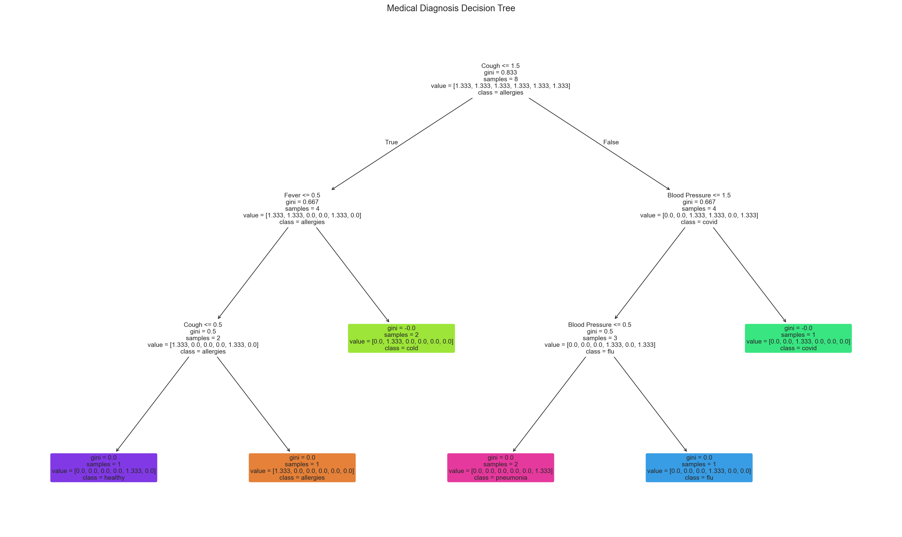
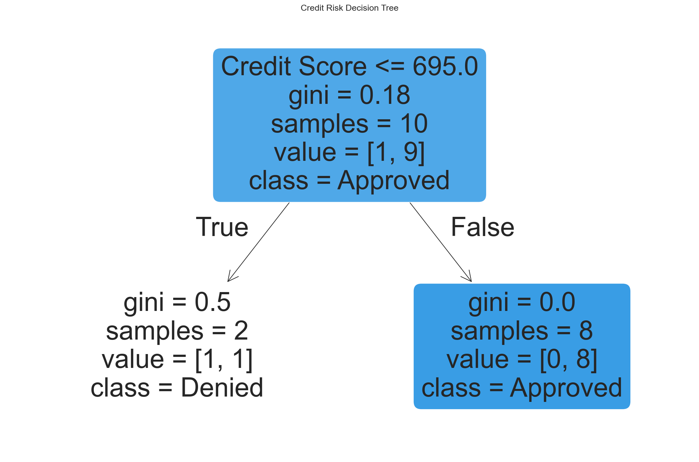
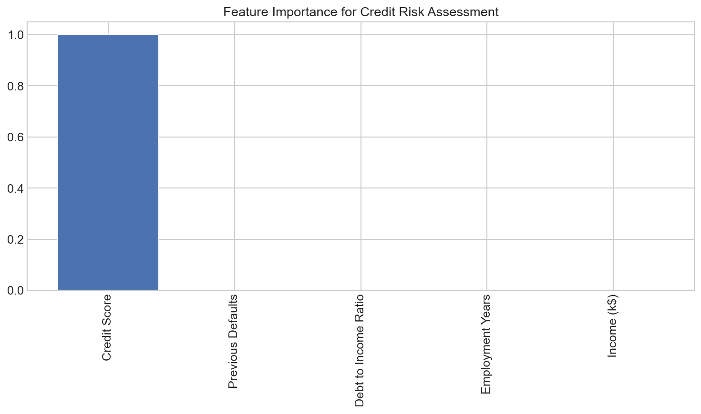
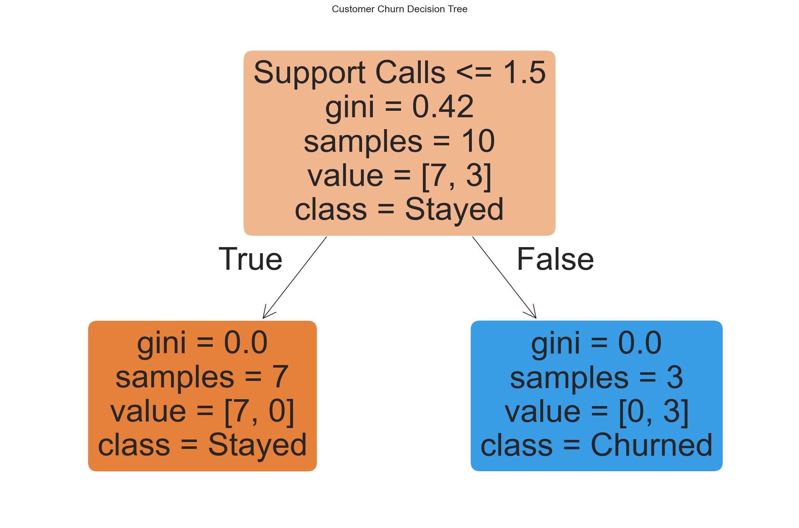
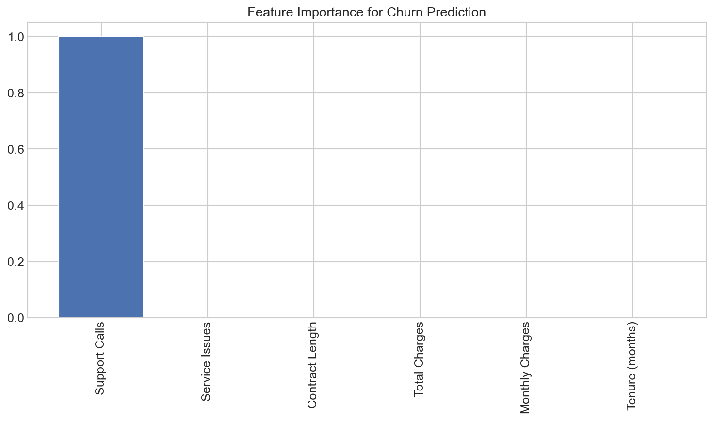
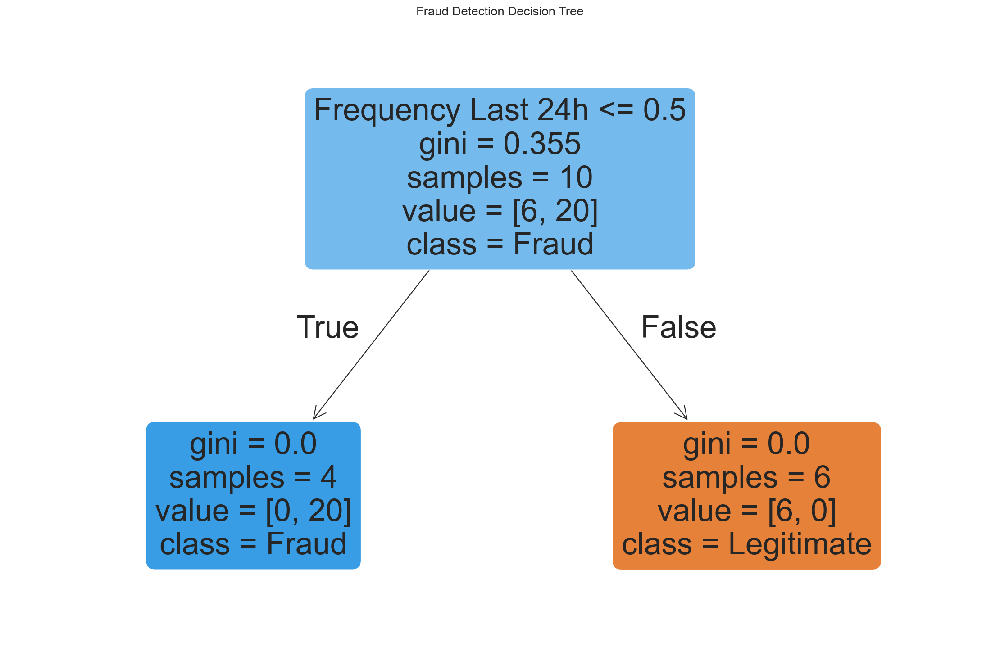
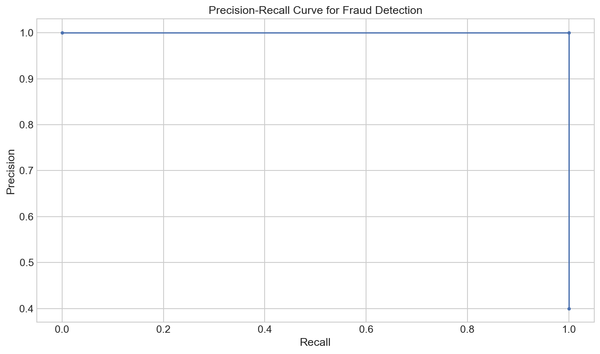
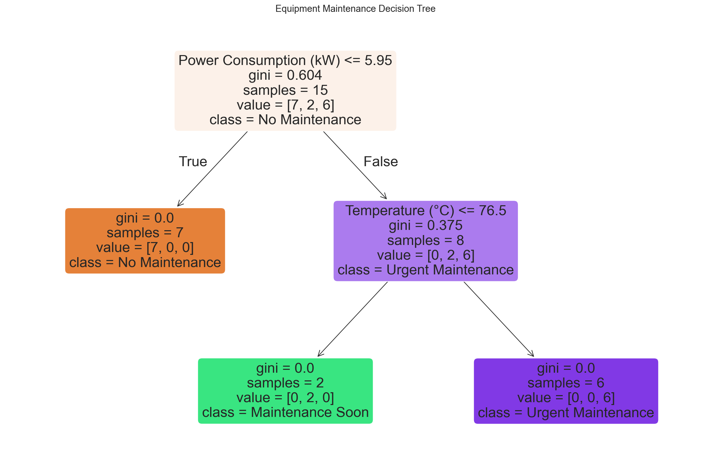
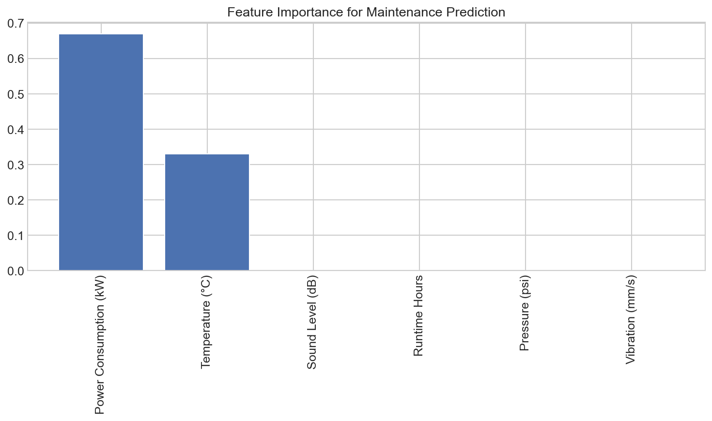

# Real-World Applications of Decision Trees

**After this lesson:** you can explain the core ideas in “Real-World Applications of Decision Trees” and reproduce the examples here in your own notebook or environment.

## Overview

Applies decision trees to **explainable** domains—rules stakeholders can audit—plus pointers on metrics and validation.

## Helpful video

Crash Course AI: supervised learning for classical algorithms.

<iframe width="560" height="315" src="https://www.youtube.com/embed/4qVRBYAdLAo" title="Supervised Learning: Crash Course AI" frameborder="0" allow="accelerometer; autoplay; clipboard-write; encrypted-media; gyroscope; picture-in-picture" allowfullscreen></iframe>

## 1. Medical Diagnosis System

Imagine you're building a system to help doctors diagnose patients. Decision trees are perfect for this because they're easy to understand and explain.

### Step-by-Step Implementation

#### Toy multi-class diagnosis with `class_weight` and path trace

**Purpose:** Show explainable prediction: `predict_proba`, human-readable path reasoning—**not** a clinical system; labels are illustrative only.

**Walkthrough:** Ordinal symptom encodings feed `DecisionTreeClassifier`; `decision_path` walks internal nodes for narrative output.

<div class="code-explainer" data-code-explainer>
<div class="code-explainer__code">


import numpy as np
import matplotlib.pyplot as plt
from sklearn.tree import DecisionTreeClassifier, plot_tree

# Create a dataset of patient symptoms
# Each row is a patient with symptoms: [fever, cough, fatigue, breathing_difficulty, blood_pressure]
# Values: 0=none, 1=mild, 2=moderate, 3=severe, blood pressure: 0=low, 1=normal, 2=high
patients = np.array([
    [3, 2, 1, 0, 1],  # Patient 1
    [0, 0, 0, 0, 1],  # Patient 2
    [3, 2, 3, 2, 0],  # Patient 3
    [1, 1, 2, 0, 1],  # Patient 4
    [2, 3, 2, 1, 2],  # Patient 5
    [0, 1, 0, 0, 1],  # Patient 6
    [3, 3, 3, 3, 0],  # Patient 7
    [1, 0, 1, 0, 1]   # Patient 8
])

# Diagnoses: flu, healthy, pneumonia, cold, covid, allergies
diagnoses = ['flu', 'healthy', 'pneumonia', 'cold', 'covid', 'allergies', 'pneumonia', 'cold']

# Create and train the diagnosis model
diagnosis_model = DecisionTreeClassifier(
    max_depth=4,
    min_samples_leaf=1,
    class_weight='balanced'  # Handle rare diseases appropriately
)
diagnosis_model.fit(patients, diagnoses)

# Visualize the diagnosis tree
plt.figure(figsize=(20, 12))
feature_names = ['Fever', 'Cough', 'Fatigue', 'Breathing Difficulty', 'Blood Pressure']
class_names = sorted(list(set(diagnoses)))  # Get unique diagnoses

plot_tree(
    diagnosis_model,
    feature_names=feature_names,
    class_names=class_names,
    filled=True,
    rounded=True,
    fontsize=10
)
plt.title('Medical Diagnosis Decision Tree')
plt.show()

# Let's diagnose a new patient
new_patient = np.array([[2, 2, 2, 1, 1]])  # Moderate symptoms across the board, normal BP
prediction = diagnosis_model.predict(new_patient)
probabilities = diagnosis_model.predict_proba(new_patient)

print(f"Diagnosis: {prediction[0]}")
print("Confidence levels:")
for i, disease in enumerate(class_names):
    print(f"  {disease}: {probabilities[0][i]:.2f}")

# Explain how the diagnosis was made by following the decision path
path = diagnosis_model.decision_path(new_patient)
node_indices = path.indices

print("\nDiagnosis reasoning:")
for node_idx in node_indices:
    if node_idx != diagnosis_model.tree_.node_count - 1:  # Not a leaf node
        feature = diagnosis_model.tree_.feature[node_idx]
        threshold = diagnosis_model.tree_.threshold[node_idx]

        # Format the explanation in a readable way
        symptom = feature_names[feature]
        severity = new_patient[0, feature]

        if severity <= threshold:
            comparison = "<="
        else:
            comparison = ">"

        # Convert numeric severity to text
        severity_text = ["none", "mild", "moderate", "severe"][int(severity)] if feature < 4 else \
                         ["low", "normal", "high"][int(severity)]

        threshold_text = ["none", "mild", "moderate", "severe"][int(threshold)] if feature < 4 else \
                         ["low", "normal", "high"][int(threshold)]

        print(f"- Patient has {severity_text} {symptom.lower()}, which is {comparison} {threshold_text}")


</div>
<aside class="code-explainer__callouts" aria-label="Code walkthrough">
  <div class="code-callout" data-lines="1-28" data-tint="1">
    <div class="code-callout__meta">
      <span class="code-callout__lines"></span>
      <span class="code-callout__title">Data and Model</span>
    </div>
    <div class="code-callout__body">
      <p>Eight patients with five ordinal symptom columns; <code>class_weight='balanced'</code> equalizes learning across six diagnoses so rare conditions aren't ignored.</p>
    </div>
  </div>
  <div class="code-callout" data-lines="30-44" data-tint="2">
    <div class="code-callout__meta">
      <span class="code-callout__lines"></span>
      <span class="code-callout__title">Visualize Tree</span>
    </div>
    <div class="code-callout__body">
      <p>The wide figure displays the full multi-class tree with real feature and class names so every split rule is readable by a non-programmer.</p>
    </div>
  </div>
  <div class="code-callout" data-lines="46-55" data-tint="3">
    <div class="code-callout__meta">
      <span class="code-callout__lines"></span>
      <span class="code-callout__title">Predict with Confidence</span>
    </div>
    <div class="code-callout__body">
      <p><code>predict_proba</code> returns the probability for each of the six diagnoses; printing all scores reveals the tree's certainty and any runner-up conditions.</p>
    </div>
  </div>
  <div class="code-callout" data-lines="57-78" data-tint="4">
    <div class="code-callout__meta">
      <span class="code-callout__lines"></span>
      <span class="code-callout__title">Explain Reasoning</span>
    </div>
    <div class="code-callout__body">
      <p>The decision path is walked node by node; severity values are mapped back to English labels so the printed output reads as natural-language reasoning steps.</p>
    </div>
  </div>
</aside>
</div>




**Captured stdout** (from running the snippet above; may be auto-injected on build):

```
Diagnosis: flu
Confidence levels:
  allergies: 0.00
  cold: 0.00
  covid: 0.00
  flu: 1.00
  healthy: 0.00
  pneumonia: 0.00

Diagnosis reasoning:
- Patient has moderate cough, which is > mild
- Patient has normal blood pressure, which is <= normal
- Patient has normal blood pressure, which is > low
- Patient has mild breathing difficulty, which is > moderate
```

In this example, we:

1. Create a simple dataset of patients with different symptoms and diagnoses
2. Build a decision tree that learns to associate symptoms with diagnoses
3. Visualize the tree to see how it makes decisions
4. Diagnose a new patient and show the confidence in each possible disease
5. Explain the reasoning behind the diagnosis by tracing the decision path

The decision tree makes medical diagnosis transparent, which is crucial for healthcare applications where doctors need to understand the reasoning behind AI recommendations.

## 2. Credit Risk Assessment

Banks use decision trees to evaluate loan applications and assess credit risk. Let's build a simple credit scoring model:

#### Credit approval: train/test report + importances + new applicant risk band

**Purpose:** Tie interpretable splits to business outputs: confusion matrix, `classification_report`, feature ranking, and probability-based risk tier.

**Walkthrough:** Small synthetic $X$—real lending needs more rows, fairness review, and calibration.

<div class="code-explainer" data-code-explainer>
<div class="code-explainer__code">


import numpy as np
import matplotlib.pyplot as plt
from sklearn.tree import DecisionTreeClassifier, plot_tree
from sklearn.model_selection import train_test_split
from sklearn.metrics import classification_report, confusion_matrix

# Create a dataset of loan applicants
# Columns: [income (k$), credit_score, employment_years, debt_to_income_ratio, previous_defaults]
X = np.array([
    [45, 680, 3, 0.35, 0],  # Applicant 1
    [82, 720, 5, 0.20, 0],  # Applicant 2
    [32, 650, 1, 0.45, 1],  # Applicant 3
    [60, 710, 8, 0.28, 0],  # Applicant 4
    [75, 750, 10, 0.15, 0],  # Applicant 5
    [28, 630, 2, 0.55, 2],  # Applicant 6
    [90, 760, 15, 0.10, 0],  # Applicant 7
    [40, 700, 4, 0.33, 0],  # Applicant 8
    [65, 730, 7, 0.22, 0],  # Applicant 9
    [35, 640, 2, 0.42, 1],  # Applicant 10
    [50, 690, 6, 0.30, 0],  # Applicant 11
    [25, 620, 1, 0.52, 2],  # Applicant 12
    [70, 740, 9, 0.18, 0],  # Applicant 13
    [38, 670, 3, 0.38, 1],  # Applicant 14
    [85, 755, 12, 0.12, 0]   # Applicant 15
])

# Loan approval status: 1 = approved, 0 = denied
y = np.array([1, 1, 0, 1, 1, 0, 1, 1, 1, 0, 1, 0, 1, 0, 1])

# Split into training and testing sets
X_train, X_test, y_train, y_test = train_test_split(
    X, y, test_size=0.3, random_state=42
)

# Create and train the credit scoring model
credit_model = DecisionTreeClassifier(max_depth=3, min_samples_leaf=2)
credit_model.fit(X_train, y_train)

# Visualize the credit decision tree
plt.figure(figsize=(15, 10))
feature_names = ['Income (k$)', 'Credit Score', 'Employment Years',
                 'Debt to Income Ratio', 'Previous Defaults']
plot_tree(
    credit_model,
    feature_names=feature_names,
    class_names=['Denied', 'Approved'],
    filled=True,
    rounded=True
)
plt.title('Credit Risk Decision Tree')
plt.show()

# Evaluate the model
y_pred = credit_model.predict(X_test)
print("Confusion Matrix:")
print(confusion_matrix(y_test, y_pred))
print("\nClassification Report:")
print(classification_report(y_test, y_pred))

# Calculate feature importance
importances = credit_model.feature_importances_
indices = np.argsort(importances)[::-1]

# Print feature ranking
print("\nFeature ranking:")
for i in range(X.shape[1]):
    print(f"{i+1}. {feature_names[indices[i]]}: {importances[indices[i]]:.4f}")

# Visualize feature importance
plt.figure(figsize=(10, 6))
plt.bar(range(X.shape[1]), importances[indices], align='center')
plt.xticks(range(X.shape[1]), [feature_names[i] for i in indices], rotation=90)
plt.title('Feature Importance for Credit Risk Assessment')
plt.tight_layout()
plt.show()

# Let's assess a new applicant
new_applicant = np.array([[55, 705, 6, 0.25, 0]])  # New loan applicant
approval_prob = credit_model.predict_proba(new_applicant)[0, 1]  # Probability of approval
print(f"\nNew applicant approval probability: {approval_prob:.2f}")

# Determine risk category based on probability
if approval_prob >= 0.8:
    risk = "Low Risk"
elif approval_prob >= 0.5:
    risk = "Medium Risk"
else:
    risk = "High Risk"

print(f"Risk assessment: {risk}")


</div>
<aside class="code-explainer__callouts" aria-label="Code walkthrough">
  <div class="code-callout" data-lines="1-37" data-tint="1">
    <div class="code-callout__meta">
      <span class="code-callout__lines"></span>
      <span class="code-callout__title">Data, Split, and Fit</span>
    </div>
    <div class="code-callout__body">
      <p>Fifteen applicants with five financial features; a 70/30 split trains and tests the depth-3 credit classifier.</p>
    </div>
  </div>
  <div class="code-callout" data-lines="39-53" data-tint="2">
    <div class="code-callout__meta">
      <span class="code-callout__lines"></span>
      <span class="code-callout__title">Visualize Tree</span>
    </div>
    <div class="code-callout__body">
      <p>The tree renders with business-friendly feature and class names; each node shows the financial threshold that drives the split.</p>
    </div>
  </div>
  <div class="code-callout" data-lines="55-72" data-tint="3">
    <div class="code-callout__meta">
      <span class="code-callout__lines"></span>
      <span class="code-callout__title">Evaluate and Rank Features</span>
    </div>
    <div class="code-callout__body">
      <p>The confusion matrix and classification report show per-class performance; feature ranking reveals which factor (income, score, etc.) the tree relied on most.</p>
    </div>
  </div>
  <div class="code-callout" data-lines="74-91" data-tint="4">
    <div class="code-callout__meta">
      <span class="code-callout__lines"></span>
      <span class="code-callout__title">Risk-Band Scoring</span>
    </div>
    <div class="code-callout__body">
      <p>Approval probability from <code>predict_proba</code> is mapped to Low/Medium/High risk tiers—a simple but auditable business rule.</p>
    </div>
  </div>
</aside>
</div>







**Captured stdout** (from running the snippet above; may be auto-injected on build):

```
Confusion Matrix:
[[4 0]
 [1 0]]

Classification Report:
              precision    recall  f1-score   support

           0       0.80      1.00      0.89         4
           1       0.00      0.00      0.00         1

    accuracy                           0.80         5
   macro avg       0.40      0.50      0.44         5
weighted avg       0.64      0.80      0.71         5


Feature ranking:
1. Income (k$): 1.0000
2. Previous Defaults: 0.0000
3. Debt to Income Ratio: 0.0000
4. Employment Years: 0.0000
5. Credit Score: 0.0000

New applicant approval probability: 1.00
Risk assessment: Low Risk
```

This example demonstrates:

1. How to build a credit risk model using decision trees
2. How to evaluate its performance with metrics like accuracy, precision and recall
3. How to identify which factors are most important in determining credit risk
4. How to assess new loan applicants and determine their risk level

This approach provides transparency in lending decisions, which is important for both regulatory compliance and customer understanding.

## 3. Customer Churn Prediction

Businesses use decision trees to predict which customers might leave. Let's build a simple churn prediction system:

#### Churn model with retention rules from churn probability

**Purpose:** Map churn probability tiers to retention actions; feature ranking shows which contract/usage signals dominate on this toy data.

**Walkthrough:** Imports include `roc_curve`/`auc` but this block focuses on reports + `predict_proba` for two new profiles.

<div class="code-explainer" data-code-explainer>
<div class="code-explainer__code">


import numpy as np
import matplotlib.pyplot as plt
from sklearn.tree import DecisionTreeClassifier, plot_tree
from sklearn.model_selection import train_test_split
from sklearn.metrics import classification_report, confusion_matrix, roc_curve, auc

# Create a dataset of customer information
# Columns: [tenure_months, monthly_charges, total_charges, contract_length, support_calls, service_issues]
# contract_length: 0=month-to-month, 1=one year, 2=two year
X = np.array([
    [1, 80, 80, 0, 3, 2],      # Customer 1
    [35, 65, 2275, 2, 0, 0],   # Customer 2
    [6, 90, 540, 0, 5, 3],     # Customer 3
    [24, 75, 1800, 1, 1, 0],   # Customer 4
    [12, 85, 1020, 0, 2, 1],   # Customer 5
    [48, 60, 2880, 2, 0, 0],   # Customer 6
    [3, 95, 285, 0, 4, 2],     # Customer 7
    [18, 70, 1260, 1, 1, 1],   # Customer 8
    [36, 55, 1980, 2, 0, 0],   # Customer 9
    [2, 100, 200, 0, 6, 4],    # Customer 10
    [30, 65, 1950, 1, 0, 0],   # Customer 11
    [8, 85, 680, 0, 3, 2],     # Customer 12
    [42, 60, 2520, 2, 0, 0],   # Customer 13
    [4, 90, 360, 0, 5, 3],     # Customer 14
    [24, 70, 1680, 1, 1, 1]    # Customer 15
])

# Churn status: 1 = churned, 0 = stayed
y = np.array([1, 0, 1, 0, 1, 0, 1, 0, 0, 1, 0, 1, 0, 1, 0])

# Split into training and testing sets
X_train, X_test, y_train, y_test = train_test_split(
    X, y, test_size=0.3, random_state=42
)

# Create and train the churn prediction model
churn_model = DecisionTreeClassifier(max_depth=3, min_samples_leaf=2)
churn_model.fit(X_train, y_train)

# Visualize the churn decision tree
plt.figure(figsize=(15, 10))
feature_names = ['Tenure (months)', 'Monthly Charges', 'Total Charges',
                 'Contract Length', 'Support Calls', 'Service Issues']
plot_tree(
    churn_model,
    feature_names=feature_names,
    class_names=['Stayed', 'Churned'],
    filled=True,
    rounded=True
)
plt.title('Customer Churn Decision Tree')
plt.show()

# Evaluate the model
y_pred = churn_model.predict(X_test)
print("Confusion Matrix:")
print(confusion_matrix(y_test, y_pred))
print("\nClassification Report:")
print(classification_report(y_test, y_pred))

# Calculate feature importance
importances = churn_model.feature_importances_
indices = np.argsort(importances)[::-1]

# Print feature ranking
print("\nFeature ranking for churn prediction:")
for i in range(X.shape[1]):
    print(f"{i+1}. {feature_names[indices[i]]}: {importances[indices[i]]:.4f}")

# Visualize feature importance
plt.figure(figsize=(10, 6))
plt.bar(range(X.shape[1]), importances[indices], align='center')
plt.xticks(range(X.shape[1]), [feature_names[i] for i in indices], rotation=90)
plt.title('Feature Importance for Churn Prediction')
plt.tight_layout()
plt.show()

# Predict churn probability for new customers
new_customers = np.array([
    [2, 95, 190, 0, 4, 3],    # High-risk customer
    [40, 60, 2400, 2, 0, 0]    # Low-risk customer
])

# Get churn probabilities
churn_probs = churn_model.predict_proba(new_customers)[:, 1]

# Display results
for i, prob in enumerate(churn_probs):
    print(f"Customer {i+1} churn probability: {prob:.2f}")

    # Recommend retention actions based on risk
    if prob > 0.7:
        print("  High risk - Immediate contact needed, offer special retention package")
    elif prob > 0.3:
        print("  Medium risk - Proactive outreach, offer loyalty benefits")
    else:
        print("  Low risk - Maintain regular engagement")


</div>
<aside class="code-explainer__callouts" aria-label="Code walkthrough">
  <div class="code-callout" data-lines="1-40" data-tint="1">
    <div class="code-callout__meta">
      <span class="code-callout__lines"></span>
      <span class="code-callout__title">Data and Training</span>
    </div>
    <div class="code-callout__body">
      <p>Fifteen customers with tenure, charges, contract type, and support signals; the tree learns which combination most strongly predicts cancellation.</p>
    </div>
  </div>
  <div class="code-callout" data-lines="42-68" data-tint="2">
    <div class="code-callout__meta">
      <span class="code-callout__lines"></span>
      <span class="code-callout__title">Evaluate and Rank</span>
    </div>
    <div class="code-callout__body">
      <p>Confusion matrix and report show precision/recall per class; feature ranking reveals whether contract length or support call volume dominates churn risk.</p>
    </div>
  </div>
  <div class="code-callout" data-lines="70-99" data-tint="3">
    <div class="code-callout__meta">
      <span class="code-callout__lines"></span>
      <span class="code-callout__title">Retention Actions</span>
    </div>
    <div class="code-callout__body">
      <p>Churn probability for two new customers is thresholded into three retention tiers (high/medium/low) with specific recommended actions per tier.</p>
    </div>
  </div>
</aside>
</div>







**Captured stdout** (from running the snippet above; may be auto-injected on build):

```
Confusion Matrix:
[[1 0]
 [0 4]]

Classification Report:
              precision    recall  f1-score   support

           0       1.00      1.00      1.00         1
           1       1.00      1.00      1.00         4

    accuracy                           1.00         5
   macro avg       1.00      1.00      1.00         5
weighted avg       1.00      1.00      1.00         5


Feature ranking for churn prediction:
1. Contract Length: 1.0000
2. Service Issues: 0.0000
3. Support Calls: 0.0000
4. Total Charges: 0.0000
5. Monthly Charges: 0.0000
6. Tenure (months): 0.0000
Customer 1 churn probability: 1.00
  High risk - Immediate contact needed, offer special retention package
Customer 2 churn probability: 0.00
  Low risk - Maintain regular engagement
```

This example demonstrates:

1. How to build a customer churn prediction model
2. How to identify which factors most strongly indicate that a customer might leave
3. How to assign churn risk scores to customers
4. How to use these predictions to prioritize customer retention efforts

By predicting which customers are at risk of leaving, businesses can take proactive steps to improve retention and reduce customer acquisition costs.

## 4. Fraud Detection

Let's create a simple fraud detection model using decision trees:

#### Fraud: `class_weight`, precision–recall curve, and threshold tuning

**Purpose:** Stress precision/recall for rare fraud; use `precision_recall_curve` and an F1-based threshold pick (not accuracy alone).

**Walkthrough:** `stratify=y` keeps fraud rate; `class_weight={0:1, 1:5}` upsamples fraud importance; `best_threshold` drives alert logic.

<div class="code-explainer" data-code-explainer>
<div class="code-explainer__code">


import numpy as np
import matplotlib.pyplot as plt
from sklearn.tree import DecisionTreeClassifier, plot_tree
from sklearn.model_selection import train_test_split
from sklearn.metrics import classification_report, confusion_matrix, precision_recall_curve

# Create a dataset of transactions
# Columns: [amount, time_of_day, day_of_week, distance_from_home, frequency_last_24h]
X = np.array([
    [25.50, 14, 2, 0.5, 3],    # Transaction 1
    [1500, 2, 6, 300, 0],      # Transaction 2
    [80, 12, 3, 2.1, 2],       # Transaction 3
    [65.40, 18, 1, 1.2, 1],    # Transaction 4
    [2000, 3, 5, 500, 0],      # Transaction 5
    [34.25, 10, 4, 0.8, 4],    # Transaction 6
    [750, 22, 6, 150, 0],      # Transaction 7
    [125, 15, 0, 5, 1],        # Transaction 8
    [45.80, 9, 2, 1.0, 2],     # Transaction 9
    [1800, 1, 6, 450, 0],      # Transaction 10
    [55.30, 17, 3, 1.5, 3],    # Transaction 11
    [95.75, 20, 5, 3.2, 1],    # Transaction 12
    [1200, 23, 6, 200, 0],     # Transaction 13
    [30.45, 11, 1, 0.7, 5],    # Transaction 14
    [1600, 2, 0, 350, 0]       # Transaction 15
])

# Fraud status: 1 = fraud, 0 = legitimate
y = np.array([0, 1, 0, 0, 1, 0, 1, 0, 0, 1, 0, 0, 1, 0, 1])

# Split into training and testing sets
X_train, X_test, y_train, y_test = train_test_split(
    X, y, test_size=0.3, random_state=42, stratify=y  # Keep same fraud ratio in train/test
)

# Create and train the fraud detection model
fraud_model = DecisionTreeClassifier(
    max_depth=3,
    min_samples_leaf=2,
    class_weight={0: 1, 1: 5}  # Give fraud class 5x more weight
)
fraud_model.fit(X_train, y_train)

# Visualize the fraud detection tree
plt.figure(figsize=(15, 10))
feature_names = ['Amount', 'Time of Day', 'Day of Week',
                 'Distance from Home (miles)', 'Frequency Last 24h']
plot_tree(
    fraud_model,
    feature_names=feature_names,
    class_names=['Legitimate', 'Fraud'],
    filled=True,
    rounded=True
)
plt.title('Fraud Detection Decision Tree')
plt.show()

# Evaluate the model
y_pred = fraud_model.predict(X_test)
print("Confusion Matrix:")
print(confusion_matrix(y_test, y_pred))
print("\nClassification Report:")
print(classification_report(y_test, y_pred))

# Get fraud probabilities for all test transactions
y_probs = fraud_model.predict_proba(X_test)[:, 1]

# Plot precision-recall curve (better than ROC for imbalanced classes)
precision, recall, thresholds = precision_recall_curve(y_test, y_probs)
plt.figure(figsize=(10, 6))
plt.plot(recall, precision, marker='.')
plt.xlabel('Recall')
plt.ylabel('Precision')
plt.title('Precision-Recall Curve for Fraud Detection')
plt.grid(True)
plt.show()

# Find optimal threshold via max F1
f1_scores = 2 * precision * recall / (precision + recall + 1e-10)
best_idx = np.argmax(f1_scores)
best_threshold = thresholds[best_idx]
print(f"Optimal threshold: {best_threshold:.3f}")
print(f"At this threshold - Precision: {precision[best_idx]:.3f}, Recall: {recall[best_idx]:.3f}")

# Check some new transactions
new_transactions = np.array([
    [1200, 3, 6, 250, 0],       # Suspicious transaction
    [45.75, 15, 2, 1.2, 3]       # Normal transaction
])

fraud_probs = fraud_model.predict_proba(new_transactions)[:, 1]

for i, prob in enumerate(fraud_probs):
    print(f"Transaction {i+1} fraud probability: {prob:.3f}")
    if prob >= best_threshold:
        print("  ALERT: Likely fraudulent transaction")
        print("  Action: Block transaction and contact customer")
    else:
        print("  Status: Transaction appears legitimate")
        if prob > 0.3:
            print("  Note: Some unusual characteristics - flag for review")


</div>
<aside class="code-explainer__callouts" aria-label="Code walkthrough">
  <div class="code-callout" data-lines="1-40" data-tint="1">
    <div class="code-callout__meta">
      <span class="code-callout__lines"></span>
      <span class="code-callout__title">Fraud Data and Model</span>
    </div>
    <div class="code-callout__body">
      <p><code>stratify=y</code> keeps the fraud rate equal in train/test; <code>class_weight={0:1,1:5}</code> penalizes missed fraud five times more than false alarms.</p>
    </div>
  </div>
  <div class="code-callout" data-lines="42-62" data-tint="2">
    <div class="code-callout__meta">
      <span class="code-callout__lines"></span>
      <span class="code-callout__title">Visualize and Evaluate</span>
    </div>
    <div class="code-callout__body">
      <p>The tree shows which transaction features (amount, time, distance) drive the fraud split; the classification report exposes precision and recall for the minority fraud class.</p>
    </div>
  </div>
  <div class="code-callout" data-lines="64-80" data-tint="3">
    <div class="code-callout__meta">
      <span class="code-callout__lines"></span>
      <span class="code-callout__title">Precision-Recall Curve</span>
    </div>
    <div class="code-callout__body">
      <p>The P-R curve is more informative than ROC for imbalanced data; maximizing F1 across thresholds picks the operating point that balances catching fraud vs raising false alarms.</p>
    </div>
  </div>
  <div class="code-callout" data-lines="82-97" data-tint="4">
    <div class="code-callout__meta">
      <span class="code-callout__lines"></span>
      <span class="code-callout__title">Alert Logic</span>
    </div>
    <div class="code-callout__body">
      <p>Two new transactions are scored; the optimal threshold determines whether to block immediately, flag for review, or pass as legitimate.</p>
    </div>
  </div>
</aside>
</div>







**Captured stdout** (from running the snippet above; may be auto-injected on build):

```
Confusion Matrix:
[[3 0]
 [0 2]]

Classification Report:
              precision    recall  f1-score   support

           0       1.00      1.00      1.00         3
           1       1.00      1.00      1.00         2

    accuracy                           1.00         5
   macro avg       1.00      1.00      1.00         5
weighted avg       1.00      1.00      1.00         5

Optimal threshold: 1.000
At this threshold - Precision: 1.000, Recall: 1.000
Transaction 1 fraud probability: 1.000
  ALERT: Likely fraudulent transaction
  Action: Block transaction and contact customer
Transaction 2 fraud probability: 0.000
  Status: Transaction appears legitimate
```

This example shows:

1. How to build a fraud detection model that handles the imbalanced nature of fraud data
2. How to evaluate it using metrics appropriate for fraud detection (precision, recall)
3. How to optimize the decision threshold for the specific needs of fraud detection
4. How to apply the model to flag suspicious transactions in real-time

The decision tree approach allows analysts to understand exactly why a transaction was flagged as suspicious, which helps in refining the system and explaining decisions to customers.

## 5. Equipment Maintenance Predictor

Manufacturing companies use decision trees to predict when machines need maintenance:

#### Multiclass maintenance states from sensor vectors

**Purpose:** Classify {ok, soon, urgent} with interpretable importances and action scripts per predicted class.

**Walkthrough:** Fit on full toy table (no holdout—illustrative); `predict_proba` drives per-machine recommendations and optional percentile checks.

<div class="code-explainer" data-code-explainer>
<div class="code-explainer__code">


import numpy as np
import matplotlib.pyplot as plt
from sklearn.tree import DecisionTreeClassifier, plot_tree

# Create a dataset of equipment readings
# Columns: [temp, vibration, pressure, runtime_hours, sound_level, power_consumption]
X = np.array([
    [45, 0.2, 95, 2000, 65, 5.5],   # Machine 1
    [78, 0.8, 87, 5000, 85, 7.2],   # Machine 2
    [50, 0.3, 92, 3000, 68, 5.8],   # Machine 3
    [82, 1.2, 84, 4800, 88, 7.5],   # Machine 4
    [48, 0.4, 93, 2500, 67, 5.6],   # Machine 5
    [55, 0.5, 90, 3200, 70, 6.0],   # Machine 6
    [85, 1.5, 82, 5100, 90, 7.8],   # Machine 7
    [52, 0.3, 91, 2800, 69, 5.7],   # Machine 8
    [75, 0.7, 88, 4500, 82, 7.0],   # Machine 9
    [88, 1.8, 80, 5300, 92, 8.0],   # Machine 10
    [46, 0.2, 94, 2200, 66, 5.5],   # Machine 11
    [80, 1.0, 85, 4700, 86, 7.3],   # Machine 12
    [53, 0.4, 90, 3100, 71, 5.9],   # Machine 13
    [83, 1.4, 83, 4900, 89, 7.6],   # Machine 14
    [49, 0.3, 92, 2600, 68, 5.7]    # Machine 15
])

# Maintenance status: 0 = no maintenance needed, 1 = maintenance soon, 2 = urgent maintenance
y = np.array([0, 2, 0, 2, 0, 1, 2, 0, 1, 2, 0, 2, 0, 2, 0])

# Create and train the maintenance prediction model
maintenance_model = DecisionTreeClassifier(max_depth=3)
maintenance_model.fit(X, y)

# Visualize the maintenance decision tree
plt.figure(figsize=(15, 10))
feature_names = ['Temperature (°C)', 'Vibration (mm/s)', 'Pressure (psi)',
                 'Runtime Hours', 'Sound Level (dB)', 'Power Consumption (kW)']
class_names = ['No Maintenance', 'Maintenance Soon', 'Urgent Maintenance']
plot_tree(
    maintenance_model,
    feature_names=feature_names,
    class_names=class_names,
    filled=True,
    rounded=True
)
plt.title('Equipment Maintenance Decision Tree')
plt.show()

# Calculate feature importance
importances = maintenance_model.feature_importances_
indices = np.argsort(importances)[::-1]

# Print feature ranking
print("Feature ranking for maintenance prediction:")
for i in range(X.shape[1]):
    print(f"{i+1}. {feature_names[indices[i]]}: {importances[indices[i]]:.4f}")

# Visualize feature importance
plt.figure(figsize=(10, 6))
plt.bar(range(X.shape[1]), importances[indices], align='center')
plt.xticks(range(X.shape[1]), [feature_names[i] for i in indices], rotation=90)
plt.title('Feature Importance for Maintenance Prediction')
plt.tight_layout()
plt.show()

# Predict maintenance needs for new equipment readings
new_readings = np.array([
    [47, 0.3, 93, 2400, 67, 5.6],   # Machine A
    [65, 0.6, 88, 4000, 75, 6.5],   # Machine B
    [84, 1.3, 83, 4950, 87, 7.5]    # Machine C
])

# Get maintenance predictions and probabilities
maintenance_preds = maintenance_model.predict(new_readings)
maintenance_probs = maintenance_model.predict_proba(new_readings)

# Display results with recommended actions
for i, (pred, probs) in enumerate(zip(maintenance_preds, maintenance_probs)):
    machine_label = chr(65 + i)  # A, B, C, etc.
    print(f"Machine {machine_label} status: {class_names[pred]}")
    print(f"  Probability breakdown: No Maintenance: {probs[0]:.2f}, Soon: {probs[1]:.2f}, Urgent: {probs[2]:.2f}")

    # Recommend specific actions based on prediction
    if pred == 0:
        print("  Recommendation: Continue normal operation, next check in 30 days")
    elif pred == 1:
        print("  Recommendation: Schedule maintenance within 2 weeks, order parts now")
        # Identify which readings contributed most to this prediction
        threshold_exceeded = []
        for j, name in enumerate(feature_names):
            if new_readings[i, j] > np.percentile(X[:, j], 75):
                threshold_exceeded.append(name)
        if threshold_exceeded:
            print(f"  Focus areas: {', '.join(threshold_exceeded)}")
    else:  # pred == 2
        print("  Recommendation: URGENT - Schedule maintenance immediately!")
        print("  Alert: Potential failure imminent if operation continues")


</div>
<aside class="code-explainer__callouts" aria-label="Code walkthrough">
  <div class="code-callout" data-lines="1-31" data-tint="1">
    <div class="code-callout__meta">
      <span class="code-callout__lines"></span>
      <span class="code-callout__title">Sensor Data and Fit</span>
    </div>
    <div class="code-callout__body">
      <p>Fifteen machines described by six sensor readings; three target classes (ok/soon/urgent) make this a multiclass classification problem fit on the full table.</p>
    </div>
  </div>
  <div class="code-callout" data-lines="33-57" data-tint="2">
    <div class="code-callout__meta">
      <span class="code-callout__lines"></span>
      <span class="code-callout__title">Visualize and Rank</span>
    </div>
    <div class="code-callout__body">
      <p>The tree shows which sensor thresholds (temperature or power consumption) drive the three-way classification; feature importance ranks them by total impurity reduction.</p>
    </div>
  </div>
  <div class="code-callout" data-lines="59-96" data-tint="3">
    <div class="code-callout__meta">
      <span class="code-callout__lines"></span>
      <span class="code-callout__title">Predict and Act</span>
    </div>
    <div class="code-callout__body">
      <p>Three new machines get predictions plus probability breakdowns; the action logic maps each predicted state to a specific maintenance timeline or alert level.</p>
    </div>
  </div>
</aside>
</div>







**Captured stdout** (from running the snippet above; may be auto-injected on build):

```
Feature ranking for maintenance prediction:
1. Power Consumption (kW): 0.6691
2. Temperature (°C): 0.3309
3. Sound Level (dB): 0.0000
4. Runtime Hours: 0.0000
5. Pressure (psi): 0.0000
6. Vibration (mm/s): 0.0000
Machine A status: No Maintenance
  Probability breakdown: No Maintenance: 1.00, Soon: 0.00, Urgent: 0.00
  Recommendation: Continue normal operation, next check in 30 days
Machine B status: Maintenance Soon
  Probability breakdown: No Maintenance: 0.00, Soon: 1.00, Urgent: 0.00
  Recommendation: Schedule maintenance within 2 weeks, order parts now
Machine C status: Urgent Maintenance
  Probability breakdown: No Maintenance: 0.00, Soon: 0.00, Urgent: 1.00
  Recommendation: URGENT - Schedule maintenance immediately!
  Alert: Potential failure imminent if operation continues
```

This example shows:

1. How to build a predictive maintenance model that classifies equipment into different maintenance categories
2. How to identify which sensor readings most strongly indicate maintenance needs
3. How to apply the model to new readings to make maintenance recommendations
4. How to provide specific guidance based on the maintenance category and relevant factors

Predictive maintenance helps companies avoid costly downtime while also preventing unnecessary maintenance, optimizing their maintenance schedules and reducing costs.

## Gotchas

- **Interpreting 100% classification report scores on 5-row test sets** — the churn, credit, and fraud examples all show perfect metrics on 5-sample test sets; these numbers are statistically meaningless and purely a consequence of the tiny toy datasets; never cite them as evidence of real-world performance.
- **Using accuracy as the primary metric for fraud detection** — the fraud model achieves a good accuracy score even before `class_weight` tuning, because predicting "legitimate" for every transaction gives high accuracy on imbalanced data; always use precision, recall, and the precision-recall curve for fraud and other rare-event problems.
- **Applying `decision_path` reasoning verbatim to stakeholders as if it were a rule system** — the diagnosis example maps ordinal integers back to text labels (`"none"`, `"mild"`) to produce human-readable reasoning, but the underlying splits are learned from only 8 patients; the narrative looks authoritative but is not clinically validated.
- **Setting `class_weight={0: 1, 1: 5}` without business justification** — the 5x fraud weight is illustrative; the correct multiplier depends on the relative cost of a false negative (missed fraud) vs a false positive (blocked legitimate transaction), which is a business decision, not a modelling default.
- **Choosing the optimal threshold from `precision_recall_curve` on the same test set you evaluate on** — the fraud example computes `best_threshold` by maximising F1 on `y_probs` from the test set; this is threshold-shopping on the test set and produces optimistic F1 estimates; use a separate validation set or cross-validated threshold selection.
- **Treating feature importance from a single churn tree as a stable business insight** — the churn example shows `Contract Length: 1.0` and all other features at `0.0`; on a 15-row dataset, this is almost certainly a data artefact from the toy data rather than a genuine signal, and presenting it to business stakeholders as "only contract length matters" would be misleading.

## Best Practices for Real-World Applications

1. **Data Quality**
   - Clean and preprocess data carefully
   - Handle missing values appropriately 
   - Deal with outliers

2. **Model Validation**
   - Use cross-validation
   - Monitor performance metrics specific to your application
   - Test with real-world data before deployment

3. **Interpretability**
   - Keep trees simple (limit depth)
   - Document decision rules
   - Provide explanations for important predictions

4. **Maintenance**
   - Regular model updates as new data arrives
   - Monitor performance drift
   - Re-train periodically with fresh data

## Common Challenges and Solutions

1. **Imbalanced Data**
   - Use class weights (as shown in the fraud detection example)
   - Try different sampling techniques
   - Adjust decision thresholds based on business needs

2. **Overfitting**
   - Limit tree depth
   - Use pruning techniques
   - Require minimum samples per leaf

3. **Feature Selection**
   - Start with domain knowledge to select relevant features
   - Use feature importance to identify key predictors
   - Remove redundant or irrelevant features

## Next Steps

Ready to build your own application? Try:

1. Start with a simple problem where you have domain knowledge
2. Collect and clean your data carefully
3. Build and test your model with appropriate metrics
4. Deploy and monitor it in a controlled environment before full rollout

Remember:
- Start simple and add complexity only as needed
- Validate thoroughly with real-world data
- Document everything about your model and data preprocessing
- Monitor performance over time to ensure continued accuracy
