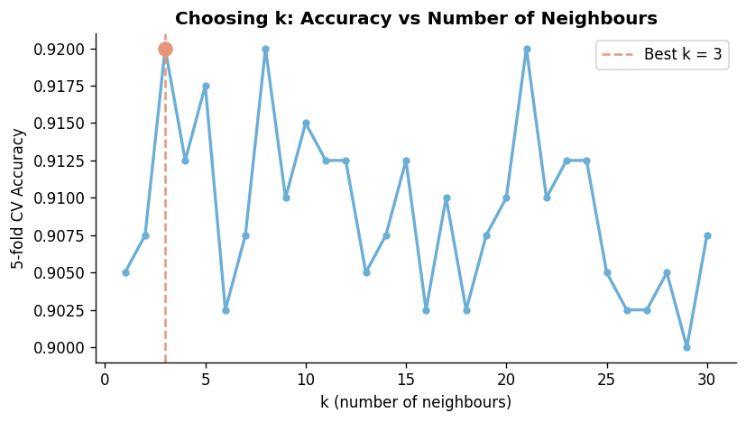
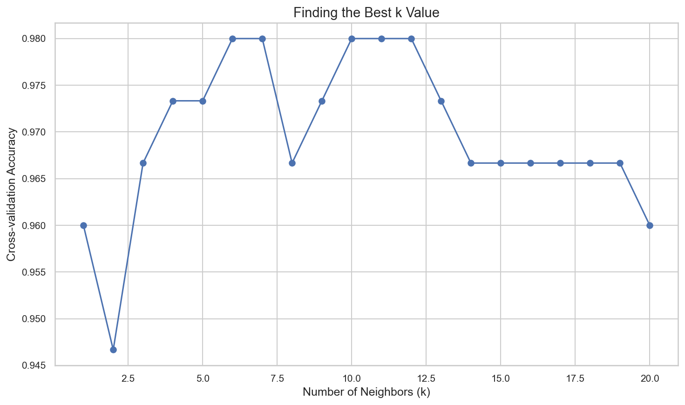

# Advanced KNN Techniques: Taking Your Skills to the Next Level

**After this lesson:** you can explain the core ideas in “Advanced KNN Techniques: Taking Your Skills to the Next Level” and reproduce the examples here in your own notebook or environment.

Welcome to the advanced section! Here we'll explore techniques that can make your KNN models more powerful and efficient. Don't worry if some concepts seem complex at first - we'll break them down into manageable pieces.


*Figure: Comparison of uniform weights vs distance-based weights in KNN*

## Helpful video

Crash Course AI: supervised learning for classical algorithms.

<iframe width="560" height="315" src="https://www.youtube.com/embed/4qVRBYAdLAo" title="Supervised Learning: Crash Course AI" frameborder="0" allow="accelerometer; autoplay; clipboard-write; encrypted-media; gyroscope; picture-in-picture" allowfullscreen></iframe>

## Why Advanced Techniques Matter

Advanced KNN techniques help you:

- Handle complex real-world data better
- Improve model accuracy
- Make predictions faster
- Deal with special cases like imbalanced data

## 1. Weighted KNN: Giving More Importance to Closer Neighbors

Think of weighted KNN like asking your friends for movie recommendations:

- Your best friend's opinion matters more than a casual acquaintance
- The closer someone is to you, the more you trust their recommendation

### How Weighted KNN Works

#### `weights='distance'` on synthetic genre features

**Purpose:** Builds a `KNeighborsClassifier` that weights closer neighbors more heavily, fits it on 3D feature vectors, and predicts a genre for a new point.

**Walkthrough:**
- `KNeighborsClassifier(..., weights='distance')`; `fit` on `X_train`, `y_train`; `predict` for `new_movie`; needs NumPy for `X_train` / `new_movie`.

```python
import numpy as np
from sklearn.neighbors import KNeighborsClassifier

# Create a weighted KNN model
knn = KNeighborsClassifier(
    n_neighbors=5,
    weights='distance'  # This makes closer neighbors count more
)

# Example: Movie Recommendations
# Features: [Action Score, Romance Score, Comedy Score]
X_train = np.array([
    [8, 2, 1],  # Action movie
    [7, 3, 2],  # Action movie
    [2, 8, 1],  # Romance movie
    [3, 7, 2],  # Romance movie
    [1, 1, 9],  # Comedy movie
    [2, 2, 8]   # Comedy movie
])
y_train = np.array(['Action', 'Action', 'Romance', 'Romance', 'Comedy', 'Comedy'])

# Train the model
knn.fit(X_train, y_train)

# Predict a new movie
new_movie = np.array([4, 4, 3])  # Mix of all genres
prediction = knn.predict([new_movie])
print(f"Predicted genre: {prediction[0]}")
```

**Captured stdout** (from running the snippet above; may be auto-injected on build):

```
Predicted genre: Action
```

## 2. Dimensionality Reduction: Making Complex Data Simpler

Sometimes your data has too many features, making KNN slow and less accurate. Dimensionality reduction helps by:

- Reducing the number of features
- Keeping the most important information
- Making visualization easier

### Using PCA (Principal Component Analysis)

#### PCA to 2D and scatter-plot Iris by class

**Purpose:** Projects Iris features onto the first two principal components and colors points by label for visualization.

**Walkthrough:**
- `PCA(n_components=2).fit_transform`; `plt.scatter` with `c=y`, `colorbar`, `plt.show()`.

```python
from sklearn.decomposition import PCA
import matplotlib.pyplot as plt

def visualize_data(X, y):
    """Reduce dimensions and create a scatter plot"""
    # Reduce to 2 dimensions for visualization
    pca = PCA(n_components=2)
    X_reduced = pca.fit_transform(X)
    
    # Create scatter plot
    plt.figure(figsize=(10, 6))
    scatter = plt.scatter(X_reduced[:, 0], X_reduced[:, 1], c=y, cmap='viridis')
    plt.colorbar(scatter)
    plt.xlabel('First Principal Component')
    plt.ylabel('Second Principal Component')
    plt.title('Data Visualization After PCA')
    plt.show()

# Example: Iris Dataset
from sklearn.datasets import load_iris
iris = load_iris()
X, y = iris.data, iris.target
visualize_data(X, y)
```




## 3. Finding the Best k Value

Choosing the right number of neighbors (k) is crucial. Too few can lead to noise, too many can blur boundaries.

### Cross-Validation for k Selection

#### Sweep `k` with 5-fold CV and plot accuracy vs `k`

**Purpose:** Trains a fresh `KNeighborsClassifier` for each `k`, records mean CV accuracy, plots the curve, and prints the `k` with the highest score.

**Walkthrough:**
- Loop over `k_values`; `cross_val_score(..., cv=5).mean()`; `np.argmax` on scores; `plt.plot` with markers.

```python
import numpy as np
from sklearn.neighbors import KNeighborsClassifier
from sklearn.model_selection import cross_val_score
import matplotlib.pyplot as plt

def find_best_k(X, y, max_k=20):
    """Find the best k value using cross-validation"""
    k_values = range(1, max_k + 1)
    scores = []
    
    for k in k_values:
        knn = KNeighborsClassifier(n_neighbors=k)
        score = cross_val_score(knn, X, y, cv=5).mean()
        scores.append(score)
    
    # Plot results
    plt.figure(figsize=(10, 6))
    plt.plot(k_values, scores, 'o-')
    plt.xlabel('Number of Neighbors (k)')
    plt.ylabel('Cross-validation Accuracy')
    plt.title('Finding the Best k Value')
    plt.grid(True)
    plt.show()
    
    best_k = k_values[np.argmax(scores)]
    print(f"Best k value: {best_k}")
    return best_k

# Example usage
best_k = find_best_k(X, y)
```




**Captured stdout** (from running the snippet above; may be auto-injected on build):

```
Best k value: 6
```

## 4. Handling Imbalanced Data

When one class is much more common than others, KNN can be biased. Here's how to fix it:

#### SMOTE + KNN pipeline with cross-validated accuracy

**Purpose:** Chains SMOTE oversampling with `KNeighborsClassifier` so CV evaluates the full preprocessing+model pipeline on imbalanced data.

**Walkthrough:**
- `Pipeline([('smote', SMOTE(...)), ('knn', KNeighborsClassifier(...))])`; `cross_val_score(pipeline, X, y, cv=5)`.

```python
import numpy as np
from imblearn.over_sampling import SMOTE
from imblearn.pipeline import Pipeline

def handle_imbalanced_data(X, y):
    """Balance classes using SMOTE"""
    # Create pipeline with SMOTE and KNN
    pipeline = Pipeline([
        ('smote', SMOTE(random_state=42)),
        ('knn', KNeighborsClassifier(n_neighbors=5))
    ])
    
    # Train and evaluate
    scores = cross_val_score(pipeline, X, y, cv=5)
    print(f"Average accuracy after balancing: {scores.mean():.3f}")
    
    return pipeline

# Example: Credit Card Fraud Detection
# (Typically has very few fraud cases)
X_imbalanced = np.array([...])  # Your features
y_imbalanced = np.array([...])  # Your labels (mostly 0s, few 1s)
model = handle_imbalanced_data(X_imbalanced, y_imbalanced)
```

## 5. Optimizing for Speed: Using Tree Structures

For large datasets, KNN can be slow. Tree structures help speed it up:

#### `BallTree`-backed k-NN with majority vote via `bincount`

**Purpose:** Stores training points in a `BallTree` for fast `k` neighbor queries, then labels each query by the mode of neighbor class indices (integer labels).

**Walkthrough:**
- `BallTree(X)` in `fit`; `tree.query(X, k=self.k)` returns distances and indices; `np.bincount` / `argmax` for voting.

```python
import numpy as np
from sklearn.neighbors import BallTree

class FastKNN:
    def __init__(self, k=5):
        self.k = k
        
    def fit(self, X, y):
        """Build a ball tree for faster searches"""
        self.tree = BallTree(X)
        self.y_train = y
        
    def predict(self, X):
        """Make predictions using the ball tree"""
        # Find k nearest neighbors quickly
        distances, indices = self.tree.query(X, k=self.k)
        
        # Get predictions
        predictions = []
        for idx_set in indices:
            k_labels = self.y_train[idx_set]
            prediction = np.bincount(k_labels).argmax()
            predictions.append(prediction)
            
        return np.array(predictions)

# Example usage
fast_knn = FastKNN(k=5)
fast_knn.fit(X_train, y_train)
predictions = fast_knn.predict(X_test)
```

## Common Mistakes to Avoid

1. **Using Weighted KNN Without Scaling**

   #### Scale features when using `weights='distance'`

   **Purpose:** Distance-based weighting is meaningless if raw feature scales differ—`StandardScaler` aligns scales before `fit`.

   **Walkthrough:**
   - `StandardScaler().fit_transform(X)` then `knn.fit(X_scaled, y)`.

   ```python
   #  Wrong way
   knn = KNeighborsClassifier(weights='distance')
   knn.fit(X_unscaled, y)
   
   #  Right way
   from sklearn.preprocessing import StandardScaler
   scaler = StandardScaler()
   X_scaled = scaler.fit_transform(X)
   knn.fit(X_scaled, y)
   ```

2. **Reducing Dimensions Too Much**

   #### Fixed 1-D PCA vs variance threshold

   **Purpose:** Contrasts an overly aggressive single-component PCA with retaining enough components to preserve most variance (`n_components=0.95`).

   **Walkthrough:**
   - `PCA(n_components=1)` vs `PCA(n_components=0.95)`.

   ```python
   #  Wrong way
   pca = PCA(n_components=1)  # Too few components
   
   #  Right way
   pca = PCA(n_components=0.95)  # Keep 95% of variance
   ```

3. **Ignoring Class Imbalance**

   #### Train on raw imbalance vs SMOTE-resampled data

   **Purpose:** Shows fitting KNN on skewed class counts versus balancing with SMOTE before `fit` so neighbors aren’t dominated by the majority class.

   **Walkthrough:**
   - `SMOTE().fit_resample` then `knn.fit(X_balanced, y_balanced)`.

   ```python
   #  Wrong way
   knn = KNeighborsClassifier()
   knn.fit(X_imbalanced, y_imbalanced)
   
   #  Right way
   from imblearn.over_sampling import SMOTE
   smote = SMOTE()
   X_balanced, y_balanced = smote.fit_resample(X_imbalanced, y_imbalanced)
   knn.fit(X_balanced, y_balanced)
   ```

## Best Practices

1. **Always Scale Your Data**

   #### `StandardScaler` on `X`

   **Purpose:** Standardizes every column so distance-based models aren’t dominated by large-magnitude features.

   **Walkthrough:**
   - `StandardScaler().fit_transform(X)`.

   ```python
   from sklearn.preprocessing import StandardScaler
   scaler = StandardScaler()
   X_scaled = scaler.fit_transform(X)
   ```

2. **Use Cross-Validation**

   #### Mean 5-fold accuracy for `knn` on scaled data

   **Purpose:** Reports the average CV accuracy of the current KNN estimator on `X_scaled` and `y`.

   **Walkthrough:**
   - `cross_val_score(..., cv=5)`; `scores.mean()` in an f-string.

   ```python
   from sklearn.model_selection import cross_val_score
   scores = cross_val_score(knn, X_scaled, y, cv=5)
   print(f"Average accuracy: {scores.mean():.3f}")
   ```

**Captured stdout** (from running the snippet above; may be auto-injected on build):

```
Average accuracy: 0.960
```

3. **Try Different Distance Metrics**

   #### Compare `metric` strings with the same CV setup

   **Purpose:** Loops over Euclidean, Manhattan, and cosine metrics, each time measuring mean CV accuracy to see which metric fits the data geometry.

   **Walkthrough:**
   - `KNeighborsClassifier(metric=metric)`; `cross_val_score(...).mean()`; formatted print per metric.

   ```python
   metrics = ['euclidean', 'manhattan', 'cosine']
   for metric in metrics:
       knn = KNeighborsClassifier(metric=metric)
       score = cross_val_score(knn, X_scaled, y, cv=5).mean()
       print(f"{metric}: {score:.3f}")
   ```

**Captured stdout** (from running the snippet above; may be auto-injected on build):

```
euclidean: 0.960
manhattan: 0.947
cosine: 0.860
```

## Additional Resources

For more learning:

- [Scikit-learn KNN Documentation](https://scikit-learn.org/stable/modules/generated/sklearn.neighbors.KNeighborsClassifier.html)
- [PCA Visualization Guide](https://scikit-learn.org/stable/auto_examples/decomposition/plot_pca_iris.html)
- [Handling Imbalanced Data](https://imbalanced-learn.org/stable/)

Remember: Advanced techniques are tools in your toolbox. Use them when they make sense for your specific problem!
