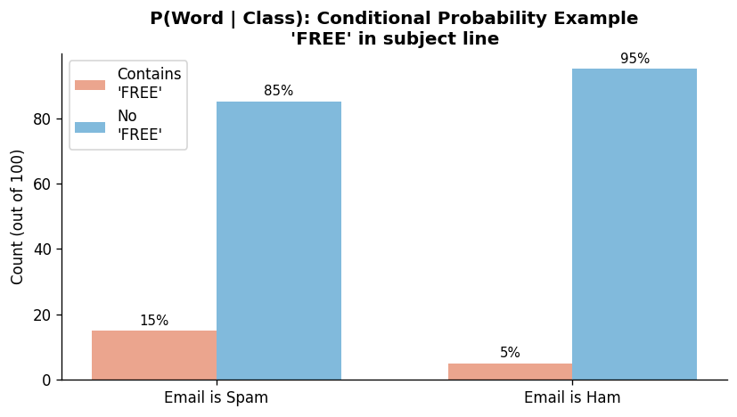

# Mathematical Foundation of Naive Bayes

**After this lesson:** you can explain the core ideas in “Mathematical Foundation of Naive Bayes” and reproduce the examples here in your own notebook or environment.

## Overview

Walks through **Bayes' theorem**, likelihoods under the independence assumption, and log-prob scoring for classification.

[Introduction](1-introduction.md); probability from Module 4 smooths the notation.

## Helpful video

Crash Course AI: supervised learning for classical algorithms.

<iframe width="560" height="315" src="https://www.youtube.com/embed/4qVRBYAdLAo" title="Supervised Learning: Crash Course AI" frameborder="0" allow="accelerometer; autoplay; clipboard-write; encrypted-media; gyroscope; picture-in-picture" allowfullscreen></iframe>

## Welcome to the Math Behind Naive Bayes

Don't worry if math isn't your strongest suit! We'll break down the concepts into simple, understandable pieces. Think of this as learning a new language - we'll start with the basics and build up gradually.

## Understanding Probability: The Language of Naive Bayes

### What is Probability?

Probability is just a fancy way of saying "how likely something is to happen." For example:

- The probability of flipping a coin and getting heads is 50%
- The probability of rolling a 6 on a die is about 16.7%

In Naive Bayes, we use probability to make predictions. It's like being a weather forecaster who says, "There's a 70% chance of rain tomorrow."

### Bayes' Theorem: The Heart of Naive Bayes

Imagine you're a detective trying to solve a case. You have some initial hunches (prior knowledge), and as you gather new evidence, you update your beliefs. That's exactly what Bayes' Theorem does!

#### The Basic Formula

Let's break down the formula step by step:

\\[P(y|X) = \frac{P(X|y)P(y)}{P(X)}\\]

Think of it like this:

- \\(P(y|X)\\): "What's the probability of y given X?" (Your updated belief)
- \\(P(X|y)\\): "How likely is X if y is true?" (The evidence)
- \\(P(y)\\): "What was your initial belief about y?" (Your prior knowledge)
- \\(P(X)\\): "How likely is X in general?" (The overall evidence)



### Real-World Example: Email Spam Detection

Let's make this concrete with an email example:

#### Spam posterior from counts

**Purpose:** Compute \\(P(\text{spam} \mid \text{"free"})\\) using Bayes' rule from simple email/word counts (prior, likelihood, evidence, posterior).

**Walkthrough:**
- Set `total_emails`, `spam_emails`, joint counts for "free", then `prior`, `likelihood`, `evidence`.
- Posterior is `(likelihood * prior) / evidence`.

```python
# Let's say we have 1000 emails in our training data
total_emails = 1000
spam_emails = 300        # 300 are spam
emails_with_word_free = 400  # 400 contain "free"
spam_with_word_free = 240    # 240 spam emails contain "free"

# Calculate probabilities
prior = spam_emails / total_emails  # 30% of emails are spam
likelihood = spam_with_word_free / spam_emails  # 80% of spam has "free"
evidence = emails_with_word_free / total_emails  # 40% of all emails have "free"

# Calculate the probability that an email is spam if it contains "free"
posterior = (likelihood * prior) / evidence  # 60% chance it's spam
```

This means:

- If you see an email with the word "free", there's a 60% chance it's spam
- The algorithm learned this from looking at past emails
- It updates its belief based on what it sees

## The "Naive" Assumption: Why It Works

### Understanding Feature Independence

The "naive" part comes from assuming that features don't affect each other. Let's use a cooking analogy:

Imagine you're making a cake. The recipe says you need:

- Flour
- Sugar
- Eggs
- Butter

The naive assumption is like saying:

- Adding more flour doesn't change how much sugar you need
- Adding eggs doesn't affect how much butter you need

In reality, these ingredients do interact, but assuming they don't makes the math much simpler!

### Why This Simplification Works

Even though features often do affect each other:

1. The simplification makes calculations much faster
2. It often works surprisingly well in practice
3. We care more about getting the right answer than having perfect probabilities

## Making Predictions: The Classification Rule

### How Naive Bayes Makes Decisions

To classify something (like an email as spam or not spam):

1. Calculate the probability for each possible class
2. Choose the class with the highest probability

It's like a voting system where each feature gets a say, and the class with the most votes wins!

### Example: Document Classification

Let's classify a document as either tech or sports:

#### Tech vs sports score (naive product)

**Purpose:** Show how class priors multiply independent word likelihoods to get a score for each label; the larger score wins.

**Walkthrough:**
- Set priors `P_tech`, `P_sports` and per-word conditional probabilities for each class.
- Multiply (naive independence) to get `tech_score` and `sports_score`.

<div class="code-explainer" data-code-explainer>
<div class="code-explainer__code">


# Our document: "computer program code"
words = ["computer", "program", "code"]

# Prior probabilities (from training data)
P_tech = 0.5    # 50% of documents are tech
P_sports = 0.5  # 50% of documents are sports

# Word probabilities in tech documents
P_computer_tech = 0.3    # "computer" appears in 30% of tech docs
P_program_tech = 0.25    # "program" appears in 25% of tech docs
P_code_tech = 0.2        # "code" appears in 20% of tech docs

# Word probabilities in sports documents
P_computer_sports = 0.01  # "computer" rarely appears in sports docs
P_program_sports = 0.02   # "program" rarely appears in sports docs
P_code_sports = 0.01      # "code" rarely appears in sports docs

# Calculate scores
tech_score = P_tech * P_computer_tech * P_program_tech * P_code_tech
sports_score = P_sports * P_computer_sports * P_program_sports * P_code_sports

# tech_score is much higher than sports_score, so we classify as tech


</div>
<aside class="code-explainer__callouts" aria-label="Code walkthrough">
  <div class="code-callout" data-lines="1-6" data-tint="1">
    <div class="code-callout__meta">
      <span class="code-callout__lines"></span>
      <span class="code-callout__title">Priors</span>
    </div>
    <div class="code-callout__body">
      <p>Equal class priors (50/50) represent a balanced corpus; in a real classifier these would be estimated from training label frequencies.</p>
    </div>
  </div>
  <div class="code-callout" data-lines="8-16" data-tint="2">
    <div class="code-callout__meta">
      <span class="code-callout__lines"></span>
      <span class="code-callout__title">Likelihoods</span>
    </div>
    <div class="code-callout__body">
      <p>Per-word conditional probabilities are set manually to illustrate that tech-domain words appear far less often in sports documents — the core assumption the Naive Bayes classifier exploits.</p>
    </div>
  </div>
  <div class="code-callout" data-lines="18-22" data-tint="3">
    <div class="code-callout__meta">
      <span class="code-callout__lines"></span>
      <span class="code-callout__title">Score Comparison</span>
    </div>
    <div class="code-callout__body">
      <p>Each score multiplies the prior by the three word likelihoods (naive independence assumption); the much higher <code>tech_score</code> wins the argmax and the document is labelled "tech".</p>
    </div>
  </div>
</aside>
</div>

## Handling Different Types of Data

### Numerical Features: The Gaussian Approach

When dealing with numbers (like height or temperature), we use the Gaussian (Normal) distribution. Think of it as a bell curve that shows how likely different values are.

For example, if we're predicting gender based on height:

- Most men are around 175cm
- Most women are around 162cm
- The curve shows how likely other heights are

#### Gaussian likelihood for height

**Purpose:** Compare Gaussian density values at a fixed height for two groups (male vs female) to see which label is more likely under each curve.

**Walkthrough:**
- Define `gaussian_probability(x, mean, std)` using the normal PDF.
- Evaluate at `x=168` for both groups and compare `male_prob` vs `female_prob`.

<div class="code-explainer" data-code-explainer>
<div class="code-explainer__code">


import math

# Example: Predicting gender based on height
male_height_mean = 175    # Average male height
male_height_std = 10      # How much heights vary
female_height_mean = 162  # Average female height
female_height_std = 8     # How much heights vary

# For a person who is 168cm tall:
def gaussian_probability(x, mean, std):
    """Calculate how likely this height is for each gender"""
    return (1 / (std * (2 * 3.14159)**0.5)) * math.exp(-((x - mean)**2) / (2 * std**2))

# Calculate probabilities
male_prob = gaussian_probability(168, male_height_mean, male_height_std)
female_prob = gaussian_probability(168, female_height_mean, female_height_std)

# Compare to make prediction
prediction = "male" if male_prob > female_prob else "female"


</div>
<aside class="code-explainer__callouts" aria-label="Code walkthrough">
  <div class="code-callout" data-lines="1-7" data-tint="1">
    <div class="code-callout__meta">
      <span class="code-callout__lines"></span>
      <span class="code-callout__title">Distribution Parameters</span>
    </div>
    <div class="code-callout__body">
      <p>Mean and standard deviation are specified for each class; these would normally be estimated from training data via maximum likelihood (sample mean and std).</p>
    </div>
  </div>
  <div class="code-callout" data-lines="9-19" data-tint="2">
    <div class="code-callout__meta">
      <span class="code-callout__lines"></span>
      <span class="code-callout__title">Gaussian PDF and Classify</span>
    </div>
    <div class="code-callout__body">
      <p>The function implements the Gaussian PDF formula; calling it at height=168 for both classes gives two density values — the class with the higher value is predicted, demonstrating the Gaussian Naive Bayes decision rule.</p>
    </div>
  </div>
</aside>
</div>

## Common Mistakes to Avoid

1. **Forgetting to Scale Numerical Features**
   - Always scale your numbers (like height, weight) before using Gaussian Naive Bayes
   - Use tools like StandardScaler from scikit-learn

2. **Ignoring the Prior Probabilities**
   - If your classes are imbalanced (e.g., 90% not spam, 10% spam), account for this
   - Use class_prior parameter in scikit-learn

3. **Using the Wrong Type of Naive Bayes**
   - Use Gaussian for numbers
   - Use Multinomial for counts (like word frequencies)
   - Use Bernoulli for yes/no features

## Practice Makes Perfect

The best way to understand these concepts is to practice:

1. Try implementing a simple spam detector
2. Experiment with different types of features
3. Compare the results with and without scaling
4. See how the algorithm behaves with different datasets

## Next Steps

Ready to see these concepts in action? Let's move on to [Types of Naive Bayes](3-types.md) to learn about the different versions of the algorithm and when to use each one.

Remember: Math is just a tool to help us make better predictions. Focus on understanding the concepts, and the formulas will make more sense!
