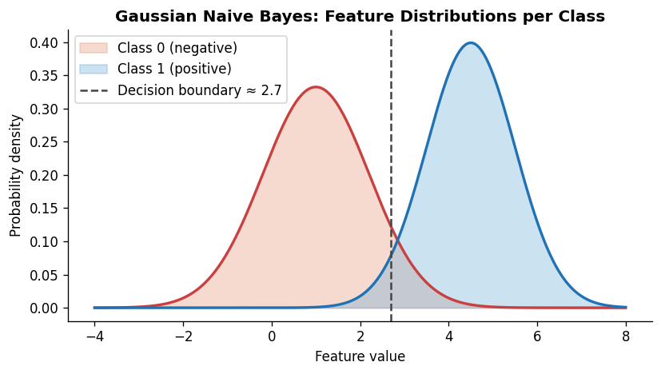
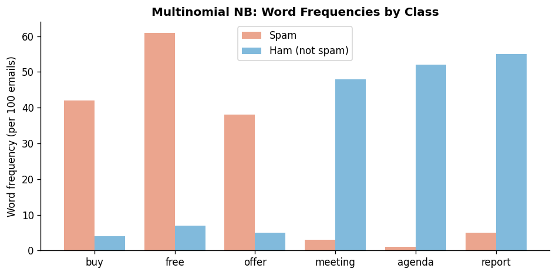

# Types of Naive Bayes Classifiers

**After this lesson:** you can explain the core ideas in “Types of Naive Bayes Classifiers” and reproduce the examples here in your own notebook or environment.

## Helpful video

Crash Course AI: supervised learning for classical algorithms.

<iframe width="560" height="315" src="https://www.youtube.com/embed/4qVRBYAdLAo" title="Supervised Learning: Crash Course AI" frameborder="0" allow="accelerometer; autoplay; clipboard-write; encrypted-media; gyroscope; picture-in-picture" allowfullscreen></iframe>

## Welcome to Different Flavors of Naive Bayes

Just like ice cream comes in different flavors for different tastes, Naive Bayes comes in different types for different kinds of data. Let's explore each type and learn when to use them!

## Overview: Choosing the Right Type

Think of choosing a Naive Bayes type like choosing the right tool for a job:

- Need to measure something? Use a ruler (Gaussian NB)
- Counting things? Use a tally counter (Multinomial NB)
- Checking if something is present? Use a checklist (Bernoulli NB)



## 1. Gaussian Naive Bayes: For Numbers

### What is it?

Gaussian Naive Bayes is like a smart ruler that understands how numbers are distributed. It's perfect for:

- Height and weight measurements
- Temperature readings
- Age data
- Any continuous numbers

### Real-World Example: Medical Diagnosis

Imagine you're a doctor trying to predict if a patient has a certain disease based on their:

- Body temperature
- Heart rate
- Blood pressure
- Age

These are all numbers, so Gaussian NB is perfect!

#### Gaussian NB on scaled vitals

**Purpose:** Train `GaussianNB` on continuous patient features after `StandardScaler`, then predict a new patient.

**Walkthrough:**
- `StandardScaler().fit_transform` on training rows; `GaussianNB().fit`.
- `transform` the new patient before `predict`.


from sklearn.naive_bayes import GaussianNB
from sklearn.preprocessing import StandardScaler

# Example: Predicting disease based on vital signs
patient_data = [
    [38.5, 90, 140, 45],  # [temperature, heart_rate, blood_pressure, age]
    [37.0, 70, 120, 30],
    [39.0, 95, 150, 55]
]
diagnoses = ['sick', 'healthy', 'sick']

# Always scale your numbers!
scaler = StandardScaler()
scaled_data = scaler.fit_transform(patient_data)

# Create and train the model
model = GaussianNB()
model.fit(scaled_data, diagnoses)

# Predict for a new patient
new_patient = [[38.2, 85, 135, 40]]
scaled_new_patient = scaler.transform(new_patient)
prediction = model.predict(scaled_new_patient)


<aside class="code-explainer__callouts" aria-label="Code walkthrough">
  

    

      
      Data and Scaling
    

    

      
Three patient records with four vitals are labelled sick/healthy; StandardScaler normalises the features so that temperature (38°C) and blood pressure (140 mmHg) live on comparable scales before Gaussian NB estimates the per-class distributions.

    

  

  

    

      
      Fit and Predict
    

    

      
GaussianNB learns mean and variance for each feature per class; the new patient is transformed with the same scaler fitted on training data before calling <code>predict</code>.

    

  

</aside>

### Why This Matters

Gaussian NB is great because:

- It understands how numbers are distributed
- Works well with measurements
- Can handle different scales (like temperature and age)
- Fast and efficient

## 2. Multinomial Naive Bayes: For Counting

### What is it?

Multinomial Naive Bayes is like a word counter that helps classify text. It's perfect for:

- Document classification
- Spam detection
- Sentiment analysis
- Any data where you're counting things

### Real-World Example: News Article Classification

Imagine you're building a system to automatically categorize news articles into:

- Sports
- Politics
- Technology
- Entertainment

Multinomial NB counts how often words appear in each category to make its predictions.

#### Multinomial NB on word counts

**Purpose:** Vectorize short articles with `CountVectorizer`, fit `MultinomialNB`, and classify a new headline.

**Walkthrough:**
- `CountVectorizer().fit_transform(articles)` builds the document-term matrix.
- `MultinomialNB().fit(X, categories)`; `vectorizer.transform(new_article)` then `predict`.


from sklearn.naive_bayes import MultinomialNB
from sklearn.feature_extraction.text import CountVectorizer

# Example: Categorizing news articles
articles = [
    "The team won the championship last night",
    "New technology breakthrough in AI research",
    "Political debate scheduled for next week"
]
categories = ['sports', 'tech', 'politics']

# Convert text to word counts
vectorizer = CountVectorizer()
X = vectorizer.fit_transform(articles)

# Create and train the model
model = MultinomialNB()
model.fit(X, categories)

# Predict a new article
new_article = ["The new smartphone features amazing camera technology"]
X_new = vectorizer.transform(new_article)
prediction = model.predict(X_new)  # Should predict 'tech'


<aside class="code-explainer__callouts" aria-label="Code walkthrough">
  

    

      
      Corpus and Vectorise
    

    

      
Three one-sentence training articles cover sports, tech, and politics; <code>CountVectorizer().fit_transform</code> builds a sparse document-term matrix of raw word counts used as features.

    

  

  

    

      
      Train and Classify
    

    

      
MultinomialNB models word counts as multinomial distributions per class; the new article is transformed with the same vocabulary before predict — words like "smartphone" and "technology" should push it toward "tech".

    

  

</aside>

### Why This Matters

Multinomial NB is great because:

- Perfect for text data
- Handles word frequencies well
- Works with any kind of count data
- Very efficient with large datasets

## 3. Bernoulli Naive Bayes: For Yes/No Questions

### What is it?

Bernoulli Naive Bayes is like a checklist that only cares if something is present or not. It's perfect for:

- Binary features (yes/no)
- Presence/absence data
- Features that are either true or false

### Real-World Example: Email Spam Detection

Imagine you're building a spam filter that checks for:

- Contains the word "free"? (yes/no)
- Has attachments? (yes/no)
- Contains links? (yes/no)
- Has exclamation marks? (yes/no)

Bernoulli NB is perfect for these yes/no features!

#### Bernoulli NB on binary feature vectors

**Purpose:** Fit `BernoulliNB` on 0/1 feature rows (spam cues) and predict a new email vector.

**Walkthrough:**
- `email_features` and `labels` are parallel lists; `BernoulliNB().fit`.
- `predict` on `new_email` with the same four binary columns.


from sklearn.naive_bayes import BernoulliNB

# Example: Spam detection
email_features = [
    [1, 1, 0, 1],  # [has_free, has_attachment, has_link, has_exclamation]
    [0, 0, 1, 0],
    [1, 1, 0, 1]
]
labels = ['spam', 'not_spam', 'spam']

# Create and train the model
model = BernoulliNB()
model.fit(email_features, labels)

# Predict a new email
new_email = [[1, 0, 0, 1]]  # has_free=True, has_exclamation=True
prediction = model.predict(new_email)


<aside class="code-explainer__callouts" aria-label="Code walkthrough">
  

    

      
      Binary Features
    

    

      
Each email is encoded as four binary flags (has_free, has_attachment, has_link, has_exclamation); BernoulliNB models each feature as a Bernoulli trial (present/absent) rather than a word count.

    

  

  

    

      
      Fit and Predict
    

    

      
The model learns P(feature=1 | class) for each binary flag; a new email with has_free and has_exclamation both true maps to the spam-like pattern seen in training.

    

  

</aside>

### Why This Matters

Bernoulli NB is great because:

- Simple and fast
- Perfect for binary features
- Works well with presence/absence data
- Less sensitive to word frequency than Multinomial NB

## Choosing the Right Type: A Quick Guide

### Decision Tree



### Quick Reference Table

| Type | Best For | Example | When to Use |
|------|----------|---------|-------------|
| Gaussian | Numbers | Height, Temperature | When dealing with measurements |
| Multinomial | Counts | Word frequencies | When counting occurrences |
| Bernoulli | Yes/No | Feature presence | When only presence matters |

## Common Mistakes to Avoid

1. **Using the Wrong Type**
   - Don't use Gaussian for text data
   - Don't use Multinomial for binary features
   - Don't use Bernoulli for continuous numbers

2. **Forgetting to Preprocess**
   - Scale numbers for Gaussian NB
   - Convert text to counts for Multinomial NB
   - Ensure binary features for Bernoulli NB

3. **Ignoring Data Characteristics**
   - Check if your data matches the type's assumptions
   - Transform data if needed
   - Consider mixing types for different features

## Practice Time

Try these exercises:

1. Build a spam detector using Bernoulli NB
2. Create a document classifier with Multinomial NB
3. Predict medical conditions using Gaussian NB
4. Compare the performance of different types

## Next Steps

Ready to put these types into action? Let's move on to [Implementation](4-implementation.md) to see how to use these different types in real projects.

Remember: The right tool for the right job! Choose your Naive Bayes type wisely based on your data.
