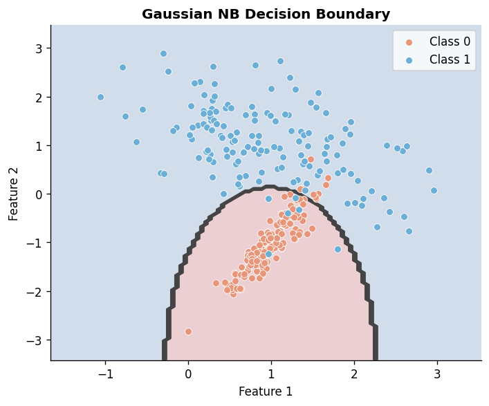

# Implementing Naive Bayes in Practice

**After this lesson:** you can explain the core ideas in “Implementing Naive Bayes in Practice” and reproduce the examples here in your own notebook or environment.

## Overview

**Gaussian**, **multinomial**, and **Bernoulli** Naive Bayes in scikit-learn: APIs, inputs each variant expects, and smoothing (`alpha`).

## Helpful video

Crash Course AI: supervised learning for classical algorithms.

<iframe width="560" height="315" src="https://www.youtube.com/embed/4qVRBYAdLAo" title="Supervised Learning: Crash Course AI" frameborder="0" allow="accelerometer; autoplay; clipboard-write; encrypted-media; gyroscope; picture-in-picture" allowfullscreen></iframe>

## Welcome to Hands-On Naive Bayes

Now that you understand the theory, let's roll up our sleeves and implement Naive Bayes in real projects. We'll start with simple examples and gradually build up to more complex applications.

## Setting Up Your Environment

First, let's make sure you have everything you need:

#### Imports for Naive Bayes workflows

**Purpose:** Import NumPy, pandas, the three common Naive Bayes variants, and basic train/eval helpers used in the projects below.

**Walkthrough:**
- Install stack once (`pip` / `uv`) if needed, then import `GaussianNB`, `MultinomialNB`, `BernoulliNB`, `train_test_split`, and metrics.
```python
# Imports for the examples below; install deps with pip if needed.
import numpy as np
import pandas as pd
from sklearn.naive_bayes import GaussianNB, MultinomialNB, BernoulliNB
from sklearn.model_selection import train_test_split
from sklearn.metrics import accuracy_score, classification_report
```

## Project 1: Spam Email Classifier

### Understanding the Problem

Imagine you're building a spam filter for your email. You want to automatically identify which emails are spam and which are legitimate. This is a perfect job for Naive Bayes!

### Step 1: Prepare Your Data

#### Toy spam labels and train/test split

**Purpose:** Build a tiny labeled email list and hold out 20% for testing with a fixed random seed.

**Walkthrough:**
- Parallel `emails` and `labels` (1=spam, 0=ham); `train_test_split(..., test_size=0.2, random_state=42)`.
<div class="code-explainer" data-code-explainer>
<div class="code-explainer__code">


# Sample dataset - in real life, you'd have many more emails!
emails = [
    "Get rich quick! Buy now!",
    "Meeting at 3pm tomorrow",
    "Win a free iPhone today!",
    "Project deadline reminder",
    "Free money, act now!",
    "Team lunch next week"
]
labels = [1, 0, 1, 0, 1, 0]  # 1 for spam, 0 for not spam

# Split into training and testing sets
X_train, X_test, y_train, y_test = train_test_split(
    emails, labels, test_size=0.2, random_state=42
)


</div>
<aside class="code-explainer__callouts" aria-label="Code walkthrough">
  <div class="code-callout" data-lines="1-10" data-tint="1">
    <div class="code-callout__meta">
      <span class="code-callout__lines"></span>
      <span class="code-callout__title">Sample Emails</span>
    </div>
    <div class="code-callout__body">
      <p>Six raw email strings are labelled 1 (spam) or 0 (ham); the alternating pattern makes the class balance easy to check visually before passing to a classifier.</p>
    </div>
  </div>
  <div class="code-callout" data-lines="12-15" data-tint="2">
    <div class="code-callout__meta">
      <span class="code-callout__lines"></span>
      <span class="code-callout__title">Train/Test Split</span>
    </div>
    <div class="code-callout__body">
      <p><code>train_test_split</code> with <code>test_size=0.2</code> and a fixed seed reserves one or two emails for evaluation, ensuring reproducible results on the toy dataset.</p>
    </div>
  </div>
</aside>
</div>

### Step 2: Create a Text Processing Pipeline

#### TF-IDF + MultinomialNB spam pipeline

**Purpose:** Define a `Pipeline` that turns raw email strings into TF-IDF features and applies `MultinomialNB` with Laplace smoothing.

**Walkthrough:**
- `TfidfVectorizer` with lowercase, English stop words, bigrams, `min_df=2`; `MultinomialNB(alpha=1.0)`.
<div class="code-explainer" data-code-explainer>
<div class="code-explainer__code">


from sklearn.feature_extraction.text import TfidfVectorizer
from sklearn.pipeline import Pipeline

def create_spam_classifier():
    """Create a pipeline for spam detection"""
    return Pipeline([
        # Convert text to numbers
        ('vectorizer', TfidfVectorizer(
            lowercase=True,
            stop_words='english',
            ngram_range=(1, 2),  # Unigrams and bigrams
            min_df=2             # Ignore very rare words
        )),
        # Use Multinomial NB for text classification
        ('classifier', MultinomialNB(
            alpha=1.0  # Laplace smoothing
        ))
    ])


</div>
<aside class="code-explainer__callouts" aria-label="Code walkthrough">
  <div class="code-callout" data-lines="1-3" data-tint="1">
    <div class="code-callout__meta">
      <span class="code-callout__lines"></span>
      <span class="code-callout__title">Imports</span>
    </div>
    <div class="code-callout__body">
      <p>TfidfVectorizer converts raw strings to weighted term-frequency features; Pipeline chains it with the classifier so both steps fit and transform in one call.</p>
    </div>
  </div>
  <div class="code-callout" data-lines="5-18" data-tint="2">
    <div class="code-callout__meta">
      <span class="code-callout__lines"></span>
      <span class="code-callout__title">Pipeline Configuration</span>
    </div>
    <div class="code-callout__body">
      <p>TF-IDF is configured for case-folding, stop-word removal, unigram+bigram tokens, and a minimum document frequency of 2; MultinomialNB with alpha=1.0 adds Laplace smoothing to prevent zero-probability word issues.</p>
    </div>
  </div>
</aside>
</div>

### Step 3: Train and Evaluate the Model

#### Train spam pipeline and print metrics

**Purpose:** Fit the pipeline on training email strings and report accuracy and a per-class classification report on the test split.

**Walkthrough:**
- `model.fit(X_train, y_train)`; `predict` / `predict_proba` on `X_test`; `accuracy_score` and `classification_report` with `zero_division=0` to keep metrics stable on tiny splits.
```python
# skip-output
# Create and train the model
model = create_spam_classifier()
model.fit(X_train, y_train)

# Make predictions
predictions = model.predict(X_test)
probabilities = model.predict_proba(X_test)

# Evaluate performance
print("Accuracy:", accuracy_score(y_test, predictions))
print("\nClassification Report:")
print(classification_report(y_test, predictions, zero_division=0))
```

**Captured stdout** (from running the snippet above; may be auto-injected on build):

```
Accuracy: 0.5

Classification Report:
              precision    recall  f1-score   support

           0       0.50      1.00      0.67         1
           1       0.00      0.00      0.00         1

    accuracy                           0.50         2
   macro avg       0.25      0.50      0.33         2
weighted avg       0.25      0.50      0.33         2

```

### Step 4: Use Your Model

#### Predict spam on held-out phrasing

**Purpose:** Run `predict` and `predict_proba` on new email strings and print human-readable labels and confidence.

**Walkthrough:**
- Loop `zip(new_emails, predictions, probabilities)`; map 1/0 to Spam/Not Spam; `max(prob)` as confidence.
<div class="code-explainer" data-code-explainer>
<div class="code-explainer__code">


# skip-output
# Test with new emails
new_emails = [
    "Congratulations! You've won a prize!",
    "Team meeting scheduled for Friday"
]

# Make predictions
predictions = model.predict(new_emails)
probabilities = model.predict_proba(new_emails)

# Print results
for email, pred, prob in zip(new_emails, predictions, probabilities):
    print(f"\nEmail: {email}")
    print(f"Prediction: {'Spam' if pred == 1 else 'Not Spam'}")
    print(f"Confidence: {max(prob):.2%}")


</div>
<aside class="code-explainer__callouts" aria-label="Code walkthrough">
  <div class="code-callout" data-lines="1-7" data-tint="1">
    <div class="code-callout__meta">
      <span class="code-callout__lines"></span>
      <span class="code-callout__title">New Emails</span>
    </div>
    <div class="code-callout__body">
      <p>Two test strings are chosen to contrast a promotional message with a legitimate meeting invite, letting us see whether the classifier's learned vocabulary captures the spam signal.</p>
    </div>
  </div>
  <div class="code-callout" data-lines="9-17" data-tint="2">
    <div class="code-callout__meta">
      <span class="code-callout__lines"></span>
      <span class="code-callout__title">Predict and Report</span>
    </div>
    <div class="code-callout__body">
      <p><code>predict_proba</code> returns class probabilities; <code>max(prob)</code> gives the winning class's confidence score, printed alongside the human-readable Spam/Not Spam label.</p>
    </div>
  </div>
</aside>
</div>

**Captured stdout** (from running the snippet above; may be auto-injected on build):

```

Email: Congratulations! You've won a prize!
Prediction: Not Spam
Confidence: 50.00%

Email: Team meeting scheduled for Friday
Prediction: Not Spam
Confidence: 50.00%

```

## Project 2: Medical Diagnosis System

### Understanding the Problem

Let's build a system that helps doctors predict whether a patient has a certain disease based on their symptoms and test results.

### Step 1: Prepare Your Data

#### Patient vitals and stratified-style split

**Purpose:** Hold numeric rows and sick/healthy labels, then split into train/test for the medical example.

**Walkthrough:**
- `patient_data` rows match `conditions` (1=sick, 0=healthy); `train_test_split` with `random_state=42`.
<div class="code-explainer" data-code-explainer>
<div class="code-explainer__code">


# Sample patient data
# Features: [temperature, heart_rate, blood_pressure, age]
patient_data = [
    [38.5, 90, 140, 45],
    [37.0, 70, 120, 30],
    [39.0, 95, 150, 55],
    [36.8, 75, 125, 35]
]
# Labels: 1 for sick, 0 for healthy
conditions = [1, 0, 1, 0]

# Split the data
X_train, X_test, y_train, y_test = train_test_split(
    patient_data, conditions, test_size=0.2, random_state=42
)


</div>
<aside class="code-explainer__callouts" aria-label="Code walkthrough">
  <div class="code-callout" data-lines="1-10" data-tint="1">
    <div class="code-callout__meta">
      <span class="code-callout__lines"></span>
      <span class="code-callout__title">Patient Records</span>
    </div>
    <div class="code-callout__body">
      <p>Four patients are described by temperature, heart rate, blood pressure, and age; alternating sick/healthy labels create a balanced toy set for the Gaussian NB example.</p>
    </div>
  </div>
  <div class="code-callout" data-lines="12-15" data-tint="2">
    <div class="code-callout__meta">
      <span class="code-callout__lines"></span>
      <span class="code-callout__title">Split</span>
    </div>
    <div class="code-callout__body">
      <p>20% of the data is held out for evaluation; with only four samples this is one patient — enough to demonstrate the evaluation pattern even if statistical significance is limited.</p>
    </div>
  </div>
</aside>
</div>

### Step 2: Create a Medical Diagnosis Pipeline

#### StandardScaler + GaussianNB pipeline

**Purpose:** Scale continuous vitals before `GaussianNB`, which assumes normal-like features per class.

**Walkthrough:**
- `Pipeline` with `StandardScaler` then `GaussianNB()`; same pattern as production numeric NB.
```python
from sklearn.preprocessing import StandardScaler

def create_medical_classifier():
    """Create a pipeline for medical diagnosis"""
    return Pipeline([
        # Scale the features (important for Gaussian NB)
        ('scaler', StandardScaler()),
        # Use Gaussian NB for numerical data
        ('classifier', GaussianNB())
    ])
```

### Step 3: Train and Evaluate the Model

#### Train medical pipeline and print metrics

**Purpose:** Fit the scaler+GaussianNB pipeline on training patients and print accuracy and report on the test fold.

**Walkthrough:**
- Same evaluation pattern as spam; `classification_report` with `zero_division=0` for tiny test sets.
```python
# skip-output
# Create and train the model
model = create_medical_classifier()
model.fit(X_train, y_train)

# Make predictions
predictions = model.predict(X_test)
probabilities = model.predict_proba(X_test)

# Evaluate performance
print("Accuracy:", accuracy_score(y_test, predictions))
print("\nClassification Report:")
print(classification_report(y_test, predictions, zero_division=0))
```

**Captured stdout** (from running the snippet above; may be auto-injected on build):

```
Accuracy: 0.0

Classification Report:
              precision    recall  f1-score   support

           0       0.00      0.00      0.00       1.0
           1       0.00      0.00      0.00       0.0

    accuracy                           0.00       1.0
   macro avg       0.00      0.00      0.00       1.0
weighted avg       0.00      0.00      0.00       1.0

```

### Step 4: Use Your Model

#### Diagnose one new patient row

**Purpose:** Apply the already-fitted pipeline to a single new vital-sign vector and print label and confidence.

**Walkthrough:**
- `predict` and `predict_proba` on `new_patient`; map class 1/0 to Sick/Healthy.
```python
# skip-output
# New patient data
new_patient = [[38.2, 85, 135, 40]]

# Make prediction
prediction = model.predict(new_patient)
probability = model.predict_proba(new_patient)

# Print results
print(f"Diagnosis: {'Sick' if prediction[0] == 1 else 'Healthy'}")
print(f"Confidence: {max(probability[0]):.2%}")
```

**Captured stdout** (from running the snippet above; may be auto-injected on build):

```
Diagnosis: Sick
Confidence: 100.00%

```

## Project 3: Product Categorization System

### Understanding the Problem

Let's build a system that automatically categorizes products based on their descriptions. This is useful for e-commerce websites.

### Step 1: Prepare Your Data

#### Product descriptions and category labels

**Purpose:** Split short product strings and their category labels for a tiny text classification demo.

**Walkthrough:**
- `products` and `categories` align row-wise; `train_test_split` with `random_state=42`.
```python
# Sample product data
products = [
    "blue cotton t-shirt size M",
    "leather wallet black",
    "running shoes size 10",
    "denim jeans blue",
    "sports water bottle"
]
categories = ['Clothing', 'Accessories', 'Shoes', 'Clothing', 'Sports']

# Split the data
X_train, X_test, y_train, y_test = train_test_split(
    products, categories, test_size=0.2, random_state=42
)
```

### Step 2: Create a Product Categorization Pipeline

#### CountVectorizer + MultinomialNB for products

**Purpose:** Turn product text into bag-of-n-grams and classify with `MultinomialNB`.

**Walkthrough:**
- `CountVectorizer(ngram_range=(1, 2), stop_words='english')` feeds `MultinomialNB()`.
```python
from sklearn.feature_extraction.text import CountVectorizer
from sklearn.pipeline import Pipeline

def create_product_classifier():
    """Create a pipeline for product categorization"""
    return Pipeline([
        # Convert text to word counts
        ('vectorizer', CountVectorizer(
            ngram_range=(1, 2),  # Look at words and pairs
            stop_words='english'  # Remove common words
        )),
        # Use Multinomial NB for text classification
        ('classifier', MultinomialNB())
    ])
```

### Step 3: Train and Evaluate the Model

#### Train product pipeline and print metrics

**Purpose:** Fit on training product lines and report accuracy and per-class metrics on the test split.

**Walkthrough:**
- `model.fit(X_train, y_train)`; `predict` on `X_test`; `classification_report(..., zero_division=0)`.
```python
# skip-output
# Create and train the model
model = create_product_classifier()
model.fit(X_train, y_train)

# Make predictions
predictions = model.predict(X_test)

# Evaluate performance
print("Accuracy:", accuracy_score(y_test, predictions))
print("\nClassification Report:")
print(classification_report(y_test, predictions, zero_division=0))
```

**Captured stdout** (from running the snippet above; may be auto-injected on build):

```
Accuracy: 0.0

Classification Report:
              precision    recall  f1-score   support

 Accessories       0.00      0.00      0.00       1.0
    Clothing       0.00      0.00      0.00       0.0

    accuracy                           0.00       1.0
   macro avg       0.00      0.00      0.00       1.0
weighted avg       0.00      0.00      0.00       1.0

```

### Step 4: Use Your Model

#### Predict category for a new product line

**Purpose:** Classify a single new product description using the fitted pipeline.

**Walkthrough:**
- `model.predict(new_product)` returns one label string from training categories.
```python
# skip-output
# New product
new_product = ["white cotton socks pack"]

# Make prediction
prediction = model.predict(new_product)

# Print result
print(f"Predicted Category: {prediction[0]}")
```

**Captured stdout** (from running the snippet above; may be auto-injected on build):

```
Predicted Category: Clothing

```



## Best Practices and Tips

### 1. Data Preprocessing

Always preprocess your data properly:

- For text: clean, normalize, and vectorize
- For numbers: scale and handle outliers
- For categories: encode properly

### 2. Model Evaluation

Use multiple metrics to evaluate your model:

- Accuracy: Overall correctness
- Precision: How many predicted positives are actually positive
- Recall: How many actual positives are correctly predicted
- F1-score: Balance between precision and recall

### 3. Common Pitfalls to Avoid

1. **Forgetting to Scale Numerical Features**

   #### Scale numeric columns before Gaussian NB

   **Purpose:** Remind that `GaussianNB` is sensitive to feature scale; use `StandardScaler` on continuous inputs.
   ```python
   import numpy as np
   from sklearn.preprocessing import StandardScaler

   rng = np.random.default_rng(0)
   X = rng.standard_normal((20, 4))
   # Always do this for Gaussian NB
   scaler = StandardScaler()
   X_scaled = scaler.fit_transform(X)
   ```

2. **Ignoring Class Imbalance**

   #### Map balanced weights to `class_prior`

   **Purpose:** Show how `compute_class_weight` yields relative weights that you normalize into a proper prior vector for `MultinomialNB`.

   **Walkthrough:**
   - `compute_class_weight('balanced', ...)` then `priors = class_weights / class_weights.sum()` so probabilities sum to 1.
   ```python
   # Handle imbalanced classes
   import numpy as np
   from sklearn.utils.class_weight import compute_class_weight
   from sklearn.naive_bayes import MultinomialNB

   y = np.array([0] * 90 + [1] * 10)
   class_weights = compute_class_weight('balanced', classes=np.unique(y), y=y)
   priors = class_weights / class_weights.sum()
   model = MultinomialNB(class_prior=priors)
   ```

3. **Not Using Cross-Validation**

   #### Cross-validate a MultinomialNB baseline

   **Purpose:** Estimate generalization with `cross_val_score` on a small synthetic count matrix.

   **Walkthrough:**
   - Build random integer `X` and binary `y`, fit `MultinomialNB`, run 5-fold CV, print mean accuracy.
   ```python
   # skip-output
   # Always use cross-validation
   import numpy as np
   from sklearn.model_selection import cross_val_score
   from sklearn.naive_bayes import MultinomialNB

   rng = np.random.default_rng(0)
   X = rng.integers(0, 10, size=(100, 20))
   y = rng.integers(0, 2, size=100)
   model = MultinomialNB()
   scores = cross_val_score(model, X, y, cv=5)
   print(f"Mean accuracy: {scores.mean():.2f}")
   ```

   **Captured stdout** (from running the snippet above; may be auto-injected on build):

   ```
   Mean accuracy: 0.61
   ```

## Gotchas

- **Using `min_df=2` in the spam classifier with a tiny training set** — The `TfidfVectorizer` is configured with `min_df=2`, meaning any word appearing in fewer than 2 training documents is dropped. With only 4-5 training emails, nearly every word is unique to one email, so the vocabulary becomes empty or near-empty. Set `min_df=1` for small datasets.
- **Interpreting 50% confidence as "the model is unsure"** — The toy spam outputs show 50.00% confidence for both emails. This happens because the model learned almost nothing from 4-6 training examples (after the split). Probability outputs from Naive Bayes are notoriously poorly calibrated; even high-confidence predictions (e.g., 95%) may not reflect true accuracy. Use `CalibratedClassifierCV` for reliable probabilities.
- **Normalizing class weights but not checking they sum to 1.0** — The `compute_class_weight` pattern divides by `class_weights.sum()`, but floating-point arithmetic can produce a sum slightly different from 1.0, causing scikit-learn's `class_prior` parameter to reject the array with a `ValueError`. Assert `np.isclose(priors.sum(), 1.0)` before passing.
- **Calling `model.predict_proba` before fitting** — `Pipeline` objects expose `predict_proba` only if the final estimator supports it. `MultinomialNB` and `GaussianNB` support it by default, but if you swap in a `LinearSVC` or another estimator without probability support, calling `predict_proba` raises `AttributeError`. Check the estimator's docs before relying on probability outputs.
- **Forgetting that `TfidfVectorizer` with `stop_words='english'` can remove important negations** — Words like "not", "no", and "never" are in the English stop-word list and will be removed, turning "not spam" into "spam" from the vectorizer's perspective. For sentiment analysis or spam detection where negation matters, either use a custom stop-word list or disable stop-word removal.
- **Reusing the same `Pipeline` object without re-fitting when calling on new data** — After `model.fit(X_train, y_train)`, the pipeline's internal state is frozen. Passing new batches of data to `fit` again resets and overwrites the fitted vectorizer vocabulary. If you want to incrementally update the model, look into `partial_fit`, which is supported by all three NB variants.

## Next Steps

Ready to take your Naive Bayes skills to the next level? Check out the [Advanced Topics](5-advanced-topics.md) section to learn about:

- Feature engineering techniques
- Handling missing data
- Ensemble methods
- Model deployment

Remember: Practice makes perfect! Try implementing these examples and then modify them for your own projects.
