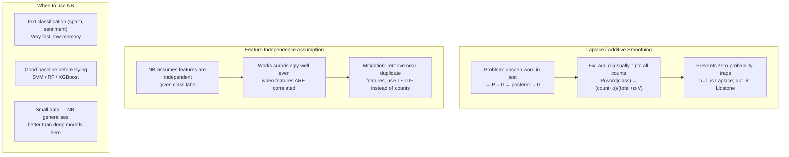

# Advanced Topics in Naive Bayes

**After this lesson:** you can explain the core ideas in “Advanced Topics in Naive Bayes” and reproduce the examples here in your own notebook or environment.

## Overview

Discusses **smoothing**, correlated features breaking the assumption, and mitigations—without losing the fast baseline story.

## Helpful video

Crash Course AI: supervised learning for classical algorithms.

<iframe width="560" height="315" src="https://www.youtube.com/embed/4qVRBYAdLAo" title="Supervised Learning: Crash Course AI" frameborder="0" allow="accelerometer; autoplay; clipboard-write; encrypted-media; gyroscope; picture-in-picture" allowfullscreen></iframe>

## Welcome to Advanced Naive Bayes

Now that you've mastered the basics, let's explore some advanced techniques that will make your Naive Bayes models even better. Think of this as adding special tools to your machine learning toolbox!



## 1. Feature Engineering: Making Your Data Work Better

### What is Feature Engineering?

Feature engineering is like being a chef who transforms basic ingredients into a delicious meal. You take your raw data and transform it into features that help your model make better predictions.

### Text Feature Engineering

Let's say you're building a spam detector. Instead of just using raw words, you can create smarter features:

#### TF-IDF pipeline with custom preprocessing

**Purpose:** Show a `Pipeline` of `TfidfVectorizer` (with a callable `preprocessor` for cleaning) plus `MultinomialNB`, without extra NLP dependencies.

**Walkthrough:**
- `normalize_text` lowercases and strips non-letters (keeping `!?.`).
- `TfidfVectorizer(preprocessor=..., ngram_range=(1, 3), max_features=1000)` feeds `MultinomialNB`.

<div class="code-explainer" data-code-explainer>
<div class="code-explainer__code">


import re

from sklearn.feature_extraction.text import TfidfVectorizer
from sklearn.naive_bayes import MultinomialNB
from sklearn.pipeline import Pipeline


def normalize_text(text):
    """Lightweight cleaning before tokenization."""
    text = text.lower()
    return re.sub(r"[^a-zA-Z\s!?.]", "", text)


pipeline = Pipeline(
    [
        (
            "vectorizer",
            TfidfVectorizer(
                preprocessor=normalize_text,
                ngram_range=(1, 3),
                max_features=1000,
            ),
        ),
        ("classifier", MultinomialNB()),
    ]
)


</div>
<aside class="code-explainer__callouts" aria-label="Code walkthrough">
  <div class="code-callout" data-lines="1-12" data-tint="1">
    <div class="code-callout__meta">
      <span class="code-callout__lines"></span>
      <span class="code-callout__title">Text Normalizer</span>
    </div>
    <div class="code-callout__body">
      <p><code>normalize_text</code> lowercases and strips non-letter characters (preserving punctuation like <code>!?.</code>) before tokenization — passed as the <code>preprocessor</code> callable to <code>TfidfVectorizer</code>.</p>
    </div>
  </div>
  <div class="code-callout" data-lines="14-28" data-tint="2">
    <div class="code-callout__meta">
      <span class="code-callout__lines"></span>
      <span class="code-callout__title">TF-IDF and NB Pipeline</span>
    </div>
    <div class="code-callout__body">
      <p>The pipeline chains vectorization (up to trigrams, top 1000 features) with <code>MultinomialNB</code>; calling <code>pipeline.fit</code> runs both steps in sequence automatically.</p>
    </div>
  </div>
</aside>
</div>

### Numerical Feature Engineering

When working with numbers (like age or income), you can transform them to better fit the Gaussian distribution:

#### Power transform + Gaussian NB

**Purpose:** Pipeline `PowerTransformer` (Yeo–Johnson) before `GaussianNB` when features are skewed.

**Walkthrough:**
- `PowerTransformer(method='yeo-johnson')` learns a per-feature transform; `GaussianNB` then fits on the transformed space.

```python
from sklearn.preprocessing import PowerTransformer
from sklearn.naive_bayes import GaussianNB
from sklearn.pipeline import Pipeline

def transform_numerical_features():
    """Create better numerical features"""
    return Pipeline([
        ('transformer', PowerTransformer(
            method='yeo-johnson'  # Handles positive and negative numbers
        )),
        ('classifier', GaussianNB())
    ])
```

## 2. Handling Missing Data: Don't Let Gaps Stop You

### Why Missing Data Matters

Imagine you're a doctor with incomplete patient records. You can't just ignore missing information - you need to handle it smartly!

### Smart Ways to Handle Missing Data

#### KNN imputer + scaler + Gaussian NB (sketch)

**Purpose:** Illustrate plugging `KNNImputer` (or `IterativeImputer`) ahead of scaling and `GaussianNB` in a `Pipeline`.

**Walkthrough:**
- `KNNImputer(n_neighbors=5)` fills missing numeric cells; `StandardScaler` then `GaussianNB` for the final classifier.

<div class="code-explainer" data-code-explainer>
<div class="code-explainer__code">


from sklearn.experimental import enable_iterative_imputer  # noqa: F401
from sklearn.impute import KNNImputer, IterativeImputer
from sklearn.preprocessing import StandardScaler
from sklearn.naive_bayes import GaussianNB
from sklearn.pipeline import Pipeline

class SmartDataImputer:
    def __init__(self, strategy='knn'):
        self.strategy = strategy

    def impute(self, data):
        """Fill in missing values intelligently"""
        if self.strategy == 'knn':
            # Use similar patients to fill in missing values
            imputer = KNNImputer(n_neighbors=5)
        else:
            # Use iterative approach (enable experimental import in sklearn if required)
            imputer = IterativeImputer(max_iter=10)

        return imputer.fit_transform(data)

# Prefer sklearn imputers directly inside Pipeline (SmartDataImputer is illustrative)
pipeline = Pipeline([
    ('imputer', KNNImputer(n_neighbors=5)),
    ('scaler', StandardScaler()),
    ('classifier', GaussianNB())
])


</div>
<aside class="code-explainer__callouts" aria-label="Code walkthrough">
  <div class="code-callout" data-lines="1-21" data-tint="1">
    <div class="code-callout__meta">
      <span class="code-callout__lines"></span>
      <span class="code-callout__title">Imputer Class</span>
    </div>
    <div class="code-callout__body">
      <p><code>SmartDataImputer</code> selects between KNN (neighbor-based) and iterative imputation; both strategies are sklearn's built-in imputers — the class is illustrative of the pattern.</p>
    </div>
  </div>
  <div class="code-callout" data-lines="22-29" data-tint="2">
    <div class="code-callout__meta">
      <span class="code-callout__lines"></span>
      <span class="code-callout__title">Production Pipeline</span>
    </div>
    <div class="code-callout__body">
      <p>The recommended approach is to drop the wrapper class and put <code>KNNImputer</code> directly into a <code>Pipeline</code> with <code>StandardScaler</code> and <code>GaussianNB</code> so all steps are cross-validated together.</p>
    </div>
  </div>
</aside>
</div>
```

## 3. Ensemble Methods: Teamwork Makes the Dream Work

### What are Ensembles?

An ensemble is like a team of experts working together. Instead of relying on one model, we combine multiple models to get better predictions.

### Voting Classifier

#### VotingClassifier with multiple NB variants (illustrative)

**Purpose:** Show how `VotingClassifier` combines estimators; in practice each base learner must see compatible features (often separate pipelines per modality).

**Walkthrough:**
- List named steps (`multinomial`, `gaussian`, `bernoulli`); `voting='soft'` averages predicted probabilities.

<div class="code-explainer" data-code-explainer>
<div class="code-explainer__code">


from sklearn.ensemble import VotingClassifier
from sklearn.naive_bayes import GaussianNB, MultinomialNB, BernoulliNB

def create_naive_bayes_team():
    """Create a team of Naive Bayes models"""
    models = [
        ('multinomial', MultinomialNB()),  # For text
        ('gaussian', GaussianNB()),        # For numbers
        ('bernoulli', BernoulliNB())       # For yes/no features
    ]

    return VotingClassifier(
        estimators=models,
        voting='soft'  # Use probability estimates
    )


</div>
<aside class="code-explainer__callouts" aria-label="Code walkthrough">
  <div class="code-callout" data-lines="1-10" data-tint="1">
    <div class="code-callout__meta">
      <span class="code-callout__lines"></span>
      <span class="code-callout__title">Three NB Variants</span>
    </div>
    <div class="code-callout__body">
      <p>Each Naive Bayes variant targets a different feature type: Multinomial for text counts, Gaussian for continuous values, Bernoulli for binary yes/no features.</p>
    </div>
  </div>
  <div class="code-callout" data-lines="12-16" data-tint="2">
    <div class="code-callout__meta">
      <span class="code-callout__lines"></span>
      <span class="code-callout__title">Soft Voting</span>
    </div>
    <div class="code-callout__body">
      <p><code>voting='soft'</code> averages predicted class probabilities from all estimators rather than majority-voting hard labels — note that in practice each base model needs compatible input features.</p>
    </div>
  </div>
</aside>
</div>

### Stacking Classifier

#### StackingClassifier with logistic meta-learner

**Purpose:** Stack several Naive Bayes variants with `LogisticRegression` as the final estimator (conceptual; feature alignment across bases is required in real use).

**Walkthrough:**
- `StackingClassifier(estimators=..., final_estimator=LogisticRegression(), cv=5)`.

<div class="code-explainer" data-code-explainer>
<div class="code-explainer__code">


from sklearn.ensemble import StackingClassifier
from sklearn.linear_model import LogisticRegression
from sklearn.naive_bayes import GaussianNB, MultinomialNB, BernoulliNB

def create_stacked_model():
    """Create a stacked model with Naive Bayes"""
    base_models = [
        ('mnb', MultinomialNB()),
        ('gnb', GaussianNB()),
        ('bnb', BernoulliNB())
    ]

    return StackingClassifier(
        estimators=base_models,
        final_estimator=LogisticRegression(),
        cv=5  # Use 5-fold cross-validation
    )


</div>
<aside class="code-explainer__callouts" aria-label="Code walkthrough">
  <div class="code-callout" data-lines="1-11" data-tint="1">
    <div class="code-callout__meta">
      <span class="code-callout__lines"></span>
      <span class="code-callout__title">Base Models</span>
    </div>
    <div class="code-callout__body">
      <p>Three NB variants serve as base learners; stacking passes their out-of-fold predictions as features to the meta-learner rather than averaging them directly.</p>
    </div>
  </div>
  <div class="code-callout" data-lines="13-19" data-tint="2">
    <div class="code-callout__meta">
      <span class="code-callout__lines"></span>
      <span class="code-callout__title">Logistic Meta-learner</span>
    </div>
    <div class="code-callout__body">
      <p><code>StackingClassifier</code> with <code>cv=5</code> generates cross-validated predictions from each base model; <code>LogisticRegression</code> learns how to combine them optimally.</p>
    </div>
  </div>
</aside>
</div>

## 4. Model Deployment: Taking Your Model to the Real World

### Saving Your Model

#### Persist estimator with joblib and sidecar JSON

**Purpose:** Save a fitted model to disk with `joblib` and optional metadata for deployment.

**Walkthrough:**
- `joblib.dump` the estimator; write `model_info.json`; `load` reverses the steps.

<div class="code-explainer" data-code-explainer>
<div class="code-explainer__code">


import json

import joblib

class ModelSaver:
    def __init__(self, model, info=None):
        self.model = model
        self.info = info or {}

    def save(self, folder):
        """Save model and its information"""
        # Save the model
        joblib.dump(self.model, f"{folder}/model.joblib")

        # Save additional information
        with open(f"{folder}/model_info.json", 'w') as f:
            json.dump(self.info, f)

    @classmethod
    def load(cls, folder):
        """Load a saved model"""
        model = joblib.load(f"{folder}/model.joblib")
        with open(f"{folder}/model_info.json", 'r') as f:
            info = json.load(f)
        return cls(model, info)


</div>
<aside class="code-explainer__callouts" aria-label="Code walkthrough">
  <div class="code-callout" data-lines="1-7" data-tint="1">
    <div class="code-callout__meta">
      <span class="code-callout__lines"></span>
      <span class="code-callout__title">Class Init</span>
    </div>
    <div class="code-callout__body">
      <p>Stores a reference to the fitted model and optional metadata dict (<code>info</code>) — the sidecar JSON lets you record version, training date, or feature names alongside the binary model.</p>
    </div>
  </div>
  <div class="code-callout" data-lines="9-26" data-tint="2">
    <div class="code-callout__meta">
      <span class="code-callout__lines"></span>
      <span class="code-callout__title">Save and Load</span>
    </div>
    <div class="code-callout__body">
      <p><code>save</code> writes the estimator with <code>joblib.dump</code> and the metadata as JSON; the <code>@classmethod</code> <code>load</code> reverses both steps, reconstructing the <code>ModelSaver</code> instance.</p>
    </div>
  </div>
</aside>
</div>

### Monitoring Your Model

#### Track predictions for simple drift-style checks

**Purpose:** Keep a lightweight log of predictions (and optional labels) to compute rolling accuracy offline.

**Walkthrough:**
- Append dicts with `features`, `prediction`, optional `actual`, and `datetime.now()`.

<div class="code-explainer" data-code-explainer>
<div class="code-explainer__code">


from datetime import datetime

class ModelMonitor:
    def __init__(self):
        self.predictions = []
        self.timestamps = []

    def track_prediction(self, features, prediction, actual=None):
        """Keep track of model predictions"""
        self.predictions.append({
            'features': features,
            'prediction': prediction,
            'actual': actual,
            'time': datetime.now()
        })

    def check_performance(self, window=100):
        """Check recent model performance"""
        if len(self.predictions) < window:
            return "Not enough data"

        recent = self.predictions[-window:]
        accuracy = sum(1 for p in recent if p['prediction'] == p['actual']) / window
        return f"Recent accuracy: {accuracy:.2%}"


</div>
<aside class="code-explainer__callouts" aria-label="Code walkthrough">
  <div class="code-callout" data-lines="1-16" data-tint="1">
    <div class="code-callout__meta">
      <span class="code-callout__lines"></span>
      <span class="code-callout__title">Track Predictions</span>
    </div>
    <div class="code-callout__body">
      <p>Each prediction is stored as a dict with features, predicted label, optional true label, and timestamp — collecting these enables rolling accuracy checks without external logging infrastructure.</p>
    </div>
  </div>
  <div class="code-callout" data-lines="18-25" data-tint="2">
    <div class="code-callout__meta">
      <span class="code-callout__lines"></span>
      <span class="code-callout__title">Rolling Accuracy</span>
    </div>
    <div class="code-callout__body">
      <p><code>check_performance</code> slices the last <code>window</code> predictions and counts matches against actuals — a quick drift indicator when true labels arrive with delay.</p>
    </div>
  </div>
</aside>
</div>

## 5. Hyperparameter Tuning: Finding the Best Settings

### What are Hyperparameters?

Hyperparameters are like the settings on your camera. You need to adjust them to get the best results for each situation.

### Finding the Best Settings

#### RandomizedSearchCV over vectorizer + MultinomialNB

**Purpose:** Search `max_features`, `ngram_range`, and `alpha` on a text pipeline with cross-validation.

**Walkthrough:**
- `param_options` uses `randint` / `uniform` distributions; `RandomizedSearchCV(..., n_iter=20, cv=3)`; return `best_params_`.

<div class="code-explainer" data-code-explainer>
<div class="code-explainer__code">


from sklearn.model_selection import RandomizedSearchCV
from scipy.stats import uniform, randint
from sklearn.feature_extraction.text import TfidfVectorizer
from sklearn.naive_bayes import MultinomialNB
from sklearn.pipeline import Pipeline

def find_best_settings(X, y):
    """Find the best hyperparameters"""
    # Define what settings to try
    param_options = {
        'vectorizer__max_features': randint(100, 10000),
        'vectorizer__ngram_range': [(1, 1), (1, 2), (1, 3)],
        'classifier__alpha': uniform(0.1, 2.0)
    }

    # Create the model
    model = Pipeline([
        ('vectorizer', TfidfVectorizer()),
        ('classifier', MultinomialNB())
    ])

    # Search for best settings
    search = RandomizedSearchCV(
        model, param_options,
        n_iter=20,  # Try 20 different combinations
        cv=3,       # Use 3-fold CV (needs enough samples vs n_splits)
        scoring='accuracy'
    )

    # Find the best settings
    search.fit(X, y)
    return search.best_params_


# Example: small text corpus (enough rows for cv=3)
X_text = [
    "sports team wins game",
    "stock market news today",
    "team scores in final quarter",
    "finance report earnings beat",
    "championship final overtime",
    "investors buy tech shares",
    "roster injury update",
    "quarterly revenue growth",
    "playoff bracket announced",
    "dividend yield increases",
]
y_text = [0, 1, 0, 1, 0, 1, 0, 1, 0, 1]
best = find_best_settings(X_text, y_text)


</div>
<aside class="code-explainer__callouts" aria-label="Code walkthrough">
  <div class="code-callout" data-lines="1-21" data-tint="1">
    <div class="code-callout__meta">
      <span class="code-callout__lines"></span>
      <span class="code-callout__title">Search Space and Pipeline</span>
    </div>
    <div class="code-callout__body">
      <p>The param dict samples <code>max_features</code> and <code>alpha</code> from continuous distributions (<code>randint</code>/<code>uniform</code>) and tries three ngram ranges; the <code>vectorizer__</code> prefix routes params to the correct pipeline step.</p>
    </div>
  </div>
  <div class="code-callout" data-lines="22-33" data-tint="2">
    <div class="code-callout__meta">
      <span class="code-callout__lines"></span>
      <span class="code-callout__title">Randomized Search</span>
    </div>
    <div class="code-callout__body">
      <p><code>RandomizedSearchCV</code> with <code>n_iter=20</code> tries 20 random combinations instead of an exhaustive grid — much faster when the search space is large.</p>
    </div>
  </div>
  <div class="code-callout" data-lines="35-50" data-tint="3">
    <div class="code-callout__meta">
      <span class="code-callout__lines"></span>
      <span class="code-callout__title">Toy Corpus Example</span>
    </div>
    <div class="code-callout__body">
      <p>Ten labeled sentences (sports vs finance) illustrate the input format; call <code>find_best_settings</code> on your real dataset to get the winning hyperparameter combination via <code>best_params_</code>.</p>
    </div>
  </div>
</aside>
</div>

## Common Advanced Challenges and Solutions

### 1. Dealing with Class Imbalance

When one class is much more common than others:

#### Normalize balanced weights to `class_prior`

**Purpose:** Turn `compute_class_weight` outputs into a proper prior vector summing to 1 for `MultinomialNB`.

```python
import numpy as np
from sklearn.utils.class_weight import compute_class_weight
from sklearn.naive_bayes import MultinomialNB

y = np.array([0] * 90 + [1] * 10)
class_weights = compute_class_weight("balanced", classes=np.unique(y), y=y)
priors = class_weights / class_weights.sum()
model = MultinomialNB(class_prior=priors)
```

### 2. Handling High-Dimensional Data

When you have too many features:

#### Chi-squared feature selection before NB

**Purpose:** Reduce dimensionality with `SelectKBest` and `chi2` (non-negative counts required).

**Walkthrough:**
- `SelectKBest(chi2, k=1000).fit_transform(X, y)` returns a reduced sparse or dense matrix.

```python
import numpy as np
from sklearn.feature_selection import SelectKBest, chi2
from scipy.sparse import csr_matrix

rng = np.random.default_rng(0)
X = csr_matrix(rng.integers(1, 10, size=(50, 200)))
y = rng.integers(0, 2, size=50)

selector = SelectKBest(chi2, k=100)  # keep top features for this toy size
X_new = selector.fit_transform(X, y)
```

### 3. Improving Numeric Stability

When dealing with very small probabilities:

#### Argmax on `predict_log_proba`

**Purpose:** Use log-probabilities for numerical stability when comparing classes (equivalent argmax to `predict` for many models).

**Walkthrough:**
- Fit `BernoulliNB` on a tiny binary matrix; `predict_log_proba` then `np.argmax` along classes.

```python
import numpy as np
from sklearn.naive_bayes import BernoulliNB

X = np.array([[1, 0, 1], [0, 1, 0], [1, 1, 0]])
y = np.array([0, 1, 0])
model = BernoulliNB().fit(X, y)

log_probs = model.predict_log_proba(X)
predictions = np.argmax(log_probs, axis=1)
```

## Next Steps

Ready to become a Naive Bayes expert? Try these challenges:

1. Implement feature engineering in your own project
2. Experiment with different ensemble methods
3. Deploy a model and monitor its performance
4. Try hyperparameter tuning on a real dataset

Remember: The best way to learn is by doing! Start with small experiments and gradually tackle more complex problems.
