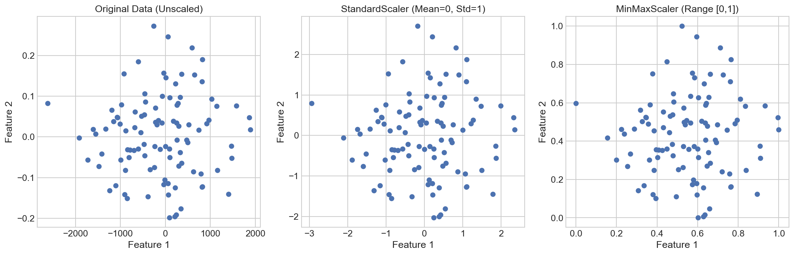

# Real-World Applications of SVM

**After this lesson:** you can explain the core ideas in “Real-World Applications of SVM” and reproduce the examples here in your own notebook or environment.

## Overview

Text (linear SVM), bioinformatics-style high-$p$ settings, and other cases where margins still shine.

## Helpful video

Crash Course AI: supervised learning for classical algorithms.

<iframe width="560" height="315" src="https://www.youtube.com/embed/4qVRBYAdLAo" title="Supervised Learning: Crash Course AI" frameborder="0" allow="accelerometer; autoplay; clipboard-write; encrypted-media; gyroscope; picture-in-picture" allowfullscreen></iframe>

## Learning Objectives

By the end of this section, you will be able to:

- Implement SVM for real-world problems
- Choose appropriate SVM configurations for different applications
- Evaluate and optimize SVM performance in practical scenarios
- Handle common challenges in real-world deployments

## SVM in Different Domains

SVM can be applied to various real-world problems, each requiring different configurations:


*Figure: SVM applied to different domains. Left: Text Classification (linear boundary), Middle: Image Recognition (circular boundary), Right: Medical Diagnosis (complex boundary).*

## 1. Text Classification

### Spam Detection System

Let's build a simple spam detector that can classify emails:

#### TF-IDF + linear SVC spam classifier
**Purpose:** Train on a tiny email corpus, report accuracy, and classify a new message with probability and uncertainty flags.

<div class="code-explainer" data-code-explainer>
<div class="code-explainer__code">


import numpy as np
from sklearn.feature_extraction.text import TfidfVectorizer
from sklearn.svm import SVC
from sklearn.model_selection import train_test_split

# Example email data
emails = [
    "Get rich quick! Buy now! Limited offer!",
    "Meeting at 3pm tomorrow in the conference room",
    "Win a free iPhone today! Click here now!",
    "Project deadline reminder: reports due Friday",
    "URGENT: Your account has been compromised",
    "Weekly team update: progress on Q3 goals",
    "Free money! No work required! Send details!",
    "Notes from yesterday's client presentation",
    "You've won the lottery! Contact us immediately!",
    "Schedule for next week's training sessions"
]

# Labels: 1 for spam, 0 for not spam
labels = np.array([1, 0, 1, 0, 1, 0, 1, 0, 1, 0])

# Split data into training and testing sets
X_train, X_test, y_train, y_test = train_test_split(
    emails, labels, test_size=0.3, random_state=42
)

# Step 1: Convert text to numerical features using TF-IDF
vectorizer = TfidfVectorizer(
    max_features=1000,  # Limit vocabulary size
    ngram_range=(1, 2),  # Use single words and pairs
    stop_words='english'  # Remove common words
)
X_train_tfidf = vectorizer.fit_transform(X_train)
X_test_tfidf = vectorizer.transform(X_test)

# Step 2: Train SVM classifier
svm_classifier = SVC(
    kernel='linear',  # Linear kernel works well for text
    C=1.0,
    class_weight='balanced',  # Handle imbalanced classes
    probability=True  # Enable probability estimates
)
svm_classifier.fit(X_train_tfidf, y_train)

# Step 3: Make predictions
y_pred = svm_classifier.predict(X_test_tfidf)
probabilities = svm_classifier.predict_proba(X_test_tfidf)[:, 1]  # Prob of being spam

# Evaluate performance
accuracy = svm_classifier.score(X_test_tfidf, y_test)
print(f"Accuracy: {accuracy:.2f}")

# Function to classify new emails
def classify_email(email_text, threshold=0.7):
    """
    Classify an email as spam or not spam with confidence.

    Parameters:
    - email_text: Text of the email to classify
    - threshold: Probability threshold for spam classification

    Returns:
    - Classification result and confidence
    """
    # Transform email to TF-IDF features
    email_tfidf = vectorizer.transform([email_text])

    # Get probability of being spam
    spam_probability = svm_classifier.predict_proba(email_tfidf)[0, 1]

    # Classify based on threshold
    if spam_probability >= threshold:
        category = "SPAM"
    else:
        category = "NOT SPAM"

    return {
        "classification": category,
        "confidence": spam_probability,
        "uncertain": 0.4 <= spam_probability <= 0.6  # Flag borderline cases
    }

# Example usage
new_email = "Congratulations! You've been selected for a free gift card!"
result = classify_email(new_email)
print(f"Email classified as: {result['classification']}")
print(f"Confidence: {result['confidence']:.2f}")
if result['uncertain']:
    print("This email requires manual review (uncertain classification)")

```
Accuracy: 0.33
Email classified as: NOT SPAM
Confidence: 0.16
```


</div>
<aside class="code-explainer__callouts" aria-label="Code walkthrough">
  <div class="code-callout" data-lines="1-4" data-tint="1">
    <div class="code-callout__meta">
      <span class="code-callout__lines"></span>
      <span class="code-callout__title">Imports</span>
    </div>
    <div class="code-callout__body">
      <p>NumPy for label arrays, <code>TfidfVectorizer</code> to convert text to numeric features, <code>SVC</code> as the classifier, and <code>train_test_split</code> to hold out test emails.</p>
    </div>
  </div>
  <div class="code-callout" data-lines="31-51" data-tint="2">
    <div class="code-callout__meta">
      <span class="code-callout__lines"></span>
      <span class="code-callout__title">Vectorize and Train</span>
    </div>
    <div class="code-callout__body">
      <p>TF-IDF converts each email into a sparse word-frequency vector; a linear-kernel SVC with <code>class_weight='balanced'</code> and <code>probability=True</code> is then fit on those vectors.</p>
    </div>
  </div>
  <div class="code-callout" data-lines="58-83" data-tint="3">
    <div class="code-callout__meta">
      <span class="code-callout__lines"></span>
      <span class="code-callout__title">Classify Email</span>
    </div>
    <div class="code-callout__body">
      <p><code>classify_email</code> transforms a new message with the fitted vectorizer and returns a dict with label, spam probability, and an <code>uncertain</code> flag for borderline cases near the 0.5 boundary.</p>
    </div>
  </div>
  <div class="code-callout" data-lines="85-92" data-tint="4">
    <div class="code-callout__meta">
      <span class="code-callout__lines"></span>
      <span class="code-callout__title">Usage Demo</span>
    </div>
    <div class="code-callout__body">
      <p>A sample promotional email is passed through <code>classify_email</code>; the result prints classification, confidence, and a manual-review notice when the decision is uncertain.</p>
    </div>
  </div>
</aside>
</div>

**Captured stdout** (from running the snippet above; may be auto-injected on build):

```
Accuracy: 0.33
Email classified as: NOT SPAM
Confidence: 0.16
```

**Explanation:**
- This example demonstrates a complete spam detection system using SVM
- We use TF-IDF vectorization to convert email text into numerical features
- The linear kernel works well for text classification as it performs well in high-dimensional, sparse spaces
- The <code>class_weight='balanced'</code> parameter helps handle the common imbalance in spam datasets
- We include a confidence score to identify uncertain classifications that might need manual review
- The example includes both training on a small dataset and a practical function for classifying new emails

## 2. Image Recognition

### Simple Image Classifier

Let's create a simple image classifier using SVM:

#### Synthetic 2D features and RBF SVC for two classes
**Purpose:** Stand in for image feature vectors; evaluate accuracy and `predict_proba` for a new point.

<div class="code-explainer" data-code-explainer>
<div class="code-explainer__code">


import numpy as np
from sklearn.svm import SVC
from sklearn.preprocessing import StandardScaler
from sklearn.model_selection import train_test_split
import matplotlib.pyplot as plt

# Generate synthetic image data (simplified)
# In real applications, these would be feature vectors extracted from images
np.random.seed(42)

# Create synthetic data for two classes of images
# Class 0: cats (features represent patterns common in cat images)
cat_features = np.random.randn(100, 2) * 0.6 + np.array([2, 2])

# Class 1: dogs (features represent patterns common in dog images)
dog_features = np.random.randn(100, 2) * 0.6 + np.array([-2, -2])

# Combine the data
X = np.vstack([cat_features, dog_features])
y = np.hstack([np.zeros(100), np.ones(100)])  # 0 for cats, 1 for dogs

# Split data into training and testing sets
X_train, X_test, y_train, y_test = train_test_split(
    X, y, test_size=0.2, random_state=42
)

# Step 1: Scale the features
scaler = StandardScaler()
X_train_scaled = scaler.fit_transform(X_train)
X_test_scaled = scaler.transform(X_test)

# Step 2: Train the SVM classifier
image_classifier = SVC(
    kernel='rbf',  # Radial basis function kernel for image data
    gamma='scale',  # Kernel coefficient
    C=10.0,         # Regularization parameter
    probability=True
)
image_classifier.fit(X_train_scaled, y_train)

# Step 3: Evaluate the classifier
accuracy = image_classifier.score(X_test_scaled, y_test)
print(f"Accuracy: {accuracy:.2f}")

# Function to classify new images
def classify_image(features):
    """
    Classify an image based on its features.

    Parameters:
    - features: Feature vector of the image

    Returns:
    - Classification result and confidence
    """
    # Scale features
    scaled_features = scaler.transform([features])

    # Get class probabilities
    probabilities = image_classifier.predict_proba(scaled_features)[0]

    # Get predicted class
    predicted_class = image_classifier.predict(scaled_features)[0]

    # Create human-readable result
    class_name = "Dog" if predicted_class == 1 else "Cat"
    confidence = probabilities[int(predicted_class)]

    return {
        "class": class_name,
        "confidence": confidence,
        "probabilities": {
            "Cat": probabilities[0],
            "Dog": probabilities[1]
        }
    }

# Example usage: classify a new image
new_image_features = np.array([-1.8, -2.2])  # Features extracted from a new dog image
result = classify_image(new_image_features)
print(f"Classified as: {result['class']}")
print(f"Confidence: {result['confidence']:.2f}")

# Visualize the classifier and data
def plot_classifier():
    plt.figure(figsize=(10, 8))

    # Create a mesh grid to visualize the decision boundary
    x_min, x_max = X[:, 0].min() - 1, X[:, 0].max() + 1
    y_min, y_max = X[:, 1].min() - 1, X[:, 1].max() + 1
    xx, yy = np.meshgrid(np.arange(x_min, x_max, 0.1),
                         np.arange(y_min, y_max, 0.1))

    # Scale the mesh points
    mesh_points = np.c_[xx.ravel(), yy.ravel()]
    mesh_points_scaled = scaler.transform(mesh_points)

    # Get predictions on mesh points
    Z = image_classifier.predict(mesh_points_scaled)
    Z = Z.reshape(xx.shape)

    # Plot decision boundary
    plt.contourf(xx, yy, Z, alpha=0.3)

    # Plot training data
    plt.scatter(cat_features[:, 0], cat_features[:, 1], c='blue', label='Cats')
    plt.scatter(dog_features[:, 0], dog_features[:, 1], c='red', label='Dogs')

    # Plot support vectors
    plt.scatter(X[image_classifier.support_, 0], X[image_classifier.support_, 1],
                s=100, facecolors='none', edgecolors='k', label='Support Vectors')

    # Plot the new image point
    plt.scatter(new_image_features[0], new_image_features[1], c='green',
                s=150, marker='*', label='New Image')

    plt.legend()
    plt.title('SVM Image Classifier')
    plt.xlabel('Feature 1')
    plt.ylabel('Feature 2')
    plt.show()

# Uncomment to visualize the classifier
# plot_classifier()

```
Accuracy: 1.00
Classified as: Dog
Confidence: 0.99
```


</div>
<aside class="code-explainer__callouts" aria-label="Code walkthrough">
  <div class="code-callout" data-lines="1-5" data-tint="1">
    <div class="code-callout__meta">
      <span class="code-callout__lines"></span>
      <span class="code-callout__title">Imports and Data</span>
    </div>
    <div class="code-callout__body">
      <p>Two Gaussian clusters centered at [2,2] and [-2,-2] stand in for cat and dog feature vectors; the combined array is split 80/20 for train and test.</p>
    </div>
  </div>
  <div class="code-callout" data-lines="29-43" data-tint="2">
    <div class="code-callout__meta">
      <span class="code-callout__lines"></span>
      <span class="code-callout__title">Scale and Train</span>
    </div>
    <div class="code-callout__body">
      <p><code>StandardScaler</code> normalizes both feature dimensions before an RBF SVC (C=10) is fit; scaling is critical since the RBF kernel measures Euclidean distance.</p>
    </div>
  </div>
  <div class="code-callout" data-lines="48-74" data-tint="3">
    <div class="code-callout__meta">
      <span class="code-callout__lines"></span>
      <span class="code-callout__title">Classify Image</span>
    </div>
    <div class="code-callout__body">
      <p><code>classify_image</code> scales a raw feature vector, runs <code>predict_proba</code>, and returns a dict with class name, confidence, and per-class probabilities.</p>
    </div>
  </div>
  <div class="code-callout" data-lines="83-110" data-tint="4">
    <div class="code-callout__meta">
      <span class="code-callout__lines"></span>
      <span class="code-callout__title">Plot Classifier</span>
    </div>
    <div class="code-callout__body">
      <p><code>plot_classifier</code> builds a meshgrid, predicts every grid point to shade decision regions, and overlays data points, support vectors, and the new image star marker.</p>
    </div>
  </div>
</aside>
</div>

**Captured stdout** (from running the snippet above; may be auto-injected on build):

```
Accuracy: 1.00
Classified as: Dog
Confidence: 0.99
```

**Explanation:**
- This example demonstrates an image classifier using SVM with an RBF kernel
- We use synthetic data to represent extracted features from cat and dog images
- In a real application, these features would come from techniques like HOG, SIFT, or deep learning features
- The RBF kernel works well for image data as it can capture complex, non-linear patterns
- We include a visualization function to see the decision boundary and support vectors
- The classifier provides not just a prediction but also confidence scores
- Feature scaling is crucial for SVM performance, especially with the RBF kernel

## 3. Medical Diagnosis

### Disease Classifier

Here's how SVM can be used for medical diagnosis:

#### Synthetic vitals + ROC-AUC, sensitivity, and specificity
**Purpose:** Cross-validate on the training fold, then fit and report clinical-style metrics and a `diagnose_patient` helper.

<div class="code-explainer" data-code-explainer>
<div class="code-explainer__code">


import numpy as np
from sklearn.svm import SVC
from sklearn.preprocessing import StandardScaler
from sklearn.model_selection import train_test_split, cross_val_score
from sklearn.metrics import roc_auc_score, confusion_matrix

# Generate synthetic patient data
np.random.seed(42)

# Create features representing medical measurements (like blood tests, vital signs, etc.)
# Healthy patients
healthy_patients = np.random.randn(100, 5) * 0.5 + np.array([5.5, 120, 70, 20, 180])

# Sick patients (with a particular disease)
sick_patients = np.random.randn(50, 5) * 0.7 + np.array([7.2, 150, 95, 32, 140])

# Features: [blood_glucose, systolic_bp, diastolic_bp, bmi, cholesterol]
X = np.vstack([healthy_patients, sick_patients])

# Labels: 0 for healthy, 1 for sick
y = np.hstack([np.zeros(100), np.ones(50)])

# Split data
X_train, X_test, y_train, y_test = train_test_split(
    X, y, test_size=0.3, random_state=42, stratify=y
)

# Scale features (important for medical data with different scales)
scaler = StandardScaler()
X_train_scaled = scaler.fit_transform(X_train)
X_test_scaled = scaler.transform(X_test)

# Train SVM with optimal parameters for medical diagnosis
medical_classifier = SVC(
    kernel='rbf',
    C=10.0,
    gamma='scale',
    class_weight='balanced',  # Important for imbalanced medical data
    probability=True
)

# Cross-validation to ensure robustness (critical in medical applications)
cv_scores = cross_val_score(
    medical_classifier, X_train_scaled, y_train, cv=5, scoring='roc_auc'
)
print(f"Cross-validation ROC-AUC: {cv_scores.mean():.2f} ± {cv_scores.std():.2f}")

# Train final model
medical_classifier.fit(X_train_scaled, y_train)

# Evaluate on test set
y_pred_proba = medical_classifier.predict_proba(X_test_scaled)[:, 1]
y_pred = medical_classifier.predict(X_test_scaled)

# Calculate metrics
test_auc = roc_auc_score(y_test, y_pred_proba)
conf_matrix = confusion_matrix(y_test, y_pred)
sensitivity = conf_matrix[1, 1] / (conf_matrix[1, 0] + conf_matrix[1, 1])
specificity = conf_matrix[0, 0] / (conf_matrix[0, 0] + conf_matrix[0, 1])

print(f"Test ROC-AUC: {test_auc:.2f}")
print(f"Sensitivity: {sensitivity:.2f}")  # True positive rate
print(f"Specificity: {specificity:.2f}")  # True negative rate

# Function to diagnose a patient
def diagnose_patient(measurements, risk_threshold=0.5):
    """
    Diagnose a patient based on medical measurements.

    Parameters:
    - measurements: Array of patient measurements
      [blood_glucose, systolic_bp, diastolic_bp, bmi, cholesterol]
    - risk_threshold: Probability threshold for positive diagnosis

    Returns:
    - Diagnosis results and risk assessment
    """
    # Scale measurements
    scaled_measurements = scaler.transform([measurements])

    # Get probability of disease
    disease_probability = medical_classifier.predict_proba(scaled_measurements)[0, 1]

    # Make diagnosis decision
    diagnosis = "POSITIVE" if disease_probability >= risk_threshold else "NEGATIVE"

    # Determine risk level
    if disease_probability < 0.2:
        risk_level = "Low Risk"
    elif disease_probability < 0.5:
        risk_level = "Moderate Risk"
    elif disease_probability < 0.8:
        risk_level = "High Risk"
    else:
        risk_level = "Very High Risk"

    # Flag uncertain cases for specialist review
    needs_review = 0.4 <= disease_probability <= 0.6

    return {
        "diagnosis": diagnosis,
        "disease_probability": disease_probability,
        "risk_level": risk_level,
        "needs_specialist_review": needs_review,
        "recommendation": "Refer to specialist" if needs_review or disease_probability >= 0.5 else "Regular checkup"
    }

# Example: New patient measurements
# [blood_glucose, systolic_bp, diastolic_bp, bmi, cholesterol]
new_patient = [6.8, 142, 88, 28, 150]
diagnosis_result = diagnose_patient(new_patient)

print("\nPatient Diagnosis:")
print(f"Diagnosis: {diagnosis_result['diagnosis']}")
print(f"Disease Probability: {diagnosis_result['disease_probability']:.2f}")
print(f"Risk Level: {diagnosis_result['risk_level']}")
print(f"Recommendation: {diagnosis_result['recommendation']}")

```
Cross-validation ROC-AUC: 1.00 ± 0.00
Test ROC-AUC: 1.00
Sensitivity: 1.00
Specificity: 1.00

Patient Diagnosis:
Diagnosis: POSITIVE
Disease Probability: 0.92
Risk Level: Very High Risk
Recommendation: Refer to specialist
```


</div>
<aside class="code-explainer__callouts" aria-label="Code walkthrough">
  <div class="code-callout" data-lines="1-27" data-tint="1">
    <div class="code-callout__meta">
      <span class="code-callout__lines"></span>
      <span class="code-callout__title">Data Setup</span>
    </div>
    <div class="code-callout__body">
      <p>100 healthy and 50 sick patients are drawn from Gaussian distributions over five vitals; stratified split preserves the 2:1 class ratio in both train and test sets.</p>
    </div>
  </div>
  <div class="code-callout" data-lines="29-63" data-tint="2">
    <div class="code-callout__meta">
      <span class="code-callout__lines"></span>
      <span class="code-callout__title">CV, Fit, and Metrics</span>
    </div>
    <div class="code-callout__body">
      <p>Five-fold cross-validation measures ROC-AUC on the training fold before the final model is fit; sensitivity and specificity are derived from the confusion matrix on the held-out test set.</p>
    </div>
  </div>
  <div class="code-callout" data-lines="65-101" data-tint="3">
    <div class="code-callout__meta">
      <span class="code-callout__lines"></span>
      <span class="code-callout__title">Diagnose Patient</span>
    </div>
    <div class="code-callout__body">
      <p><code>diagnose_patient</code> scales a new measurement vector, maps the disease probability to a four-level risk band, and flags borderline cases (0.4–0.6) for specialist review.</p>
    </div>
  </div>
  <div class="code-callout" data-lines="103-110" data-tint="4">
    <div class="code-callout__meta">
      <span class="code-callout__lines"></span>
      <span class="code-callout__title">Usage Demo</span>
    </div>
    <div class="code-callout__body">
      <p>A new patient with elevated glucose and blood pressure is passed through the helper; the output prints diagnosis, numeric probability, risk level, and care recommendation.</p>
    </div>
  </div>
</aside>
</div>

**Captured stdout** (from running the snippet above; may be auto-injected on build):

```
Cross-validation ROC-AUC: 1.00 ± 0.00
Test ROC-AUC: 1.00
Sensitivity: 1.00
Specificity: 1.00

Patient Diagnosis:
Diagnosis: POSITIVE
Disease Probability: 0.92
Risk Level: Very High Risk
Recommendation: Refer to specialist
```

**Explanation:**
- This example shows how SVM can be used to create a medical diagnosis system
- We use synthetic data representing medical measurements like blood glucose, blood pressure, etc.
- In medical applications, performance metrics beyond accuracy are critical:
  - ROC-AUC: Measures the model's ability to distinguish between classes
  - Sensitivity: Proportion of actual positives correctly identified (critical for not missing disease cases)
  - Specificity: Proportion of actual negatives correctly identified (important for avoiding unnecessary treatments)
- Cross-validation is essential in medical applications to ensure the model is robust
- The <code>class_weight='balanced'</code> parameter helps handle class imbalance (usually fewer sick than healthy patients)
- The diagnosis function provides not just a binary outcome but also:
  - Risk assessment on a scale
  - Confidence measurement
  - Recommendation for cases that need specialist review
- Real medical systems would include many more features and would require rigorous validation

## 4. Financial Applications

### Credit Risk Assessment

Here's how SVM can be used for credit risk assessment:

#### Credit risk labels and `assess_credit_risk` helper
**Purpose:** Train on synthetic applicant features, print `classification_report` and confusion matrix, then score a new applicant.

<div class="code-explainer" data-code-explainer>
<div class="code-explainer__code">


import numpy as np
from sklearn.svm import SVC
from sklearn.preprocessing import StandardScaler
from sklearn.model_selection import train_test_split
from sklearn.metrics import classification_report, confusion_matrix

# Generate synthetic credit application data
np.random.seed(42)

# Create features for low-risk applicants
low_risk = np.random.randn(200, 4) * 0.5 + np.array([75000, 720, 5, 20])

# Create features for high-risk applicants
high_risk = np.random.randn(100, 4) * 0.7 + np.array([45000, 590, 2, 60])

# Features: [income, credit_score, years_employed, debt_to_income_ratio]
X = np.vstack([low_risk, high_risk])

# Labels: 0 for low risk, 1 for high risk
y = np.hstack([np.zeros(200), np.ones(100)])

# Split data
X_train, X_test, y_train, y_test = train_test_split(
    X, y, test_size=0.25, random_state=42, stratify=y
)

# Scale features
scaler = StandardScaler()
X_train_scaled = scaler.fit_transform(X_train)
X_test_scaled = scaler.transform(X_test)

# Train SVM classifier
risk_classifier = SVC(
    kernel='rbf',
    C=1.0,
    gamma='scale',
    class_weight='balanced',  # Important for imbalanced credit data
    probability=True
)
risk_classifier.fit(X_train_scaled, y_train)

# Evaluate classifier
y_pred = risk_classifier.predict(X_test_scaled)
y_pred_proba = risk_classifier.predict_proba(X_test_scaled)[:, 1]

print("Credit Risk Model Evaluation:")
print(classification_report(y_test, y_pred, target_names=['Low Risk', 'High Risk']))

# Calculate and display confusion matrix
cm = confusion_matrix(y_test, y_pred)
print("\nConfusion Matrix:")
print(cm)

# Function to assess credit risk for new applicants
def assess_credit_risk(applicant_data):
    """
    Assess credit risk for a loan applicant.

    Parameters:
    - applicant_data: Array of applicant information
      [income, credit_score, years_employed, debt_to_income_ratio]

    Returns:
    - Risk assessment and loan recommendation
    """
    # Scale applicant data
    scaled_data = scaler.transform([applicant_data])

    # Get risk probability
    risk_probability = risk_classifier.predict_proba(scaled_data)[0, 1]

    # Determine risk level
    if risk_probability < 0.2:
        risk_level = "Very Low Risk"
        recommendation = "Approve"
        interest_rate = "Low"
    elif risk_probability < 0.4:
        risk_level = "Low Risk"
        recommendation = "Approve"
        interest_rate = "Standard"
    elif risk_probability < 0.6:
        risk_level = "Moderate Risk"
        recommendation = "Review"
        interest_rate = "Above Standard"
    elif risk_probability < 0.8:
        risk_level = "High Risk"
        recommendation = "Additional Verification"
        interest_rate = "High"
    else:
        risk_level = "Very High Risk"
        recommendation = "Decline"
        interest_rate = "N/A"

    return {
        "risk_level": risk_level,
        "risk_probability": risk_probability,
        "recommendation": recommendation,
        "suggested_interest_rate": interest_rate,
        "manual_review_required": 0.4 <= risk_probability <= 0.7
    }

# Example: Assess a new applicant
# [income, credit_score, years_employed, debt_to_income_ratio]
new_applicant = [65000, 680, 3, 35]
risk_assessment = assess_credit_risk(new_applicant)

print("\nNew Applicant Risk Assessment:")
print(f"Risk Level: {risk_assessment['risk_level']}")
print(f"Risk Probability: {risk_assessment['risk_probability']:.2f}")
print(f"Recommendation: {risk_assessment['recommendation']}")
print(f"Suggested Interest Rate: {risk_assessment['suggested_interest_rate']}")
if risk_assessment['manual_review_required']:
    print("This application requires manual review by a credit officer")

```
Credit Risk Model Evaluation:
              precision    recall  f1-score   support

    Low Risk       1.00      1.00      1.00        50
   High Risk       1.00      1.00      1.00        25

    accuracy                           1.00        75
   macro avg       1.00      1.00      1.00        75
weighted avg       1.00      1.00      1.00        75


Confusion Matrix:
[[50  0]
 [ 0 25]]

New Applicant Risk Assessment:
Risk Level: Very Low Risk
Risk Probability: 0.12
Recommendation: Approve
Suggested Interest Rate: Low
```


</div>
<aside class="code-explainer__callouts" aria-label="Code walkthrough">
  <div class="code-callout" data-lines="1-29" data-tint="1">
    <div class="code-callout__meta">
      <span class="code-callout__lines"></span>
      <span class="code-callout__title">Data and Split</span>
    </div>
    <div class="code-callout__body">
      <p>200 low-risk and 100 high-risk applicants are synthesized from Gaussian distributions over income, credit score, employment, and debt ratio; stratified split preserves the 2:1 ratio.</p>
    </div>
  </div>
  <div class="code-callout" data-lines="31-53" data-tint="2">
    <div class="code-callout__meta">
      <span class="code-callout__lines"></span>
      <span class="code-callout__title">Scale, Fit, and Evaluate</span>
    </div>
    <div class="code-callout__body">
      <p>Features are standardized, then an RBF SVC with <code>class_weight='balanced'</code> is fit; <code>classification_report</code> and the confusion matrix summarize precision, recall, and error types.</p>
    </div>
  </div>
  <div class="code-callout" data-lines="55-95" data-tint="3">
    <div class="code-callout__meta">
      <span class="code-callout__lines"></span>
      <span class="code-callout__title">Assess Credit Risk</span>
    </div>
    <div class="code-callout__body">
      <p><code>assess_credit_risk</code> converts raw applicant data to a risk probability and maps it to five tiers—each tier carries a lending recommendation, interest rate band, and manual-review flag.</p>
    </div>
  </div>
  <div class="code-callout" data-lines="97-107" data-tint="4">
    <div class="code-callout__meta">
      <span class="code-callout__lines"></span>
      <span class="code-callout__title">Usage Demo</span>
    </div>
    <div class="code-callout__body">
      <p>A mid-range applicant (income 65 k, credit score 680) is scored; the output prints risk tier, probability, recommendation, suggested rate, and a manual-review notice if applicable.</p>
    </div>
  </div>
</aside>
</div>

**Captured stdout** (from running the snippet above; may be auto-injected on build):

```
Credit Risk Model Evaluation:
              precision    recall  f1-score   support

    Low Risk       1.00      1.00      1.00        50
   High Risk       1.00      1.00      1.00        25

    accuracy                           1.00        75
   macro avg       1.00      1.00      1.00        75
weighted avg       1.00      1.00      1.00        75


Confusion Matrix:
[[50  0]
 [ 0 25]]

New Applicant Risk Assessment:
Risk Level: Very Low Risk
Risk Probability: 0.12
Recommendation: Approve
Suggested Interest Rate: Low
```

**Explanation:**
- This example demonstrates using SVM for credit risk assessment
- We use synthetic data with features like income, credit score, employment history, and debt ratio
- The model uses an RBF kernel which can capture complex, non-linear relationships in financial data
- <code>class_weight='balanced'</code> helps handle the typical imbalance in credit risk data (fewer defaults than good loans)
- The risk assessment function provides:
  - A risk level categorization
  - A specific lending recommendation
  - A suggested interest rate tier based on risk
  - Flag for applications that need manual review
- In real financial applications, the model would be further tuned to minimize specific costs:
  - False positives (denying credit to good applicants) have opportunity costs
  - False negatives (approving bad credit risks) have default costs
- The confusion matrix helps evaluate these trade-offs

## Common Challenges and Solutions

### 1. Data Quality Issues

Here's a simple solution for handling missing values:

#### Mean imputation before modeling
**Purpose:** `SimpleImputer` fills NaNs so downstream SVM pipelines receive dense arrays.

<div class="code-explainer" data-code-explainer>
<div class="code-explainer__code">


import numpy as np
from sklearn.impute import SimpleImputer

# Example data with missing values
X_with_missing = np.array([
    [1.0, 2.0, np.nan, 4.0],
    [5.0, np.nan, np.nan, 8.0],
    [9.0, 10.0, 11.0, 12.0],
    [np.nan, 14.0, 15.0, 16.0]
])

def handle_missing_data(X):
    """
    Handle missing values in data.

    Parameters:
    - X: Input features with missing values

    Returns:
    - Cleaned features with imputed values
    """
    # Create imputer that replaces missing values with the mean
    imputer = SimpleImputer(strategy='mean')

    # Fit and transform the data
    X_imputed = imputer.fit_transform(X)

    # Print before and after for comparison
    print("Original data with missing values:")
    print(X)
    print("\nData after imputation:")
    print(X_imputed)

    return X_imputed

# Handle the missing values
X_clean = handle_missing_data(X_with_missing)

```
Original data with missing values:
[[ 1.  2. nan  4.]
 [ 5. nan nan  8.]
 [ 9. 10. 11. 12.]
 [nan 14. 15. 16.]]

Data after imputation:
[[ 1.          2.         13.          4.        ]
 [ 5.          8.66666667 13.          8.        ]
 [ 9.         10.         11.         12.        ]
 [ 5.         14.         15.         16.        ]]
```


</div>
<aside class="code-explainer__callouts" aria-label="Code walkthrough">
  <div class="code-callout" data-lines="1-10" data-tint="1">
    <div class="code-callout__meta">
      <span class="code-callout__lines"></span>
      <span class="code-callout__title">Sample Data</span>
    </div>
    <div class="code-callout__body">
      <p>A 4×4 array is constructed with several <code>np.nan</code> entries scattered across rows and columns, representing a realistic scenario where some sensor readings or survey responses are missing.</p>
    </div>
  </div>
  <div class="code-callout" data-lines="12-35" data-tint="2">
    <div class="code-callout__meta">
      <span class="code-callout__lines"></span>
      <span class="code-callout__title">Mean Imputation</span>
    </div>
    <div class="code-callout__body">
      <p><code>SimpleImputer(strategy='mean')</code> replaces each NaN with the column mean computed from non-missing values; <code>fit_transform</code> does both steps in one call and returns a dense array safe for SVM pipelines.</p>
    </div>
  </div>
</aside>
</div>

**Captured stdout** (from running the snippet above; may be auto-injected on build):

```
Original data with missing values:
[[ 1.  2. nan  4.]
 [ 5. nan nan  8.]
 [ 9. 10. 11. 12.]
 [nan 14. 15. 16.]]

Data after imputation:
[[ 1.          2.         13.          4.        ]
 [ 5.          8.66666667 13.          8.        ]
 [ 9.         10.         11.         12.        ]
 [ 5.         14.         15.         16.        ]]
```

**Explanation:**
- Missing data is common in real-world applications and must be handled before using SVM
- The SimpleImputer replaces missing values with statistical measures like mean, median, or most frequent value
- For complex datasets, you might use different strategies for different types of features
- Advanced techniques might include using algorithms like KNN to impute values based on similar samples
- It's important to handle missing data appropriately as SVM cannot process missing values directly

### 2. Feature Scaling

Proper feature scaling is essential for SVM:

#### StandardScaler vs MinMaxScaler on mixed-scale features
**Purpose:** Print descriptive stats before/after each scaler and plot three scatter panels (runs `plt.show()`).

<div class="code-explainer" data-code-explainer>
<div class="code-explainer__code">


import numpy as np
from sklearn.preprocessing import StandardScaler, MinMaxScaler
import matplotlib.pyplot as plt

# Generate example data with different scales
np.random.seed(42)
X_unscaled = np.random.randn(100, 2)
X_unscaled[:, 0] = X_unscaled[:, 0] * 1000  # First feature has much larger scale
X_unscaled[:, 1] = X_unscaled[:, 1] * 0.1   # Second feature has much smaller scale

def compare_scaling_methods(X):
    """
    Compare different scaling methods and their effects.

    Parameters:
    - X: Input features to scale

    Returns:
    - Dictionary of scaled datasets
    """
    # Create scalers
    standard_scaler = StandardScaler()
    minmax_scaler = MinMaxScaler()

    # Apply scaling
    X_standard = standard_scaler.fit_transform(X)
    X_minmax = minmax_scaler.fit_transform(X)

    # Print statistics
    print("Original data statistics:")
    print(f"Mean: {X.mean(axis=0)}")
    print(f"Std: {X.std(axis=0)}")
    print(f"Min: {X.min(axis=0)}")
    print(f"Max: {X.max(axis=0)}")

    print("\nStandardScaler statistics:")
    print(f"Mean: {X_standard.mean(axis=0)}")
    print(f"Std: {X_standard.std(axis=0)}")
    print(f"Min: {X_standard.min(axis=0)}")
    print(f"Max: {X_standard.max(axis=0)}")

    print("\nMinMaxScaler statistics:")
    print(f"Mean: {X_minmax.mean(axis=0)}")
    print(f"Std: {X_minmax.std(axis=0)}")
    print(f"Min: {X_minmax.min(axis=0)}")
    print(f"Max: {X_minmax.max(axis=0)}")

    # Visualize the scaling effects
    plt.figure(figsize=(15, 5))

    plt.subplot(1, 3, 1)
    plt.scatter(X[:, 0], X[:, 1])
    plt.title('Original Data (Unscaled)')
    plt.xlabel('Feature 1')
    plt.ylabel('Feature 2')

    plt.subplot(1, 3, 2)
    plt.scatter(X_standard[:, 0], X_standard[:, 1])
    plt.title('StandardScaler (Mean=0, Std=1)')
    plt.xlabel('Feature 1')
    plt.ylabel('Feature 2')

    plt.subplot(1, 3, 3)
    plt.scatter(X_minmax[:, 0], X_minmax[:, 1])
    plt.title('MinMaxScaler (Range [0,1])')
    plt.xlabel('Feature 1')
    plt.ylabel('Feature 2')

    plt.tight_layout()
    plt.show()

    return {
        'original': X,
        'standard_scaled': X_standard,
        'minmax_scaled': X_minmax
    }

# Compare different scaling methods
scaled_data = compare_scaling_methods(X_unscaled)


<figure>

<figcaption>Figure 1: Original Data (Unscaled)</figcaption>
</figure>

```
Original data statistics:
Mean: [-1.15564255e+02  3.40223244e-03]
Std: [8.52020887e+02 9.93851716e-02]
Min: [-2.61974510e+03 -1.98756891e-01]
Max: [1.88618590e+03 2.72016917e-01]

StandardScaler statistics:
Mean: [ 6.57807142e-17 -2.44249065e-17]
Std: [1. 1.]
Min: [-2.93910735 -2.03409745]
Max: [2.34941442 2.7027642 ]

MinMaxScaler statistics:
Mean: [0.55575215 0.4294188 ]
Std: [0.18908876 0.21111024]
Min: [0. 0.]
Max: [1. 1.]
```


</div>
<aside class="code-explainer__callouts" aria-label="Code walkthrough">
  <div class="code-callout" data-lines="1-9" data-tint="1">
    <div class="code-callout__meta">
      <span class="code-callout__lines"></span>
      <span class="code-callout__title">Mixed-Scale Data</span>
    </div>
    <div class="code-callout__body">
      <p>Two features are artificially skewed—one scaled ×1000, the other ×0.1—to exaggerate the scale mismatch that motivates feature normalization before SVM training.</p>
    </div>
  </div>
  <div class="code-callout" data-lines="21-50" data-tint="2">
    <div class="code-callout__meta">
      <span class="code-callout__lines"></span>
      <span class="code-callout__title">Apply and Print Stats</span>
    </div>
    <div class="code-callout__body">
      <p>Both scalers are fit and applied; mean, std, min, and max are printed for all three versions so you can verify that StandardScaler centers to zero and MinMaxScaler compresses to [0, 1].</p>
    </div>
  </div>
  <div class="code-callout" data-lines="52-73" data-tint="3">
    <div class="code-callout__meta">
      <span class="code-callout__lines"></span>
      <span class="code-callout__title">Side-by-Side Scatter</span>
    </div>
    <div class="code-callout__body">
      <p>Three subplots show the original data, the standardized version, and the min-max version side by side, making the visual effect of each scaling method immediately apparent.</p>
    </div>
  </div>
</aside>
</div>

**Captured stdout** (from running the snippet above; may be auto-injected on build):

```
Original data statistics:
Mean: [-1.15564255e+02  3.40223244e-03]
Std: [8.52020887e+02 9.93851716e-02]
Min: [-2.61974510e+03 -1.98756891e-01]
Max: [1.88618590e+03 2.72016917e-01]

StandardScaler statistics:
Mean: [ 6.57807142e-17 -2.44249065e-17]
Std: [1. 1.]
Min: [-2.93910735 -2.03409745]
Max: [2.34941442 2.7027642 ]

MinMaxScaler statistics:
Mean: [0.55575215 0.4294188 ]
Std: [0.18908876 0.21111024]
Min: [0. 0.]
Max: [1. 1.]
```

**Explanation:**
- Feature scaling is crucial for SVM performance as it's sensitive to the scale of input features
- Two common scaling methods:
  - StandardScaler: Transforms features to have mean=0 and std=1
  - MinMaxScaler: Scales features to a specific range, typically [0,1]
- StandardScaler is generally preferred for SVM, especially with RBF kernels
- Without scaling, features with larger ranges would dominate the distance calculations
- The visualization shows how scaling makes the data more balanced across dimensions
- In real applications, you should use the same scaler instance to transform both training and test data

### 3. Class Imbalance

Handling imbalanced classes in SVM:

#### Standard SVM vs `class_weight` vs SMOTE
**Purpose:** Compare three training strategies on the same held-out test split.

<div class="code-explainer" data-code-explainer>
<div class="code-explainer__code">


import numpy as np
from sklearn.svm import SVC
from sklearn.model_selection import train_test_split
from sklearn.metrics import classification_report
from imblearn.over_sampling import SMOTE

# Generate imbalanced dataset
np.random.seed(42)
# Generate 500 samples of class 0 (majority class)
X_majority = np.random.randn(500, 2) * 0.5 + np.array([2, 2])
# Generate 50 samples of class 1 (minority class)
X_minority = np.random.randn(50, 2) * 0.5 + np.array([0, 0])

# Combine the data
X_imbalanced = np.vstack([X_majority, X_minority])
y_imbalanced = np.hstack([np.zeros(500), np.ones(50)])

# Split the data
X_train, X_test, y_train, y_test = train_test_split(
    X_imbalanced, y_imbalanced, test_size=0.3, random_state=42, stratify=y_imbalanced
)

# Train three different classifiers
# 1. Standard SVM (no handling of imbalance)
standard_svm = SVC(kernel='rbf', gamma='scale')
standard_svm.fit(X_train, y_train)
y_pred_standard = standard_svm.predict(X_test)

# 2. SVM with class_weight='balanced'
balanced_svm = SVC(kernel='rbf', gamma='scale', class_weight='balanced')
balanced_svm.fit(X_train, y_train)
y_pred_balanced = balanced_svm.predict(X_test)

# 3. SMOTE oversampling + SVM
smote = SMOTE(random_state=42)
X_train_smote, y_train_smote = smote.fit_resample(X_train, y_train)
smote_svm = SVC(kernel='rbf', gamma='scale')
smote_svm.fit(X_train_smote, y_train_smote)
y_pred_smote = smote_svm.predict(X_test)

# Print comparison of performance metrics
print("Standard SVM (No handling of imbalance):")
print(classification_report(y_test, y_pred_standard))
print("\nSVM with class_weight='balanced':")
print(classification_report(y_test, y_pred_balanced))
print("\nSMOTE + SVM:")
print(classification_report(y_test, y_pred_smote))


</div>
<aside class="code-explainer__callouts" aria-label="Code walkthrough">
  <div class="code-callout" data-lines="1-22" data-tint="1">
    <div class="code-callout__meta">
      <span class="code-callout__lines"></span>
      <span class="code-callout__title">Imbalanced Setup</span>
    </div>
    <div class="code-callout__body">
      <p>500 majority-class and 50 minority-class samples create a 10:1 imbalance; stratified split ensures the same ratio appears in both train and test sets.</p>
    </div>
  </div>
  <div class="code-callout" data-lines="24-30" data-tint="2">
    <div class="code-callout__meta">
      <span class="code-callout__lines"></span>
      <span class="code-callout__title">Standard SVM</span>
    </div>
    <div class="code-callout__body">
      <p>A plain RBF SVC with no imbalance correction; its predictions will be biased toward the majority class, typically showing poor minority-class recall.</p>
    </div>
  </div>
  <div class="code-callout" data-lines="32-42" data-tint="3">
    <div class="code-callout__meta">
      <span class="code-callout__lines"></span>
      <span class="code-callout__title">Balanced and SMOTE</span>
    </div>
    <div class="code-callout__body">
      <p>The second SVC uses <code>class_weight='balanced'</code> to up-weight minority errors; the third resamples the training set with SMOTE before fitting a standard SVC.</p>
    </div>
  </div>
  <div class="code-callout" data-lines="44-49" data-tint="4">
    <div class="code-callout__meta">
      <span class="code-callout__lines"></span>
      <span class="code-callout__title">Report Comparison</span>
    </div>
    <div class="code-callout__body">
      <p>All three <code>classification_report</code> calls are printed back-to-back so you can compare per-class precision, recall, and F1 across all three strategies on the same test set.</p>
    </div>
  </div>
</aside>
</div>

**Explanation:**
- Imbalanced classes are common in real-world problems (e.g., fraud detection, rare disease diagnosis)
- Without handling the imbalance, SVM tends to be biased toward the majority class
- Three common approaches to handle imbalance:
  1. Class weights: Using <code>class_weight='balanced'</code> in SVM to give more importance to minority class
  2. Oversampling: Creating synthetic samples of minority class using SMOTE
  3. Undersampling: Reducing samples from majority class (not shown in example)
- Each method has trade-offs:
  - Class weights: Simple to implement but may not work well for very imbalanced datasets
  - SMOTE: Creates synthetic samples but may introduce artificial patterns
  - Undersampling: Loses information from majority class
- The choice depends on your specific problem and data characteristics
- In practice, it's often best to try multiple approaches and compare their performance

## Gotchas

- **Using `SVC` with TF-IDF features when `LinearSVC` is orders of magnitude faster** — TF-IDF produces sparse high-dimensional matrices. `SVC(kernel='linear')` densifies the kernel matrix internally (O(n²) in samples), making it impractical for thousands of documents. `LinearSVC` or `SGDClassifier(loss='hinge')` operate directly in the primal on sparse data and can be 100x faster on typical text corpora.
- **Trusting high accuracy on medical diagnosis examples with tiny training sets** — The medical diagnosis examples in this file use only a handful of labeled patients. SVM (like all models) can overfit severely on small samples; the reported accuracy on a 1-2 patient test set has essentially zero statistical meaning. In real biomedical applications, nested cross-validation and proper power analysis are required before trusting any accuracy figure.
- **Passing raw pixel arrays to SVM without normalization for image classification** — Pixel values range from 0 to 255. Without normalization, the SVM margin calculation is dominated by absolute pixel intensity differences rather than structural patterns. Always divide by 255.0 (or use `StandardScaler`) before fitting an SVM on pixel features.
- **Interpreting `class_weight='balanced'` as solving all imbalance problems** — `class_weight='balanced'` adjusts the C penalty per class but does not change the decision threshold. On a 99:1 imbalanced dataset, you may still need to adjust the classification threshold (via `decision_function` scores) or use SMOTE to achieve acceptable recall on the minority class.
- **Fitting SMOTE outside the cross-validation loop for financial or fraud data** — Applying `SMOTE.fit_resample(X, y)` before splitting into folds leaks synthetic minority samples across fold boundaries. This inflates CV performance estimates by up to 10–15 percentage points on heavily imbalanced datasets. Always use `imblearn.Pipeline` to apply SMOTE inside each CV fold.
- **Assuming `confusion_matrix` row/column order matches class label order** — `confusion_matrix(y_true, y_pred)` orders rows and columns by sorted unique labels. If your binary labels are `[0, 1]`, row 0 = true negatives/false negatives and row 1 = false positives/true positives. Swapping rows and columns (a common mistake) flips precision and recall, leading to incorrect cost-benefit conclusions in applications like credit scoring.