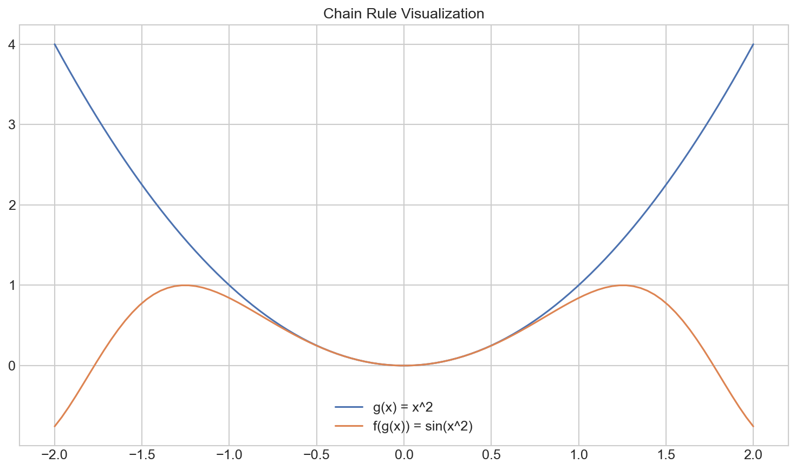
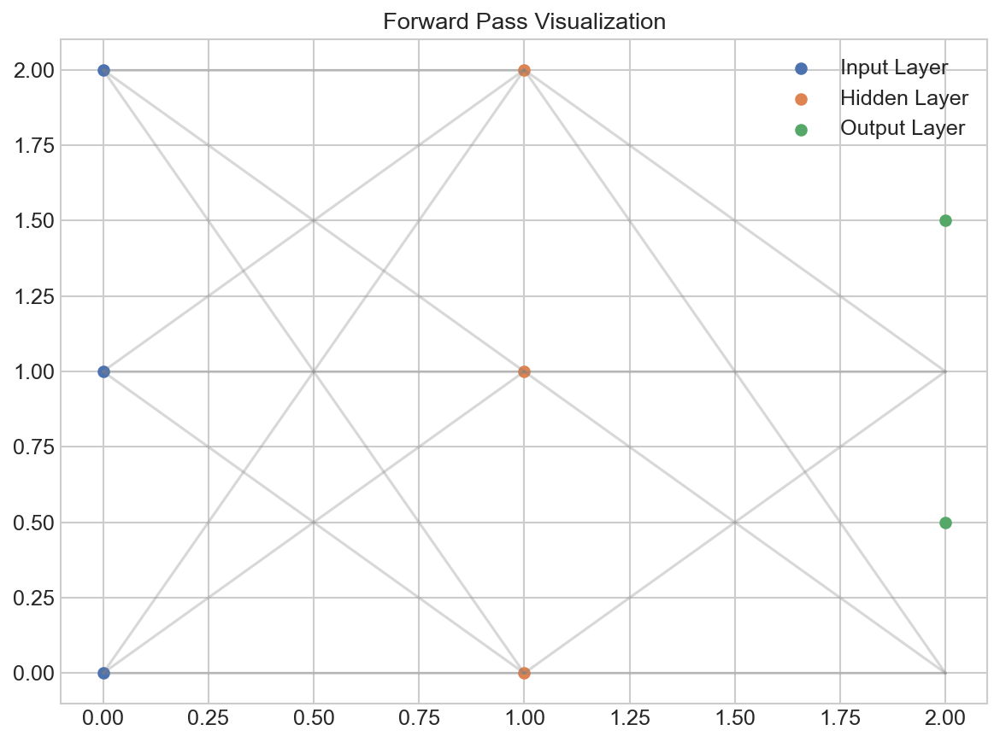
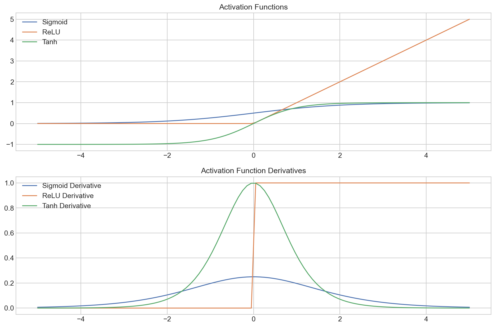

# Mathematical Foundations of Backpropagation

**After this lesson:** you can explain the core ideas in “Mathematical Foundations of Backpropagation” and reproduce the examples here in your own notebook or environment.

## Overview

Chain rule, local derivatives for activations and losses, and assembling **$\partial L/\partial w$** layer by layer.

[Introduction](1-introduction.md); [neural networks intro](../neural-networks/1-introduction.md) for forward-pass context.

## Helpful video

Crash Course AI: supervised learning framing (~15 min).

<iframe width="560" height="315" src="https://www.youtube.com/embed/4qVRBYAdLAo" title="Supervised Learning: Crash Course AI" frameborder="0" allow="accelerometer; autoplay; clipboard-write; encrypted-media; gyroscope; picture-in-picture" allowfullscreen></iframe>

## Understanding the Chain Rule

### What is the Chain Rule?

Imagine you're trying to find out how a small change in the temperature affects the amount of ice cream sold. The chain rule helps us understand how changes in one variable affect another through a series of connected steps.

In technical terms, the chain rule is the mathematical foundation of backpropagation. For a function $f(g(x))$, its derivative is:

$$\frac{df}{dx} = \frac{df}{dg} \cdot \frac{dg}{dx}$$

### Why Does it Matter?

The chain rule is crucial because:

- It helps us understand how small changes in the weights affect the final output
- It allows us to calculate gradients efficiently
- It's the key to making neural networks learn

### Visual Example


import matplotlib.pyplot as plt
import numpy as np

def plot_chain_rule_example():
    x = np.linspace(-2, 2, 100)
    g = x**2  # g(x) = x^2
    f = np.sin(g)  # f(g(x)) = sin(x^2)

    plt.figure(figsize=(10, 6))
    plt.plot(x, g, label='g(x) = x^2')
    plt.plot(x, f, label='f(g(x)) = sin(x^2)')
    plt.legend()
    plt.title('Chain Rule Visualization')
    plt.grid(True)
    plt.show()

plot_chain_rule_example()


<figure>

<figcaption>Figure 1: Chain Rule Visualization</figcaption>
</figure>

<aside class="code-explainer__callouts" aria-label="Code walkthrough">
  

    

      
      Imports
    

    

      
Standard matplotlib and NumPy imports needed for all visualizations in this file.

    

  

  

    

      
      Composed Functions
    

    

      
Compute both <code>g(x) = x²</code> and the composed <code>f(g(x)) = sin(x²)</code> over the same input range to visualize the chain relationship.

    

  

  

    

      
      Plot and Call
    

    

      
Overlay both curves so you can see how applying <code>sin</code> to the parabola output changes the shape — the chain rule governs how these slopes relate.

    

  

</aside>

## Forward Pass

### What is the Forward Pass?

Think of the forward pass like a recipe. You start with ingredients (inputs), follow the steps (layers), and end up with a finished dish (output).

In technical terms, we compute the output of the network:

$$z^{(l)} = W^{(l)}a^{(l-1)} + b^{(l)}$$
$$a^{(l)} = f(z^{(l)})$$

where:

- $z^{(l)}$ is the weighted sum (like mixing ingredients)
- $W^{(l)}$ are the weights (like recipe proportions)
- $a^{(l-1)}$ is the activation from the previous layer (like intermediate results)
- $b^{(l)}$ is the bias (like seasoning)
- $f$ is the activation function (like cooking method)

### Visual Example


def plot_forward_pass():
    # Create a simple network visualization
    plt.figure(figsize=(8, 6))

    # Input layer
    plt.scatter([0, 0, 0], [0, 1, 2], label='Input Layer')

    # Hidden layer
    plt.scatter([1, 1, 1], [0, 1, 2], label='Hidden Layer')

    # Output layer
    plt.scatter([2, 2], [0.5, 1.5], label='Output Layer')

    # Connect nodes
    for i in range(3):
        for j in range(3):
            plt.plot([0, 1], [i, j], 'gray', alpha=0.3)

    for i in range(3):
        for j in range(2):
            plt.plot([1, 2], [i, j], 'gray', alpha=0.3)

    plt.title('Forward Pass Visualization')
    plt.legend()
    plt.grid(True)
    plt.show()

plot_forward_pass()


<figure>

<figcaption>Figure 2: Forward Pass Visualization</figcaption>
</figure>

<aside class="code-explainer__callouts" aria-label="Code walkthrough">
  

    

      
      Layer Node Positions
    

    

      
Place three input nodes at x=0, three hidden nodes at x=1, and two output nodes at x=2 using <code>scatter</code> as proxy "neurons".

    

  

  

    

      
      Draw Connections
    

    

      
Nested loops draw semi-transparent gray lines between every input–hidden pair and every hidden–output pair, mimicking a fully-connected forward pass.

    

  

  

    

      
      Render and Call
    

    

      
Add title, legend, and grid then invoke the function immediately to produce the diagram inline.

    

  

</aside>

## Backward Pass

### What is the Backward Pass?

The backward pass is like learning from your mistakes. If your recipe didn't turn out right, you figure out which steps need adjustment.

### Output Layer Error

For the output layer $L$, the error is:

$$\delta^{(L)} = \frac{\partial L}{\partial a^{(L)}} \cdot f'(z^{(L)})$$

where:

- $L$ is the loss function (how wrong we were)
- $a^{(L)}$ is the output activation (our prediction)
- $f'$ is the derivative of the activation function (how sensitive we are to changes)

### Hidden Layer Error

For hidden layer $l$, the error is:

$$\delta^{(l)} = (W^{(l+1)})^T \delta^{(l+1)} \cdot f'(z^{(l)})$$

This is like figuring out which earlier steps contributed to the final mistake.

### Weight Gradients

The gradients for the weights and biases are:

$$\frac{\partial L}{\partial W^{(l)}} = \delta^{(l)} (a^{(l-1)})^T$$
$$\frac{\partial L}{\partial b^{(l)}} = \delta^{(l)}$$

These tell us how to adjust our recipe for better results.

## Activation Functions

### What are Activation Functions?

Activation functions are like filters that decide how much of a signal to pass through. Think of them like volume controls on a stereo.

### Common Activation Functions

1. **Sigmoid**
   $$\sigma(x) = \frac{1}{1 + e^{-x}}$$
   $$\sigma'(x) = \sigma(x)(1 - \sigma(x))$$

   Like a smooth on/off switch.

2. **ReLU**
   $$\text{ReLU}(x) = \max(0, x)$$
   $$\text{ReLU}'(x) = \begin{cases} 1 & \text{if } x > 0 \\ 0 & \text{if } x \leq 0 \end{cases}$$

   Like a simple on/off switch.

3. **Tanh**
   $$\tanh(x) = \frac{e^x - e^{-x}}{e^x + e^{-x}}$$
   $$\tanh'(x) = 1 - \tanh^2(x)$$

   Like a smooth volume control.

### Visual Example


def plot_activation_functions():
    x = np.linspace(-5, 5, 100)

    # Sigmoid
    sigmoid = 1 / (1 + np.exp(-x))
    sigmoid_derivative = sigmoid * (1 - sigmoid)

    # ReLU
    relu = np.maximum(0, x)
    relu_derivative = np.where(x > 0, 1, 0)

    # Tanh
    tanh = np.tanh(x)
    tanh_derivative = 1 - np.tanh(x)**2

    plt.figure(figsize=(12, 8))

    # Plot functions
    plt.subplot(2, 1, 1)
    plt.plot(x, sigmoid, label='Sigmoid')
    plt.plot(x, relu, label='ReLU')
    plt.plot(x, tanh, label='Tanh')
    plt.title('Activation Functions')
    plt.legend()
    plt.grid(True)

    # Plot derivatives
    plt.subplot(2, 1, 2)
    plt.plot(x, sigmoid_derivative, label='Sigmoid Derivative')
    plt.plot(x, relu_derivative, label='ReLU Derivative')
    plt.plot(x, tanh_derivative, label='Tanh Derivative')
    plt.title('Activation Function Derivatives')
    plt.legend()
    plt.grid(True)

    plt.tight_layout()
    plt.show()

plot_activation_functions()


<figure>

<figcaption>Figure 3: Activation Functions</figcaption>
</figure>

<aside class="code-explainer__callouts" aria-label="Code walkthrough">
  

    

      
      Compute Functions and Derivatives
    

    

      
Calculate Sigmoid, ReLU, and Tanh — and their analytical derivatives — for 100 points between −5 and 5.

    

  

  

    

      
      Top Panel: Functions
    

    

      
Overlay all three activation curves on a single subplot to compare their saturation behavior and value ranges.

    

  

  

    

      
      Bottom Panel: Derivatives
    

    

      
Plot the matching derivative curves below — showing where each function saturates (near-zero gradients) and where backprop signals vanish.

    

  

</aside>

## Loss Functions

### What are Loss Functions?

Loss functions measure how wrong our predictions are. Think of them like a score in a game - the lower the better.

### Common Loss Functions

1. **Mean Squared Error (MSE)**
   $$L_{\text{MSE}} = \frac{1}{n}\sum_{i=1}^n (y_i - \hat{y}_i)^2$$
   $$\frac{\partial L_{\text{MSE}}}{\partial \hat{y}_i} = -\frac{2}{n}(y_i - \hat{y}_i)$$

   Like measuring the average distance from the target.

2. **Binary Cross-Entropy**
   $$L_{\text{BCE}} = -\frac{1}{n}\sum_{i=1}^n [y_i\log(\hat{y}_i) + (1-y_i)\log(1-\hat{y}_i)]$$
   $$\frac{\partial L_{\text{BCE}}}{\partial \hat{y}_i} = -\frac{y_i}{\hat{y}_i} + \frac{1-y_i}{1-\hat{y}_i}$$

   Like measuring how surprised we are by the wrong predictions.

### Visual Example


def plot_loss_functions():
    y_true = np.array([0, 1, 0, 1])
    y_pred = np.linspace(0.01, 0.99, 100)

    # MSE
    mse = np.mean((y_true - y_pred)**2)

    # BCE
    bce = -np.mean(
        y_true * np.log(y_pred) +
        (1 - y_true) * np.log(1 - y_pred)
    )

    plt.figure(figsize=(10, 6))
    plt.plot(y_pred, mse, label='MSE')
    plt.plot(y_pred, bce, label='BCE')
    plt.title('Loss Functions')
    plt.xlabel('Prediction')
    plt.ylabel('Loss')
    plt.legend()
    plt.grid(True)
    plt.show()

plot_loss_functions()


<aside class="code-explainer__callouts" aria-label="Code walkthrough">
  

    

      
      Data Setup
    

    

      
Four fixed true labels and a sweep of predictions from 0.01 to 0.99 serve as the x-axis for both loss curves.

    

  

  

    

      
      Compute MSE and BCE
    

    

      
MSE averages squared differences; Binary Cross-Entropy penalizes confident wrong predictions logarithmically — both computed over the prediction sweep.

    

  

  

    

      
      Overlay and Call
    

    

      
Plot both loss values against the prediction range to show how each penalizes errors differently, then immediately render the figure.

    

  

</aside>

## Matrix Formulation

### What is Matrix Formulation?

Matrix formulation is like a recipe written in a compact form. Instead of writing out each step separately, we use matrices to represent the entire process at once.

For a batch of inputs $X$ with shape $(n, d)$:

1. Forward pass:
   $$Z^{(l)} = W^{(l)}A^{(l-1)} + b^{(l)}$$
   $$A^{(l)} = f(Z^{(l)})$$

2. Backward pass:
   $$\Delta^{(L)} = \frac{\partial L}{\partial A^{(L)}} \odot f'(Z^{(L)})$$
   $$\Delta^{(l)} = (W^{(l+1)})^T\Delta^{(l+1)} \odot f'(Z^{(l)})$$

3. Weight updates:
   $$\frac{\partial L}{\partial W^{(l)}} = \Delta^{(l)}(A^{(l-1)})^T$$
   $$\frac{\partial L}{\partial b^{(l)}} = \sum_{i=1}^n \Delta^{(l)}_i$$

where:

- $\odot$ represents element-wise multiplication
- $n$ is the batch size
- $d$ is the input dimension

### Why This Matters

Matrix formulation is important because:

- It makes computation more efficient
- It allows us to process multiple examples at once
- It's the foundation of modern deep learning frameworks

## Common Mistakes to Avoid

1. **Forgetting the Chain Rule**
   - Always remember to multiply derivatives
   - Check your gradient calculations
   - Use gradient checking for verification

2. **Ignoring Activation Derivatives**
   - Different activation functions have different derivatives
   - ReLU has a special case at x = 0
   - Sigmoid can lead to vanishing gradients

3. **Matrix Dimension Mismatches**
   - Always check matrix shapes
   - Use broadcasting carefully
   - Verify your matrix multiplications

## Gotchas

- **Applying the chain rule in the wrong order** — The chain rule requires multiplying $\partial f/\partial g$ by $\partial g/\partial x$, not the reverse. Swapping the order produces incorrect gradients that still have plausible-looking magnitudes, making this mistake hard to spot without gradient checking.
- **Using the pre-activation $z$ where the activation $a$ is expected (or vice versa)** — The weight gradient is $\delta^{(l)} (a^{(l-1)})^T$, using the previous layer's *activation*. Accidentally substituting $z$ produces subtly wrong gradients that converge more slowly or not at all.
- **Overlooking the element-wise vs. matrix multiplication distinction** — The $\odot$ (Hadamard) product in $\Delta^{(l)} = (W^{(l+1)})^T\Delta^{(l+1)} \odot f'(Z^{(l)})$ is element-wise, not a dot product. Using `np.dot` here silently produces wrong shapes or values.
- **Sigmoid's vanishing gradient in deep networks** — The sigmoid derivative peaks at 0.25, so multiplying it through many layers shrinks gradients exponentially. The math in this file shows this clearly in the activation derivative plots; in practice, switching to ReLU for hidden layers is the standard fix.
- **Forgetting to sum bias gradients across the batch** — The bias gradient is $\sum_i \Delta^{(l)}_i$, a sum over the batch dimension. Missing the sum gives a gradient shaped (batch, neurons) instead of (neurons,), causing a shape error or (worse) silent broadcasting.
- **Using MSE loss with a sigmoid output for classification** — MSE paired with sigmoid produces a non-convex loss surface with slow-moving gradients near 0 and 1. Use binary cross-entropy instead, whose derivative cancels the sigmoid's saturation and gives a cleaner gradient signal.

## Additional Resources

- [3Blue1Brown: Calculus](https://www.youtube.com/playlist?list=PLZHQObOWTQDMsr9K-rj53DwVRMYO3t5Yr) - Visual calculus explanations
- [Khan Academy: Chain Rule](https://www.khanacademy.org/math/ap-calculus-ab/ab-differentiation-2-new/ab-3-1a/v/chain-rule-introduction) - Step-by-step chain rule tutorial
- [MIT: Linear Algebra](https://ocw.mit.edu/courses/mathematics/18-06-linear-algebra-spring-2010/) - Comprehensive linear algebra course
