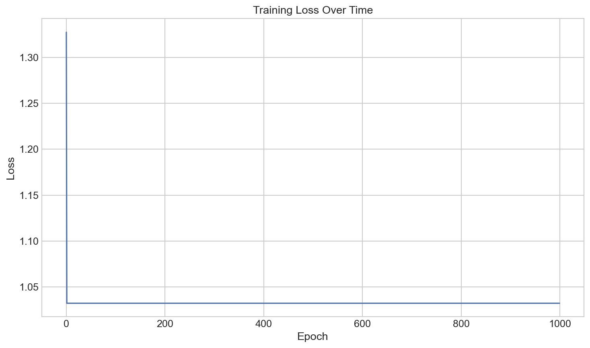

# Implementing Backpropagation

**After this lesson:** you can explain the core ideas in “Implementing Backpropagation” and reproduce the examples here in your own notebook or environment.

## Overview

Numerical vs symbolic gradients, modular layers, and debugging shape mistakes when implementing backward passes.

## Helpful video

Crash Course AI: supervised learning framing (~15 min).

<iframe width="560" height="315" src="https://www.youtube.com/embed/4qVRBYAdLAo" title="Supervised Learning: Crash Course AI" frameborder="0" allow="accelerometer; autoplay; clipboard-write; encrypted-media; gyroscope; picture-in-picture" allowfullscreen></iframe>

## Getting Started

Before we dive into the code, let's understand what we're building. We'll create a simple neural network that can learn from data. Think of it like teaching a computer to recognize patterns, similar to how you might teach a child to recognize different animals.

## Basic Implementation

Let's start with a basic implementation of backpropagation. This is like the core recipe for our neural network:

#### `backward_pass` skeleton

- **Purpose:** Show the **reverse loop** over layers: start from output error `dz`, compute `dW`/`db`, then propagate `dz` backward with **`Wᵀ`** and the **derivative of the activation** at the pre-activation `z`.
- **Walkthrough:** Expects `cache` to store activations `a` and pre-activations `z`; `activation_derivative` and `sigmoid` must exist in your module—this snippet is a teaching scaffold, not a drop-in for arbitrary architectures.

<div class="code-explainer" data-code-explainer>
<div class="code-explainer__code">


def backward_pass(network, x, y, cache):
    """
    Compute gradients using backpropagation
    
    This function is like a teacher correcting a student's work:
    1. It looks at the final answer (output)
    2. Compares it with the correct answer (target)
    3. Figures out how to adjust the student's thinking (weights)
    
    Parameters:
    - network: List of layer parameters (like the student's knowledge)
    - x: Input data (like the questions)
    - y: True labels (like the correct answers)
    - cache: Dictionary containing intermediate values (like the student's work)
    
    Returns:
    - gradients: Dictionary of gradients for each parameter (like correction notes)
    """
    gradients = {}
    L = len(network)  # Number of layers
    
    # Output layer error
    # This is like checking how far off the final answer is
    dz = cache['a' + str(L)] - y
    
    # Backpropagate through layers
    # This is like going back through the student's work to find where they went wrong
    for l in reversed(range(L)):
        # Current layer gradients
        # This is like figuring out how to adjust each step of the solution
        gradients['dW' + str(l)] = np.dot(
            dz, cache['a' + str(l-1)].T
        )
        gradients['db' + str(l)] = np.sum(
            dz, axis=1, keepdims=True
        )
        
        if l > 0:
            # Error for previous layer
            # This is like tracing back to earlier mistakes
            dz = np.dot(
                network[l]['W'].T, dz
            ) * activation_derivative(
                cache['z' + str(l-1)]
            )
    
    return gradients


</div>
<aside class="code-explainer__callouts" aria-label="Code walkthrough">
  <div class="code-callout" data-lines="22-24" data-tint="1">
    <div class="code-callout__meta">
      <span class="code-callout__lines"></span>
      <span class="code-callout__title">Output layer error (δ)</span>
    </div>
    <div class="code-callout__body">
      <p><code>dz = prediction - y</code> is the gradient of MSE loss w.r.t. the output pre-activation — the "how wrong were we" signal that flows backward through every layer.</p>
    </div>
  </div>
  <div class="code-callout" data-lines="28-36" data-tint="2">
    <div class="code-callout__meta">
      <span class="code-callout__lines"></span>
      <span class="code-callout__title">Weight &amp; bias gradients</span>
    </div>
    <div class="code-callout__body">
      <p><code>dW = dz · aᵀ</code> — outer product of upstream error and previous activations. <code>db = Σ dz</code> sums across the batch dimension. These gradients are what the optimizer uses to update each layer's parameters.</p>
    </div>
  </div>
  <div class="code-callout" data-lines="38-45" data-tint="3">
    <div class="code-callout__meta">
      <span class="code-callout__lines"></span>
      <span class="code-callout__title">Propagate error backward</span>
    </div>
    <div class="code-callout__body">
      <p><code>dz = Wᵀ · dz × σ′(z)</code> — the chain rule in action. Transposing W "routes" the error back through the same weights that carried it forward. Multiplying by the activation derivative applies the local gradient at that layer.</p>
    </div>
  </div>
</aside>
</div>

## Activation Function Derivatives

These are like the rules for how the network should adjust its thinking:

#### Activation derivatives (elementwise)

- **Purpose:** Local **chain-rule** pieces for common activations: **sigmoid**, **ReLU**, **tanh**—multiply these by upstream `dz` during backprop.
- **Walkthrough:** `sigmoid` must be defined elsewhere; ReLU uses `np.where`; tanh derivative uses $1 - \tanh^2(x)$.

<div class="code-explainer" data-code-explainer>
<div class="code-explainer__code">


def sigmoid_derivative(x):
    """
    Derivative of sigmoid activation function

    The sigmoid function is like a smooth on/off switch.
    Its derivative tells us how sensitive it is to changes.
    """
    sx = sigmoid(x)
    return sx * (1 - sx)

def relu_derivative(x):
    """
    Derivative of ReLU activation function

    ReLU is like a simple on/off switch.
    Its derivative is 1 when on, 0 when off.
    """
    return np.where(x > 0, 1, 0)

def tanh_derivative(x):
    """
    Derivative of tanh activation function

    Tanh is like a smooth volume control.
    Its derivative tells us how the volume changes with the input.
    """
    return 1 - np.tanh(x)**2


</div>
<aside class="code-explainer__callouts" aria-label="Code walkthrough">
  <div class="code-callout" data-lines="1-9" data-tint="1">
    <div class="code-callout__meta">
      <span class="code-callout__lines"></span>
      <span class="code-callout__title">Sigmoid derivative</span>
    </div>
    <div class="code-callout__body">
      <p>Reuses the sigmoid output <code>sx</code> to compute <code>σ(x)·(1−σ(x))</code>, which is the local gradient passed back through any sigmoid activation during backprop.</p>
    </div>
  </div>
  <div class="code-callout" data-lines="11-19" data-tint="2">
    <div class="code-callout__meta">
      <span class="code-callout__lines"></span>
      <span class="code-callout__title">ReLU derivative</span>
    </div>
    <div class="code-callout__body">
      <p><code>np.where</code> returns 1 where the pre-activation was positive and 0 elsewhere — the "dead neuron" property: no gradient flows for negative inputs.</p>
    </div>
  </div>
  <div class="code-callout" data-lines="21-28" data-tint="3">
    <div class="code-callout__meta">
      <span class="code-callout__lines"></span>
      <span class="code-callout__title">Tanh derivative</span>
    </div>
    <div class="code-callout__body">
      <p><code>1 − tanh²(x)</code> is the exact derivative of tanh. Its output is always in (0, 1], so it avoids the vanishing-gradient extremes that plague sigmoid.</p>
    </div>
  </div>
</aside>
</div>

## Complete Implementation

Now, let's put it all together in a complete neural network class:

#### `NeuralNetwork` class (educational)

- **Purpose:** Wire **init** / **forward** / **backward** / **update** into one object so you can train small fully connected nets in a notebook; read the methods below for the full forward/backprop story.
- **Walkthrough:** Lists `weights`/`biases` per layer; training loop typically computes loss, calls backward, then SGD-style updates—**align tensor shapes** with your `layer_sizes` when you adapt this code.

<div class="code-explainer" data-code-explainer>
<div class="code-explainer__code">


class NeuralNetwork:
    def __init__(self, layer_sizes):
        """
        Initialize neural network

        This is like setting up a new student with:
        - A certain number of layers (like grade levels)
        - Weights and biases (like knowledge and preferences)

        Parameters:
        - layer_sizes: List of integers representing the size of each layer
        """
        self.layer_sizes = layer_sizes
        self.weights = []
        self.biases = []

        # Initialize weights and biases
        # This is like giving the student some initial knowledge
        for i in range(len(layer_sizes) - 1):
            self.weights.append(
                np.random.randn(layer_sizes[i+1], layer_sizes[i]) * 0.01
            )
            self.biases.append(
                np.zeros((layer_sizes[i+1], 1))
            )

    def forward(self, x):
        """
        Forward pass through the network

        This is like the student solving a problem:
        1. Takes the input (question)
        2. Processes it through each layer (thinking steps)
        3. Produces an output (answer)

        Parameters:
        - x: Input data

        Returns:
        - cache: Dictionary containing intermediate values
        """
        cache = {'a0': x}

        for l in range(len(self.weights)):
            # Linear transformation
            # This is like combining different pieces of knowledge
            z = np.dot(self.weights[l], cache['a' + str(l)]) + self.biases[l]
            cache['z' + str(l+1)] = z

            # Activation
            # This is like deciding how confident we are in our answer
            cache['a' + str(l+1)] = self.activation(z)

        return cache

    def backward(self, x, y, cache):
        """
        Backward pass through the network

        This is like the teacher correcting the student's work:
        1. Looks at the final answer
        2. Compares it with the correct answer
        3. Figures out how to adjust the student's thinking

        Parameters:
        - x: Input data
        - y: True labels
        - cache: Dictionary containing intermediate values

        Returns:
        - gradients: Dictionary of gradients for each parameter
        """
        gradients = {}
        L = len(self.weights)

        # Output layer error
        # This is like checking how far off the final answer is
        dz = cache['a' + str(L)] - y

        # Backpropagate through layers
        # This is like going back through the student's work
        for l in reversed(range(L)):
            # Current layer gradients
            # This is like figuring out how to adjust each step
            gradients['dW' + str(l)] = np.dot(
                dz, cache['a' + str(l)].T
            )
            gradients['db' + str(l)] = np.sum(
                dz, axis=1, keepdims=True
            )

            if l > 0:
                # Error for previous layer
                # This is like tracing back to earlier mistakes
                dz = np.dot(
                    self.weights[l].T, dz
                ) * self.activation_derivative(
                    cache['z' + str(l)]
                )

        return gradients

    def update_parameters(self, gradients, learning_rate):
        """
        Update network parameters using gradients

        This is like the student learning from their mistakes:
        1. Sees how they were wrong
        2. Adjusts their thinking
        3. Gets better for next time

        Parameters:
        - gradients: Dictionary of gradients for each parameter
        - learning_rate: Learning rate for gradient descent
        """
        for l in range(len(self.weights)):
            self.weights[l] -= learning_rate * gradients['dW' + str(l)]
            self.biases[l] -= learning_rate * gradients['db' + str(l)]

    def train(self, x, y, learning_rate=0.01, epochs=1000):
        """
        Train the network

        This is like a student practicing with many problems:
        1. Tries to solve each problem
        2. Gets feedback on their answers
        3. Improves with each attempt

        Parameters:
        - x: Input data
        - y: True labels
        - learning_rate: Learning rate for gradient descent
        - epochs: Number of training epochs
        """
        for epoch in range(epochs):
            # Forward pass
            # This is like the student solving a problem
            cache = self.forward(x)

            # Backward pass
            # This is like the teacher correcting the work
            gradients = self.backward(x, y, cache)

            # Update parameters
            # This is like the student learning from their mistakes
            self.update_parameters(gradients, learning_rate)

            # Print progress
            # This is like checking how well the student is doing
            if epoch % 100 == 0:
                loss = self.compute_loss(y, cache['a' + str(len(self.weights))])
                print(f"Epoch {epoch}, Loss: {loss}")

    def activation(self, x):
        """
        Activation function

        This is like deciding how confident we are in our answer.
        We'll use sigmoid, but you could use ReLU or tanh instead.
        """
        return 1 / (1 + np.exp(-x))  # Sigmoid

    def activation_derivative(self, x):
        """
        Derivative of activation function

        This tells us how sensitive our confidence is to changes.
        """
        sx = self.activation(x)
        return sx * (1 - sx)  # Sigmoid derivative

    def compute_loss(self, y_true, y_pred):
        """
        Compute loss

        This is like measuring how wrong our answers are.
        We'll use mean squared error, but you could use cross-entropy instead.
        """
        return np.mean((y_true - y_pred)**2)  # MSE


</div>
<aside class="code-explainer__callouts" aria-label="Code walkthrough">
  <div class="code-callout" data-lines="1-25" data-tint="1">
    <div class="code-callout__meta">
      <span class="code-callout__lines"></span>
      <span class="code-callout__title">Weight initialisation</span>
    </div>
    <div class="code-callout__body">
      <p>Weights are drawn from a zero-mean Gaussian scaled by 0.01 to keep activations in a well-behaved range at the start of training. Biases are initialised to zero — a safe default for fully-connected layers.</p>
    </div>
  </div>
  <div class="code-callout" data-lines="27-54" data-tint="2">
    <div class="code-callout__meta">
      <span class="code-callout__lines"></span>
      <span class="code-callout__title">Forward pass</span>
    </div>
    <div class="code-callout__body">
      <p>Each layer computes <code>z = W·a + b</code> then applies the activation. Both <code>z</code> and <code>a</code> are stashed in <code>cache</code> because the backward pass needs them to compute gradients.</p>
    </div>
  </div>
  <div class="code-callout" data-lines="56-100" data-tint="3">
    <div class="code-callout__meta">
      <span class="code-callout__lines"></span>
      <span class="code-callout__title">Backward pass</span>
    </div>
    <div class="code-callout__body">
      <p>Iterates layers in reverse, computing <code>dW</code>, <code>db</code>, then propagating <code>dz</code> further back via <code>Wᵀ · dz × σ′(z)</code>. The <code>if l &gt; 0</code> guard prevents propagating past the input layer.</p>
    </div>
  </div>
  <div class="code-callout" data-lines="102-112" data-tint="4">
    <div class="code-callout__meta">
      <span class="code-callout__lines"></span>
      <span class="code-callout__title">Parameter update (SGD)</span>
    </div>
    <div class="code-callout__body">
      <p>Plain gradient descent: subtract <code>lr × gradient</code> from each weight and bias. Swap this method for Adam or RMSprop without touching the rest of the class.</p>
    </div>
  </div>
  <div class="code-callout" data-lines="114-140" data-tint="1">
    <div class="code-callout__meta">
      <span class="code-callout__lines"></span>
      <span class="code-callout__title">Training loop</span>
    </div>
    <div class="code-callout__body">
      <p>Runs forward → backward → update for each epoch, logging loss every 100 steps. The loss call re-reads the final activation from <code>cache</code> rather than doing a second forward pass.</p>
    </div>
  </div>
  <div class="code-callout" data-lines="142-163" data-tint="2">
    <div class="code-callout__meta">
      <span class="code-callout__lines"></span>
      <span class="code-callout__title">Activation &amp; loss helpers</span>
    </div>
    <div class="code-callout__body">
      <p>Sigmoid activation and its derivative are defined here for self-containment. <code>compute_loss</code> uses MSE — switch to binary cross-entropy for classification tasks.</p>
    </div>
  </div>
</aside>
</div>

## Usage Example

Let's see how to use our neural network:

<div class="code-explainer" data-code-explainer>
<div class="code-explainer__code">


# Create a simple neural network
# This is like setting up a new student with:
# - 2 inputs (like two pieces of information)
# - 3 hidden neurons (like three thinking steps)
# - 1 output (like one final answer)
network = NeuralNetwork([2, 3, 1])

# Generate some training data
# This is like creating practice problems
X = np.random.randn(2, 1000)  # 1000 samples, 2 features
y = np.random.randn(1, 1000)  # 1000 samples, 1 target

# Train the network
# This is like the student practicing with the problems
network.train(X, y, learning_rate=0.01, epochs=1000)

# Make predictions
# This is like the student solving new problems
predictions = network.forward(X)['a' + str(len(network.weights))]


</div>
<aside class="code-explainer__callouts" aria-label="Code walkthrough">
  <div class="code-callout" data-lines="1-6" data-tint="1">
    <div class="code-callout__meta">
      <span class="code-callout__lines"></span>
      <span class="code-callout__title">Build the network</span>
    </div>
    <div class="code-callout__body">
      <p><code>[2, 3, 1]</code> means 2 input features, one hidden layer of 3 neurons, and 1 output neuron. Change these numbers to match your dataset's dimensions.</p>
    </div>
  </div>
  <div class="code-callout" data-lines="8-11" data-tint="2">
    <div class="code-callout__meta">
      <span class="code-callout__lines"></span>
      <span class="code-callout__title">Synthetic data</span>
    </div>
    <div class="code-callout__body">
      <p>Random data is used here for illustration. Note the shape convention: <code>(features, samples)</code> — columns are samples, rows are features — the opposite of the pandas/sklearn convention.</p>
    </div>
  </div>
  <div class="code-callout" data-lines="13-15" data-tint="3">
    <div class="code-callout__meta">
      <span class="code-callout__lines"></span>
      <span class="code-callout__title">Train</span>
    </div>
    <div class="code-callout__body">
      <p>Kicks off the forward → backward → update loop for 1000 epochs at <code>lr=0.01</code>. Loss is printed every 100 epochs so you can watch convergence.</p>
    </div>
  </div>
  <div class="code-callout" data-lines="17-19" data-tint="4">
    <div class="code-callout__meta">
      <span class="code-callout__lines"></span>
      <span class="code-callout__title">Get predictions</span>
    </div>
    <div class="code-callout__body">
      <p>Runs a forward pass and extracts the final layer's activations. The key is built dynamically from the number of weight matrices so it works regardless of network depth.</p>
    </div>
  </div>
</aside>
</div>

```
Epoch 0, Loss: 1.2398897398986224
Epoch 100, Loss: 0.9784079619497448
Epoch 200, Loss: 0.978407981338456
Epoch 300, Loss: 0.9784079813400142
Epoch 400, Loss: 0.9784079813400143
Epoch 500, Loss: 0.9784079813400143
Epoch 600, Loss: 0.9784079813400143
Epoch 700, Loss: 0.9784079813400143
Epoch 800, Loss: 0.9784079813400143
Epoch 900, Loss: 0.9784079813400143
```

## Visualizing the Training Process

Let's add some visualization to help understand what's happening:

<div class="code-explainer" data-code-explainer>
<div class="code-explainer__code">


def plot_training_process(network, x, y, epochs=1000):
    """
    Plot the training process

    This helps us see how the network is learning over time.
    """
    losses = []

    for epoch in range(epochs):
        # Forward pass
        cache = network.forward(x)

        # Compute loss
        loss = network.compute_loss(y, cache['a' + str(len(network.weights))])
        losses.append(loss)

        # Backward pass
        gradients = network.backward(x, y, cache)

        # Update parameters
        network.update_parameters(gradients, learning_rate=0.01)

    # Plot loss over time
    plt.figure(figsize=(10, 6))
    plt.plot(losses)
    plt.title('Training Loss Over Time')
    plt.xlabel('Epoch')
    plt.ylabel('Loss')
    plt.grid(True)
    plt.show()

# Create and train a network
network = NeuralNetwork([2, 3, 1])
X = np.random.randn(2, 1000)
y = np.random.randn(1, 1000)
plot_training_process(network, X, y)


</div>
<aside class="code-explainer__callouts" aria-label="Code walkthrough">
  <div class="code-callout" data-lines="1-7" data-tint="1">
    <div class="code-callout__meta">
      <span class="code-callout__lines"></span>
      <span class="code-callout__title">Function signature</span>
    </div>
    <div class="code-callout__body">
      <p>Accepts an already-constructed <code>NeuralNetwork</code> object so it works with any architecture. The <code>losses</code> list accumulates one scalar per epoch for plotting.</p>
    </div>
  </div>
  <div class="code-callout" data-lines="9-21" data-tint="2">
    <div class="code-callout__meta">
      <span class="code-callout__lines"></span>
      <span class="code-callout__title">Training loop</span>
    </div>
    <div class="code-callout__body">
      <p>Runs the full forward → loss → backward → update cycle every epoch and records the loss. Unlike <code>train()</code>, every epoch's loss is saved rather than only printing every 100 steps.</p>
    </div>
  </div>
  <div class="code-callout" data-lines="23-30" data-tint="3">
    <div class="code-callout__meta">
      <span class="code-callout__lines"></span>
      <span class="code-callout__title">Loss curve plot</span>
    </div>
    <div class="code-callout__body">
      <p>A simple matplotlib line plot of epoch vs loss. A steadily decreasing curve indicates healthy training; plateaus or oscillations suggest a learning-rate or architecture issue.</p>
    </div>
  </div>
  <div class="code-callout" data-lines="32-36" data-tint="4">
    <div class="code-callout__meta">
      <span class="code-callout__lines"></span>
      <span class="code-callout__title">Driver code</span>
    </div>
    <div class="code-callout__body">
      <p>Creates a fresh <code>[2, 3, 1]</code> network and random data, then calls the function — a minimal end-to-end demo you can run directly in a notebook cell.</p>
    </div>
  </div>
</aside>
</div>




## Best Practices

1. **Gradient Checking**
   - Verify your implementation by comparing numerical and analytical gradients
   - Use small networks for testing
   - Check each layer separately

2. **Learning Rate**
   - Start with a small learning rate (e.g., 0.01)
   - Use learning rate scheduling
   - Consider adaptive methods (Adam, RMSprop)

3. **Initialization**
   - Use proper weight initialization (Xavier, He)
   - Initialize biases to zero
   - Consider batch normalization

4. **Regularization**
   - Use L1/L2 regularization
   - Implement dropout
   - Apply early stopping

5. **Debugging**
   - Monitor loss during training
   - Check gradient magnitudes
   - Visualize activations and weights

## Common Mistakes to Avoid

1. **Forgetting to Normalize Data**
   - Always normalize your inputs
   - Check for outliers
   - Handle missing values

2. **Poor Learning Rate Choice**
   - Start small and increase if needed
   - Watch for oscillations
   - Use learning rate scheduling

3. **Ignoring Regularization**
   - Add dropout or L2 regularization
   - Monitor for overfitting
   - Use early stopping

4. **Matrix Dimension Mismatches**
   - Check shapes before operations
   - Use broadcasting carefully
   - Verify your matrix multiplications

## Gotchas

- **Shape convention mismatch between examples** — The `NeuralNetwork` class uses the `(features, samples)` convention (columns are samples), which is the *opposite* of the pandas/sklearn convention. Passing an `(n_samples, n_features)` array directly into `network.train` silently transposes the learning problem and produces garbage gradients.
- **Recomputing loss from the forward pass cache instead of re-running forward** — In the `train` method, `compute_loss` reads `cache['a…']` from the *same* forward pass that generated the current gradients. Calling `forward` again would be wasteful but also consistent; mixing cache reads with extra forward calls is a common source of subtle training-loop bugs.
- **Initializing weights with `randn * 0.01` for every architecture** — Scaling by 0.01 keeps initial activations small for shallow nets but starves gradients in deep nets. Use Xavier init for tanh/sigmoid layers and He init for ReLU; the scaffolding here always uses `* 0.01`, which will fail silently on deeper architectures.
- **The training loop doesn't shuffle data between epochs** — The `train` method runs gradient descent on the full dataset in a single step each epoch. Without mini-batching or shuffling, the gradient estimate is just full-batch GD; on real data this means the model sees the same ordering every time, which can introduce bias.
- **`activation_derivative` is hard-coded to sigmoid throughout** — The `NeuralNetwork` class uses sigmoid both as the activation and for its derivative. Swapping `activation` to ReLU without also updating `activation_derivative` produces incorrect gradients with no error — the network trains silently with the wrong math.
- **Gradient checking is described but not wired up** — The "Best Practices" section recommends gradient checking, but there is no utility function for it in this file. Without a numerical gradient check, a subtle sign error or index-off-by-one in the backward pass can go undetected for many training runs.

## Additional Resources

- [Neural Networks and Deep Learning](http://neuralnetworksanddeeplearning.com/) - Free online book with interactive examples
- [CS231n: Convolutional Neural Networks](http://cs231n.stanford.edu/) - Stanford's deep learning course
- [3Blue1Brown: Neural Networks](https://www.youtube.com/playlist?list=PLZHQObOWTQDNU6R1_67000Dx_ZCJB-3pi) - Visual explanations
- [Deep Learning Specialization](https://www.coursera.org/specializations/deep-learning) - Andrew Ng's comprehensive course
