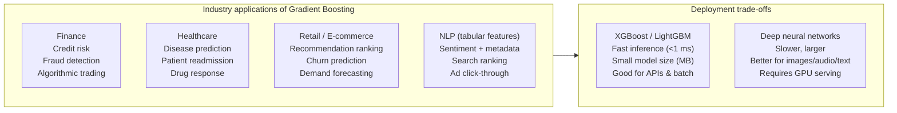

# Real-World Applications of Gradient Boosting

**After this lesson:** you can explain the core ideas in “Real-World Applications of Gradient Boosting” and reproduce the examples here in your own notebook or environment.

## Overview

Competition-style tabular problems, ranking, and deployment considerations (latency, model size).

## Helpful video

Crash Course AI: supervised learning framing (~15 min).

<iframe width="560" height="315" src="https://www.youtube.com/embed/4qVRBYAdLAo" title="Supervised Learning: Crash Course AI" frameborder="0" allow="accelerometer; autoplay; clipboard-write; encrypted-media; gyroscope; picture-in-picture" allowfullscreen></iframe>

## 1. Financial Applications: Making Smart Money Decisions

### Credit Risk Assessment: Who Gets a Loan?

Imagine you're a bank manager deciding who to give loans to. Gradient Boosting can help make these decisions smarter and fairer.


import pandas as pd
import numpy as np
from xgboost import XGBClassifier
from sklearn.preprocessing import StandardScaler
from sklearn.model_selection import train_test_split

# Create sample credit data
# Think of this as collecting information about loan applicants
np.random.seed(42)
n_samples = 1000

data = pd.DataFrame({
    'income': np.random.normal(50000, 20000, n_samples),        # Annual income
    'age': np.random.normal(40, 10, n_samples),                 # Applicant age
    'employment_length': np.random.normal(8, 4, n_samples),     # Years employed
    'debt_ratio': np.random.uniform(0.1, 0.6, n_samples),       # Debt to income ratio
    'credit_score': np.random.normal(700, 50, n_samples),       # Credit score
    'previous_defaults': np.random.randint(0, 3, n_samples),    # Past defaults
    'loan_amount': np.random.normal(200000, 100000, n_samples)  # Requested loan
})

# Create target (default probability)
# This is like marking which applicants actually defaulted
data['default'] = (
    (data['debt_ratio'] > 0.4) &
    (data['credit_score'] < 650) |
    (data['previous_defaults'] > 1)
).astype(int)

# Train credit risk model
def train_credit_model(data):
    """Train a model to predict loan default risk"""
    # Prepare data
    X = data.drop('default', axis=1)
    y = data['default']

    X_train, X_test, y_train, y_test = train_test_split(
        X, y,
        test_size=0.2,
        random_state=42
    )

    scaler = StandardScaler()
    X_train_scaled = scaler.fit_transform(X_train)
    X_test_scaled = scaler.transform(X_test)

    model = XGBClassifier(
        max_depth=4,
        learning_rate=0.1,
        n_estimators=100,
        scale_pos_weight=len(y_train[y_train==0])/len(y_train[y_train==1])
    )
    model.fit(X_train_scaled, y_train)
    return model, scaler

# Create risk scoring function
def calculate_credit_risk(model, scaler, applicant_data):
    """Calculate credit risk score and recommendations"""
    scaled_data = scaler.transform(applicant_data)
    default_prob = model.predict_proba(scaled_data)[:, 1]
    credit_score = 100 * (1 - default_prob)

    feature_imp = pd.DataFrame({
        'feature': applicant_data.columns,
        'importance': model.feature_importances_
    }).sort_values('importance', ascending=False)

    recommendations = []
    if default_prob > 0.3:
        if applicant_data['debt_ratio'].values[0] > 0.4:
            recommendations.append("Reduce debt ratio")
        if applicant_data['credit_score'].values[0] < 650:
            recommendations.append("Improve credit score")

    return {
        'credit_score': credit_score[0],
        'default_probability': default_prob[0],
        'key_factors': feature_imp.head(3),
        'recommendations': recommendations
    }


<aside class="code-explainer__callouts" aria-label="Code walkthrough">
  

    

      
      Imports and Sample Data
    

    

      
Seven applicant features are generated with realistic distributions; the default label is derived from a rule combining high debt ratio, low credit score, and prior defaults.

    

  

  

    

      
      Train Credit Model
    

    

      
Features are standard-scaled before fitting an XGBClassifier; <code>scale_pos_weight</code> compensates for class imbalance by weighting the minority (default) class proportionally.

    

  

  

    

      
      Risk Scoring Function
    

    

      
Scores a new applicant by transforming their features, extracting the default probability, inverting it to a 0–100 credit score, ranking feature importances, and appending targeted recommendations when risk exceeds 0.3.

    

  

</aside>

### Stock Market Prediction: Finding Patterns in Market Data

Let's build a system that can help predict stock movements. Think of this as having a smart assistant for stock trading.


import yfinance as yf
from lightgbm import LGBMRegressor

def create_stock_features(data, lookback=30):
    """Create technical indicators from stock data"""
    df = data.copy()

    # Price-based indicators
    df['SMA_20'] = df['Close'].rolling(window=20).mean()
    df['SMA_50'] = df['Close'].rolling(window=50).mean()
    df['RSI'] = calculate_rsi(df['Close'])

    # Volume indicators
    df['Volume_SMA'] = df['Volume'].rolling(window=20).mean()
    df['Volume_Ratio'] = df['Volume'] / df['Volume_SMA']

    # Volatility indicators
    df['Daily_Return'] = df['Close'].pct_change()
    df['Volatility'] = df['Daily_Return'].rolling(window=20).std()

    # Target: Next day return
    df['Target'] = df['Close'].shift(-1) / df['Close'] - 1

    return df.dropna()

def train_stock_predictor(symbol='AAPL', lookback_days=30):
    """Train a model to predict stock movements"""
    stock = yf.Ticker(symbol)
    data = stock.history(period='2y')

    df = create_stock_features(data, lookback_days)

    model = LGBMRegressor(
        n_estimators=100,
        learning_rate=0.05,
        max_depth=5
    )

    predictions = []
    train_size = 252  # One year of trading days

    for i in range(train_size, len(df)):
        train_data = df.iloc[i-train_size:i]
        X_train = train_data.drop(['Target'], axis=1)
        y_train = train_data['Target']

        model.fit(X_train, y_train)

        X_test = df.iloc[i:i+1].drop(['Target'], axis=1)
        pred = model.predict(X_test)
        predictions.append(pred[0])

    return model, predictions


<aside class="code-explainer__callouts" aria-label="Code walkthrough">
  

    

      
      Feature Engineering
    

    

      
Computes SMA-20/50, RSI, volume ratio, daily return, and 20-day rolling volatility; the target is the next-day return, shifted by one row so the model predicts one step ahead.

    

  

  

    

      
      Walk-forward Training
    

    

      
Downloads two years of history, then slides a 252-day (one trading year) window forward: each iteration retrains LGBMRegressor on the preceding year and predicts the next day, simulating realistic out-of-sample evaluation.

    

  

</aside>

## 2. Healthcare Applications: Predicting Health Risks

### Disease Risk Prediction: Early Warning System

Imagine you're a doctor trying to predict which patients might develop certain conditions. Gradient Boosting can help identify at-risk patients early.


def train_disease_predictor(medical_data):
    """Train a model to predict disease risk"""
    features = [
        'age', 'bmi', 'blood_pressure', 'cholesterol',
        'glucose', 'smoking', 'family_history'
    ]

    X = medical_data[features]
    y = medical_data['disease']

    model = XGBClassifier(
        max_depth=3,
        learning_rate=0.1,
        n_estimators=100
    )

    cv_scores = cross_val_score(
        model, X, y,
        cv=StratifiedKFold(5),
        scoring='roc_auc'
    )

    model.fit(X, y)
    return model

def assess_patient_risk(model, patient_data):
    """Assess a patient's disease risk"""
    risk_prob = model.predict_proba(patient_data)[0, 1]

    if risk_prob < 0.2:
        risk_level = "Low"
    elif risk_prob < 0.6:
        risk_level = "Moderate"
    else:
        risk_level = "High"

    importance = pd.DataFrame({
        'factor': patient_data.columns,
        'importance': model.feature_importances_
    }).sort_values('importance', ascending=False)

    recommendations = []
    if risk_prob > 0.3:
        if patient_data['smoking'].values[0] == 1:
            recommendations.append("Stop smoking")
        if patient_data['bmi'].values[0] > 30:
            recommendations.append("Reduce BMI")
        if patient_data['blood_pressure'].values[0] > 140:
            recommendations.append("Control blood pressure")

    return {
        'risk_probability': risk_prob,
        'risk_level': risk_level,
        'key_factors': importance.head(3),
        'recommendations': recommendations
    }


<aside class="code-explainer__callouts" aria-label="Code walkthrough">
  

    

      
      Train with Cross-validation
    

    

      
Seven clinical features feed an XGBClassifier with depth=3 (intentionally shallow to prevent overfitting on medical data); stratified 5-fold cross-validation measures ROC-AUC before the final model is fitted on all data.

    

  

  

    

      
      Risk Assessment
    

    

      
Maps the predicted probability to Low/Moderate/High risk tiers, ranks features by importance, then appends condition-specific recommendations (smoking, BMI, blood pressure) when risk exceeds 0.3.

    

  

</aside>

## 3. Marketing Applications: Understanding Customers

### Customer Churn Prediction: Keeping Customers Happy

Let's build a system that can predict which customers might leave a service. This is like having a crystal ball for customer retention.


from catboost import CatBoostClassifier

def predict_customer_churn(customer_data):
    """Predict which customers might leave"""
    features = [
        'tenure', 'monthly_charges', 'total_charges',
        'contract_type', 'payment_method', 'internet_service',
        'online_security', 'tech_support', 'streaming_tv'
    ]

    cat_features = [
        'contract_type', 'payment_method', 'internet_service',
        'online_security', 'tech_support', 'streaming_tv'
    ]

    model = CatBoostClassifier(
        iterations=200,
        learning_rate=0.1,
        depth=6,
        loss_function='Logloss',
        verbose=False
    )

    model.fit(
        customer_data[features],
        customer_data['churn'],
        cat_features=cat_features
    )

    return model


<aside class="code-explainer__callouts" aria-label="Code walkthrough">
  

    

      
      Feature Lists
    

    

      
Nine customer features are enumerated; six of them are explicitly marked as categorical so CatBoost encodes them natively without manual one-hot encoding.

    

  

  

    

      
      CatBoost Training
    

    

      
CatBoostClassifier is configured with 200 trees, depth=6, and Logloss; passing <code>cat_features</code> to <code>fit</code> tells the library which columns to handle with ordered target statistics instead of label encoding.

    

  

</aside>

## Common Mistakes to Avoid

1. **Ignoring Data Quality**
   - Like cooking with spoiled ingredients
   - Can lead to poor predictions
   - Solution: Clean and validate data first

2. **Overfitting to Specific Cases**
   - Like memorizing recipes instead of learning to cook
   - Won't work well on new data
   - Solution: Use cross-validation

3. **Not Considering Business Context**
   - Like cooking without knowing who you're cooking for
   - Can lead to impractical solutions
   - Solution: Understand the real-world problem

## Next Steps

Ready to try these applications? Start with the credit risk example and gradually move to more complex projects. Remember, the key is to understand both the technical aspects and the real-world context!

## Additional Resources

For more learning:

- [XGBoost Applications](https://xgboost.readthedocs.io/en/latest/tutorials/index.html)
- [LightGBM Use Cases](https://lightgbm.readthedocs.io/en/latest/Examples.html)
- [CatBoost Applications](https://catboost.ai/docs/concepts/use-cases)
- [Kaggle Competitions](https://www.kaggle.com/competitions)
