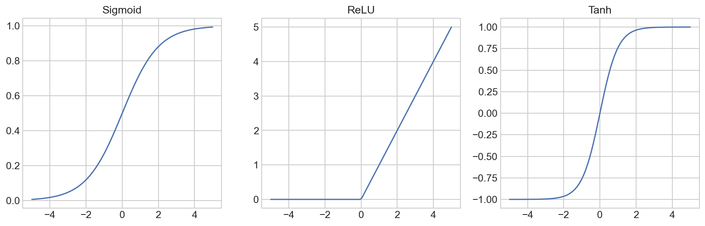

# Mathematical Foundation of Neural Networks

**After this lesson:** you can explain the core ideas in “Mathematical Foundation of Neural Networks” and reproduce the examples here in your own notebook or environment.

## Overview

Layers, activations, loss functions, and forward pass notation—setup for training with gradients.

[Introduction](1-introduction.md); [backpropagation](../backpropagation/1-introduction.md) for the backward pass story.

## Helpful video

Crash Course AI: supervised learning framing (~15 min).

<iframe width="560" height="315" src="https://www.youtube.com/embed/4qVRBYAdLAo" title="Supervised Learning: Crash Course AI" frameborder="0" allow="accelerometer; autoplay; clipboard-write; encrypted-media; gyroscope; picture-in-picture" allowfullscreen></iframe>

## Welcome to the Math Behind Neural Networks

Don't worry if math isn't your strongest suit! We'll break down these concepts into simple, understandable pieces. Think of this like learning to cook - you don't need to be a master chef to make a great meal, you just need to understand the basic ingredients and how they work together.

## Why Understanding the Math Matters

Understanding the math behind neural networks helps you:

- Choose the right type of network for your problem
- Fix issues when your network isn't learning well
- Create more efficient and effective models
- Understand why certain techniques work better than others

## Forward Propagation

### Single Neuron

A neuron computes:

$$z = \sum_{i=1}^n w_ix_i + b$$
$$a = f(z)$$

where:

- $w_i$ are weights
- $x_i$ are inputs
- $b$ is bias
- $f$ is activation function

```python
def forward_neuron(x, w, b, activation_fn):
    """Forward pass through a single neuron"""
    z = np.dot(w, x) + b
    return activation_fn(z)
```

### Real-World Analogy

Imagine you're deciding whether to go to the beach:

- Inputs: Weather (sunny/cloudy), Temperature, Day of week
- Weights: How important each factor is to you
- Bias: Your general preference for the beach
- Activation: Your final decision (go/don't go)

## Activation Functions

### Common Functions and Their Derivatives

1. **Sigmoid**
   $$\sigma(x) = \frac{1}{1 + e^{-x}}$$
   $$\sigma'(x) = \sigma(x)(1 - \sigma(x))$$

```python
def sigmoid(x):
    return 1 / (1 + np.exp(-x))

def sigmoid_derivative(x):
    sx = sigmoid(x)
    return sx * (1 - sx)
```

2. **ReLU**
   $$\text{ReLU}(x) = \max(0, x)$$
   $$\text{ReLU}'(x) = \begin{cases} 1 & \text{if } x > 0 \\ 0 & \text{if } x \leq 0 \end{cases}$$

```python
def relu(x):
    return np.maximum(0, x)

def relu_derivative(x):
    return np.where(x > 0, 1, 0)
```

3. **Tanh**
   $$\tanh(x) = \frac{e^x - e^{-x}}{e^x + e^{-x}}$$
   $$\tanh'(x) = 1 - \tanh^2(x)$$

```python
def tanh(x):
    return np.tanh(x)

def tanh_derivative(x):
    return 1 - np.tanh(x)**2
```

## Loss Functions

### Common Loss Functions

1. **Mean Squared Error (MSE)**
   $$L_{\text{MSE}} = \frac{1}{n}\sum_{i=1}^n (y_i - \hat{y}_i)^2$$
   $$\frac{\partial L_{\text{MSE}}}{\partial \hat{y}_i} = -\frac{2}{n}(y_i - \hat{y}_i)$$

```python
def mse_loss(y_true, y_pred):
    return np.mean((y_true - y_pred)**2)

def mse_derivative(y_true, y_pred):
    return -2 * (y_true - y_pred) / len(y_true)
```

2. **Binary Cross-Entropy**
   $$L_{\text{BCE}} = -\frac{1}{n}\sum_{i=1}^n [y_i\log(\hat{y}_i) + (1-y_i)\log(1-\hat{y}_i)]$$
   $$\frac{\partial L_{\text{BCE}}}{\partial \hat{y}_i} = -\frac{y_i}{\hat{y}_i} + \frac{1-y_i}{1-\hat{y}_i}$$

```python
def binary_cross_entropy(y_true, y_pred):
    epsilon = 1e-15  # Prevent log(0)
    y_pred = np.clip(y_pred, epsilon, 1 - epsilon)
    return -np.mean(
        y_true * np.log(y_pred) + 
        (1 - y_true) * np.log(1 - y_pred)
    )
```

## Backpropagation

### Chain Rule Application

For a network with $L$ layers:

$$\frac{\partial L}{\partial w^{(l)}} = \frac{\partial L}{\partial a^{(l)}} \cdot \frac{\partial a^{(l)}}{\partial z^{(l)}} \cdot \frac{\partial z^{(l)}}{\partial w^{(l)}}$$

<div class="code-explainer" data-code-explainer>
<div class="code-explainer__code">


def backward_pass(network, x, y, cache):
    """Compute gradients using backpropagation"""
    gradients = {}
    L = len(network)

    # Output layer error
    dz = cache['a' + str(L)] - y

    # Backpropagate through layers
    for l in reversed(range(L)):
        # Current layer gradients
        gradients['dW' + str(l)] = np.dot(
            dz, cache['a' + str(l-1)].T
        )
        gradients['db' + str(l)] = np.sum(
            dz, axis=1, keepdims=True
        )

        if l > 0:
            # Error for previous layer
            dz = np.dot(
                network[l]['W'].T, dz
            ) * activation_derivative(
                cache['z' + str(l-1)]
            )

    return gradients


</div>
<aside class="code-explainer__callouts" aria-label="Code walkthrough">
  <div class="code-callout" data-lines="1-8" data-tint="1">
    <div class="code-callout__meta">
      <span class="code-callout__lines"></span>
      <span class="code-callout__title">Output Layer Error</span>
    </div>
    <div class="code-callout__body">
      <p>Initialize gradient storage and compute the output-layer error <code>dz</code> as the difference between prediction and true label.</p>
    </div>
  </div>
  <div class="code-callout" data-lines="10-19" data-tint="2">
    <div class="code-callout__meta">
      <span class="code-callout__lines"></span>
      <span class="code-callout__title">Weight Gradients</span>
    </div>
    <div class="code-callout__body">
      <p>For each layer (in reverse), compute <code>dW</code> via outer product of error and previous activations, and <code>db</code> by summing the error signal.</p>
    </div>
  </div>
  <div class="code-callout" data-lines="21-28" data-tint="3">
    <div class="code-callout__meta">
      <span class="code-callout__lines"></span>
      <span class="code-callout__title">Propagate Error Back</span>
    </div>
    <div class="code-callout__body">
      <p>Chain the error backward through the transposed weight matrix and multiply element-wise by the activation derivative to reach the previous layer.</p>
    </div>
  </div>
</aside>
</div>

## Weight Initialization

### Xavier/Glorot Initialization

For layer $l$ with $n_{in}$ inputs and $n_{out}$ outputs:

$$w^{(l)} \sim \mathcal{N}\left(0, \sqrt{\frac{2}{n_{in} + n_{out}}}\right)$$

```python
def xavier_init(n_in, n_out):
    """Xavier weight initialization"""
    limit = np.sqrt(2 / (n_in + n_out))
    return np.random.normal(0, limit, (n_out, n_in))
```

### He Initialization

For ReLU networks:

$$w^{(l)} \sim \mathcal{N}\left(0, \sqrt{\frac{2}{n_{in}}}\right)$$

```python
def he_init(n_in, n_out):
    """He weight initialization"""
    limit = np.sqrt(2 / n_in)
    return np.random.normal(0, limit, (n_out, n_in))
```

## Optimization Algorithms

### Gradient Descent with Momentum

Update rule with momentum $\beta$:

$$v_t = \beta v_{t-1} + (1-\beta)\nabla_\theta J(\theta)$$
$$\theta_t = \theta_{t-1} - \alpha v_t$$

<div class="code-explainer" data-code-explainer>
<div class="code-explainer__code">


class MomentumOptimizer:
    def __init__(self, learning_rate=0.01, beta=0.9):
        self.lr = learning_rate
        self.beta = beta
        self.velocity = {}

    def update(self, params, gradients):
        if not self.velocity:
            for key in params:
                self.velocity[key] = np.zeros_like(params[key])

        for key in params:
            # Update velocity
            self.velocity[key] = (
                self.beta * self.velocity[key] +
                (1 - self.beta) * gradients[key]
            )
            # Update parameters
            params[key] -= self.lr * self.velocity[key]


</div>
<aside class="code-explainer__callouts" aria-label="Code walkthrough">
  <div class="code-callout" data-lines="1-4" data-tint="1">
    <div class="code-callout__meta">
      <span class="code-callout__lines"></span>
      <span class="code-callout__title">Optimizer Setup</span>
    </div>
    <div class="code-callout__body">
      <p>Store learning rate, momentum coefficient <code>beta</code>, and an empty dict for per-parameter velocity vectors.</p>
    </div>
  </div>
  <div class="code-callout" data-lines="6-11" data-tint="2">
    <div class="code-callout__meta">
      <span class="code-callout__lines"></span>
      <span class="code-callout__title">Lazy Initialization</span>
    </div>
    <div class="code-callout__body">
      <p>On the first call, create zero-filled velocity arrays matching each parameter's shape so the update rule works from the first step.</p>
    </div>
  </div>
  <div class="code-callout" data-lines="13-19" data-tint="3">
    <div class="code-callout__meta">
      <span class="code-callout__lines"></span>
      <span class="code-callout__title">Momentum Update</span>
    </div>
    <div class="code-callout__body">
      <p>Blend the running velocity with the current gradient using <code>beta</code>, then nudge each parameter by the damped velocity — smoothing out oscillations.</p>
    </div>
  </div>
</aside>
</div>

### Adam Optimizer

Combines momentum and RMSprop:

$$m_t = \beta_1 m_{t-1} + (1-\beta_1)\nabla_\theta J(\theta)$$
$$v_t = \beta_2 v_{t-1} + (1-\beta_2)(\nabla_\theta J(\theta))^2$$
$$\hat{m}_t = \frac{m_t}{1-\beta_1^t}$$
$$\hat{v}_t = \frac{v_t}{1-\beta_2^t}$$
$$\theta_t = \theta_{t-1} - \alpha\frac{\hat{m}_t}{\sqrt{\hat{v}_t}+\epsilon}$$

<div class="code-explainer" data-code-explainer>
<div class="code-explainer__code">


class AdamOptimizer:
    def __init__(self, learning_rate=0.001, beta1=0.9,
                 beta2=0.999, epsilon=1e-8):
        self.lr = learning_rate
        self.beta1 = beta1
        self.beta2 = beta2
        self.epsilon = epsilon
        self.m = {}  # First moment
        self.v = {}  # Second moment
        self.t = 0   # Time step

    def update(self, params, gradients):
        if not self.m:
            for key in params:
                self.m[key] = np.zeros_like(params[key])
                self.v[key] = np.zeros_like(params[key])

        self.t += 1

        for key in params:
            # Update moments
            self.m[key] = (
                self.beta1 * self.m[key] +
                (1 - self.beta1) * gradients[key]
            )
            self.v[key] = (
                self.beta2 * self.v[key] +
                (1 - self.beta2) * gradients[key]**2
            )

            # Bias correction
            m_hat = self.m[key] / (1 - self.beta1**self.t)
            v_hat = self.v[key] / (1 - self.beta2**self.t)

            # Update parameters
            params[key] -= (
                self.lr * m_hat /
                (np.sqrt(v_hat) + self.epsilon)
            )


</div>
<aside class="code-explainer__callouts" aria-label="Code walkthrough">
  <div class="code-callout" data-lines="1-10" data-tint="1">
    <div class="code-callout__meta">
      <span class="code-callout__lines"></span>
      <span class="code-callout__title">Adam Hyperparameters</span>
    </div>
    <div class="code-callout__body">
      <p>Store the learning rate, two decay rates (<code>beta1</code> for momentum, <code>beta2</code> for RMS), a numerical floor <code>epsilon</code>, and empty dicts for first/second moments.</p>
    </div>
  </div>
  <div class="code-callout" data-lines="12-17" data-tint="2">
    <div class="code-callout__meta">
      <span class="code-callout__lines"></span>
      <span class="code-callout__title">Initialize Moments</span>
    </div>
    <div class="code-callout__body">
      <p>On the first update, create zero arrays for both <code>m</code> (first moment) and <code>v</code> (second moment) matching each parameter's shape.</p>
    </div>
  </div>
  <div class="code-callout" data-lines="19-29" data-tint="3">
    <div class="code-callout__meta">
      <span class="code-callout__lines"></span>
      <span class="code-callout__title">Update Moments</span>
    </div>
    <div class="code-callout__body">
      <p>Accumulate an exponential moving average of gradients (<code>m</code>) and squared gradients (<code>v</code>) using their respective decay rates.</p>
    </div>
  </div>
  <div class="code-callout" data-lines="31-38" data-tint="4">
    <div class="code-callout__meta">
      <span class="code-callout__lines"></span>
      <span class="code-callout__title">Bias Correction and Step</span>
    </div>
    <div class="code-callout__body">
      <p>Divide by <code>(1 - beta^t)</code> to correct the early-step bias, then scale the gradient by <code>lr / (sqrt(v_hat) + epsilon)</code> for an adaptive per-parameter step.</p>
    </div>
  </div>
</aside>
</div>

## Regularization Techniques

### L2 Regularization

Adds term to loss function:

$$L_{\text{reg}} = L + \frac{\lambda}{2}\sum_{l=1}^L \|w^{(l)}\|_2^2$$

```python
def l2_regularization(weights, lambda_):
    """Compute L2 regularization term"""
    reg_term = 0
    for w in weights:
        reg_term += np.sum(w**2)
    return 0.5 * lambda_ * reg_term
```

### Dropout

During training, randomly drop neurons with probability $p$:

```python
def dropout_forward(x, p_drop):
    """Forward pass with dropout"""
    mask = np.random.binomial(1, 1-p_drop, x.shape)
    out = x * mask
    cache = mask
    return out, cache

def dropout_backward(dout, cache):
    """Backward pass with dropout"""
    mask = cache
    return dout * mask
```

## Visualizing the Concepts

Let's create some visualizations to help understand these concepts:

<div class="code-explainer" data-code-explainer>
<div class="code-explainer__code">


import matplotlib.pyplot as plt
import numpy as np

# Plot activation functions
x = np.linspace(-5, 5, 100)
plt.figure(figsize=(12, 4))

# Sigmoid
plt.subplot(1, 3, 1)
plt.plot(x, 1 / (1 + np.exp(-x)))
plt.title('Sigmoid')
plt.grid(True)

# ReLU
plt.subplot(1, 3, 2)
plt.plot(x, np.maximum(0, x))
plt.title('ReLU')
plt.grid(True)

# Tanh
plt.subplot(1, 3, 3)
plt.plot(x, np.tanh(x))
plt.title('Tanh')
plt.grid(True)

plt.tight_layout()
plt.show()


</div>
<aside class="code-explainer__callouts" aria-label="Code walkthrough">
  <div class="code-callout" data-lines="1-6" data-tint="1">
    <div class="code-callout__meta">
      <span class="code-callout__lines"></span>
      <span class="code-callout__title">Setup</span>
    </div>
    <div class="code-callout__body">
      <p>Create 100 evenly spaced points from −5 to 5 and open a wide figure with three subplots side by side.</p>
    </div>
  </div>
  <div class="code-callout" data-lines="8-12" data-tint="2">
    <div class="code-callout__meta">
      <span class="code-callout__lines"></span>
      <span class="code-callout__title">Sigmoid Plot</span>
    </div>
    <div class="code-callout__body">
      <p>Plots <code>1/(1+e⁻ˣ)</code> — the S-shaped curve that squashes any input to (0, 1), used in binary output layers.</p>
    </div>
  </div>
  <div class="code-callout" data-lines="14-18" data-tint="3">
    <div class="code-callout__meta">
      <span class="code-callout__lines"></span>
      <span class="code-callout__title">ReLU and Tanh Plots</span>
    </div>
    <div class="code-callout__body">
      <p>ReLU clips negatives to zero; Tanh maps to (−1, 1). Comparing all three side by side shows their distinct saturation behaviors.</p>
    </div>
  </div>
</aside>
</div>




## Gotchas

- **Applying He initialization to sigmoid/tanh layers** — `he_init` divides by $n_{in}$ and is designed for ReLU networks (where neurons are "half dead"). Using it with sigmoid or tanh causes over-large initial activations that push neurons into saturation immediately, making early gradients near zero before any training begins.
- **Forgetting bias correction in Adam at the first few steps** — The bias correction terms `1 - beta1^t` and `1 - beta2^t` are close to 0 at step 1, making the corrected moments large. Skipping this correction in a custom Adam implementation causes a very large first step that can destabilize training — the effect disappears after ~10 steps but the model may never recover.
- **Using `dropout_forward` during inference without removing the mask** — The `dropout_forward` function applies a random mask and rescales by `1 - p_drop` (inverted dropout). At inference time the mask must not be applied. Forgetting to disable dropout during evaluation produces predictions that are randomly noisy — the model appears to have high variance across identical inputs.
- **Applying L2 regularization to biases** — The `l2_regularization` function sums squared norms over all weight matrices. Best practice is to regularize only weight matrices, not bias vectors; regularizing biases adds a spurious pull toward zero that can shift decision boundaries and is rarely helpful.
- **Using a raw dot product for the single-neuron forward pass with batched input** — The `forward_neuron` snippet computes `np.dot(w, x)`. For a single sample this works fine, but with a batch of inputs $X$ of shape `(n_features, batch_size)`, the dot should be `np.dot(w, X)` not `np.dot(X, w)`. The transposition error silently produces a scalar instead of a `(batch_size,)` vector.
- **Momentum's `1 - beta` factor changes gradient contribution** — The update rule here is $v_t = \beta v_{t-1} + (1 - \beta)\nabla J$. Some implementations omit `(1 - beta)` and write $v_t = \beta v_{t-1} + \nabla J$ instead. The two formulations have the same fixed point but different effective learning rates; mixing them when porting code between frameworks silently changes convergence speed.

## Next Steps

Now that you understand the mathematics behind Neural Networks, let's move on to [Implementation](3-implementation.md) to see how to put these concepts into practice!
