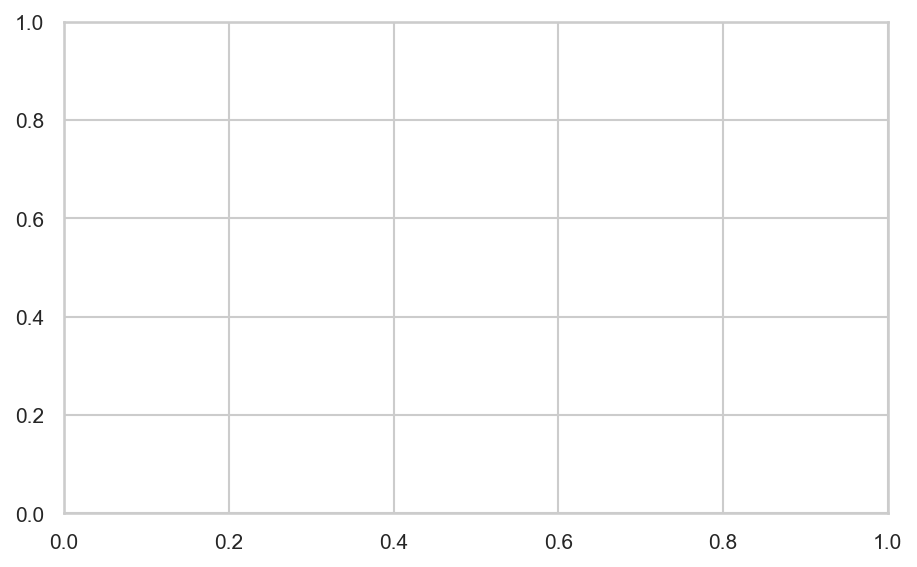

# Implementing Neural Networks

**After this lesson:** you can explain the core ideas in “Implementing Neural Networks” and reproduce the examples here in your own notebook or environment.

## Overview

Minimal **sklearn** `MLPClassifier` / framework-agnostic patterns: batches, epochs, and monitoring loss.

## Helpful video

Crash Course AI: supervised learning framing (~15 min).

<iframe width="560" height="315" src="https://www.youtube.com/embed/4qVRBYAdLAo" title="Supervised Learning: Crash Course AI" frameborder="0" allow="accelerometer; autoplay; clipboard-write; encrypted-media; gyroscope; picture-in-picture" allowfullscreen></iframe>

## Welcome to Neural Network Implementation

Ready to build your first neural network? This guide will walk you through the process step by step, with clear explanations and practical examples. Think of it like building a house - we'll start with the foundation and work our way up!

## Why Implementation Matters

Understanding how to implement neural networks helps you:

- Turn theoretical concepts into working solutions
- Solve real-world problems
- Debug and improve your models
- Build confidence in your machine learning skills

## Getting Started with TensorFlow

TensorFlow is like a toolbox for building neural networks. It provides all the tools you need to create, train, and use your models.

### Setting Up Your Environment

First, let's make sure you have everything you need:

#### Environment: TensorFlow + sklearn utilities

- **Purpose:** Install/import **TensorFlow** and the usual **train/test split** + **scaling** helpers for the examples below (notebooks may use `!pip`; local envs use `uv pip` / `pip`).
- **Walkthrough:** Keep **TensorFlow** and **Python** versions compatible per [TF install docs](https://www.tensorflow.org/install).

```python
# Install required packages
# pip install tensorflow numpy scikit-learn matplotlib

# Import necessary libraries
import tensorflow as tf
import numpy as np
import matplotlib.pyplot as plt
from sklearn.model_selection import train_test_split
from sklearn.preprocessing import StandardScaler
```

### Your First Neural Network: Predicting House Prices

Let's build a simple network to predict house prices based on features like size, number of bedrooms, and location.

#### Keras `Sequential`: regression with early stopping

- **Purpose:** Train a small **fully connected** net on synthetic tabular data with **MSE** loss, **MAE** metric, and **`EarlyStopping`** on a validation slice.
- **Walkthrough:** `create_house_data` builds features and noisy prices; **`StandardScaler`** is fit on train only; sample prediction shows inference on one row.

<div class="code-explainer" data-code-explainer>
<div class="code-explainer__code">


# Create sample dataset
def create_house_data(n_samples=1000):
    """Generate synthetic house price data"""
    np.random.seed(42)
    # Features: size (sq ft), bedrooms, bathrooms, age
    X = np.random.rand(n_samples, 4)
    X[:, 0] = X[:, 0] * 2000 + 1000  # Size: 1000-3000 sq ft
    X[:, 1] = np.round(X[:, 1] * 4 + 1)  # Bedrooms: 1-5
    X[:, 2] = np.round(X[:, 2] * 3 + 1)  # Bathrooms: 1-4
    X[:, 3] = np.round(X[:, 3] * 50)  # Age: 0-50 years
    
    # Generate prices based on features
    prices = (
        100 * X[:, 0] +  # Base price per sq ft
        50000 * X[:, 1] +  # Price per bedroom
        30000 * X[:, 2] +  # Price per bathroom
        -1000 * X[:, 3]  # Price reduction per year of age
    )
    prices += np.random.normal(0, 50000, n_samples)  # Add some noise
    
    return X, prices

# Create and prepare data
X, y = create_house_data()
X_train, X_test, y_train, y_test = train_test_split(
    X, y, test_size=0.2, random_state=42
)

# Scale the features
scaler = StandardScaler()
X_train_scaled = scaler.fit_transform(X_train)
X_test_scaled = scaler.transform(X_test)

# Create the model
model = tf.keras.Sequential([
    # Input layer with 4 features
    tf.keras.layers.Dense(64, activation='relu', input_shape=(4,)),
    # Hidden layer
    tf.keras.layers.Dense(32, activation='relu'),
    # Output layer (single value for price)
    tf.keras.layers.Dense(1)
])

# Compile the model
model.compile(
    optimizer='adam',
    loss='mean_squared_error',
    metrics=['mae']  # Mean Absolute Error
)

# Train the model
history = model.fit(
    X_train_scaled, y_train,
    epochs=50,
    batch_size=32,
    validation_split=0.2,
    callbacks=[
        tf.keras.callbacks.EarlyStopping(
            patience=5,
            restore_best_weights=True
        )
    ]
)

# Evaluate the model
test_loss, test_mae = model.evaluate(X_test_scaled, y_test)
print(f"Test MAE: ${test_mae:,.2f}")

# Make predictions
sample_house = np.array([[1500, 3, 2, 10]])  # 1500 sq ft, 3 bed, 2 bath, 10 years old
sample_house_scaled = scaler.transform(sample_house)
predicted_price = model.predict(sample_house_scaled)[0][0]
print(f"Predicted price: ${predicted_price:,.2f}")


</div>
<aside class="code-explainer__callouts" aria-label="Code walkthrough">
  <div class="code-callout" data-lines="29-32" data-tint="1">
    <div class="code-callout__meta">
      <span class="code-callout__lines"></span>
      <span class="code-callout__title">Scale before training</span>
    </div>
    <div class="code-callout__body">
      <p>Fit the scaler on training data only (<code>fit_transform</code>), then apply the same learned scale to test data (<code>transform</code>). Fitting on the full dataset would leak test statistics into training.</p>
    </div>
  </div>
  <div class="code-callout" data-lines="34-42" data-tint="2">
    <div class="code-callout__meta">
      <span class="code-callout__lines"></span>
      <span class="code-callout__title">Network architecture</span>
    </div>
    <div class="code-callout__body">
      <p><code>Sequential</code> stacks layers left-to-right. Two hidden <code>Dense</code> layers with <code>relu</code> add non-linearity. The final layer has 1 unit with no activation — regression predicts an unbounded number, not a probability.</p>
    </div>
  </div>
  <div class="code-callout" data-lines="44-49" data-tint="3">
    <div class="code-callout__meta">
      <span class="code-callout__lines"></span>
      <span class="code-callout__title">Compile: optimizer &amp; loss</span>
    </div>
    <div class="code-callout__body">
      <p><code>adam</code> adapts the learning rate per parameter — a safe default for most tasks. <code>mean_squared_error</code> is the regression loss; <code>mae</code> as a metric gives error in the original price units, which is easier to interpret.</p>
    </div>
  </div>
  <div class="code-callout" data-lines="51-63" data-tint="4">
    <div class="code-callout__meta">
      <span class="code-callout__lines"></span>
      <span class="code-callout__title">Fit with early stopping</span>
    </div>
    <div class="code-callout__body">
      <p>Training runs up to 50 epochs in mini-batches of 32. <code>EarlyStopping(patience=5)</code> halts if validation loss doesn't improve for 5 epochs, then restores the best weights — prevents overfitting without manually tuning the epoch count.</p>
    </div>
  </div>
</aside>
</div>

## Understanding the Code

Let's break down what each part does:

1. **Data Preparation**
   - We create synthetic house data with realistic features
   - Split into training and testing sets
   - Scale the features to help the network learn better

2. **Model Architecture**
   - Input layer: Takes 4 features (size, bedrooms, bathrooms, age)
   - Hidden layer: 64 neurons with ReLU activation
   - Output layer: 1 neuron for the predicted price

3. **Training Process**
   - Uses Adam optimizer for efficient learning
   - Mean Squared Error loss for regression
   - Early stopping to prevent overfitting

## Visualizing the Results

Let's create some plots to understand how our model is performing:

#### Loss curves + predicted vs actual scatter

- **Purpose:** Visualize **training vs validation loss** across epochs and check **calibration** of predictions vs `y_test`.
- **Walkthrough:** Uses **`history`** and **`model`** from the previous cell; diagonal line is perfect agreement.

<div class="code-explainer" data-code-explainer>
<div class="code-explainer__code">


# Plot training history
plt.figure(figsize=(12, 4))

# Plot loss
plt.subplot(1, 2, 1)
plt.plot(history.history['loss'], label='Training Loss')
plt.plot(history.history['val_loss'], label='Validation Loss')
plt.title('Loss Over Time')
plt.xlabel('Epoch')
plt.ylabel('Loss')
plt.legend()

# Plot predictions vs actual
plt.subplot(1, 2, 2)
predictions = model.predict(X_test_scaled)
plt.scatter(y_test, predictions)
plt.plot([y_test.min(), y_test.max()],
         [y_test.min(), y_test.max()],
         'r--')
plt.title('Predictions vs Actual')
plt.xlabel('Actual Price')
plt.ylabel('Predicted Price')

plt.tight_layout()
plt.show()


</div>
<aside class="code-explainer__callouts" aria-label="Code walkthrough">
  <div class="code-callout" data-lines="1-11" data-tint="1">
    <div class="code-callout__meta">
      <span class="code-callout__lines"></span>
      <span class="code-callout__title">Loss Curves</span>
    </div>
    <div class="code-callout__body">
      <p>Both training and validation loss are plotted against epoch; diverging curves indicate overfitting, while parallel descent shows healthy generalisation.</p>
    </div>
  </div>
  <div class="code-callout" data-lines="13-25" data-tint="2">
    <div class="code-callout__meta">
      <span class="code-callout__lines"></span>
      <span class="code-callout__title">Predicted vs Actual</span>
    </div>
    <div class="code-callout__body">
      <p>Scatter points should cluster around the diagonal red line (perfect predictions); systematic deviation above or below reveals bias in the model's estimates.</p>
    </div>
  </div>
</aside>
</div>

## Common Implementation Mistakes

1. **Forgetting to Scale Data**
   - Always scale your features to similar ranges
   - Use StandardScaler or MinMaxScaler
   - Scale test data using the same scaler as training data

2. **Choosing Wrong Architecture**
   - Start simple and add complexity as needed
   - Use appropriate activation functions
   - Don't make the network too deep for simple problems

3. **Overfitting**
   - Use validation data to monitor performance
   - Implement early stopping
   - Consider dropout layers for regularization

## Practical Tips

1. **Data Preparation**
   - Always check for missing values
   - Handle outliers appropriately
   - Create meaningful features
   - Split data properly (train/validation/test)

2. **Model Training**
   - Start with small learning rates
   - Use batch sizes that fit in memory
   - Monitor training with callbacks
   - Save model checkpoints

3. **Evaluation**
   - Use appropriate metrics for your problem
   - Compare with baseline models
   - Perform error analysis
   - Consider business impact

## Next Steps

Ready to try more advanced implementations? Continue to [Advanced Topics](4-advanced.md) to learn about:

- Convolutional Neural Networks for images
- Recurrent Neural Networks for sequences
- Transfer learning with pre-trained models
- Hyperparameter tuning techniques

## Basic Implementation with TensorFlow

### Simple Classification Example

#### Keras classifier on `make_classification`

- **Purpose:** Binary classification with **dropout**, **`binary_crossentropy`**, and **early stopping** on scaled features.
- **Walkthrough:** `sigmoid` output with one unit; `evaluate` returns loss + **accuracy** on the held-out set.

<div class="code-explainer" data-code-explainer>
<div class="code-explainer__code">


import tensorflow as tf
from tensorflow.keras import layers, models
from sklearn.model_selection import train_test_split
from sklearn.preprocessing import StandardScaler
from sklearn.datasets import make_classification

X, y = make_classification(
    n_samples=1000,
    n_features=20,
    n_informative=15,
    n_redundant=5,
    random_state=42
)

X_train, X_test, y_train, y_test = train_test_split(
    X, y, test_size=0.2, random_state=42
)

scaler = StandardScaler()
X_train_scaled = scaler.fit_transform(X_train)
X_test_scaled = scaler.transform(X_test)

model = models.Sequential([
    layers.Dense(64, activation='relu', input_shape=(20,)),
    layers.Dropout(0.2),
    layers.Dense(32, activation='relu'),
    layers.Dropout(0.2),
    layers.Dense(1, activation='sigmoid')
])

model.compile(
    optimizer='adam',
    loss='binary_crossentropy',
    metrics=['accuracy']
)

history = model.fit(
    X_train_scaled, y_train,
    epochs=50,
    batch_size=32,
    validation_split=0.2,
    callbacks=[
        tf.keras.callbacks.EarlyStopping(
            patience=5,
            restore_best_weights=True
        )
    ]
)

test_loss, test_acc = model.evaluate(X_test_scaled, y_test)
print(f"Test accuracy: {test_acc:.3f}")


</div>
<aside class="code-explainer__callouts" aria-label="Code walkthrough">
  <div class="code-callout" data-lines="1-21" data-tint="1">
    <div class="code-callout__meta">
      <span class="code-callout__lines"></span>
      <span class="code-callout__title">Data Preparation</span>
    </div>
    <div class="code-callout__body">
      <p>1000 samples with 20 features (15 informative, 5 redundant) are generated, split 80/20, and standard-scaled; the scaler is fitted on training data only to prevent data leakage.</p>
    </div>
  </div>
  <div class="code-callout" data-lines="23-35" data-tint="2">
    <div class="code-callout__meta">
      <span class="code-callout__lines"></span>
      <span class="code-callout__title">Model Architecture</span>
    </div>
    <div class="code-callout__body">
      <p>Two Dense+Dropout blocks (64→32 units, 20% dropout each) feed a sigmoid output; Dropout randomly zeros activations during training, acting as an ensemble regulariser.</p>
    </div>
  </div>
  <div class="code-callout" data-lines="37-51" data-tint="3">
    <div class="code-callout__meta">
      <span class="code-callout__lines"></span>
      <span class="code-callout__title">Train and Evaluate</span>
    </div>
    <div class="code-callout__body">
      <p>EarlyStopping with <code>restore_best_weights=True</code> halts training after 5 non-improving epochs and reloads the checkpoint with the lowest validation loss; the final evaluate call reports held-out accuracy.</p>
    </div>
  </div>
</aside>
</div>

## PyTorch Implementation

### Custom Neural Network

#### PyTorch `nn.Module` training loop

- **Purpose:** Mirror the Keras example with an explicit **forward → loss → backward** loop for educational control.
- **Walkthrough:** Expects **`X_train_scaled`**, **`y_train`** from the **TensorFlow classification** cell; **BCE** with logits would be more stable for production—here matches `sigmoid` + `BCELoss`.

<div class="code-explainer" data-code-explainer>
<div class="code-explainer__code">


import torch
import torch.nn as nn
import torch.optim as optim

class NeuralNet(nn.Module):
    def __init__(self, input_size, hidden_size, num_classes):
        super(NeuralNet, self).__init__()
        self.layer1 = nn.Linear(input_size, hidden_size)
        self.relu = nn.ReLU()
        self.dropout = nn.Dropout(0.2)
        self.layer2 = nn.Linear(hidden_size, num_classes)
        self.sigmoid = nn.Sigmoid()

    def forward(self, x):
        x = self.layer1(x)
        x = self.relu(x)
        x = self.dropout(x)
        x = self.layer2(x)
        x = self.sigmoid(x)
        return x

# Convert data to PyTorch tensors
X_train_tensor = torch.FloatTensor(X_train_scaled)
y_train_tensor = torch.FloatTensor(y_train)
X_test_tensor = torch.FloatTensor(X_test_scaled)
y_test_tensor = torch.FloatTensor(y_test)

model = NeuralNet(input_size=20, hidden_size=64, num_classes=1)
criterion = nn.BCELoss()
optimizer = optim.Adam(model.parameters())

num_epochs = 50
for epoch in range(num_epochs):
    outputs = model(X_train_tensor)
    loss = criterion(outputs, y_train_tensor.view(-1, 1))

    optimizer.zero_grad()
    loss.backward()
    optimizer.step()

    if (epoch + 1) % 10 == 0:
        print(f'Epoch [{epoch+1}/{num_epochs}], Loss: {loss.item():.4f}')

with torch.no_grad():
    outputs = model(X_test_tensor)
    predicted = (outputs > 0.5).float()
    accuracy = (predicted == y_test_tensor.view(-1, 1)).float().mean()
    print(f'Test Accuracy: {accuracy:.3f}')


</div>
<aside class="code-explainer__callouts" aria-label="Code walkthrough">
  <div class="code-callout" data-lines="1-20" data-tint="1">
    <div class="code-callout__meta">
      <span class="code-callout__lines"></span>
      <span class="code-callout__title">Module Definition</span>
    </div>
    <div class="code-callout__body">
      <p><code>NeuralNet</code> subclasses <code>nn.Module</code> and declares layers in <code>__init__</code>; the <code>forward</code> method chains Linear→ReLU→Dropout→Linear→Sigmoid, making the data flow explicit compared to Keras.</p>
    </div>
  </div>
  <div class="code-callout" data-lines="22-42" data-tint="2">
    <div class="code-callout__meta">
      <span class="code-callout__lines"></span>
      <span class="code-callout__title">Training Loop</span>
    </div>
    <div class="code-callout__body">
      <p>Each epoch runs forward pass → BCELoss → <code>zero_grad</code> → <code>backward</code> → <code>step</code>; this explicit loop mirrors what Keras's <code>fit</code> does internally, giving full control over each gradient update.</p>
    </div>
  </div>
  <div class="code-callout" data-lines="44-48" data-tint="3">
    <div class="code-callout__meta">
      <span class="code-callout__lines"></span>
      <span class="code-callout__title">Inference</span>
    </div>
    <div class="code-callout__body">
      <p><code>torch.no_grad()</code> disables gradient tracking during evaluation; predictions above 0.5 are rounded to 1, and the mean of boolean matches gives accuracy.</p>
    </div>
  </div>
</aside>
</div>

## Real-World Example: Image Classification

### CNN with TensorFlow

#### Illustrative CNN + `ImageDataGenerator` (paths are placeholders)

- **Purpose:** Show a **Conv2D** stack, **batch norm**, and **data augmentation**—you must point **`train_dir`** / **`validation_dir`** at real image folders.
- **Walkthrough:** `flow_from_directory` expects class subfolders; adjust **`steps_per_epoch`** if batch size changes.

<div class="code-explainer" data-code-explainer>
<div class="code-explainer__code">


import tensorflow as tf
from tensorflow.keras import layers, models
from tensorflow.keras.preprocessing.image import ImageDataGenerator

def create_cnn_model(input_shape, num_classes):
    model = models.Sequential([
        # First convolutional block
        layers.Conv2D(32, (3, 3), activation='relu', input_shape=input_shape),
        layers.MaxPooling2D((2, 2)),
        layers.BatchNormalization(),
        # Second convolutional block
        layers.Conv2D(64, (3, 3), activation='relu'),
        layers.MaxPooling2D((2, 2)),
        layers.BatchNormalization(),
        # Third convolutional block
        layers.Conv2D(128, (3, 3), activation='relu'),
        layers.MaxPooling2D((2, 2)),
        layers.BatchNormalization(),
        # Dense head
        layers.Flatten(),
        layers.Dense(128, activation='relu'),
        layers.Dropout(0.5),
        layers.Dense(num_classes, activation='softmax')
    ])
    return model

train_datagen = ImageDataGenerator(
    rescale=1./255,
    rotation_range=20,
    width_shift_range=0.2,
    height_shift_range=0.2,
    horizontal_flip=True,
    fill_mode='nearest'
)
test_datagen = ImageDataGenerator(rescale=1./255)

train_generator = train_datagen.flow_from_directory(
    'train_dir', target_size=(224, 224), batch_size=32, class_mode='categorical'
)
validation_generator = test_datagen.flow_from_directory(
    'validation_dir', target_size=(224, 224), batch_size=32, class_mode='categorical'
)

model = create_cnn_model(
    input_shape=(224, 224, 3),
    num_classes=len(train_generator.class_indices)
)
model.compile(optimizer='adam', loss='categorical_crossentropy', metrics=['accuracy'])

history = model.fit(
    train_generator,
    steps_per_epoch=train_generator.samples // 32,
    epochs=50,
    validation_data=validation_generator,
    validation_steps=validation_generator.samples // 32,
    callbacks=[
        tf.keras.callbacks.EarlyStopping(patience=5, restore_best_weights=True),
        tf.keras.callbacks.ReduceLROnPlateau(factor=0.5, patience=3)
    ]
)


</div>
<aside class="code-explainer__callouts" aria-label="Code walkthrough">
  <div class="code-callout" data-lines="1-25" data-tint="1">
    <div class="code-callout__meta">
      <span class="code-callout__lines"></span>
      <span class="code-callout__title">CNN Architecture</span>
    </div>
    <div class="code-callout__body">
      <p>Three Conv→Pool→BatchNorm blocks progressively double filter depth (32→64→128), shrinking spatial resolution while increasing feature richness; Flatten then connects to a Dense head with 50% dropout.</p>
    </div>
  </div>
  <div class="code-callout" data-lines="27-43" data-tint="2">
    <div class="code-callout__meta">
      <span class="code-callout__lines"></span>
      <span class="code-callout__title">Data Augmentation</span>
    </div>
    <div class="code-callout__body">
      <p>Training images are randomly rotated, shifted, and flipped on the fly; the test generator only rescales to [0,1] — augmentation is applied only to training data to avoid contaminating evaluation.</p>
    </div>
  </div>
  <div class="code-callout" data-lines="45-59" data-tint="3">
    <div class="code-callout__meta">
      <span class="code-callout__lines"></span>
      <span class="code-callout__title">Compile and Train</span>
    </div>
    <div class="code-callout__body">
      <p>EarlyStopping halts training when validation loss stalls for 5 epochs; ReduceLROnPlateau halves the learning rate after 3 non-improving epochs, allowing finer convergence before stopping.</p>
    </div>
  </div>
</aside>
</div>

## Transfer Learning Example

### Using Pre-trained ResNet

#### Transfer learning: frozen ResNet50 + fine-tune tail

- **Purpose:** Reuse **ImageNet** weights: train a small head while the CNN body is frozen, then unfreeze last layers with a **lower learning rate**.
- **Walkthrough:** Expects **`train_generator`** / **`validation_generator`** from the CNN section; set **`num_classes`** from `train_generator.class_indices`.

<div class="code-explainer" data-code-explainer>
<div class="code-explainer__code">


import tensorflow as tf
from tensorflow.keras import layers, models
from tensorflow.keras.applications import ResNet50

base_model = ResNet50(
    weights='imagenet',
    include_top=False,
    input_shape=(224, 224, 3)
)
base_model.trainable = False

num_classes = len(train_generator.class_indices)

model = models.Sequential([
    base_model,
    layers.GlobalAveragePooling2D(),
    layers.Dense(256, activation='relu'),
    layers.Dropout(0.5),
    layers.Dense(num_classes, activation='softmax')
])

model.compile(
    optimizer=tf.keras.optimizers.Adam(learning_rate=0.001),
    loss='categorical_crossentropy',
    metrics=['accuracy']
)

history = model.fit(
    train_generator,
    steps_per_epoch=train_generator.samples // 32,
    epochs=20,
    validation_data=validation_generator,
    validation_steps=validation_generator.samples // 32
)

# Fine-tuning phase: unfreeze last 4 layers
base_model.trainable = True
for layer in base_model.layers[:-4]:
    layer.trainable = False

model.compile(
    optimizer=tf.keras.optimizers.Adam(learning_rate=0.0001),
    loss='categorical_crossentropy',
    metrics=['accuracy']
)

history_fine = model.fit(
    train_generator,
    steps_per_epoch=train_generator.samples // 32,
    epochs=10,
    validation_data=validation_generator,
    validation_steps=validation_generator.samples // 32
)


</div>
<aside class="code-explainer__callouts" aria-label="Code walkthrough">
  <div class="code-callout" data-lines="1-20" data-tint="1">
    <div class="code-callout__meta">
      <span class="code-callout__lines"></span>
      <span class="code-callout__title">Frozen Feature Extractor</span>
    </div>
    <div class="code-callout__body">
      <p>ResNet50 pretrained on ImageNet provides a powerful feature extractor; setting <code>trainable=False</code> freezes all its weights so only the new Dense head learns during the first training phase.</p>
    </div>
  </div>
  <div class="code-callout" data-lines="22-35" data-tint="2">
    <div class="code-callout__meta">
      <span class="code-callout__lines"></span>
      <span class="code-callout__title">Head Training</span>
    </div>
    <div class="code-callout__body">
      <p>GlobalAveragePooling2D collapses spatial dimensions before the classification head; training with lr=0.001 rapidly adapts the new layers to the target class distribution.</p>
    </div>
  </div>
  <div class="code-callout" data-lines="37-52" data-tint="3">
    <div class="code-callout__meta">
      <span class="code-callout__lines"></span>
      <span class="code-callout__title">Fine-tuning</span>
    </div>
    <div class="code-callout__body">
      <p>The last 4 ResNet layers are unfrozen and the model is recompiled with lr=0.0001 (10× smaller) to gently update the high-level feature detectors without destroying the pretrained representations.</p>
    </div>
  </div>
</aside>
</div>

## Best Practices

### 1. Model Architecture

#### BatchNorm + dropout stack (template)

- **Purpose:** Reusable **Dense** stack with **BatchNormalization** and **Dropout** for multiclass softmax outputs.
- **Walkthrough:** First `BatchNormalization` can act on inputs when `input_shape` is set; tune widths for your feature dimension.

<div class="code-explainer" data-code-explainer>
<div class="code-explainer__code">


from tensorflow.keras import layers, models

def create_model(input_shape, num_classes):
    """Create model with best practices"""
    model = models.Sequential([
        # Input normalization
        layers.BatchNormalization(input_shape=input_shape),
        # First block
        layers.Dense(256),
        layers.BatchNormalization(),
        layers.ReLU(),
        layers.Dropout(0.3),
        # Second block
        layers.Dense(128),
        layers.BatchNormalization(),
        layers.ReLU(),
        layers.Dropout(0.3),
        # Output layer
        layers.Dense(num_classes, activation='softmax')
    ])
    return model


</div>
<aside class="code-explainer__callouts" aria-label="Code walkthrough">
  <div class="code-callout" data-lines="1-2" data-tint="1">
    <div class="code-callout__meta">
      <span class="code-callout__lines"></span>
      <span class="code-callout__title">Imports</span>
    </div>
    <div class="code-callout__body">
      <p>Only Keras <code>layers</code> and <code>models</code> are needed; all building blocks (BatchNorm, Dense, ReLU, Dropout) live in <code>layers</code>.</p>
    </div>
  </div>
  <div class="code-callout" data-lines="4-21" data-tint="2">
    <div class="code-callout__meta">
      <span class="code-callout__lines"></span>
      <span class="code-callout__title">BN+Dropout Blocks</span>
    </div>
    <div class="code-callout__body">
      <p>An initial BatchNorm normalises raw inputs; each Dense block follows the pattern Dense→BatchNorm→ReLU→Dropout — BatchNorm stabilises training, ReLU introduces non-linearity, and Dropout regularises; the final softmax produces class probabilities.</p>
    </div>
  </div>
</aside>
</div>




### 2. Training Configuration

#### Optimizer, metrics, and callback bundle

- **Purpose:** Centralize **compile** settings: Adam with **gradient clipping**, classification metrics, and **EarlyStopping** / **ReduceLROnPlateau** / **ModelCheckpoint**.
- **Walkthrough:** Pass the returned dict into `model.compile(**get_training_config())` after filtering keys your TF version supports.

<div class="code-explainer" data-code-explainer>
<div class="code-explainer__code">


import tensorflow as tf

def get_training_config():
    """Get training configuration"""
    return {
        'optimizer': tf.keras.optimizers.Adam(
            learning_rate=0.001,
            clipnorm=1.0
        ),
        'loss': 'categorical_crossentropy',
        'metrics': [
            'accuracy',
            tf.keras.metrics.AUC(),
            tf.keras.metrics.Precision(),
            tf.keras.metrics.Recall()
        ],
        'callbacks': [
            tf.keras.callbacks.EarlyStopping(
                patience=5,
                restore_best_weights=True
            ),
            tf.keras.callbacks.ReduceLROnPlateau(
                factor=0.5,
                patience=3,
                min_lr=1e-6
            ),
            tf.keras.callbacks.ModelCheckpoint(
                'best_model.h5',
                save_best_only=True
            )
        ]
    }


</div>
<aside class="code-explainer__callouts" aria-label="Code walkthrough">
  <div class="code-callout" data-lines="1-10" data-tint="1">
    <div class="code-callout__meta">
      <span class="code-callout__lines"></span>
      <span class="code-callout__title">Optimizer</span>
    </div>
    <div class="code-callout__body">
      <p>Adam with <code>clipnorm=1.0</code> clips the global gradient norm to prevent exploding gradients — a common issue with deep networks or recurrent architectures.</p>
    </div>
  </div>
  <div class="code-callout" data-lines="12-32" data-tint="2">
    <div class="code-callout__meta">
      <span class="code-callout__lines"></span>
      <span class="code-callout__title">Metrics and Callbacks</span>
    </div>
    <div class="code-callout__body">
      <p>Four metrics capture accuracy, AUC, precision, and recall; three callbacks handle early stopping with weight restoration, automatic LR halving on plateau, and saving the best checkpoint to disk.</p>
    </div>
  </div>
</aside>
</div>

### 3. Data Pipeline

#### `image_dataset_from_directory` + ResNet preprocess

- **Purpose:** Efficient **tf.data** pipeline: load images from folders, **split** validation, **preprocess** for ResNet, **prefetch**.
- **Walkthrough:** `data_dir` should follow Keras image_dataset layout (class subfolders).

```python
import tensorflow as tf

def create_data_pipeline(data_dir, batch_size=32):
    """Create efficient data pipeline"""
    return tf.keras.preprocessing.image_dataset_from_directory(
        data_dir,
        validation_split=0.2,
        subset="training",
        seed=123,
        image_size=(224, 224),
        batch_size=batch_size
    ).map(lambda x, y: (
        tf.keras.applications.resnet50.preprocess_input(x), y
    )).prefetch(tf.data.AUTOTUNE)
```

## Common Pitfalls and Solutions

1. **Vanishing/Exploding Gradients**

   - **Purpose:** Cap update steps when gradients spike (**exploding**) or shrink unstable updates (**vanishing** mitigation is partial—also check activations, init, and normalization).
   - **Walkthrough:** **`clipnorm`** scales the whole gradient; **`clipvalue`** caps each component—usually pick one strategy, not both at strong values.

   ```python
   import tensorflow as tf

   # Use gradient clipping
   optimizer = tf.keras.optimizers.Adam(
       clipnorm=1.0,
       clipvalue=0.5,
   )
   ```

2. **Overfitting**

   - **Purpose:** Add **L1/L2** penalties on weights or activations so large weights cost more in the loss.
   - **Walkthrough:** **`kernel_regularizer`** acts on `W`; **`activity_regularizer`** on layer outputs—often combine with **dropout** and early stopping.

   ```python
   import tensorflow as tf
   from tensorflow.keras import layers

   # Add regularization
   layers.Dense(
       256,
       kernel_regularizer=tf.keras.regularizers.l2(0.01),
       activity_regularizer=tf.keras.regularizers.l1(0.01),
   )
   ```

3. **Memory Issues**

   - **Purpose:** Stream **batches** from disk instead of loading all images into RAM.
   - **Walkthrough:** **`ImageDataGenerator.flow_from_directory`** yields batches; **`preprocess_input`** should match your backbone (e.g. ResNet50).

   ```python
   import tensorflow as tf
   from tensorflow.keras.applications.resnet50 import preprocess_input

   # Use generator for large datasets
   train_generator = tf.keras.preprocessing.image.ImageDataGenerator(
       preprocessing_function=preprocess_input
   ).flow_from_directory(
       "train_dir",
       target_size=(224, 224),
       batch_size=32,
   )
   ```

## Next Steps

Ready to explore advanced techniques? Continue to [Advanced Topics](4-advanced.md)!
