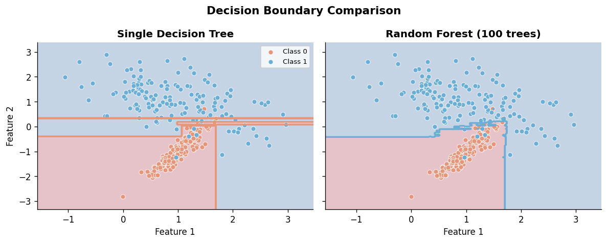
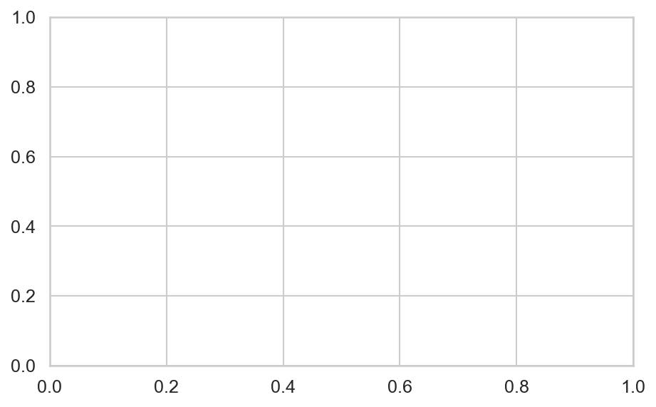
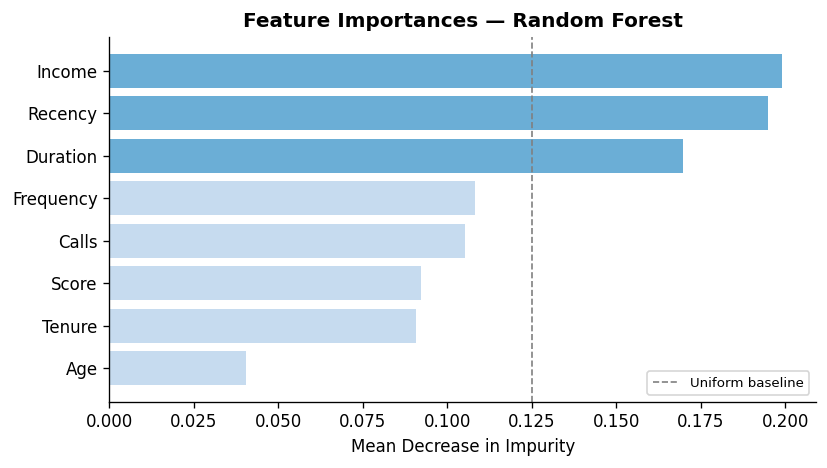
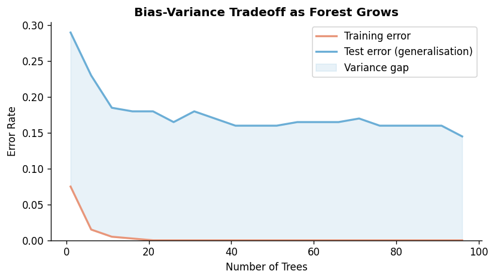
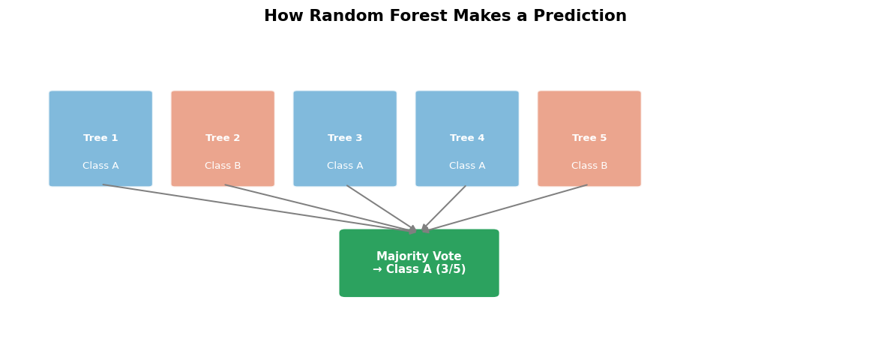

# Implementing Random Forest

**After this lesson:** you can explain the core ideas in “Implementing Random Forest” and reproduce the examples here in your own notebook or environment.

## Overview

`RandomForestClassifier` / `Regressor`: `n_estimators`, `max_features`, out-of-bag estimates, and feature importances.

## Helpful video

Crash Course AI: supervised learning framing (~15 min).

<iframe width="560" height="315" src="https://www.youtube.com/embed/4qVRBYAdLAo" title="Supervised Learning: Crash Course AI" frameborder="0" allow="accelerometer; autoplay; clipboard-write; encrypted-media; gyroscope; picture-in-picture" allowfullscreen></iframe>

## Basic Implementation

### Simple Classification Example

Let's start with a basic example that shows how to create and train a Random Forest classifier:

#### `RandomForestClassifier` on synthetic data

- **Purpose:** Train a **bagged forest** on `make_classification`, evaluate with **`classification_report`** (precision/recall/F1 per class).
- **Walkthrough:** `n_estimators` trees vote; `max_depth` caps each tree; same train/test split seed keeps examples reproducible.

<div class="code-explainer" data-code-explainer>
<div class="code-explainer__code">


import numpy as np
import pandas as pd
from sklearn.ensemble import RandomForestClassifier
from sklearn.model_selection import train_test_split
from sklearn.metrics import classification_report
from sklearn.datasets import make_classification

X, y = make_classification(
    n_samples=1000,
    n_features=20,
    n_informative=15,
    n_redundant=5,
    random_state=42
)

X_train, X_test, y_train, y_test = train_test_split(
    X, y,
    test_size=0.2,
    random_state=42
)

rf = RandomForestClassifier(
    n_estimators=100,
    max_depth=10,
    random_state=42
)
rf.fit(X_train, y_train)

y_pred = rf.predict(X_test)
print(classification_report(y_test, y_pred))

```
              precision    recall  f1-score   support

           0       0.91      0.90      0.90       106
           1       0.89      0.90      0.89        94

    accuracy                           0.90       200
   macro avg       0.90      0.90      0.90       200
weighted avg       0.90      0.90      0.90       200
```


</div>
<aside class="code-explainer__callouts" aria-label="Code walkthrough">
  <div class="code-callout" data-lines="1-14" data-tint="1">
    <div class="code-callout__meta">
      <span class="code-callout__lines"></span>
      <span class="code-callout__title">Data and Split</span>
    </div>
    <div class="code-callout__body">
      <p>1000 samples with 15 informative and 5 redundant features are generated; the 80/20 split with a fixed seed ensures reproducible train/test partitions across notebook reruns.</p>
    </div>
  </div>
  <div class="code-callout" data-lines="16-29" data-tint="2">
    <div class="code-callout__meta">
      <span class="code-callout__lines"></span>
      <span class="code-callout__title">Fit and Evaluate</span>
    </div>
    <div class="code-callout__body">
      <p>100 trees with depth limited to 10 are grown and their votes aggregated; the classification report shows per-class precision, recall, and F1 on the held-out test set.</p>
    </div>
  </div>
</aside>
</div>


*Figure 1: A single decision tree (left) makes simple, piecewise linear decisions, while a Random Forest (right) combines multiple trees to create more complex decision boundaries.*

## Real-World Example: Credit Risk Prediction

Let's create a more realistic example that shows how Random Forest can be used in a real-world scenario:

#### Credit risk: OOB score, probabilities, risk tiers

- **Purpose:** Use **`oob_score=True`** for a bagging generalization estimate without a separate validation set; bucket **`predict_proba`** into Low/Medium/High risk.
- **Walkthrough:** Synthetic credit rows in a **`DataFrame`**; `pd.cut` bins continuous risk scores for reporting.

<div class="code-explainer" data-code-explainer>
<div class="code-explainer__code">


import numpy as np
import pandas as pd
from sklearn.ensemble import RandomForestClassifier
from sklearn.model_selection import train_test_split

# Create a realistic credit dataset
data = pd.DataFrame({
    'income': np.random.normal(50000, 20000, 1000),  # Annual income
    'age': np.random.normal(40, 10, 1000),           # Age in years
    'employment_length': np.random.normal(8, 4, 1000),  # Years employed
    'debt_ratio': np.random.uniform(0.1, 0.6, 1000),   # Debt to income ratio
    'credit_score': np.random.normal(700, 50, 1000)    # Credit score
})

# Create target variable (high risk = 1, low risk = 0)
data['risk'] = (
    (data['debt_ratio'] > 0.4) & 
    (data['credit_score'] < 650)
).astype(int)

# Prepare features and target
X = data.drop('risk', axis=1)
y = data['risk']

# Split the data
X_train, X_test, y_train, y_test = train_test_split(
    X, y, 
    test_size=0.2, 
    random_state=42
)

# Create model with best practices
rf = RandomForestClassifier(
    n_estimators=100,      # Number of trees
    max_depth=None,        # Let trees grow fully
    min_samples_split=5,   # Minimum samples to split
    min_samples_leaf=2,    # Minimum samples in leaf
    max_features='sqrt',   # Number of features to consider
    bootstrap=True,        # Use bootstrap sampling
    oob_score=True,        # Calculate out-of-bag score
    random_state=42,       # For reproducibility
    n_jobs=-1             # Use all CPU cores
)

# Train the model
rf.fit(X_train, y_train)

# Print out-of-bag score
print(f"Out-of-bag score: {rf.oob_score_:.3f}")

# Make predictions with probability
y_prob = rf.predict_proba(X_test)
risk_scores = y_prob[:, 1]  # Probability of high risk

# Create risk categories
risk_categories = pd.cut(
    risk_scores,
    bins=[0, 0.3, 0.6, 1],
    labels=['Low', 'Medium', 'High']
)

# Print distribution
print("\nRisk Distribution:")
print(risk_categories.value_counts())

```
Out-of-bag score: 0.998

Risk Distribution:
Low       77
Medium     0
High      14
Name: count, dtype: int64
```


</div>
<aside class="code-explainer__callouts" aria-label="Code walkthrough">
  <div class="code-callout" data-lines="6-19" data-tint="1">
    <div class="code-callout__meta">
      <span class="code-callout__lines"></span>
      <span class="code-callout__title">Feature matrix + risk label</span>
    </div>
    <div class="code-callout__body">
      <p>Five financial columns become the feature matrix. The risk label is created with a compound boolean: high debt ratio AND low credit score → 1 (risky). <code>.astype(int)</code> converts the boolean to 0/1 integers for the classifier.</p>
    </div>
  </div>
  <div class="code-callout" data-lines="32-43" data-tint="2">
    <div class="code-callout__meta">
      <span class="code-callout__lines"></span>
      <span class="code-callout__title">Key hyperparameters</span>
    </div>
    <div class="code-callout__body">
      <p><code>max_features='sqrt'</code> means each tree sees only √(n_features) columns per split — the randomness that makes trees diverse. <code>oob_score=True</code> uses samples not in each bootstrap bag as a free validation set. <code>n_jobs=-1</code> uses all CPU cores.</p>
    </div>
  </div>
  <div class="code-callout" data-lines="45-49" data-tint="3">
    <div class="code-callout__meta">
      <span class="code-callout__lines"></span>
      <span class="code-callout__title">Out-of-bag score</span>
    </div>
    <div class="code-callout__body">
      <p>Because each tree is trained on a bootstrap sample (~63% of data), the remaining ~37% acts as a held-out test set for that tree. <code>oob_score_</code> aggregates these per-tree estimates — a free generalization measure without a separate validation split.</p>
    </div>
  </div>
  <div class="code-callout" data-lines="51-64" data-tint="4">
    <div class="code-callout__meta">
      <span class="code-callout__lines"></span>
      <span class="code-callout__title">Predict probabilities + risk tiers</span>
    </div>
    <div class="code-callout__body">
      <p><code>predict_proba</code> returns probabilities for each class; <code>[:, 1]</code> takes the "high risk" column. <code>pd.cut</code> bins the continuous risk score into business-friendly categories — more actionable than raw predictions.</p>
    </div>
  </div>
</aside>
</div>

## Feature Importance Analysis

Understanding which features are most important for making predictions:

#### Importance bars with tree-to-tree variance

- **Purpose:** Plot **mean Gini importance** with **error bars** from the distribution of per-tree importances—more informative than a single vector.
- **Walkthrough:** Uses trained **`rf`** and feature names from **`X.columns`** (run the credit example above first).

<div class="code-explainer" data-code-explainer>
<div class="code-explainer__code">


import numpy as np
import matplotlib.pyplot as plt
import seaborn as sns

def plot_feature_importance(model, feature_names):
    """Plot feature importance with error bars."""
    importances = model.feature_importances_

    # Standard deviation across individual tree importances
    std = np.std([
        tree.feature_importances_
        for tree in model.estimators_
    ], axis=0)

    indices = np.argsort(importances)[::-1]

    plt.figure(figsize=(10, 6))
    plt.title("Feature Importances")

    plt.bar(range(X.shape[1]),
            importances[indices],
            yerr=std[indices],
            align="center")

    plt.xticks(range(X.shape[1]),
               [feature_names[i] for i in indices],
               rotation=45)
    plt.tight_layout()
    plt.show()

plot_feature_importance(rf, X.columns)


<figure>

<figcaption>Figure 1: Feature Importances</figcaption>
</figure>


</div>
<aside class="code-explainer__callouts" aria-label="Code walkthrough">
  <div class="code-callout" data-lines="1-14" data-tint="1">
    <div class="code-callout__meta">
      <span class="code-callout__lines"></span>
      <span class="code-callout__title">Importance and Variance</span>
    </div>
    <div class="code-callout__body">
      <p><code>feature_importances_</code> is the mean impurity decrease over all trees; the standard deviation across individual tree importances quantifies how consistently each feature matters — high std means the importance is unstable.</p>
    </div>
  </div>
  <div class="code-callout" data-lines="16-30" data-tint="2">
    <div class="code-callout__meta">
      <span class="code-callout__lines"></span>
      <span class="code-callout__title">Sorted Bar Chart</span>
    </div>
    <div class="code-callout__body">
      <p>Features are ranked from most to least important; error bars show the per-tree variance, making it easy to distinguish reliably important features from those that vary across trees.</p>
    </div>
  </div>
</aside>
</div>


*Figure 2: Feature importance shows which features contribute most to the model's predictions.*

## Hyperparameter Tuning

Finding the best combination of parameters for your model:

#### `RandomizedSearchCV` with ROC-AUC

- **Purpose:** Search random hyperparameter draws under **5-fold CV**, optimizing **ROC-AUC**—good default for binary skew-sensitive tasks.
- **Walkthrough:** `param_dist` mixes `randint` and lists; `n_iter` controls budget; `fit` on **`X_train`, `y_train`** from the credit example.

<div class="code-explainer" data-code-explainer>
<div class="code-explainer__code">


from sklearn.model_selection import RandomizedSearchCV
from sklearn.ensemble import RandomForestClassifier
from scipy.stats import randint

param_dist = {
    'n_estimators': randint(100, 500),
    'max_depth': [None] + list(range(10, 50, 10)),
    'min_samples_split': randint(2, 20),
    'min_samples_leaf': randint(1, 10),
    'max_features': ['sqrt', 'log2', None],
    'bootstrap': [True, False]
}

random_search = RandomizedSearchCV(
    RandomForestClassifier(random_state=42),
    param_distributions=param_dist,
    n_iter=100,
    cv=5,
    scoring='roc_auc',
    n_jobs=-1,
    random_state=42
)

random_search.fit(X_train, y_train)

print("Best parameters:", random_search.best_params_)
print("Best score:", random_search.best_score_)

```
Best parameters: {'bootstrap': True, 'max_depth': 30, 'max_features': 'sqrt', 'min_samples_leaf': 8, 'min_samples_split': 8, 'n_estimators': 221}
Best score: 1.0
```


</div>
<aside class="code-explainer__callouts" aria-label="Code walkthrough">
  <div class="code-callout" data-lines="1-12" data-tint="1">
    <div class="code-callout__meta">
      <span class="code-callout__lines"></span>
      <span class="code-callout__title">Parameter Space</span>
    </div>
    <div class="code-callout__body">
      <p>Six hyperparameters are searched: tree count (100–500 from uniform integer distribution), depth, split thresholds, leaf size, feature subset method, and bootstrap flag — mixing continuous distributions with discrete lists.</p>
    </div>
  </div>
  <div class="code-callout" data-lines="14-26" data-tint="2">
    <div class="code-callout__meta">
      <span class="code-callout__lines"></span>
      <span class="code-callout__title">Randomised CV Search</span>
    </div>
    <div class="code-callout__body">
      <p>100 random configurations are evaluated via 5-fold CV optimising ROC-AUC; <code>n_jobs=-1</code> parallelises across all cores, making 100-iter random search practical even with a large parameter space.</p>
    </div>
  </div>
</aside>
</div>


*Figure 3: The bias-variance tradeoff in Random Forests - how model complexity affects predictions.*

## Advanced Techniques

### 1. Custom Scorer

Creating a custom scoring metric that favors precision over recall:

#### `make_scorer` + $F_\beta$ ($\beta<1$ favors precision)

- **Purpose:** Wrap **`fbeta_score`** so **`cross_val_score`** optimizes a precision-weighted objective instead of plain accuracy.
- **Walkthrough:** Uses fitted **`rf`** and full **`X`, `y`** from the credit workflow; lower $\beta$ pushes precision.

<div class="code-explainer" data-code-explainer>
<div class="code-explainer__code">


from sklearn.metrics import make_scorer, fbeta_score
from sklearn.model_selection import cross_val_score

# beta < 1 weights precision more than recall
beta = 0.5
f_half_scorer = make_scorer(fbeta_score, beta=beta)

scores = cross_val_score(
    rf, X, y,
    scoring=f_half_scorer,
    cv=5
)
print(f"F-{beta} scores:", scores)

```
F-0.5 scores: [0.98214286 1.         1.         1.         0.94339623]
```


</div>
<aside class="code-explainer__callouts" aria-label="Code walkthrough">
  <div class="code-callout" data-lines="1-6" data-tint="1">
    <div class="code-callout__meta">
      <span class="code-callout__lines"></span>
      <span class="code-callout__title">Custom Scorer</span>
    </div>
    <div class="code-callout__body">
      <p><code>make_scorer</code> wraps <code>fbeta_score</code> so it works inside CV functions; beta=0.5 means precision counts twice as much as recall — useful when false positives are costlier than false negatives.</p>
    </div>
  </div>
  <div class="code-callout" data-lines="8-13" data-tint="2">
    <div class="code-callout__meta">
      <span class="code-callout__lines"></span>
      <span class="code-callout__title">Cross-validate</span>
    </div>
    <div class="code-callout__body">
      <p>5-fold CV returns one score per fold; inspecting the spread reveals whether the model's precision-weighted performance is stable across different data partitions.</p>
    </div>
  </div>
</aside>
</div>

### 2. Feature Selection

Selecting only the most important features:

#### `SelectFromModel` thresholded on importances

- **Purpose:** Drop weak features by keeping columns whose importance exceeds the **median** (or a fixed threshold)—reduces variance and inference cost.
- **Walkthrough:** `prefit=True` uses the already-fitted **`rf`**; `get_support()` maps the boolean mask back to **`X.columns`**.

<div class="code-explainer" data-code-explainer>
<div class="code-explainer__code">


from sklearn.feature_selection import SelectFromModel

# Keep features with importance above the median
selector = SelectFromModel(
    rf, prefit=True,
    threshold='median'
)

X_selected = selector.transform(X)
print(f"Selected {X_selected.shape[1]} features")

selected_features = X.columns[selector.get_support()].tolist()
print("Selected features:", selected_features)

```
Selected 3 features
Selected features: ['employment_length', 'debt_ratio', 'credit_score']
```


</div>
<aside class="code-explainer__callouts" aria-label="Code walkthrough">
  <div class="code-callout" data-lines="1-7" data-tint="1">
    <div class="code-callout__meta">
      <span class="code-callout__lines"></span>
      <span class="code-callout__title">Threshold Selection</span>
    </div>
    <div class="code-callout__body">
      <p><code>prefit=True</code> skips refitting the forest; <code>threshold='median'</code> retains only the top half of features by importance — a quick way to halve feature dimensionality.</p>
    </div>
  </div>
  <div class="code-callout" data-lines="9-13" data-tint="2">
    <div class="code-callout__meta">
      <span class="code-callout__lines"></span>
      <span class="code-callout__title">Transform and Report</span>
    </div>
    <div class="code-callout__body">
      <p><code>selector.transform</code> returns a dense array with only the selected columns; <code>get_support()</code> provides the boolean mask used to recover feature names from <code>X.columns</code>.</p>
    </div>
  </div>
</aside>
</div>

### 3. Handling Imbalanced Data

Using a balanced version of Random Forest for imbalanced datasets:

#### `BalancedRandomForestClassifier` (imbalanced-learn)

- **Purpose:** Undersample each bootstrap to **balance classes** before fitting trees—helps when the positive class is rare.
- **Walkthrough:** Requires **`pip install imbalanced-learn`**; same **`X_train`/`y_train`** as your main example; compare reports to vanilla `rf`.

<div class="code-explainer" data-code-explainer>
<div class="code-explainer__code">


from imblearn.ensemble import BalancedRandomForestClassifier
from sklearn.metrics import classification_report

# Each bootstrap undersamples the majority class to match minority
brf = BalancedRandomForestClassifier(
    n_estimators=100,
    random_state=42
)

brf.fit(X_train, y_train)
y_pred_balanced = brf.predict(X_test)

print("\nBalanced Random Forest Results:")
print(classification_report(y_test, y_pred_balanced))


</div>
<aside class="code-explainer__callouts" aria-label="Code walkthrough">
  <div class="code-callout" data-lines="1-8" data-tint="1">
    <div class="code-callout__meta">
      <span class="code-callout__lines"></span>
      <span class="code-callout__title">Balanced Bootstrapping</span>
    </div>
    <div class="code-callout__body">
      <p><code>BalancedRandomForestClassifier</code> from imbalanced-learn undersamples the majority class in each bootstrap so every tree trains on a balanced subset — reducing the bias toward predicting the majority class.</p>
    </div>
  </div>
  <div class="code-callout" data-lines="10-15" data-tint="2">
    <div class="code-callout__meta">
      <span class="code-callout__lines"></span>
      <span class="code-callout__title">Fit and Compare</span>
    </div>
    <div class="code-callout__body">
      <p>The same train/test split is reused so the classification report can be compared directly with the standard random forest report — typically showing improved minority-class recall at the cost of some precision.</p>
    </div>
  </div>
</aside>
</div>


*Figure 4: How individual tree predictions combine to form the final ensemble prediction.*

## Best Practices

### 1. Model Evaluation

Comprehensive evaluation of model performance:

#### Reports + ROC curve helper

- **Purpose:** Print **train vs test** `classification_report` and plot a **ROC** curve to spot overfitting and threshold behavior.
- **Walkthrough:** Assumes **binary** `predict_proba`; imports **`matplotlib.pyplot`** as `plt` before calling.

<div class="code-explainer" data-code-explainer>
<div class="code-explainer__code">


import matplotlib.pyplot as plt
from sklearn.metrics import classification_report, RocCurveDisplay

def evaluate_model(model, X_train, X_test, y_train, y_test):
    """Comprehensive model evaluation."""
    train_pred = model.predict(X_train)
    test_pred = model.predict(X_test)

    print("Training Results:")
    print(classification_report(y_train, train_pred))
    print("\nTesting Results:")
    print(classification_report(y_test, test_pred))

    RocCurveDisplay.from_estimator(model, X_test, y_test)
    plt.show()


</div>
<aside class="code-explainer__callouts" aria-label="Code walkthrough">
  <div class="code-callout" data-lines="1-3" data-tint="1">
    <div class="code-callout__meta">
      <span class="code-callout__lines"></span>
      <span class="code-callout__title">Imports</span>
    </div>
    <div class="code-callout__body">
      <p><code>RocCurveDisplay.from_estimator</code> is a convenience method that handles predict_proba, threshold sweep, and plotting in one call.</p>
    </div>
  </div>
  <div class="code-callout" data-lines="5-15" data-tint="2">
    <div class="code-callout__meta">
      <span class="code-callout__lines"></span>
      <span class="code-callout__title">Train vs Test Reports</span>
    </div>
    <div class="code-callout__body">
      <p>Printing both train and test classification reports in one function makes it easy to spot overfitting: a large gap between train and test precision/recall signals that the model has memorised training examples.</p>
    </div>
  </div>
</aside>
</div>

### 2. Feature Engineering

Creating new features to improve model performance:

#### `FunctionTransformer` + `Pipeline`

- **Purpose:** Engineer ratios and nonlinear terms **inside** a pipeline so the same transforms apply at predict time.
- **Walkthrough:** `FunctionTransformer` applies **`create_interaction_features`**; the forest step sees augmented columns.

<div class="code-explainer" data-code-explainer>
<div class="code-explainer__code">


import numpy as np
from sklearn.preprocessing import FunctionTransformer
from sklearn.pipeline import Pipeline
from sklearn.ensemble import RandomForestClassifier

def create_interaction_features(X):
    """Create interaction and polynomial features."""
    X = X.copy()

    # Ratio features
    X['income_per_age'] = X['income'] / X['age']
    X['debt_per_income'] = X['debt_ratio'] * X['income']

    # Polynomial feature
    X['credit_score_squared'] = X['credit_score'] ** 2

    return X

pipeline = Pipeline([
    ('feature_engineering', FunctionTransformer(create_interaction_features)),
    ('random_forest', RandomForestClassifier())
])


</div>
<aside class="code-explainer__callouts" aria-label="Code walkthrough">
  <div class="code-callout" data-lines="1-16" data-tint="1">
    <div class="code-callout__meta">
      <span class="code-callout__lines"></span>
      <span class="code-callout__title">Feature Engineering</span>
    </div>
    <div class="code-callout__body">
      <p>Three derived features are added: two domain-specific ratios (income per age, debt × income) and a squared credit score to capture non-linear effects; copying first avoids mutating the caller's DataFrame.</p>
    </div>
  </div>
  <div class="code-callout" data-lines="18-21" data-tint="2">
    <div class="code-callout__meta">
      <span class="code-callout__lines"></span>
      <span class="code-callout__title">Pipeline Integration</span>
    </div>
    <div class="code-callout__body">
      <p><code>FunctionTransformer</code> wraps the custom function so it participates in sklearn pipelines — the same transformation is automatically applied during both <code>fit</code> and <code>predict</code>.</p>
    </div>
  </div>
</aside>
</div>

### 3. Model Persistence

Saving and loading trained models:

#### `joblib` for sklearn estimators

- **Purpose:** Persist a fitted **`RandomForestClassifier`** (or any sklearn object graph) to disk for deployment or reproducibility.
- **Walkthrough:** Pickle-compatible; match **sklearn** versions between save and load environments.

```python
import joblib

# Save model
joblib.dump(rf, 'random_forest_model.joblib')

# Load model
loaded_rf = joblib.load('random_forest_model.joblib')
```

## Common Pitfalls and Solutions

1. **Memory Issues**

   - **Purpose:** Cut **RAM** for large `X` and smaller ensembles while prototyping.
   - **Walkthrough:** `float32` halves numeric storage vs `float64`; fewer **`n_estimators`** reduces both memory and the size of `estimators_` in memory.

   ```python
   import numpy as np
   from sklearn.ensemble import RandomForestClassifier

   # Use smaller data types
   X = X.astype(np.float32)

   # Reduce number of trees
   rf = RandomForestClassifier(n_estimators=50)
   ```

2. **Long Training Time**

   - **Purpose:** Iterate faster with **shallower** / **fewer-tree** forests before a full run.
   - **Walkthrough:** **`n_jobs=-1`** uses all cores for **`fit`** (and prediction where supported); set on the estimator you actually train.

   ```python
   from sklearn.ensemble import RandomForestClassifier

   # Use fewer trees for initial experiments
   rf_quick = RandomForestClassifier(
       n_estimators=10,
       max_depth=5,
       n_jobs=-1,
   )

   # Or set parallel fits on an existing forest
   rf = RandomForestClassifier(n_estimators=100, n_jobs=-1)
   ```


<figure>

<figcaption>Figure 1: Generated visualization</figcaption>
</figure>

3. **Overfitting**

   - **Purpose:** Constrain **leaf purity** and **depth** so trees do not memorize noise.
   - **Walkthrough:** Larger **`min_samples_leaf`** and lower **`max_depth`** smooth decision boundaries—pair with CV to choose values.

   ```python
   from sklearn.ensemble import RandomForestClassifier

   # Increase min_samples_leaf
   rf = RandomForestClassifier(
       min_samples_leaf=5,
       max_depth=10,
       random_state=42,
   )
   ```

## Gotchas

- **`oob_score=True` requires `bootstrap=True`** — setting `bootstrap=False` and `oob_score=True` together raises a `ValueError`; OOB scoring is only meaningful when bootstrap sampling is active because the out-of-bag samples are the ones not selected by bootstrap.
- **`SelectFromModel` with `prefit=True` freezes the importance threshold at fit time** — if you retrain the forest on new data and call `transform` again without recreating the selector, it still uses the old importance threshold and selected columns, silently producing wrong results.
- **`predict_proba` columns are ordered by `classes_`, not by label value** — on an imbalanced dataset where class 0 happens to be the minority, `predict_proba[:, 1]` is still the probability of class 1 (the one with higher index in `classes_`); always check `rf.classes_` before indexing into the probability matrix.
- **`RandomizedSearchCV` does not set `random_state` on the estimator** — the `random_state=42` in `RandomizedSearchCV` controls which parameter combinations are drawn, not the forest's internal randomness; the `RandomForestClassifier` inside also needs its own `random_state` for reproducible trees.
- **`BalancedRandomForestClassifier` from imbalanced-learn may not be installed** — unlike sklearn estimators, `imblearn` is a separate package; calling it without `pip install imbalanced-learn` raises an `ImportError` with no clear hint about the fix.
- **`joblib.load` on a model saved with a different sklearn version may silently give wrong predictions** — sklearn pickles embed the version; loading across minor versions (e.g., 1.2 → 1.4) usually works but can break if internal estimator structure changed; always record the sklearn version alongside saved models.

## Next Steps

Ready to explore advanced techniques? Continue to [Advanced Topics](4-advanced.md)!
