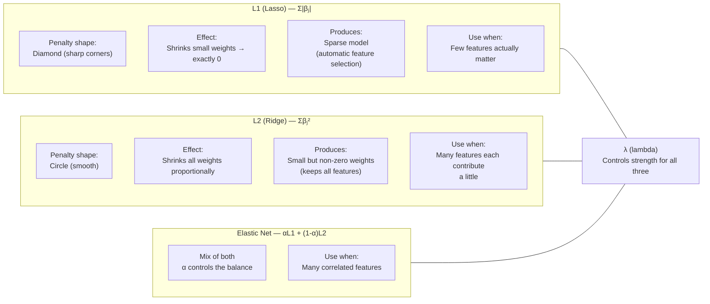

# Mathematical Foundation of Regularization

**After this lesson:** you can explain the core ideas in “Mathematical Foundation of Regularization” and reproduce the examples here in your own notebook or environment.

## Overview

Ridge, Lasso, and Elastic Net penalties on linear models; geometric picture of shrinkage and sparsity.

[Introduction](1-introduction.md); ties to [5.1 bias–variance](../../5.1-intro-to-ml/bias-variance.md).

## Helpful video

Crash Course AI: supervised learning framing (~15 min).

<iframe width="560" height="315" src="https://www.youtube.com/embed/4qVRBYAdLAo" title="Supervised Learning: Crash Course AI" frameborder="0" allow="accelerometer; autoplay; clipboard-write; encrypted-media; gyroscope; picture-in-picture" allowfullscreen></iframe>

## Loss Function with Regularization

### General Form

The regularized loss function is like a report card that considers both how well you're doing (original loss) and how well you're following the rules (regularization):

$$L_{reg}(\beta) = L(\beta) + \lambda R(\beta)$$

where:

- $L(\beta)$ is the original loss function (like your test scores)
- $R(\beta)$ is the regularization term (like following classroom rules)
- $\lambda$ is the regularization strength (like how strict the teacher is)

### Why This Matters

Just as a good student balances studying and following rules, a good model balances accuracy and simplicity. Regularization helps find this balance.

## Types of Regularization Terms

*The key geometric intuition: L1's diamond corners sit on the axes, so the optimal solution often lands exactly at zero for some weights — that's sparse. L2's smooth circle never quite reaches the axes.*

### 1. L1 Regularization (Lasso)

$$R(\beta) = \sum_{j=1}^p |\beta_j|$$

Think of L1 as a strict teacher who wants you to focus on the most important subjects and drop the less relevant ones.

Properties:

- Non-differentiable at zero (like a sharp corner in a path)
- Promotes sparsity (like having a minimalist wardrobe)
- Solution path is nonlinear (like a winding road)

### 2. L2 Regularization (Ridge)

$$R(\beta) = \sum_{j=1}^p \beta_j^2$$

L2 is like a gentle coach who wants all players to contribute, but prevents any single player from dominating the game.

Properties:

- Differentiable everywhere (like a smooth road)
- Shrinks coefficients proportionally (like turning down the volume on all speakers)
- Has closed-form solution (like having a direct formula to solve a problem)

### 3. Elastic Net

$$R(\beta) = \alpha\sum_{j=1}^p |\beta_j| + (1-\alpha)\sum_{j=1}^p \beta_j^2$$

Elastic Net is like having both a strict teacher and a gentle coach - it combines the best of both approaches.

Properties:

- Combines L1 and L2 properties (like having both structure and flexibility)
- $\alpha$ controls the mix (like adjusting the balance between strict and gentle)
- More stable than pure L1 (like having multiple safety nets)

## Optimization Theory

### Gradient Descent with L2

For ridge regression:

$$\beta^{(t+1)} = \beta^{(t)} - \eta(\nabla L(\beta^{(t)}) + 2\lambda\beta^{(t)})$$

Think of this as taking small steps down a hill while being pulled back by a gentle force (regularization).

where:

- $\eta$ is the learning rate (like how big your steps are)
- $t$ is the iteration number (like counting your steps)

### Proximal Gradient for L1

For lasso regression:

$$\beta^{(t+1)} = \text{prox}_{\lambda\eta}(\beta^{(t)} - \eta\nabla L(\beta^{(t)}))$$

This is like taking steps down a hill while occasionally hitting sharp corners (the non-differentiable points).

where $\text{prox}$ is the soft-thresholding operator:

$$\text{prox}_{\lambda}(x) = \text{sign}(x)\max(|x|-\lambda, 0)$$

## Geometric Interpretation

### L1 Constraint Region

- Shape: Diamond (in 2D) - like a diamond-shaped fence
- Promotes sparsity due to corners - like having clear boundaries
- Intersects axes at $\pm\frac{1}{\lambda}$ - like having specific stopping points

### L2 Constraint Region

- Shape: Circle (in 2D) - like a circular boundary
- Smooth boundary - like a gentle curve
- Radius determined by $\frac{1}{\sqrt{\lambda}}$ - like how far you can go

### Elastic Net Region

- Shape: Rounded diamond - like a diamond with softened corners
- Combines properties of L1 and L2 - like having both structure and flexibility
- Controlled by mixing parameter $\alpha$ - like adjusting the balance

## Statistical Properties

### Bias-Variance Tradeoff

For regularized estimator $\hat{\beta}$:

$$\text{MSE}(\hat{\beta}) = \text{Bias}(\hat{\beta})^2 + \text{Var}(\hat{\beta})$$

Think of this as balancing between:

- Being too rigid (high bias)
- Being too flexible (high variance)

- Regularization increases bias (like having more rules)
- But reduces variance (like having more stability)
- Optimal $\lambda$ balances this tradeoff (like finding the right amount of rules)

### Degrees of Freedom

For ridge regression:

$$\text{df}(\lambda) = \text{tr}(X(X^TX + \lambda I)^{-1}X^T)$$

This measures how many "free parameters" your model has, like counting how many decisions you can make.

For lasso, degrees of freedom  number of non-zero coefficients (like counting how many features you're actually using)

## Theoretical Guarantees

### Oracle Properties

Under certain conditions, Lasso achieves:

1. Consistent variable selection (like reliably picking the right features)
2. Asymptotic normality (like having predictable behavior)
3. Oracle property (performs as if true model known) (like having perfect knowledge)

### Convergence Rates

For well-behaved problems:

- Ridge: $O(1/t)$ convergence rate (like taking regular steps)
- Lasso: $O(1/\sqrt{t})$ convergence rate (like taking smaller steps)
- Elastic Net: Between $O(1/t)$ and $O(1/\sqrt{t})$ (like having a mix of step sizes)

## Cross-Validation Theory

### K-Fold CV Error

For regularization parameter $\lambda$:

$$\text{CV}(\lambda) = \frac{1}{K}\sum_{k=1}^K \text{MSE}_k(\lambda)$$

This is like testing your model on different scenarios to see how well it performs.

where $\text{MSE}_k$ is the error on fold $k$ (like your score on each test)

### One Standard Error Rule

Choose largest $\lambda$ such that:

$$\text{CV}(\lambda) \leq \min_{\lambda'}\text{CV}(\lambda') + \text{SE}(\min_{\lambda'}\text{CV}(\lambda'))$$

This is like choosing the simplest model that still performs well within a reasonable margin of error.

## Regularization Path

### Solution Path Equations

For ridge:
$$\hat{\beta}(\lambda) = (X^TX + \lambda I)^{-1}X^Ty$$

For lasso:
$$\hat{\beta}(\lambda) = \text{sign}(\hat{\beta}_{OLS})\max(|\hat{\beta}_{OLS}| - \lambda, 0)$$

These equations show how the model changes as you adjust the regularization strength, like seeing how a student's behavior changes as rules are adjusted.

where $\hat{\beta}_{OLS}$ is the ordinary least squares solution (like the model without any rules)

## Common Mistakes to Avoid

1. Using too strong regularization (like having too many rules)
2. Not tuning the regularization parameter (like not adjusting the rules)
3. Applying the same regularization to all features (like treating all students the same)
4. Ignoring feature scaling (like comparing apples and oranges)
5. Not validating the regularization effect (like not checking if the rules are working)

## Next Steps

Now that you understand the mathematics behind regularization, let's move on to [Implementation](3-implementation.md) to see how to put these concepts into practice!

## Additional Resources

- [Understanding Regularization Mathematically](https://towardsdatascience.com/regularization-in-machine-learning-76441ddcf99a)
- [Geometric Interpretation of Regularization](https://www.analyticsvidhya.com/blog/2016/01/complete-tutorial-ridge-lasso-regression-python/)
- [Statistical Properties of Regularization](https://www.statlearning.com/)
