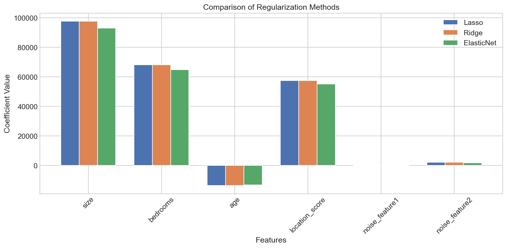

# Implementing Regularization

**After this lesson:** you can explain the core ideas in “Implementing Regularization” and reproduce the examples here in your own notebook or environment.

## Overview

Using **`Ridge`**, **`Lasso`**, **`ElasticNet`** (and related) in sklearn: pipelines, `alpha`, and metrics.

## Helpful video

Crash Course AI: supervised learning framing (~15 min).

<iframe width="560" height="315" src="https://www.youtube.com/embed/4qVRBYAdLAo" title="Supervised Learning: Crash Course AI" frameborder="0" allow="accelerometer; autoplay; clipboard-write; encrypted-media; gyroscope; picture-in-picture" allowfullscreen></iframe>

## Basic Implementation

### Simple Example with Ridge Regression

Let's start with a basic example that shows how to implement Ridge Regression, one of the most common regularization techniques.

#### Ridge on scaled features (regression)

- **Purpose:** Fit **L2-penalized** linear regression after **`StandardScaler`** so penalties apply fairly across feature scales.
- **Walkthrough:** `alpha` controls penalty strength; predictions use **`X_test_scaled`** with the **fitted** scaler.

<div class="code-explainer" data-code-explainer>
<div class="code-explainer__code">


from sklearn.linear_model import Ridge
from sklearn.preprocessing import StandardScaler
from sklearn.model_selection import train_test_split
import numpy as np

np.random.seed(42)
X = np.random.randn(100, 20)  # 100 samples, 20 features
y = np.random.randn(100)

X_train, X_test, y_train, y_test = train_test_split(
    X, y, test_size=0.2, random_state=42
)

scaler = StandardScaler()
X_train_scaled = scaler.fit_transform(X_train)
X_test_scaled = scaler.transform(X_test)

ridge = Ridge(alpha=0.1)
ridge.fit(X_train_scaled, y_train)

y_pred = ridge.predict(X_test_scaled)


</div>
<aside class="code-explainer__callouts" aria-label="Code walkthrough">
  <div class="code-callout" data-lines="1-8" data-tint="1">
    <div class="code-callout__meta">
      <span class="code-callout__lines"></span>
      <span class="code-callout__title">Data and Split</span>
    </div>
    <div class="code-callout__body">
      <p>100 random samples with 20 features and a random target are generated with a fixed seed for reproducibility; the 80/20 split produces 80 training and 20 test samples.</p>
    </div>
  </div>
  <div class="code-callout" data-lines="10-21" data-tint="2">
    <div class="code-callout__meta">
      <span class="code-callout__lines"></span>
      <span class="code-callout__title">Scale and Fit Ridge</span>
    </div>
    <div class="code-callout__body">
      <p>StandardScaler normalises features to zero mean and unit variance (fitted on training data only); Ridge with alpha=0.1 applies L2 regularisation, shrinking coefficients toward zero without eliminating any.</p>
    </div>
  </div>
</aside>
</div>

## Real-World Example: House Price Prediction

Let's look at a more practical example that you might encounter in the real world - predicting house prices.

#### Compare Lasso, Ridge, ElasticNet coefficients

- **Purpose:** On the **same scaled** train/test split, compare **$R^2$**, **RMSE**, and **coefficient vectors**—L1 may zero noisy columns.
- **Walkthrough:** Bar chart overlays coefficients per feature; requires **`Ridge`**, **`Lasso`**, **`ElasticNet`** and **`numpy`** for vector math.

<div class="code-explainer" data-code-explainer>
<div class="code-explainer__code">


import numpy as np
import pandas as pd
from sklearn.model_selection import train_test_split
from sklearn.metrics import mean_squared_error, r2_score
from sklearn.preprocessing import StandardScaler
from sklearn.linear_model import Ridge, Lasso, ElasticNet
import matplotlib.pyplot as plt

# Create sample dataset
# This simulates a real-world housing dataset
np.random.seed(42)
n_samples = 1000

# Create features that might affect house prices
data = pd.DataFrame({
    'size': np.random.normal(2000, 500, n_samples),  # House size in square feet
    'bedrooms': np.random.randint(1, 6, n_samples),  # Number of bedrooms
    'age': np.random.randint(0, 50, n_samples),      # Age of the house
    'location_score': np.random.uniform(0, 10, n_samples),  # Location quality
    'noise_feature1': np.random.normal(0, 1, n_samples),    # Random noise
    'noise_feature2': np.random.normal(0, 1, n_samples)     # Random noise
})

# Create target with noise
# This simulates how house prices are determined
data['price'] = (
    200 * data['size'] 
    + 50000 * data['bedrooms']
    - 1000 * data['age']
    + 20000 * data['location_score']
    + np.random.normal(0, 50000, n_samples)  # Add some randomness
)

# Prepare data
X = data.drop('price', axis=1)  # Features
y = data['price']               # Target

# Scale features
# This is crucial for regularization to work properly
scaler = StandardScaler()
X_scaled = scaler.fit_transform(X)

# Split data
# This helps us evaluate how well our model generalizes
X_train, X_test, y_train, y_test = train_test_split(
    X_scaled, y, test_size=0.2, random_state=42
)

# Compare different regularization methods
# Let's see how different types of regularization perform
models = {
    'Lasso': Lasso(alpha=0.1),           # L1 regularization
    'Ridge': Ridge(alpha=0.1),           # L2 regularization
    'ElasticNet': ElasticNet(alpha=0.1, l1_ratio=0.5)  # Combined L1 and L2
}

results = {}
for name, model in models.items():
    # Train model
    model.fit(X_train, y_train)
    
    # Make predictions
    y_pred = model.predict(X_test)
    
    # Store results
    results[name] = {
        'R2': r2_score(y_test, y_pred),  # How well the model fits
        'RMSE': np.sqrt(mean_squared_error(y_test, y_pred)),  # Average error
        'Coefficients': model.coef_  # How important each feature is
    }

# Plot coefficients comparison
# This helps us visualize how different regularization methods affect feature importance
plt.figure(figsize=(12, 6))
x = np.arange(len(X.columns))
width = 0.25

for i, (name, result) in enumerate(results.items()):
    plt.bar(x + i*width, result['Coefficients'], 
            width, label=name)

plt.xlabel('Features')
plt.ylabel('Coefficient Value')
plt.title('Comparison of Regularization Methods')
plt.xticks(x + width, X.columns, rotation=45)
plt.legend()
plt.tight_layout()
plt.show()

# Print performance metrics
# This helps us compare how well each method performs
for name, result in results.items():
    print(f"\n{name}:")
    print(f"R Score: {result['R2']:.3f}")  # Higher is better
    print(f"RMSE: ${result['RMSE']:,.2f}")  # Lower is better


</div>
<aside class="code-explainer__callouts" aria-label="Code walkthrough">
  <div class="code-callout" data-lines="14-22" data-tint="1">
    <div class="code-callout__meta">
      <span class="code-callout__lines"></span>
      <span class="code-callout__title">Noise features in the dataset</span>
    </div>
    <div class="code-callout__body">
      <p>4 meaningful features (size, bedrooms, age, location) plus 2 random noise columns. Regularization should shrink or zero the noise coefficients — this makes the comparison between methods observable in the coefficient chart.</p>
    </div>
  </div>
  <div class="code-callout" data-lines="38-47" data-tint="2">
    <div class="code-callout__meta">
      <span class="code-callout__lines"></span>
      <span class="code-callout__title">Scale before regularizing</span>
    </div>
    <div class="code-callout__body">
      <p>Regularization penalizes coefficient magnitude — without scaling, features with large units (e.g. house size in sq ft) receive a lower penalty than small-unit features, distorting results. Always scale before applying L1 or L2 penalties.</p>
    </div>
  </div>
  <div class="code-callout" data-lines="49-55" data-tint="3">
    <div class="code-callout__meta">
      <span class="code-callout__lines"></span>
      <span class="code-callout__title">Three regularization methods</span>
    </div>
    <div class="code-callout__body">
      <p><strong>Lasso</strong> (L1) drives noisy coefficients to exactly zero — acts as feature selection. <strong>Ridge</strong> (L2) shrinks all coefficients but rarely zeros them. <strong>ElasticNet</strong> blends both via <code>l1_ratio</code>. Same <code>alpha=0.1</code> lets you compare them fairly.</p>
    </div>
  </div>
  <div class="code-callout" data-lines="57-70" data-tint="4">
    <div class="code-callout__meta">
      <span class="code-callout__lines"></span>
      <span class="code-callout__title">Train and collect metrics</span>
    </div>
    <div class="code-callout__body">
      <p>The loop trains each model and stores R², RMSE, and <code>coef_</code> vectors in one dict — a reusable pattern for comparing multiple estimators on the same split without repeating code.</p>
    </div>
  </div>
  <div class="code-callout" data-lines="72-88" data-tint="1">
    <div class="code-callout__meta">
      <span class="code-callout__lines"></span>
      <span class="code-callout__title">Coefficient comparison chart</span>
    </div>
    <div class="code-callout__body">
      <p>Grouped bar chart shows each method's coefficient per feature side-by-side. Lasso bars for noise features should be near zero; Ridge bars will be small but nonzero — the visual makes the L1 vs L2 difference concrete.</p>
    </div>
  </div>
</aside>
</div>




```

Lasso:
R Score: 0.849
RMSE: $57,759.84

Ridge:
R Score: 0.849
RMSE: $57,761.15

ElasticNet:
R Score: 0.845
RMSE: $58,572.77
```

## Hyperparameter Tuning

Finding the right regularization strength (alpha) is like finding the right amount of seasoning for a dish - too little and it's bland, too much and it's overwhelming.

#### `GridSearchCV` for `Ridge` `alpha`

- **Purpose:** Pick **`alpha`** by **5-fold CV** on **negative MSE** (maximize implied RMSE reduction).
- **Walkthrough:** Uses **`X_train`**, **`y_train`** from the house-pricing cell (already scaled features).

<div class="code-explainer" data-code-explainer>
<div class="code-explainer__code">


from sklearn.model_selection import GridSearchCV
from sklearn.linear_model import Ridge

# Setup parameter grid
# We'll try different values of alpha to find the best one
param_grid = {
    'alpha': [0.001, 0.01, 0.1, 1, 10, 100]
}

# Perform grid search
# This is like trying different amounts of seasoning to find the perfect taste
grid_search = GridSearchCV(
    Ridge(), param_grid, cv=5, scoring='neg_mean_squared_error'
)
grid_search.fit(X_train, y_train)

print("Best alpha:", grid_search.best_params_['alpha'])


</div>
<aside class="code-explainer__callouts" aria-label="Code walkthrough">
  <div class="code-callout" data-lines="1-7" data-tint="1">
    <div class="code-callout__meta">
      <span class="code-callout__lines"></span>
      <span class="code-callout__title">Import and Grid</span>
    </div>
    <div class="code-callout__body">
      <p>Import <code>GridSearchCV</code> and define candidate alpha values to sweep over.</p>
    </div>
  </div>
  <div class="code-callout" data-lines="10-17" data-tint="2">
    <div class="code-callout__meta">
      <span class="code-callout__lines"></span>
      <span class="code-callout__title">Search and Report</span>
    </div>
    <div class="code-callout__body">
      <p>Run 5-fold CV over the grid using negative MSE and print the winning alpha.</p>
    </div>
  </div>
</aside>
</div>

```
Best alpha: 1
```

## Feature Selection with Lasso

Lasso regularization is particularly good at feature selection - it's like having a strict teacher who helps you focus on the most important subjects.

#### Nonzero Lasso coefficients as feature selection

- **Purpose:** List features whose **Lasso** coefficients remain nonzero at a given **`alpha`**—a simple embedded selector.
- **Walkthrough:** Expects **`X`** as a **`DataFrame`** with column names; uses training labels **`y_train`**.

<div class="code-explainer" data-code-explainer>
<div class="code-explainer__code">


from sklearn.linear_model import Lasso

def select_features_lasso(X, y, alpha=0.1):
    """Select features using Lasso regularization"""
    # Train Lasso model
    lasso = Lasso(alpha=alpha)
    lasso.fit(X, y)

    # Get selected features
    selected_features = X.columns[lasso.coef_ != 0]

    # Print results
    print("Selected features:", len(selected_features))
    for feature, coef in zip(X.columns, lasso.coef_):
        if coef != 0:
            print(f"{feature}: {coef:.4f}")

    return selected_features

# Use function
selected = select_features_lasso(
    pd.DataFrame(X_train, columns=X.columns),
    y_train
)


</div>
<aside class="code-explainer__callouts" aria-label="Code walkthrough">
  <div class="code-callout" data-lines="1-9" data-tint="1">
    <div class="code-callout__meta">
      <span class="code-callout__lines"></span>
      <span class="code-callout__title">Fit Lasso</span>
    </div>
    <div class="code-callout__body">
      <p>Train a Lasso model at the given alpha to shrink unimportant coefficients to exactly zero.</p>
    </div>
  </div>
  <div class="code-callout" data-lines="11-24" data-tint="2">
    <div class="code-callout__meta">
      <span class="code-callout__lines"></span>
      <span class="code-callout__title">Report and Return</span>
    </div>
    <div class="code-callout__body">
      <p>Filter nonzero coefficients, print selected feature names with their magnitudes, and invoke the function on training data.</p>
    </div>
  </div>
</aside>
</div>

```
Selected features: 6
size: 97603.1853
bedrooms: 68149.6454
age: -13579.6658
location_score: 57494.9345
noise_feature1: -215.6718
noise_feature2: 2136.7192
```

## Cross-Validation Implementation

Cross-validation is like taking multiple tests to ensure you really understand the material, not just memorizing the answers.

#### CV RMSE vs `alpha` for three linear models

- **Purpose:** Sweep **`alpha`** and compare **5-fold neg-MSE** → RMSE for **Ridge**, **Lasso**, and **ElasticNet** on the same `(X, y)`.
- **Walkthrough:** Uses **`X_scaled`** and **`y`** from the house example; returns a **`DataFrame`** for quick plotting.

<div class="code-explainer" data-code-explainer>
<div class="code-explainer__code">


import numpy as np
import pandas as pd
from sklearn.model_selection import cross_val_score
from sklearn.linear_model import Ridge, Lasso, ElasticNet

def compare_alphas(X, y, alphas=[0.001, 0.01, 0.1, 1, 10]):
    """Compare different regularization strengths"""
    results = []

    for alpha in alphas:
        # Create and evaluate models
        ridge_scores = cross_val_score(
            Ridge(alpha=alpha), X, y,
            cv=5, scoring='neg_mean_squared_error'
        )
        lasso_scores = cross_val_score(
            Lasso(alpha=alpha), X, y,
            cv=5, scoring='neg_mean_squared_error'
        )
        elastic_scores = cross_val_score(
            ElasticNet(alpha=alpha, l1_ratio=0.5), X, y,
            cv=5, scoring='neg_mean_squared_error'
        )

        # Store results
        results.append({
            'alpha': alpha,
            'ridge_rmse': np.sqrt(-ridge_scores.mean()),
            'lasso_rmse': np.sqrt(-lasso_scores.mean()),
            'elastic_rmse': np.sqrt(-elastic_scores.mean())
        })

    return pd.DataFrame(results)

# Compare alphas
results_df = compare_alphas(X_scaled, y)
print(results_df)


</div>
<aside class="code-explainer__callouts" aria-label="Code walkthrough">
  <div class="code-callout" data-lines="1-5" data-tint="1">
    <div class="code-callout__meta">
      <span class="code-callout__lines"></span>
      <span class="code-callout__title">Imports</span>
    </div>
    <div class="code-callout__body">
      <p>Import cross-validation utilities and all three regularized linear models to compare.</p>
    </div>
  </div>
  <div class="code-callout" data-lines="7-31" data-tint="2">
    <div class="code-callout__meta">
      <span class="code-callout__lines"></span>
      <span class="code-callout__title">CV per Alpha</span>
    </div>
    <div class="code-callout__body">
      <p>For each alpha value, run 5-fold cross-validation on Ridge, Lasso, and ElasticNet and collect RMSE results.</p>
    </div>
  </div>
  <div class="code-callout" data-lines="33-37" data-tint="3">
    <div class="code-callout__meta">
      <span class="code-callout__lines"></span>
      <span class="code-callout__title">Build and Print</span>
    </div>
    <div class="code-callout__body">
      <p>Return results as a DataFrame and print the side-by-side RMSE comparison for all alpha values.</p>
    </div>
  </div>
</aside>
</div>

```
    alpha    ridge_rmse    lasso_rmse   elastic_rmse
0   0.001  52068.418223  52068.418348   52068.402573
1   0.010  52068.416936  52068.418164   52072.058727
2   0.100  52068.406433  52068.416387   52448.489489
3   1.000  52068.538348  52068.398518   68525.490301
4  10.000  52092.969096  52068.225701  124140.292139
```

## Model Evaluation Functions

Evaluating your model is like checking your work after solving a problem - it helps you understand how well you're doing.

#### Train vs test $R^2$, RMSE, sparsity

- **Purpose:** Summarize **fit vs generalization** and count **nonzero weights** for interpretability.
- **Walkthrough:** Works for **linear** models with **`coef_`**; uses **`r2_score`** and **`mean_squared_error`**.

<div class="code-explainer" data-code-explainer>
<div class="code-explainer__code">


import numpy as np
from sklearn.metrics import r2_score, mean_squared_error

def evaluate_regularized_model(model, X_train, X_test, y_train, y_test):
    """Comprehensive evaluation of regularized model"""
    # Train model
    model.fit(X_train, y_train)

    # Make predictions
    y_train_pred = model.predict(X_train)
    y_test_pred = model.predict(X_test)

    # Calculate metrics
    results = {
        'train_r2': r2_score(y_train, y_train_pred),  # How well it fits training data
        'test_r2': r2_score(y_test, y_test_pred),     # How well it generalizes
        'train_rmse': np.sqrt(mean_squared_error(y_train, y_train_pred)),  # Training error
        'test_rmse': np.sqrt(mean_squared_error(y_test, y_test_pred)),     # Testing error
        'n_nonzero_coef': np.sum(model.coef_ != 0)    # How many features it uses
    }

    # Print results
    print("Training R²:", results['train_r2'])
    print("Testing R²:", results['test_r2'])
    print("Training RMSE:", results['train_rmse'])
    print("Testing RMSE:", results['test_rmse'])
    print("Non-zero coefficients:", results['n_nonzero_coef'])

    return results


</div>
<aside class="code-explainer__callouts" aria-label="Code walkthrough">
  <div class="code-callout" data-lines="1-11" data-tint="1">
    <div class="code-callout__meta">
      <span class="code-callout__lines"></span>
      <span class="code-callout__title">Fit and Predict</span>
    </div>
    <div class="code-callout__body">
      <p>Train the model and generate predictions for both train and test sets to compare in-sample vs out-of-sample performance.</p>
    </div>
  </div>
  <div class="code-callout" data-lines="13-29" data-tint="2">
    <div class="code-callout__meta">
      <span class="code-callout__lines"></span>
      <span class="code-callout__title">Metrics and Sparsity</span>
    </div>
    <div class="code-callout__body">
      <p>Compute R² and RMSE for train/test, count nonzero coefficients for sparsity, print all metrics, and return the results dict.</p>
    </div>
  </div>
</aside>
</div>

## Best Practices

### 1. Feature Scaling

Always scale your features before applying regularization. This is like converting different currencies to a common standard before comparing them.

#### Fit `StandardScaler` on feature matrix

- **Purpose:** Reminder snippet: **fit** scaler on training data only; here `X` stands in for the full design matrix before splitting.
- **Walkthrough:** In production, call **`fit_transform`** on train and **`transform`** on test.

```python
from sklearn.preprocessing import StandardScaler

# Always scale features before regularization
scaler = StandardScaler()
X_scaled = scaler.fit_transform(X)
```

### 2. Cross-Validation

Use cross-validation to find the best regularization strength. This is like taking multiple tests to ensure you really understand the material.

### 3. Feature Selection

Consider using Lasso for feature selection when you have many features. This is like having a strict teacher who helps you focus on the most important subjects.

### 4. Model Comparison

Compare different regularization methods to find the best one for your specific problem. This is like trying different approaches to solve a problem.

### 5. Regularization Path

Plot the regularization path to understand how different features are affected by regularization. This is like seeing how different ingredients affect the taste of a dish.

## Common Mistakes to Avoid

1. Not scaling features before regularization
2. Using the same regularization strength for all features
3. Not validating the regularization effect
4. Ignoring feature selection when appropriate
5. Not comparing different regularization methods

## Next Steps

Now that you understand how to implement regularization, let's move on to [Advanced Topics](4-advanced.md) to explore more sophisticated techniques!

## Gotchas

- **`scaler.fit_transform(X)` on the whole dataset before splitting leaks test statistics** — the house pricing example calls `scaler.fit_transform(X)` then splits, so test-set mean and variance are baked into the scaler; always fit the scaler on `X_train` only and apply `transform` to `X_test`.
- **`Lasso` with very small `alpha` can fail to converge within the default `max_iter=1000`** — sklearn prints a `ConvergenceWarning` silently in some environments; if coefficients look unexpectedly large, increase `max_iter` or scale features more aggressively before fitting.
- **`GridSearchCV` with `scoring='neg_mean_squared_error'` returns negative scores** — `best_score_` will be a negative number (e.g., `-2.7e9`); learners who check this directly may think the model is broken when it is working correctly; take `abs()` or negate to get the actual MSE.
- **`select_features_lasso` comparing `lasso.coef_ != 0` is sensitive to floating-point noise** — at some alpha values, Lasso leaves near-zero coefficients like `1e-15` that are not exactly zero; use a small threshold (`abs(coef) > 1e-6`) rather than strict `!= 0` to avoid retaining numerically negligible features.
- **`compare_alphas` applies the same `alpha` to Ridge, Lasso, and ElasticNet, but the scales are not equivalent** — `alpha=10` on Lasso is far more aggressive than `alpha=10` on Ridge because L1 and L2 penalties have different magnitudes; a fair comparison requires tuning each method's alpha range independently.
- **`n_nonzero_coef` counting on Ridge will always equal the number of features** — Ridge never produces exact zero coefficients; reporting sparsity for a Ridge model as a meaningful metric misleads learners into thinking Ridge performs feature selection.

## Additional Resources

- [Scikit-learn Regularization Documentation](https://scikit-learn.org/stable/modules/linear_model.html)
- [Regularization in Machine Learning](https://towardsdatascience.com/regularization-in-machine-learning-76441ddcf99a)
- [Understanding L1 and L2 Regularization](https://www.analyticsvidhya.com/blog/2016/01/complete-tutorial-ridge-lasso-regression-python/)
