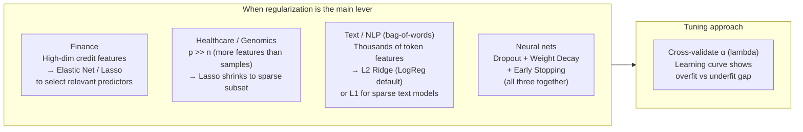

# Real-World Applications of Regularization

**After this lesson:** you can explain the core ideas in “Real-World Applications of Regularization” and reproduce the examples here in your own notebook or environment.

## Overview

High-dimensional and noisy settings where regularization is the main lever.

## Helpful video

Crash Course AI: supervised learning framing (~15 min).

<iframe width="560" height="315" src="https://www.youtube.com/embed/4qVRBYAdLAo" title="Supervised Learning: Crash Course AI" frameborder="0" allow="accelerometer; autoplay; clipboard-write; encrypted-media; gyroscope; picture-in-picture" allowfullscreen></iframe>



## 1. Financial Applications

### Credit Risk Assessment

Imagine you're a bank trying to decide whether to give someone a loan. You need to consider many factors, but some are more important than others. Regularization helps focus on the most important factors.

<div class="code-explainer" data-code-explainer>
<div class="code-explainer__code">


import pandas as pd
import numpy as np
from sklearn.linear_model import LogisticRegression
from sklearn.preprocessing import StandardScaler
from sklearn.model_selection import train_test_split
from sklearn.metrics import classification_report

np.random.seed(42)
n_samples = 1000

data = pd.DataFrame({
    'income': np.random.normal(50000, 20000, n_samples),
    'age': np.random.normal(40, 10, n_samples),
    'employment_length': np.random.normal(8, 4, n_samples),
    'debt_ratio': np.random.uniform(0.1, 0.6, n_samples),
    'credit_score': np.random.normal(700, 50, n_samples),
    'previous_defaults': np.random.randint(0, 3, n_samples)
})

data['default'] = (
    (data['debt_ratio'] > 0.4) &
    (data['credit_score'] < 650) |
    (data['previous_defaults'] > 1)
).astype(int)

X = data.drop('default', axis=1)
y = data['default']

X_train, X_test, y_train, y_test = train_test_split(
    X, y, test_size=0.2, random_state=42
)

scaler = StandardScaler()
X_train_scaled = scaler.fit_transform(X_train)
X_test_scaled = scaler.transform(X_test)

model = LogisticRegression(
    penalty='elasticnet',
    solver='saga',
    l1_ratio=0.5,
    C=0.1
)
model.fit(X_train_scaled, y_train)

y_pred = model.predict(X_test_scaled)
print(classification_report(y_test, y_pred))


</div>
<aside class="code-explainer__callouts" aria-label="Code walkthrough">
  <div class="code-callout" data-lines="1-24" data-tint="1">
    <div class="code-callout__meta">
      <span class="code-callout__lines"></span>
      <span class="code-callout__title">Imports and Sample Data</span>
    </div>
    <div class="code-callout__body">
      <p>Six applicant features are generated from realistic distributions; the default label combines a high-debt/low-score rule with a prior-defaults rule to simulate real imbalanced credit data.</p>
    </div>
  </div>
  <div class="code-callout" data-lines="26-44" data-tint="2">
    <div class="code-callout__meta">
      <span class="code-callout__lines"></span>
      <span class="code-callout__title">Prepare and Train</span>
    </div>
    <div class="code-callout__body">
      <p>Features are split 80/20, standard-scaled, then fitted with an ElasticNet logistic regression (l1_ratio=0.5 balances sparsity and shrinkage; C=0.1 applies strong regularisation) using the SAGA solver required for elasticnet penalty.</p>
    </div>
  </div>
  <div class="code-callout" data-lines="46-47" data-tint="3">
    <div class="code-callout__meta">
      <span class="code-callout__lines"></span>
      <span class="code-callout__title">Evaluate</span>
    </div>
    <div class="code-callout__body">
      <p>Predictions on the held-out test set are evaluated with a full classification report showing per-class precision, recall, and F1-score.</p>
    </div>
  </div>
</aside>
</div>

```
              precision    recall  f1-score   support

           0       0.93      1.00      0.96       126
           1       1.00      0.86      0.93        74

    accuracy                           0.95       200
   macro avg       0.96      0.93      0.94       200
weighted avg       0.95      0.95      0.95       200
```

## 2. Healthcare Applications

### Disease Prediction

In healthcare, we need to predict disease risk based on various factors. Regularization helps identify the most important risk factors.

<div class="code-explainer" data-code-explainer>
<div class="code-explainer__code">


def predict_disease_risk(patient_data):
    """Predict disease risk using regularized model"""
    features = pd.DataFrame({
        'age': [patient_data['age']],
        'bmi': [patient_data['bmi']],
        'blood_pressure': [patient_data['bp']],
        'cholesterol': [patient_data['chol']],
        'glucose': [patient_data['glucose']],
        'smoking': [patient_data['smoking']],
        'family_history': [patient_data['family_history']]
    })

    features_scaled = scaler.transform(features)
    risk_prob = model.predict_proba(features_scaled)[0, 1]

    importance = pd.DataFrame({
        'feature': features.columns,
        'importance': abs(model.coef_[0])
    }).sort_values('importance', ascending=False)

    return {
        'risk_probability': risk_prob,
        'risk_factors': importance.head(3)
    }


</div>
<aside class="code-explainer__callouts" aria-label="Code walkthrough">
  <div class="code-callout" data-lines="1-11" data-tint="1">
    <div class="code-callout__meta">
      <span class="code-callout__lines"></span>
      <span class="code-callout__title">Feature Assembly</span>
    </div>
    <div class="code-callout__body">
      <p>Seven clinical measurements are extracted from the patient dict into a single-row DataFrame, preserving column names so the pre-fitted scaler can transform them correctly.</p>
    </div>
  </div>
  <div class="code-callout" data-lines="13-23" data-tint="2">
    <div class="code-callout__meta">
      <span class="code-callout__lines"></span>
      <span class="code-callout__title">Score and Rank</span>
    </div>
    <div class="code-callout__body">
      <p>The scaled features are passed to the model for a probability score; absolute coefficient magnitudes rank which risk factors drove the prediction most, and only the top three are returned.</p>
    </div>
  </div>
</aside>
</div>

## 3. Marketing Applications

### Customer Churn Prediction

In marketing, we want to predict which customers might leave. Regularization helps identify the key factors that influence customer decisions.

<div class="code-explainer" data-code-explainer>
<div class="code-explainer__code">


def analyze_churn_factors():
    """Analyze factors contributing to customer churn"""
    features = [
        'usage_decline',
        'support_calls',
        'payment_delay',
        'competitor_offers',
        'service_issues',
        'contract_length',
        'total_spend'
    ]

    # ElasticNet combines L1 sparsity and L2 shrinkage
    model = ElasticNet(alpha=0.1, l1_ratio=0.5)
    model.fit(X_train, y_train)

    coef_df = pd.DataFrame({
        'feature': features,
        'coefficient': model.coef_
    }).sort_values('coefficient', ascending=False)

    return coef_df


</div>
<aside class="code-explainer__callouts" aria-label="Code walkthrough">
  <div class="code-callout" data-lines="1-11" data-tint="1">
    <div class="code-callout__meta">
      <span class="code-callout__lines"></span>
      <span class="code-callout__title">Feature List</span>
    </div>
    <div class="code-callout__body">
      <p>Seven behavioural signals are listed; these map directly to model coefficients so the order matters when constructing the results DataFrame.</p>
    </div>
  </div>
  <div class="code-callout" data-lines="13-21" data-tint="2">
    <div class="code-callout__meta">
      <span class="code-callout__lines"></span>
      <span class="code-callout__title">Train and Rank</span>
    </div>
    <div class="code-callout__body">
      <p>ElasticNet (l1_ratio=0.5) is fitted and its coefficients are paired with feature names; sorting by coefficient value surfaces the features that most increase or decrease churn probability.</p>
    </div>
  </div>
</aside>
</div>

## 4. Real Estate Applications

### House Price Prediction

In real estate, we need to predict house prices based on various features. Regularization helps focus on the most important factors.

<div class="code-explainer" data-code-explainer>
<div class="code-explainer__code">


def predict_house_price(features):
    """Predict house price with regularized model"""
    pipeline = Pipeline([
        ('scaler', StandardScaler()),
        ('model', Ridge(alpha=0.1))
    ])

    pipeline.fit(X_train, y_train)
    price = pipeline.predict([features])[0]

    importance = abs(pipeline.named_steps['model'].coef_)

    return {
        'predicted_price': price,
        'key_factors': pd.DataFrame({
            'feature': X_train.columns,
            'importance': importance
        }).sort_values('importance', ascending=False)
    }


</div>
<aside class="code-explainer__callouts" aria-label="Code walkthrough">
  <div class="code-callout" data-lines="1-5" data-tint="1">
    <div class="code-callout__meta">
      <span class="code-callout__lines"></span>
      <span class="code-callout__title">Pipeline Setup</span>
    </div>
    <div class="code-callout__body">
      <p>A two-step Pipeline chains StandardScaler with Ridge regression so the scaler's fit statistics are learned only on training data and applied consistently during both training and inference.</p>
    </div>
  </div>
  <div class="code-callout" data-lines="7-18" data-tint="2">
    <div class="code-callout__meta">
      <span class="code-callout__lines"></span>
      <span class="code-callout__title">Predict and Explain</span>
    </div>
    <div class="code-callout__body">
      <p>After fitting, the pipeline predicts a single price; absolute Ridge coefficients are extracted via <code>named_steps</code> and ranked to show which features most influenced the predicted price.</p>
    </div>
  </div>
</aside>
</div>

## 5. Environmental Applications

### Climate Change Analysis

In environmental science, we need to understand which factors most affect climate change. Regularization helps identify the most significant factors.

<div class="code-explainer" data-code-explainer>
<div class="code-explainer__code">


def analyze_climate_factors():
    """Analyze factors affecting climate change"""
    features = [
        'co2_levels',
        'methane_levels',
        'deforestation_rate',
        'industrial_emissions',
        'renewable_energy_usage',
        'ocean_temperature',
        'arctic_ice_coverage'
    ]

    # LassoCV selects alpha via cross-validation
    model = LassoCV(cv=5)
    model.fit(X_train, y_train)

    factors = pd.DataFrame({
        'factor': features,
        'impact': model.coef_
    }).sort_values('impact', ascending=False)

    return factors


</div>
<aside class="code-explainer__callouts" aria-label="Code walkthrough">
  <div class="code-callout" data-lines="1-11" data-tint="1">
    <div class="code-callout__meta">
      <span class="code-callout__lines"></span>
      <span class="code-callout__title">Climate Feature List</span>
    </div>
    <div class="code-callout__body">
      <p>Seven environmental predictors span emissions sources (CO2, methane, industrial), land use (deforestation), renewable energy, and two climate indicators (ocean temperature, Arctic ice).</p>
    </div>
  </div>
  <div class="code-callout" data-lines="13-21" data-tint="2">
    <div class="code-callout__meta">
      <span class="code-callout__lines"></span>
      <span class="code-callout__title">LassoCV and Rank</span>
    </div>
    <div class="code-callout__body">
      <p>LassoCV automatically searches for the best regularisation strength via 5-fold cross-validation; zero coefficients indicate factors the model deemed irrelevant, while the sorted output highlights the most impactful drivers.</p>
    </div>
  </div>
</aside>
</div>

## 6. Sports Analytics

### Player Performance Prediction

In sports, we want to predict player performance. Regularization helps identify the most important factors affecting performance.

<div class="code-explainer" data-code-explainer>
<div class="code-explainer__code">


def predict_player_performance():
    """Predict player performance with regularization"""
    features = [
        'previous_performance',
        'training_intensity',
        'rest_days',
        'injury_history',
        'age',
        'experience',
        'team_chemistry'
    ]

    # ElasticNetCV searches l1_ratio and alpha simultaneously
    model = ElasticNetCV(
        l1_ratio=[0.1, 0.5, 0.7, 0.9, 0.95, 0.99, 1],
        cv=5
    )
    model.fit(X_train, y_train)

    return {
        'predictions': model.predict(X_test),
        'key_factors': pd.DataFrame({
            'factor': features,
            'importance': abs(model.coef_)
        }).sort_values('importance', ascending=False)
    }


</div>
<aside class="code-explainer__callouts" aria-label="Code walkthrough">
  <div class="code-callout" data-lines="1-10" data-tint="1">
    <div class="code-callout__meta">
      <span class="code-callout__lines"></span>
      <span class="code-callout__title">Performance Features</span>
    </div>
    <div class="code-callout__body">
      <p>Seven features cover historical performance, physical conditioning, and contextual factors; the list order maps one-to-one to model coefficients in the output DataFrame.</p>
    </div>
  </div>
  <div class="code-callout" data-lines="12-25" data-tint="2">
    <div class="code-callout__meta">
      <span class="code-callout__lines"></span>
      <span class="code-callout__title">ElasticNetCV Search</span>
    </div>
    <div class="code-callout__body">
      <p>ElasticNetCV jointly tunes l1_ratio across seven candidate values and alpha via cross-validation; absolute coefficients are ranked to reveal which factors most strongly predict performance.</p>
    </div>
  </div>
</aside>
</div>

## Best Practices for Applications

### 1. Feature Engineering

Creating good features is like preparing ingredients for cooking - the better the ingredients, the better the result.

<div class="code-explainer" data-code-explainer>
<div class="code-explainer__code">


def engineer_features(data):
    """Create domain-specific features"""
    # Interaction terms
    data['income_per_age'] = data['income'] / data['age']
    data['debt_to_income'] = data['debt'] / data['income']

    # Polynomial feature
    data['age_squared'] = data['age'] ** 2

    # Binary risk flag from categorical interaction
    data['high_risk'] = (
        (data['debt_ratio'] > 0.5) &
        (data['credit_score'] < 600)
    ).astype(int)

    return data


</div>
<aside class="code-explainer__callouts" aria-label="Code walkthrough">
  <div class="code-callout" data-lines="1-6" data-tint="1">
    <div class="code-callout__meta">
      <span class="code-callout__lines"></span>
      <span class="code-callout__title">Ratio Features</span>
    </div>
    <div class="code-callout__body">
      <p>Two ratio features compress correlated raw columns into single signals: income-per-age captures earning power relative to career stage, while debt-to-income is the classic creditworthiness metric.</p>
    </div>
  </div>
  <div class="code-callout" data-lines="8-15" data-tint="2">
    <div class="code-callout__meta">
      <span class="code-callout__lines"></span>
      <span class="code-callout__title">Polynomial and Flag</span>
    </div>
    <div class="code-callout__body">
      <p>Age-squared lets a linear model capture the non-linear age–risk relationship; the binary <code>high_risk</code> flag encodes a conjunction rule (high debt AND low score) as a single interpretable feature.</p>
    </div>
  </div>
</aside>
</div>

### 2. Model Selection

Choosing the right model is like choosing the right tool for a job - different situations need different approaches.

<div class="code-explainer" data-code-explainer>
<div class="code-explainer__code">


def select_best_regularization(X, y):
    """Select best regularization method"""
    models = {
        'ridge': Ridge(),
        'lasso': Lasso(),
        'elastic': ElasticNet()
    }

    best_score = float('-inf')
    best_model = None

    for name, model in models.items():
        scores = cross_val_score(
            model, X, y, cv=5, scoring='r2'
        )
        avg_score = scores.mean()

        if avg_score > best_score:
            best_score = avg_score
            best_model = name

    return best_model, best_score


</div>
<aside class="code-explainer__callouts" aria-label="Code walkthrough">
  <div class="code-callout" data-lines="1-7" data-tint="1">
    <div class="code-callout__meta">
      <span class="code-callout__lines"></span>
      <span class="code-callout__title">Model Candidates</span>
    </div>
    <div class="code-callout__body">
      <p>Three regularisers are kept in a dictionary: Ridge for correlated features, Lasso for automatic feature selection, and ElasticNet when both properties are desirable.</p>
    </div>
  </div>
  <div class="code-callout" data-lines="9-21" data-tint="2">
    <div class="code-callout__meta">
      <span class="code-callout__lines"></span>
      <span class="code-callout__title">CV Selection Loop</span>
    </div>
    <div class="code-callout__body">
      <p>Each model is evaluated with 5-fold cross-validation using R² as the scoring metric; the loop tracks the best average score and returns the winning method name alongside its score.</p>
    </div>
  </div>
</aside>
</div>

## Common Mistakes to Avoid

1. Not scaling features before regularization
2. Using the same regularization strength for all features
3. Not validating the regularization effect
4. Ignoring feature selection when appropriate
5. Not comparing different regularization methods

## Next Steps

Now that you understand how regularization is applied in real-world scenarios, you can start using these techniques in your own projects!

## Additional Resources

- [Regularization in Practice](https://towardsdatascience.com/regularization-in-machine-learning-76441ddcf99a)
- [Real-World Applications of Regularization](https://www.analyticsvidhya.com/blog/2016/01/complete-tutorial-ridge-lasso-regression-python/)
- [Best Practices for Regularization](https://www.statlearning.com/)
