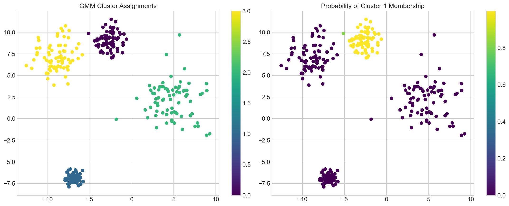
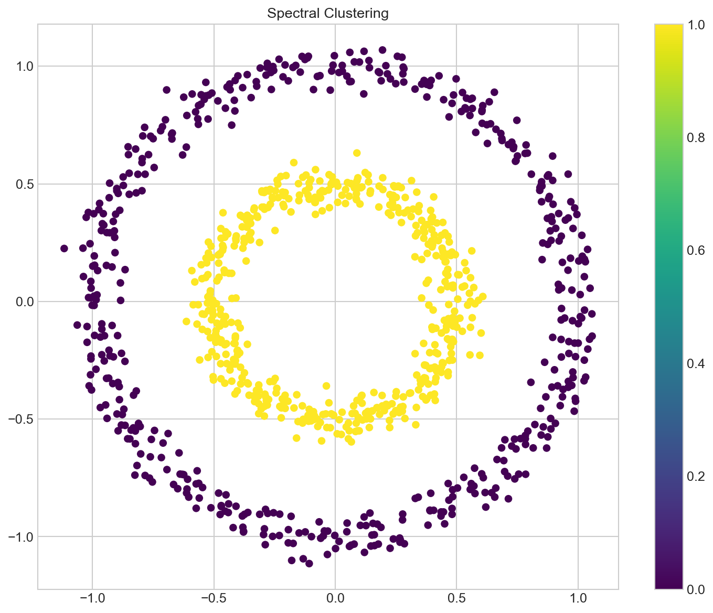

# Advanced Clustering Techniques

**After this lesson:** you can explain the core ideas in “Advanced Clustering Techniques” and reproduce the examples here in your own notebook or environment.

## Overview

Spectral / mixture-model angles and practical checks when basic k-means or DBSCAN are not enough.

## Helpful video

StatQuest overview of K-means clustering.

<iframe width="560" height="315" src="https://www.youtube.com/embed/4b5d3muPQmA" title="K-means Clustering, Clearly Explained" frameborder="0" allow="accelerometer; autoplay; clipboard-write; encrypted-media; gyroscope; picture-in-picture" allowfullscreen></iframe>

## HDBSCAN: Advanced Density-Based Clustering

HDBSCAN improves on DBSCAN by:

- Automatically adapting to varying densities
- Not requiring an epsilon parameter
- Providing cluster membership probabilities

<div class="code-explainer" data-code-explainer>
<div class="code-explainer__code">


import numpy as np
import matplotlib.pyplot as plt
from sklearn.datasets import make_moons, make_blobs
import hdbscan

# Create complex dataset
X1, _ = make_moons(n_samples=200, noise=0.05, random_state=42)
X2, _ = make_blobs(n_samples=100, centers=[[2, 0]], cluster_std=0.5, random_state=42)
X = np.vstack([X1, X2])

# Apply HDBSCAN
clusterer = hdbscan.HDBSCAN(min_cluster_size=5, min_samples=3)
cluster_labels = clusterer.fit_predict(X)

# Plot results
plt.figure(figsize=(10, 8))
scatter = plt.scatter(X[:, 0], X[:, 1], c=cluster_labels, cmap='viridis')
plt.title('HDBSCAN Clustering')
plt.colorbar(scatter)
plt.show()

# Plot cluster probabilities
plt.figure(figsize=(10, 8))
scatter = plt.scatter(X[:, 0], X[:, 1],
                     c=clusterer.probabilities_, cmap='viridis')
plt.title('HDBSCAN Cluster Membership Probabilities')
plt.colorbar(scatter)
plt.show()


</div>
<aside class="code-explainer__callouts" aria-label="Code walkthrough">
  <div class="code-callout" data-lines="1-13" data-tint="1">
    <div class="code-callout__meta">
      <span class="code-callout__lines"></span>
      <span class="code-callout__title">Mixed Dataset and HDBSCAN Fit</span>
    </div>
    <div class="code-callout__body">
      <p>Stack a moon-shaped and a blob-shaped distribution to create a dataset with varying density; HDBSCAN finds clusters without requiring an epsilon radius by adapting to local density.</p>
    </div>
  </div>
  <div class="code-callout" data-lines="15-29" data-tint="2">
    <div class="code-callout__meta">
      <span class="code-callout__lines"></span>
      <span class="code-callout__title">Labels and Probabilities</span>
    </div>
    <div class="code-callout__body">
      <p>First plot shows hard cluster labels; second uses <code>clusterer.probabilities_</code> — HDBSCAN's unique membership confidence score that shows how "core" each point is to its cluster.</p>
    </div>
  </div>
</aside>
</div>

## Gaussian Mixture Models (GMM)

GMM is like having multiple overlapping probability distributions:

1. Each cluster is a Gaussian distribution
2. Points can belong partially to multiple clusters
3. Model learns distribution parameters

<div class="code-explainer" data-code-explainer>
<div class="code-explainer__code">


from sklearn.mixture import GaussianMixture

# Create sample data
X, _ = make_blobs(n_samples=300, centers=4, cluster_std=[1.0, 2.0, 0.5, 1.5],
                  random_state=42)

# Fit GMM
gmm = GaussianMixture(n_components=4, random_state=42)
gmm.fit(X)
labels = gmm.predict(X)
probs = gmm.predict_proba(X)

# Plot results
fig, (ax1, ax2) = plt.subplots(1, 2, figsize=(15, 6))

# Plot cluster assignments
scatter1 = ax1.scatter(X[:, 0], X[:, 1], c=labels, cmap='viridis')
ax1.set_title('GMM Cluster Assignments')
plt.colorbar(scatter1, ax=ax1)

# Plot membership probabilities for first cluster
scatter2 = ax2.scatter(X[:, 0], X[:, 1], c=probs[:, 0], cmap='viridis')
ax2.set_title('Probability of Cluster 1 Membership')
plt.colorbar(scatter2, ax=ax2)

plt.tight_layout()
plt.show()


<figure>

<figcaption>Figure 1: GMM Cluster Assignments</figcaption>
</figure>


</div>
<aside class="code-explainer__callouts" aria-label="Code walkthrough">
  <div class="code-callout" data-lines="1-11" data-tint="1">
    <div class="code-callout__meta">
      <span class="code-callout__lines"></span>
      <span class="code-callout__title">GMM Fit with Varied Spreads</span>
    </div>
    <div class="code-callout__body">
      <p>Create four blobs with different standard deviations; GMM handles unequal cluster sizes better than K-Means because each component has its own covariance; <code>predict_proba</code> gives soft membership scores.</p>
    </div>
  </div>
  <div class="code-callout" data-lines="13-28" data-tint="2">
    <div class="code-callout__meta">
      <span class="code-callout__lines"></span>
      <span class="code-callout__title">Hard Labels vs Soft Membership</span>
    </div>
    <div class="code-callout__body">
      <p>Left subplot shows argmax cluster assignments; right uses <code>probs[:, 0]</code> to color by probability of belonging to cluster 0 — gradient color reveals the boundary uncertainty that hard labels hide.</p>
    </div>
  </div>
</aside>
</div>


## Spectral Clustering

Spectral clustering is like finding communities in a social network:

1. Build similarity graph
2. Find graph Laplacian
3. Use eigenvectors for clustering

<div class="code-explainer" data-code-explainer>
<div class="code-explainer__code">


from sklearn.cluster import SpectralClustering

# Create interlocking circles
from sklearn.datasets import make_circles
X, _ = make_circles(n_samples=1000, factor=0.5, noise=0.05, random_state=42)

# Apply Spectral Clustering
spectral = SpectralClustering(n_clusters=2, affinity='nearest_neighbors',
                             random_state=42)
labels = spectral.fit_predict(X)

# Plot results
plt.figure(figsize=(10, 8))
scatter = plt.scatter(X[:, 0], X[:, 1], c=labels, cmap='viridis')
plt.title('Spectral Clustering')
plt.colorbar(scatter)
plt.show()


<figure>

<figcaption>Figure 2: Spectral Clustering</figcaption>
</figure>


</div>
<aside class="code-explainer__callouts" aria-label="Code walkthrough">
  <div class="code-callout" data-lines="1-9" data-tint="1">
    <div class="code-callout__meta">
      <span class="code-callout__lines"></span>
      <span class="code-callout__title">Concentric Circles Setup</span>
    </div>
    <div class="code-callout__body">
      <p><code>make_circles</code> creates two interlocking rings that K-Means cannot separate; <code>affinity='nearest_neighbors'</code> builds a graph that captures the ring topology instead of Euclidean distance.</p>
    </div>
  </div>
  <div class="code-callout" data-lines="11-17" data-tint="2">
    <div class="code-callout__meta">
      <span class="code-callout__lines"></span>
      <span class="code-callout__title">Spectral Fit and Plot</span>
    </div>
    <div class="code-callout__body">
      <p>Spectral clustering maps points to a low-dimensional eigenspace before clustering; the result correctly separates inner and outer rings that would confuse centroid-based methods.</p>
    </div>
  </div>
</aside>
</div>


## Real-World Applications

### 1. Topic Modeling with GMM

<div class="code-explainer" data-code-explainer>
<div class="code-explainer__code">


from sklearn.feature_extraction.text import TfidfVectorizer

# Sample documents
documents = [
    "machine learning algorithms classification",
    "neural networks deep learning",
    "clustering unsupervised learning",
    "deep neural networks training",
    "kmeans clustering algorithm"
]

# Create TF-IDF features
vectorizer = TfidfVectorizer(max_features=1000)
X = vectorizer.fit_transform(documents).toarray()

# Apply GMM
gmm = GaussianMixture(n_components=2, random_state=42)
doc_labels = gmm.fit_predict(X)
doc_probs = gmm.predict_proba(X)

# Print results
for doc, label, probs in zip(documents, doc_labels, doc_probs):
    print(f"Document: {doc}")
    print(f"Topic: {label}")
    print(f"Topic Probabilities: {probs}\n")

```
Document: machine learning algorithms classification
Topic: 0
Topic Probabilities: [1. 0.]

Document: neural networks deep learning
Topic: 0
Topic Probabilities: [1. 0.]

Document: clustering unsupervised learning
Topic: 1
Topic Probabilities: [0. 1.]

Document: deep neural networks training
Topic: 0
Topic Probabilities: [1. 0.]

Document: kmeans clustering algorithm
Topic: 1
Topic Probabilities: [0. 1.]
```


</div>
<aside class="code-explainer__callouts" aria-label="Code walkthrough">
  <div class="code-callout" data-lines="1-14" data-tint="1">
    <div class="code-callout__meta">
      <span class="code-callout__lines"></span>
      <span class="code-callout__title">TF-IDF Vectorization</span>
    </div>
    <div class="code-callout__body">
      <p>Convert five short documents to TF-IDF feature vectors; <code>.toarray()</code> converts the sparse matrix to dense — required for GMM which expects a dense input array.</p>
    </div>
  </div>
  <div class="code-callout" data-lines="16-24" data-tint="2">
    <div class="code-callout__meta">
      <span class="code-callout__lines"></span>
      <span class="code-callout__title">GMM Topic Assignments</span>
    </div>
    <div class="code-callout__body">
      <p>Fit GMM with 2 components to discover two topic groups; <code>predict_proba</code> shows the soft topic membership — documents about "deep learning" and "clustering" should land in different components.</p>
    </div>
  </div>
</aside>
</div>

```
Document: machine learning algorithms classification
Topic: 0
Topic Probabilities: [1. 0.]

Document: neural networks deep learning
Topic: 0
Topic Probabilities: [1. 0.]

Document: clustering unsupervised learning
Topic: 1
Topic Probabilities: [0. 1.]

Document: deep neural networks training
Topic: 0
Topic Probabilities: [1. 0.]

Document: kmeans clustering algorithm
Topic: 1
Topic Probabilities: [0. 1.]
```

### 2. Image Segmentation with HDBSCAN

<div class="code-explainer" data-code-explainer>
<div class="code-explainer__code">


from skimage import io
from skimage.color import rgb2lab

# Load and prepare image
image = io.imread('sample_image.jpg')
pixels = rgb2lab(image).reshape(-1, 3)

# Apply HDBSCAN
clusterer = hdbscan.HDBSCAN(min_cluster_size=50, min_samples=10)
labels = clusterer.fit_predict(pixels)

# Reshape and display results
segmented = labels.reshape(image.shape[:2])

fig, (ax1, ax2) = plt.subplots(1, 2, figsize=(12, 6))
ax1.imshow(image)
ax1.set_title('Original Image')
ax2.imshow(segmented, cmap='viridis')
ax2.set_title('HDBSCAN Segmentation')
plt.show()


</div>
<aside class="code-explainer__callouts" aria-label="Code walkthrough">
  <div class="code-callout" data-lines="1-8" data-tint="1">
    <div class="code-callout__meta">
      <span class="code-callout__lines"></span>
      <span class="code-callout__title">Pixel Feature Extraction</span>
    </div>
    <div class="code-callout__body">
      <p>Convert to CIELAB color space (<code>rgb2lab</code>) where Euclidean distance matches perceptual color difference; reshape flattens the image to a (height×width, 3) pixel array for clustering.</p>
    </div>
  </div>
  <div class="code-callout" data-lines="10-20" data-tint="2">
    <div class="code-callout__meta">
      <span class="code-callout__lines"></span>
      <span class="code-callout__title">Segment and Display</span>
    </div>
    <div class="code-callout__body">
      <p>HDBSCAN groups pixels by color similarity; reshaping labels back to (height, width) creates a segmentation map where each color region gets a cluster index.</p>
    </div>
  </div>
</aside>
</div>

## Advanced Techniques

### 1. Ensemble Clustering

<div class="code-explainer" data-code-explainer>
<div class="code-explainer__code">


def ensemble_clustering(X, n_members=5):
    # Create ensemble members
    clusterers = [
        hdbscan.HDBSCAN(min_cluster_size=5),
        GaussianMixture(n_components=3),
        SpectralClustering(n_clusters=3),
    ]

    # Get predictions from each member
    predictions = np.zeros((X.shape[0], len(clusterers)))
    for i, clusterer in enumerate(clusterers):
        predictions[:, i] = clusterer.fit_predict(X)

    # Combine predictions (simple majority voting)
    from scipy.stats import mode
    ensemble_pred = mode(predictions, axis=1)[0]

    return ensemble_pred


</div>
<aside class="code-explainer__callouts" aria-label="Code walkthrough">
  <div class="code-callout" data-lines="1-8" data-tint="1">
    <div class="code-callout__meta">
      <span class="code-callout__lines"></span>
      <span class="code-callout__title">Three Diverse Clusterers</span>
    </div>
    <div class="code-callout__body">
      <p>Combine HDBSCAN, GMM, and SpectralClustering — each with different inductive biases; diversity across methods reduces the chance that all three make the same mistakes.</p>
    </div>
  </div>
  <div class="code-callout" data-lines="10-18" data-tint="2">
    <div class="code-callout__meta">
      <span class="code-callout__lines"></span>
      <span class="code-callout__title">Majority Vote Ensemble</span>
    </div>
    <div class="code-callout__body">
      <p>Collect per-clusterer predictions in a matrix, then <code>mode(axis=1)</code> picks the most common label per point — note that cluster label alignment across methods is a known challenge for real ensemble implementations.</p>
    </div>
  </div>
</aside>
</div>

### 2. Semi-Supervised Clustering

```python
def semi_supervised_gmm(X, labeled_indices, true_labels):
    # Initialize GMM
    gmm = GaussianMixture(n_components=len(np.unique(true_labels)))
    
    # Partial fit with labeled data
    X_labeled = X[labeled_indices]
    gmm.fit(X_labeled, true_labels[labeled_indices])
    
    # Predict remaining points
    labels = gmm.predict(X)
    
    return labels
```

### 3. Online Clustering

```python
from sklearn.cluster import MiniBatchKMeans

def online_clustering(data_generator, n_clusters=3):
    # Initialize online clusterer
    clusterer = MiniBatchKMeans(n_clusters=n_clusters)
    
    # Process data in batches
    for batch in data_generator:
        clusterer.partial_fit(batch)
    
    return clusterer
```

## Best Practices

### 1. Model Selection

```python
def select_best_model(X, models, n_splits=5):
    from sklearn.metrics import silhouette_score
    scores = {}
    
    for name, model in models.items():
        labels = model.fit_predict(X)
        score = silhouette_score(X, labels)
        scores[name] = score
    
    return scores
```

### 2. Parameter Optimization

<div class="code-explainer" data-code-explainer>
<div class="code-explainer__code">


def optimize_hdbscan(X):
    best_score = -1
    best_params = {}

    for min_cluster_size in [5, 10, 15, 20]:
        for min_samples in [5, 10, 15]:
            clusterer = hdbscan.HDBSCAN(
                min_cluster_size=min_cluster_size,
                min_samples=min_samples
            )
            labels = clusterer.fit_predict(X)

            if len(np.unique(labels)) > 1:  # More than one cluster
                score = silhouette_score(X, labels)
                if score > best_score:
                    best_score = score
                    best_params = {
                        'min_cluster_size': min_cluster_size,
                        'min_samples': min_samples
                    }

    return best_params


</div>
<aside class="code-explainer__callouts" aria-label="Code walkthrough">
  <div class="code-callout" data-lines="1-3" data-tint="1">
    <div class="code-callout__meta">
      <span class="code-callout__lines"></span>
      <span class="code-callout__title">Init Best Trackers</span>
    </div>
    <div class="code-callout__body">
      <p>Set up variables to track the best silhouette score and corresponding parameter combination found so far.</p>
    </div>
  </div>
  <div class="code-callout" data-lines="5-21" data-tint="2">
    <div class="code-callout__meta">
      <span class="code-callout__lines"></span>
      <span class="code-callout__title">Grid Search Loop</span>
    </div>
    <div class="code-callout__body">
      <p>Try every combination of <code>min_cluster_size</code> and <code>min_samples</code>, scoring each valid clustering with silhouette to find the best params.</p>
    </div>
  </div>
</aside>
</div>

## Common Pitfalls and Solutions

1. **Model Selection Issues**
   - Try multiple algorithms
   - Use ensemble methods
   - Validate results

2. **Parameter Sensitivity**
   - Use parameter search
   - Cross-validate results
   - Consider stability

3. **Scalability**
   - Use mini-batch methods
   - Consider data sampling
   - Implement parallel processing

## Gotchas

- **Ensemble clustering with naive majority voting is broken by label misalignment** — different clustering algorithms assign arbitrary integers to clusters, so cluster "0" in HDBSCAN and cluster "0" in GMM may refer to completely different groups. A majority vote on raw labels is meaningless; use a proper consensus method like co-association matrices.
- **GMM's `n_components` is not the same as the true number of clusters** — GMM fits a mixture of Gaussians regardless of whether your data is actually Gaussian. Setting `n_components` too high causes it to split one real cluster into multiple Gaussian blobs, inflating the apparent cluster count.
- **HDBSCAN's `min_cluster_size` has a large impact on results** — setting it too small produces many tiny clusters and noise, too large merges distinct groups. Unlike DBSCAN's `eps`, there is no k-distance plot guide; validate with silhouette scores while excluding noise points (`labels != -1`).
- **Spectral clustering is not scalable** — it computes an n×n affinity matrix, making it O(n²) in memory and O(n³) in the eigendecomposition. On more than a few thousand points it becomes impractical; use `SpectralClustering(n_components=..., eigen_solver='amg')` or switch to HDBSCAN for large datasets.
- **`GaussianMixture.fit` can fail to converge** — EM for GMM can collapse when a Gaussian component shrinks to fit a single point (covariance → 0). Add `reg_covar=1e-6` to regularize covariance matrices and prevent `ConvergenceWarning` or `NaN` outputs.
- **`MiniBatchKMeans` for online clustering produces slightly different centroids each run** — mini-batch updates introduce randomness beyond the initial seed; results will vary across runs even with `random_state` set, which is expected behavior, not a bug.

## Next Steps

Now that you've mastered clustering techniques, try the [assignment](./assignment.md) to apply these concepts to real-world problems!
