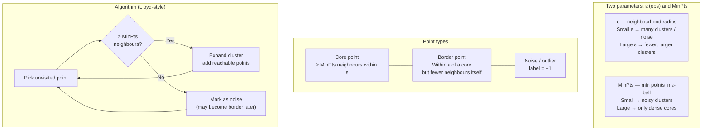

# DBSCAN (Density-Based Spatial Clustering)

**After this lesson:** you can explain the core ideas in “DBSCAN (Density-Based Spatial Clustering)” and reproduce the examples here in your own notebook or environment.

## Overview

**DBSCAN** for arbitrary shapes and noise points: `eps`, `min_samples`, and when density clustering wins over k-means.

## Helpful video

StatQuest overview of K-means clustering.

<iframe width="560" height="315" src="https://www.youtube.com/embed/4b5d3muPQmA" title="K-means Clustering, Clearly Explained" frameborder="0" allow="accelerometer; autoplay; clipboard-write; encrypted-media; gyroscope; picture-in-picture" allowfullscreen></iframe>

## Quick Reference



DBSCAN is ideal when:
- Clusters have arbitrary shapes (not spherical)
- You need to identify noise/outliers
- Cluster sizes and densities vary
- You don't know the number of clusters

```python
from sklearn.cluster import DBSCAN

# Basic usage
dbscan = DBSCAN(eps=0.5, min_samples=5)
labels = dbscan.fit_predict(X)

# Noise points are labeled as -1
noise_mask = labels == -1
```

For the complete tutorial, see [Advanced Clustering Guide](advanced-clustering.md).
