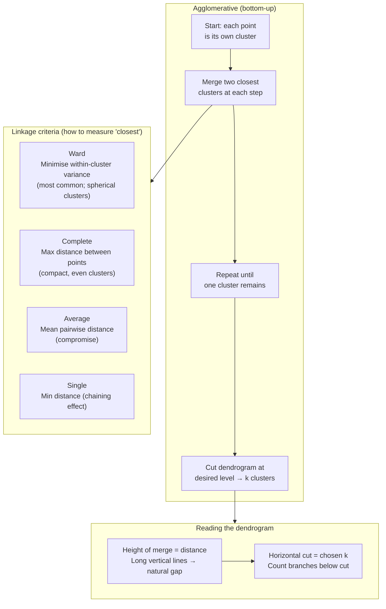

# Hierarchical Clustering

**After this lesson:** you can explain the core ideas in “Hierarchical Clustering” and reproduce the examples here in your own notebook or environment.

## Overview

**Agglomerative** clustering: linkage criteria, dendrograms, and choosing a cut.

## Helpful video

StatQuest overview of K-means clustering.

<iframe width="560" height="315" src="https://www.youtube.com/embed/4b5d3muPQmA" title="K-means Clustering, Clearly Explained" frameborder="0" allow="accelerometer; autoplay; clipboard-write; encrypted-media; gyroscope; picture-in-picture" allowfullscreen></iframe>

## Quick Reference



> **Figure (add screenshot or diagram):** A dendrogram with a horizontal dashed line showing where to cut to obtain 3 clusters, with the three resulting cluster branches coloured differently.

Hierarchical clustering is ideal when:
- You want to explore multiple cluster levels
- The natural cluster hierarchy matters
- You don't know the number of clusters in advance

```python
from sklearn.cluster import AgglomerativeClustering
from scipy.cluster.hierarchy import dendrogram, linkage

# Basic usage
clustering = AgglomerativeClustering(n_clusters=3)
labels = clustering.fit_predict(X)

# For dendrogram
Z = linkage(X, method='ward')
dendrogram(Z)
```

For the complete tutorial, see [Clustering Guide](clustering.md).
