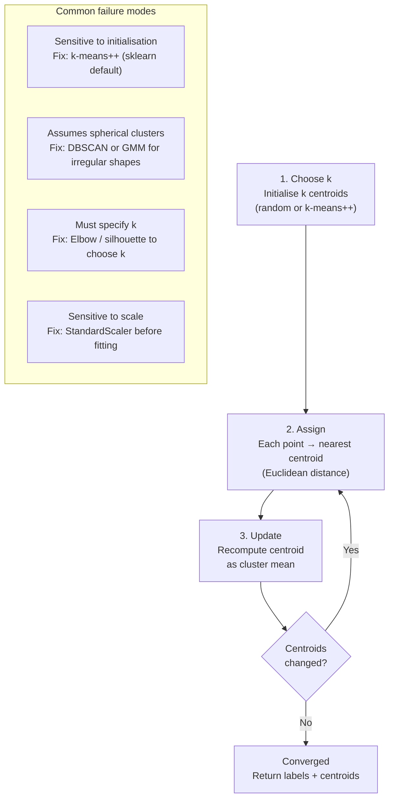

# K-means Clustering

**After this lesson:** you can explain the core ideas in “K-means Clustering” and reproduce the examples here in your own notebook or environment.

## Overview

**K-means**: Lloyd's algorithm, centroids, when spherical clusters are a reasonable assumption, and common failure modes.

## Helpful video

StatQuest overview of K-means clustering.

<iframe width="560" height="315" src="https://www.youtube.com/embed/4b5d3muPQmA" title="K-means Clustering, Clearly Explained" frameborder="0" allow="accelerometer; autoplay; clipboard-write; encrypted-media; gyroscope; picture-in-picture" allowfullscreen></iframe>

## Quick Reference



K-means is ideal when:
- You know the approximate number of clusters
- Clusters are roughly spherical
- Clusters have similar sizes

```python
from sklearn.cluster import KMeans

# Basic usage
kmeans = KMeans(n_clusters=3, random_state=42)
labels = kmeans.fit_predict(X)
```

For the complete tutorial, see [Clustering Guide](clustering.md).
