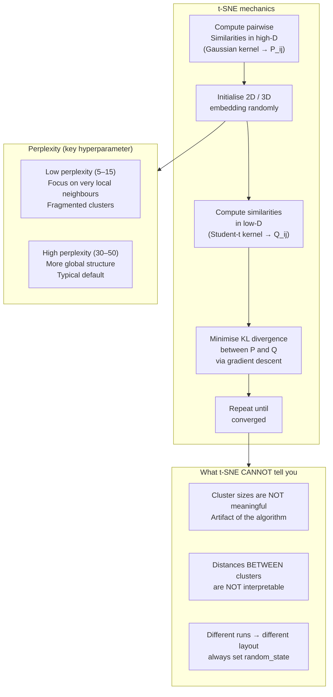

# t-SNE (t-Distributed Stochastic Neighbor Embedding)

**After this lesson:** you can explain the core ideas in “t-SNE (t-Distributed Stochastic Neighbor Embedding)” and reproduce the examples here in your own notebook or environment.

## Overview

Focus on **t-SNE** mechanics and interpretation—neighbor preservation, not cluster sizes or distances between clusters.

## Helpful video

StatQuest overview of K-means clustering.

<iframe width="560" height="315" src="https://www.youtube.com/embed/4b5d3muPQmA" title="K-means Clustering, Clearly Explained" frameborder="0" allow="accelerometer; autoplay; clipboard-write; encrypted-media; gyroscope; picture-in-picture" allowfullscreen></iframe>

## Quick Reference



t-SNE is ideal when:
- You need to visualize high-dimensional data
- Preserving local relationships matters
- You want to identify clusters visually
- Data has complex non-linear structure

```python
from sklearn.manifold import TSNE

# Basic usage
tsne = TSNE(n_components=2, perplexity=30, random_state=42)
X_embedded = tsne.fit_transform(X)

# Visualize
plt.scatter(X_embedded[:, 0], X_embedded[:, 1], c=labels)
```

For the complete tutorial, see [t-SNE and UMAP Guide](tsne-umap.md).
