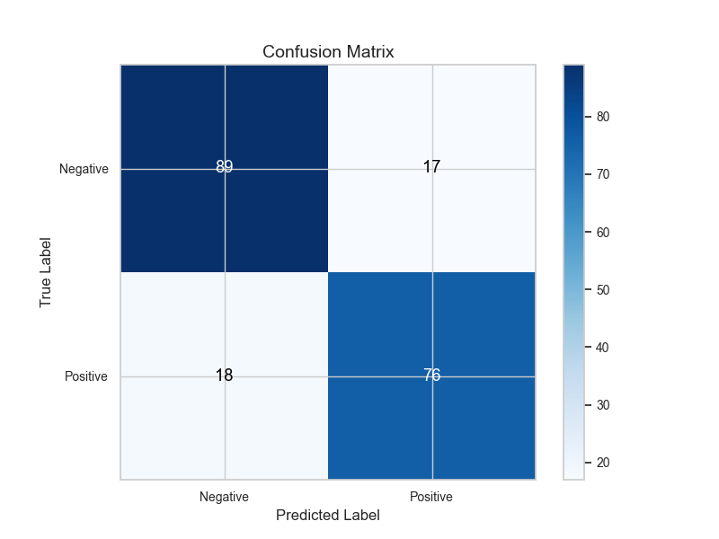
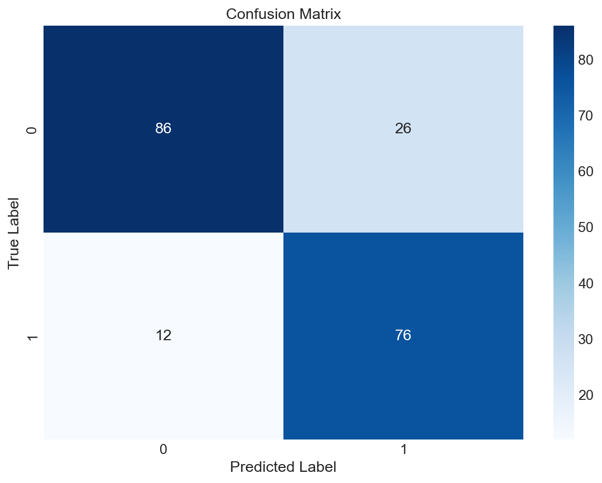
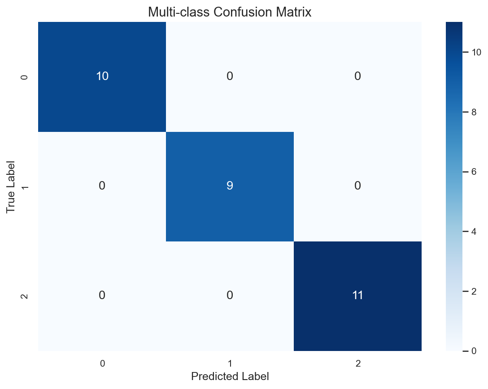
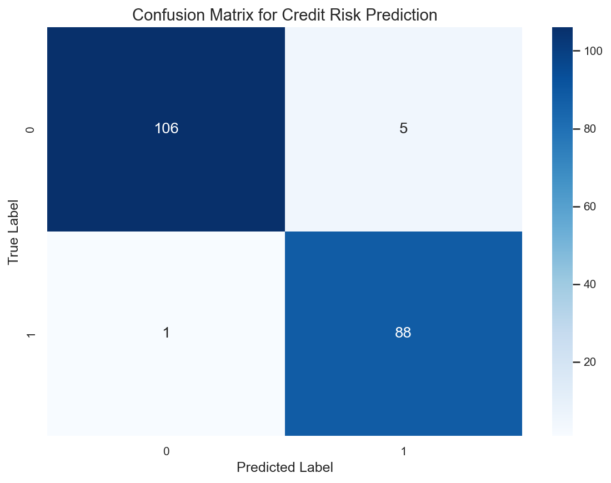

# Confusion Matrix

**After this lesson:** you can explain the core ideas in “Confusion Matrix” and reproduce the examples here in your own notebook or environment.

## Overview

Builds the **TP/TN/FP/FN** grid so precision, recall, and related rates have a shared ground truth.

## Introduction

A confusion matrix is a fundamental tool in machine learning for evaluating classification models. It provides a detailed breakdown of model predictions versus actual values, helping to understand model performance across different classes.

### Video Tutorial: Confusion Matrix Explained

<iframe width="560" height="315" src="https://www.youtube.com/embed/Kdsp6soqA7o" frameborder="0" allow="accelerometer; autoplay; clipboard-write; encrypted-media; gyroscope; picture-in-picture" allowfullscreen></iframe>

*StatQuest: Machine Learning Fundamentals: The Confusion Matrix by Josh Starmer*

## What is a Confusion Matrix?

A confusion matrix is a table that describes the performance of a classification model by comparing predicted values with actual values. Think of it as a "report card" for your model that shows exactly where it's getting things right and wrong.

The confusion matrix shows four key components for binary classification:

- **True Positives (TP)**: Correctly predicted positive cases - "We said YES, and it was YES"
- **True Negatives (TN)**: Correctly predicted negative cases - "We said NO, and it was NO"  
- **False Positives (FP)**: Incorrectly predicted positive cases - "We said YES, but it was NO" (Type I Error)
- **False Negatives (FN)**: Incorrectly predicted negative cases - "We said NO, but it was YES" (Type II Error)

### Real-World Example: Medical Diagnosis

Imagine a model predicting whether a patient has a disease:

| | Predicted: No Disease | Predicted: Disease |
|---|---|---|
| **Actual: No Disease** | TN: Healthy person correctly identified | FP: Healthy person incorrectly diagnosed |
| **Actual: Disease** | FN: Sick person missed (dangerous!) | TP: Sick person correctly identified |

**Why this matters:**
- **False Negatives (FN)**: Missing a sick patient could be life-threatening
- **False Positives (FP)**: Unnecessary worry and treatment for healthy patients
- The cost of each error type is different!

## Types of Confusion Matrices

### 1. Binary Classification

#### Logistic regression + heatmap

- **Purpose:** Build a **2×2** confusion matrix from a trained classifier and visualize counts with **seaborn**—rows = true class, columns = predicted.
- **Walkthrough:** `confusion_matrix(y_test, y_pred)`; `annot=True` writes cell counts; compare diagonal vs off-diagonal for error patterns.


import numpy as np
import matplotlib.pyplot as plt
import seaborn as sns
from sklearn.metrics import confusion_matrix
from sklearn.datasets import make_classification
from sklearn.model_selection import train_test_split
from sklearn.linear_model import LogisticRegression

# Generate sample data
X, y = make_classification(n_samples=1000, n_features=20, n_informative=15, random_state=42)
X_train, X_test, y_train, y_test = train_test_split(X, y, test_size=0.2, random_state=42)

# Train model
model = LogisticRegression(random_state=42)
model.fit(X_train, y_train)

# Get predictions
y_pred = model.predict(X_test)

# Calculate confusion matrix
cm = confusion_matrix(y_test, y_pred)

# Plot confusion matrix
plt.figure(figsize=(8, 6))
sns.heatmap(cm, annot=True, fmt='d', cmap='Blues')
plt.title('Confusion Matrix')
plt.ylabel('True Label')
plt.xlabel('Predicted Label')
plt.show()


<aside class="code-explainer__callouts" aria-label="Code walkthrough">
  

    

      
      Imports and Data
    

    

      
Generate a synthetic 1000-sample binary classification dataset with 15 informative features, then split 80/20 into train and test sets.

    

  

  

    

      
      Train and Predict
    

    

      
Fit logistic regression, generate test-set predictions, then compute the 2×2 confusion matrix comparing true vs predicted labels.

    

  

  

    

      
      Heatmap Visualization
    

    

      
<code>sns.heatmap</code> with <code>annot=True</code> writes raw counts in each cell; rows are true labels, columns are predicted labels.

    

  

</aside>

### 2. Multi-class Classification

#### Iris: 3×3 confusion matrix

- **Purpose:** Same API extends to **multi-class**: off-diagonal cells show **which classes get confused** (e.g. versicolor vs virginica).
- **Walkthrough:** `confusion_matrix` shape is `(n_classes, n_classes)`; row i = true class i.


from sklearn.datasets import load_iris
from sklearn.ensemble import RandomForestClassifier

# Load iris dataset
iris = load_iris()
X, y = iris.data, iris.target
X_train, X_test, y_train, y_test = train_test_split(X, y, test_size=0.2, random_state=42)

# Train model
model = RandomForestClassifier(random_state=42)
model.fit(X_train, y_train)

# Get predictions
y_pred = model.predict(X_test)

# Calculate confusion matrix
cm = confusion_matrix(y_test, y_pred)

# Plot confusion matrix
plt.figure(figsize=(8, 6))
sns.heatmap(cm, annot=True, fmt='d', cmap='Blues')
plt.title('Multi-class Confusion Matrix')
plt.ylabel('True Label')
plt.xlabel('Predicted Label')
plt.show()


<aside class="code-explainer__callouts" aria-label="Code walkthrough">
  

    

      
      Load Iris and Split
    

    

      
The Iris dataset has three classes; the same <code>confusion_matrix</code> API produces a 3×3 matrix without any changes to the call.

    

  

  

    

      
      Train Random Forest and Predict
    

    

      
A Random Forest classifier is fit on train data; predictions and the resulting confusion matrix reveal which species pairs are most confused.

    

  

  

    

      
      Multi-class Heatmap
    

    

      
The 3×3 heatmap shows diagonal hits and off-diagonal confusions — off-diagonal entries reveal which class pairs the model struggles to separate.

    

  

</aside>

## Interpreting Confusion Matrices

### 1. Binary Classification

- True Positives (TP): Correctly identified positive cases
- True Negatives (TN): Correctly identified negative cases
- False Positives (FP): Type I errors
- False Negatives (FN): Type II errors

### 2. Multi-class Classification

- Diagonal elements: Correct predictions
- Off-diagonal elements: Misclassifications
- Row sums: Actual class distribution
- Column sums: Predicted class distribution

### 3. Performance Metrics

- Accuracy: (TP + TN) / (TP + TN + FP + FN)
- Precision: TP / (TP + FP)
- Recall: TP / (TP + FN)
- F1 Score: 2 *(Precision* Recall) / (Precision + Recall)

## Best Practices

1. **Choose Appropriate Visualization**
   - Clear labels and title
   - Proper color scheme
   - Informative annotations
   - Grid lines

2. **Consider Class Imbalance**
   - Use appropriate metrics
   - Consider cost-sensitive learning
   - Apply class weighting

3. **Interpret Results Carefully**
   - Look for patterns
   - Identify systematic errors
   - Consider business impact

4. **Use Multiple Metrics**
   - Don't rely on accuracy alone
   - Consider precision and recall
   - Use F1 score for balance

## Common Mistakes to Avoid

1. **Ignoring Class Imbalance**
   - Using raw counts
   - Not considering costs
   - Missing important patterns

2. **Poor Visualization**
   - Unclear labels
   - Wrong color scheme
   - Missing context

3. **Misinterpretation**
   - Focusing on wrong metrics
   - Ignoring business impact
   - Overlooking patterns

## Practical Example: Credit Risk Prediction

Let's analyze a confusion matrix for a credit risk prediction model:

#### Synthetic credit features + pipeline + CM

- **Purpose:** Tie a **tabular** binary problem to a confusion matrix after **scaling + RandomForest**—closer to a real sklearn pipeline than raw matrices alone.
- **Walkthrough:** Rule-based `y` from score-like features; `Pipeline` avoids scaling leakage when you CV properly in practice; heatmap reads like the binary case but with business labels (approve/reject) in narrative text below.


import pandas as pd
import numpy as np
import matplotlib.pyplot as plt
import seaborn as sns
from sklearn.preprocessing import StandardScaler
from sklearn.pipeline import Pipeline
from sklearn.ensemble import RandomForestClassifier
from sklearn.model_selection import train_test_split
from sklearn.metrics import confusion_matrix

# Create credit risk dataset
np.random.seed(42)
n_samples = 1000

# Generate features
data = {
    'age': np.random.normal(35, 10, n_samples),
    'income': np.random.exponential(50000, n_samples),
    'credit_score': np.random.normal(700, 100, n_samples),
    'debt_ratio': np.random.beta(2, 5, n_samples),
    'employment_length': np.random.exponential(5, n_samples)
}

X = pd.DataFrame(data)
y = (X['credit_score'] + X['income']/1000 + X['age'] > 800).astype(int)

# Split data
X_train, X_test, y_train, y_test = train_test_split(X, y, test_size=0.2, random_state=42)

# Create pipeline
pipeline = Pipeline([
    ('scaler', StandardScaler()),
    ('classifier', RandomForestClassifier(random_state=42))
])

# Train model
pipeline.fit(X_train, y_train)

# Get predictions
y_pred = pipeline.predict(X_test)

# Calculate confusion matrix
cm = confusion_matrix(y_test, y_pred)

# Plot confusion matrix
plt.figure(figsize=(8, 6))
sns.heatmap(cm, annot=True, fmt='d', cmap='Blues')
plt.title('Confusion Matrix for Credit Risk Prediction')
plt.ylabel('True Label')
plt.xlabel('Predicted Label')
plt.show()


<aside class="code-explainer__callouts" aria-label="Code walkthrough">
  

    

      
      Imports
    

    

      
Import pandas, sklearn pipeline components, and seaborn — everything needed to build, train, and visualize a real-world credit pipeline.

    

  

  

    

      
      Synthetic Credit Data
    

    

      
Generate 1000 applicants with realistic financial distributions; the label is a simple threshold rule on score, income, and age.

    

  

  

    

      
      Pipeline and Training
    

    

      
A <code>Pipeline</code> chains <code>StandardScaler</code> and <code>RandomForestClassifier</code> so scaling is learned only from training data, preventing leakage.

    

  

  

    

      
      Confusion Matrix Heatmap
    

    

      
Compute and plot the binary confusion matrix with business-relevant labels (approve/reject) to reveal approval misclassification costs.

    

  

</aside>

## Additional Resources

1. Scikit-learn documentation on confusion matrices
2. Research papers on classification metrics
3. Online tutorials on model evaluation
4. Books on machine learning evaluation
