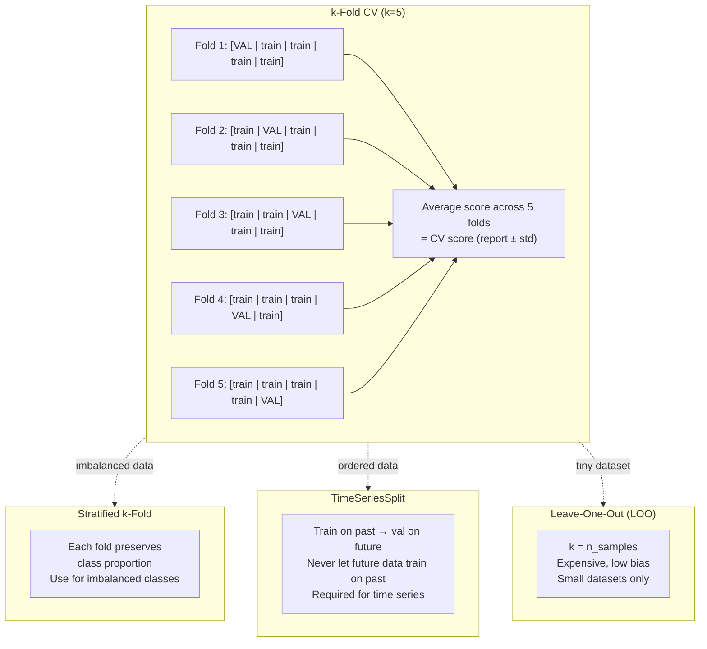

# Cross-Validation

**After this lesson:** you can explain the core ideas in “Cross-Validation” and reproduce the examples here in your own notebook or environment.

## Overview

**Cross-validation** repeatedly trains on a subset of the data and validates on held-out folds so the score reflects **generalization**, not one lucky split. Use it for model comparison and tuning; reserve a final **test** set (or outer CV) for unbiased reporting. **Prerequisites:** [ML workflow](../../5.1-intro-to-ml/ml-workflow.md); later lessons such as [hyperparameter tuning](hyperparameter-tuning.md) build on the same splits.

## What is Cross-Validation?

Cross-validation is a resampling method that uses different portions of the data to test and train a model on different iterations.

### Video Tutorial: Cross-Validation Explained

<div class="video-embed">
<iframe width="560" height="315" src="https://www.youtube.com/embed/fSytzGwwBVw" frameborder="0" allow="accelerometer; autoplay; clipboard-write; encrypted-media; gyroscope; picture-in-picture" allowfullscreen></iframe>
</div>

*StatQuest: Cross Validation by Josh Starmer*

### Why Cross-Validation Matters

Think of cross validation like a student taking multiple practice tests before the final exam. It helps us:

1. Get a more reliable estimate of how well our model will perform
2. Catch if our model is "memorizing" the data (overfitting) instead of learning patterns
3. Compare different models fairly
4. Make sure our model is stable and reliable

## Real-World Analogies

### The Restaurant Menu Analogy

Imagine you're opening a new restaurant. You wouldn't just serve your menu to one group of customers and call it a success. Instead, you'd:

- Test different dishes with various groups of customers
- Get feedback from different demographics
- Try different times of day
- Consider different seasons

This is exactly what cross validation does for machine learning models!

### The Sports Team Analogy

Think of cross validation like a sports team's practice games:

- Each fold is like a practice game
- The training data is like your team's practice
- The validation data is like the practice game
- The final model is like your team going into the real season



## Types of Cross-Validation

### K-Fold Cross-Validation

The data is divided into k subsets (called "folds"), and the holdout method is repeated k times. Each time, one fold serves as the validation set while the remaining k-1 folds form the training set.


**How it works:**
1. Split data into k equal-sized folds
2. For each fold:
   - Train model on k-1 folds
   - Validate on the remaining fold
3. Average the k validation scores

**Example with k=5:**

#### K-fold CV with `cross_val_score`

**Purpose:** Train/evaluate the same estimator on 5 disjoint validation folds and summarize mean and variability of the score.

**Walkthrough:** `KFold(..., shuffle=True)` randomizes row order before splitting; `cross_val_score` uses the estimator’s default scoring (accuracy for classifiers).

<div class="code-explainer" data-code-explainer>
<div class="code-explainer__code">


from sklearn.model_selection import KFold, cross_val_score
from sklearn.ensemble import RandomForestClassifier
import numpy as np

# Create sample data
X = np.random.randn(100, 4)
y = np.random.randint(0, 2, 100)

# 5-fold cross-validation
kf = KFold(n_splits=5, shuffle=True, random_state=42)
model = RandomForestClassifier(random_state=42)

# What this does: Trains and evaluates the model 5 times,
# each time using a different fold as validation set
scores = cross_val_score(model, X, y, cv=kf)

print(f"Cross-validation scores: {scores}")
print(f"Mean CV score: {scores.mean():.3f} (+/- {scores.std() * 2:.3f})")


</div>
<aside class="code-explainer__callouts" aria-label="Code walkthrough">
  <div class="code-callout" data-lines="1-7" data-tint="1">
    <div class="code-callout__meta">
      <span class="code-callout__lines"></span>
      <span class="code-callout__title">Data and Imports</span>
    </div>
    <div class="code-callout__body">
      <p>Import KFold and cross_val_score, then create a small random dataset to demonstrate k-fold splitting.</p>
    </div>
  </div>
  <div class="code-callout" data-lines="9-18" data-tint="2">
    <div class="code-callout__meta">
      <span class="code-callout__lines"></span>
      <span class="code-callout__title">Five-fold CV</span>
    </div>
    <div class="code-callout__body">
      <p>Run 5-fold cross-validation, training the RandomForest on each fold in turn and printing mean accuracy with ±2σ spread.</p>
    </div>
  </div>
</aside>
</div>

**Captured stdout** (from running the snippet above; may be auto-injected on build):

```
Cross-validation scores: [0.55 0.6  0.45 0.6  0.35]
Mean CV score: 0.510 (+/- 0.194)
```

### Leave-One-Out Cross-Validation (LOOCV)

Each observation is used once as a validation set while the remaining observations form the training set. This is equivalent to k-fold where k equals the number of samples.

**When to use:**
- Small datasets (< 100 samples)
- When you need maximum use of training data
- Computationally expensive for large datasets

**Example:**

#### Leave-one-out CV

**Purpose:** Use every point once as validation—maximum training data per round, feasible only for small $n$.

**Walkthrough:** `LeaveOneOut` yields $n$ splits; `cross_val_score` averages scores across all rounds (expensive when $n$ is large).

```python
import numpy as np
from sklearn.model_selection import LeaveOneOut, cross_val_score
from sklearn.ensemble import RandomForestClassifier

# Same toy X, y as k-fold example above (or define here)
X = np.random.randn(100, 4)
y = np.random.randint(0, 2, 100)
model = RandomForestClassifier(random_state=42)

loo = LeaveOneOut()
scores = cross_val_score(model, X, y, cv=loo)
print(f"LOOCV mean score: {scores.mean():.3f}")
```

**Captured stdout** (from running the snippet above; may be auto-injected on build):

```
LOOCV mean score: 0.540
```

### Stratified K-Fold Cross-Validation

Similar to K-Fold but ensures that the proportions of samples for each class are the same in each fold. This is crucial for imbalanced datasets.


**Why stratification matters:**
- Prevents folds with very few or no samples from minority classes
- Ensures each fold is representative of the overall dataset
- Provides more reliable performance estimates for imbalanced data

**Example:**

#### Stratified vs ordinary K-fold on imbalanced labels

**Purpose:** Preserve class proportions in each fold so minority classes don’t disappear from validation.

**Walkthrough:** `StratifiedKFold.split(X, y)` needs `y`; compare mean/std of scores against plain `KFold` on the same `X_imbalanced`, `y_imbalanced`.

<div class="code-explainer" data-code-explainer>
<div class="code-explainer__code">


import numpy as np
from sklearn.model_selection import StratifiedKFold, KFold, cross_val_score
from sklearn.ensemble import RandomForestClassifier

model = RandomForestClassifier(random_state=42)

# Create imbalanced dataset
y_imbalanced = np.concatenate([np.zeros(80), np.ones(20)])
X_imbalanced = np.random.randn(100, 4)

# Compare regular vs stratified k-fold
skf = StratifiedKFold(n_splits=5, shuffle=True, random_state=42)
kf = KFold(n_splits=5, shuffle=True, random_state=42)

# Stratified scores
stratified_scores = cross_val_score(model, X_imbalanced, y_imbalanced, cv=skf)
# Regular scores
regular_scores = cross_val_score(model, X_imbalanced, y_imbalanced, cv=kf)

print(f"Stratified CV: {stratified_scores.mean():.3f} (+/- {stratified_scores.std() * 2:.3f})")
print(f"Regular CV: {regular_scores.mean():.3f} (+/- {regular_scores.std() * 2:.3f})")


</div>
<aside class="code-explainer__callouts" aria-label="Code walkthrough">
  <div class="code-callout" data-lines="1-9" data-tint="1">
    <div class="code-callout__meta">
      <span class="code-callout__lines"></span>
      <span class="code-callout__title">Imbalanced Dataset</span>
    </div>
    <div class="code-callout__body">
      <p>Create a dataset with an 80/20 class split so the difference between stratified and regular k-fold is visible — minority class is easily lost in regular splits.</p>
    </div>
  </div>
  <div class="code-callout" data-lines="11-18" data-tint="2">
    <div class="code-callout__meta">
      <span class="code-callout__lines"></span>
      <span class="code-callout__title">Two Splitter Strategies</span>
    </div>
    <div class="code-callout__body">
      <p><code>StratifiedKFold</code> keeps ~20% minority class in each fold; plain <code>KFold</code> may concentrate them unevenly, inflating or deflating scores.</p>
    </div>
  </div>
  <div class="code-callout" data-lines="20-21" data-tint="3">
    <div class="code-callout__meta">
      <span class="code-callout__lines"></span>
      <span class="code-callout__title">Compare Results</span>
    </div>
    <div class="code-callout__body">
      <p>Printing mean ± 2 std for both strategies shows that stratified scoring is more stable — smaller standard deviation — on imbalanced data.</p>
    </div>
  </div>
</aside>
</div>

**Captured stdout** (from running the snippet above; may be auto-injected on build):

```
Stratified CV: 0.760 (+/- 0.172)
Regular CV: 0.770 (+/- 0.080)
```

### Time Series Cross-Validation

For time series data, we need to respect the temporal order and avoid using future data to predict the past.


**Key principles:**
- Training data always comes before validation data
- No shuffling of data
- Expanding or sliding window approaches

**Example:**

#### Time-ordered splits with `TimeSeriesSplit`

**Purpose:** Avoid leakage in temporal data: validation segments always come after training segments.

**Walkthrough:** Loop prints index ranges for each fold—train blocks grow as folds advance (expanding window).

<div class="code-explainer" data-code-explainer>
<div class="code-explainer__code">


import numpy as np
from sklearn.model_selection import TimeSeriesSplit

# Ordered data (e.g. time index 0..n-1)
X = np.arange(100).reshape(-1, 1)

# Time series split
tscv = TimeSeriesSplit(n_splits=5)

# What this does: Creates 5 splits where each validation set
# comes after its corresponding training set in time
for fold, (train_idx, val_idx) in enumerate(tscv.split(X)):
    print(f"Fold {fold+1}:")
    print(f"  Train indices: {train_idx[:5]}...{train_idx[-5:]}")
    print(f"  Val indices: {val_idx[:5]}...{val_idx[-5:]}")


</div>
<aside class="code-explainer__callouts" aria-label="Code walkthrough">
  <div class="code-callout" data-lines="1-8" data-tint="1">
    <div class="code-callout__meta">
      <span class="code-callout__lines"></span>
      <span class="code-callout__title">Setup</span>
    </div>
    <div class="code-callout__body">
      <p>Create an ordered index array simulating 100 timesteps; <code>TimeSeriesSplit(n_splits=5)</code> will produce expanding train windows that never see future validation data.</p>
    </div>
  </div>
  <div class="code-callout" data-lines="10-16" data-tint="2">
    <div class="code-callout__meta">
      <span class="code-callout__lines"></span>
      <span class="code-callout__title">Print Fold Ranges</span>
    </div>
    <div class="code-callout__body">
      <p>Each fold's train block grows while validation always starts immediately after the last training point — confirming no temporal leakage across folds.</p>
    </div>
  </div>
</aside>
</div>

**Captured stdout** (from running the snippet above; may be auto-injected on build):

```
Fold 1:
  Train indices: [0 1 2 3 4]...[15 16 17 18 19]
  Val indices: [20 21 22 23 24]...[31 32 33 34 35]
Fold 2:
  Train indices: [0 1 2 3 4]...[31 32 33 34 35]
  Val indices: [36 37 38 39 40]...[47 48 49 50 51]
Fold 3:
  Train indices: [0 1 2 3 4]...[47 48 49 50 51]
  Val indices: [52 53 54 55 56]...[63 64 65 66 67]
Fold 4:
  Train indices: [0 1 2 3 4]...[63 64 65 66 67]
  Val indices: [68 69 70 71 72]...[79 80 81 82 83]
Fold 5:
  Train indices: [0 1 2 3 4]...[79 80 81 82 83]
  Val indices: [84 85 86 87 88]...[95 96 97 98 99]
```

## Benefits of Cross-Validation

1. Better assessment of model performance
2. Reduced overfitting
3. More reliable model evaluation

## Implementation Tips

1. Choose appropriate k value
2. Consider data distribution
3. Use stratification when needed

## Common Pitfalls

1. Data leakage
2. Inappropriate fold size
3. Ignoring data dependencies

## Practical Example: Credit Risk Prediction

Let's see how cross validation helps in a real-world scenario:

#### Manual fold loop with a pipeline (credit risk sketch)

**Purpose:** Mirror production evaluation: fit `StandardScaler` + `RandomForestClassifier` inside each fold without touching other folds’ data.

**Walkthrough:** `StratifiedKFold.split` returns indices; `pipeline.score` on each validation fold builds a list of fold accuracies.

<div class="code-explainer" data-code-explainer>
<div class="code-explainer__code">


import numpy as np
from sklearn.ensemble import RandomForestClassifier
from sklearn.preprocessing import StandardScaler
from sklearn.pipeline import Pipeline
from sklearn.model_selection import StratifiedKFold

# Create credit risk dataset
np.random.seed(42)
n_samples = 1000

# Generate features
age = np.random.normal(35, 10, n_samples)
income = np.random.exponential(50000, n_samples)
credit_score = np.random.normal(700, 100, n_samples)

X = np.column_stack([age, income, credit_score])
y = (credit_score + income/1000 + age > 800).astype(int)  # Binary target

# Create pipeline
pipeline = Pipeline([
    ('scaler', StandardScaler()),
    ('classifier', RandomForestClassifier())
])

# Perform stratified cross-validation
skf = StratifiedKFold(n_splits=5, shuffle=True, random_state=42)

scores = []
for fold, (train_idx, val_idx) in enumerate(skf.split(X, y)):
    X_train, X_val = X[train_idx], X[val_idx]
    y_train, y_val = y[train_idx], y[val_idx]

    pipeline.fit(X_train, y_train)
    score = pipeline.score(X_val, y_val)
    scores.append(score)
    print(f"Fold {fold+1}: {score:.3f}")

print(f"\nMean CV score: {np.mean(scores):.3f} (+/- {np.std(scores) * 2:.3f})")


</div>
<aside class="code-explainer__callouts" aria-label="Code walkthrough">
  <div class="code-callout" data-lines="1-18" data-tint="1">
    <div class="code-callout__meta">
      <span class="code-callout__lines"></span>
      <span class="code-callout__title">Synthetic Credit Data</span>
    </div>
    <div class="code-callout__body">
      <p>Generate age, income, and credit score features, then create a binary target based on a threshold combination of those features.</p>
    </div>
  </div>
  <div class="code-callout" data-lines="20-26" data-tint="2">
    <div class="code-callout__meta">
      <span class="code-callout__lines"></span>
      <span class="code-callout__title">Pipeline and Splitter</span>
    </div>
    <div class="code-callout__body">
      <p>Wrap scaler and classifier in a pipeline to prevent data leakage, then set up stratified 5-fold splitting.</p>
    </div>
  </div>
  <div class="code-callout" data-lines="28-38" data-tint="3">
    <div class="code-callout__meta">
      <span class="code-callout__lines"></span>
      <span class="code-callout__title">Fold Loop</span>
    </div>
    <div class="code-callout__body">
      <p>Iterate through each fold, fit the pipeline on train indices, score on validation indices, and print each fold accuracy plus the overall mean.</p>
    </div>
  </div>
</aside>
</div>

**Captured stdout** (from running the snippet above; may be auto-injected on build):

```
Fold 1: 0.980
Fold 2: 0.980
Fold 3: 0.985
Fold 4: 0.975
Fold 5: 0.985

Mean CV score: 0.981 (+/- 0.007)
```

## Best Practices

### 1. Choosing the Right Number of Folds

#### Sweep k and plot mean score with error bars

**Purpose:** Visualize bias–variance of the CV estimate as fold count changes; useful for picking $k$ when data are limited.

**Walkthrough:** `cross_val_score(..., cv=k)` uses $k$-fold; `errorbar` plots mean $\pm$ std across folds.

<div class="code-explainer" data-code-explainer>
<div class="code-explainer__code">


import numpy as np
import matplotlib.pyplot as plt
from sklearn.model_selection import cross_val_score
from sklearn.linear_model import LogisticRegression
from sklearn.datasets import make_classification

X, y = make_classification(n_samples=800, n_features=20, random_state=42)


def choose_optimal_k(X, y, k_range=range(2, 11)):
    scores = []
    stds = []

    for k in k_range:
        cv_scores = cross_val_score(
            LogisticRegression(),
            X, y,
            cv=k
        )
        scores.append(cv_scores.mean())
        stds.append(cv_scores.std())

    plt.figure(figsize=(10, 5))
    plt.errorbar(k_range, scores, yerr=stds, fmt='o-')
    plt.xlabel('Number of Folds')
    plt.ylabel('Cross-validation Score')
    plt.title('Impact of K on Cross-validation')
    plt.grid(True)
    plt.savefig('assets/optimal_k_selection.png')
    plt.show()

choose_optimal_k(X, y)


</div>
<aside class="code-explainer__callouts" aria-label="Code walkthrough">
  <div class="code-callout" data-lines="1-7" data-tint="1">
    <div class="code-callout__meta">
      <span class="code-callout__lines"></span>
      <span class="code-callout__title">Data Setup</span>
    </div>
    <div class="code-callout__body">
      <p>Generate a classification dataset with 800 samples and 20 features to analyse how fold count affects CV stability.</p>
    </div>
  </div>
  <div class="code-callout" data-lines="10-21" data-tint="2">
    <div class="code-callout__meta">
      <span class="code-callout__lines"></span>
      <span class="code-callout__title">Sweep k Values</span>
    </div>
    <div class="code-callout__body">
      <p>Loop k from 2 to 10, compute cross-validated mean accuracy and standard deviation for each fold count.</p>
    </div>
  </div>
  <div class="code-callout" data-lines="23-32" data-tint="3">
    <div class="code-callout__meta">
      <span class="code-callout__lines"></span>
      <span class="code-callout__title">Error-bar Plot</span>
    </div>
    <div class="code-callout__body">
      <p>Plot mean score ± std for each k to visually identify the fold count with the best bias-variance trade-off.</p>
    </div>
  </div>
</aside>
</div>

## Additional Resources

For more information on cross-validation techniques and best practices, check out:

- [Cross Validation Guide](https://scikit-learn.org/stable/modules/cross_validation.html)
- [Time Series Cross Validation](https://scikit-learn.org/stable/modules/generated/sklearn.model_selection.TimeSeriesSplit.html)
- [Model Evaluation Best Practices](https://scikit-learn.org/stable/modules/model_evaluation.html)

Remember: Cross validation is essential for reliable model evaluation!

## Next Steps

Ready to learn more? Check out:

1. [Hyperparameter Tuning](./hyperparameter-tuning.md) to optimize your model's performance
2. [Model Metrics](./metrics.md) to understand different ways to evaluate your model
3. [Model Selection](./model-selection.md) to choose the best model for your problem
