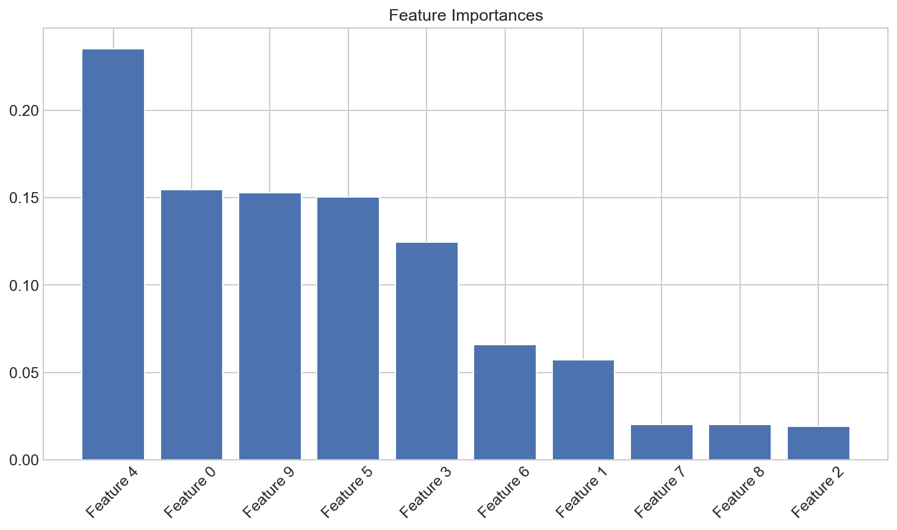

# Feature Importance

**After this lesson:** you can explain the core ideas in “Feature Importance” and reproduce the examples here in your own notebook or environment.

## Overview

Tree importances, permutation importance, and caveats—correlation and baseline comparisons matter.

## Helpful video

StatQuest: why cross-validation matters for model evaluation.

<iframe width="560" height="315" src="https://www.youtube.com/embed/fSytzGwwBVw" title="Machine Learning Fundamentals: Cross Validation" frameborder="0" allow="accelerometer; autoplay; clipboard-write; encrypted-media; gyroscope; picture-in-picture" allowfullscreen></iframe>

## Introduction

Feature importance is a crucial concept in machine learning that helps us understand which features contribute most to our model's predictions. This understanding is essential for model interpretability, feature selection, and domain knowledge validation.

## What is Feature Importance?

Feature importance measures how much each feature contributes to the model's predictions. It helps us:

1. Identify the most influential features
2. Remove irrelevant features
3. Understand model behavior
4. Validate domain knowledge



## Types of Feature Importance

### 1. Tree-Based Methods

#### Gini-based `feature_importances_`

- **Purpose:** **Mean impurity decrease** (Gini) aggregated over trees—fast, but **biased** toward high-cardinality features.
- **Walkthrough:** Fit `RandomForestClassifier`, read `feature_importances_`, sort indices descending, bar plot.

<div class="code-explainer" data-code-explainer>
<div class="code-explainer__code">


import numpy as np
import matplotlib.pyplot as plt
from sklearn.ensemble import RandomForestClassifier
from sklearn.datasets import make_classification

# Create sample dataset
X, y = make_classification(n_samples=1000, n_features=10,
                           n_informative=5, n_redundant=2,
                           random_state=42)

# Train random forest
rf = RandomForestClassifier(n_estimators=100, random_state=42)
rf.fit(X, y)

# Get feature importances
importances = rf.feature_importances_
indices = np.argsort(importances)[::-1]

# Plot feature importances
plt.figure(figsize=(10, 6))
plt.title('Feature Importances')
plt.bar(range(X.shape[1]), importances[indices])
plt.xticks(range(X.shape[1]), [f'Feature {i}' for i in indices], rotation=45)
plt.tight_layout()
plt.show()


<figure>

<figcaption>Figure 1: Feature Importances</figcaption>
</figure>


</div>
<aside class="code-explainer__callouts" aria-label="Code walkthrough">
  <div class="code-callout" data-lines="1-9" data-tint="1">
    <div class="code-callout__meta">
      <span class="code-callout__lines"></span>
      <span class="code-callout__title">Data and Model</span>
    </div>
    <div class="code-callout__body">
      <p>Generate a 10-feature dataset with only 5 truly informative features; the Random Forest should rank those 5 higher than the redundant and noise features.</p>
    </div>
  </div>
  <div class="code-callout" data-lines="11-17" data-tint="2">
    <div class="code-callout__meta">
      <span class="code-callout__lines"></span>
      <span class="code-callout__title">Extract and Sort Importances</span>
    </div>
    <div class="code-callout__body">
      <p><code>feature_importances_</code> gives mean impurity-decrease per feature summed to 1; <code>argsort[::-1]</code> ranks them highest to lowest for a sorted bar chart.</p>
    </div>
  </div>
  <div class="code-callout" data-lines="19-25" data-tint="3">
    <div class="code-callout__meta">
      <span class="code-callout__lines"></span>
      <span class="code-callout__title">Bar Plot</span>
    </div>
    <div class="code-callout__body">
      <p>Plot bars in sorted order using original feature-index labels; <code>rotation=45</code> prevents label overlap for 10 features.</p>
    </div>
  </div>
</aside>
</div>


### 2. Permutation Importance

#### Model-agnostic drop in score

- **Purpose:** Shuffle each feature, measure **score drop**—works for any fitted estimator and reflects **held-out** behavior better than impurity alone.
- **Walkthrough:** Uses the same `rf`, `X`, `y` as above; `n_repeats` gives a distribution per feature (boxplot).

```python
from sklearn.inspection import permutation_importance

# Calculate permutation importance
result = permutation_importance(rf, X, y, n_repeats=10, random_state=42)

# Plot results
plt.figure(figsize=(10, 6))
plt.title('Permutation Importances')
plt.boxplot(result.importances.T, labels=[f'Feature {i}' for i in range(X.shape[1])])
plt.xticks(rotation=45)
plt.tight_layout()
plt.show()
```


### 3. SHAP Values

#### TreeExplainer + summary plot

- **Purpose:** **SHAP** attributes each prediction to features with consistency properties—useful for debugging and stakeholder explanations (install **`shap`**).
- **Walkthrough:** `TreeExplainer` is exact for tree ensembles; summary plot shows magnitude and direction of impact.

```python
import shap

# Calculate SHAP values
explainer = shap.TreeExplainer(rf)
shap_values = explainer.shap_values(X)

# Plot summary
plt.figure(figsize=(10, 6))
shap.summary_plot(shap_values, X, plot_type="bar")
plt.tight_layout()
plt.show()
```

## Best Practices

1. **Use Multiple Methods**
   - Combine different importance measures
   - Cross-validate results
   - Consider domain knowledge

2. **Handle Correlated Features**
   - Group correlated features
   - Use appropriate methods
   - Consider feature interactions

3. **Validate Results**
   - Use cross-validation
   - Check stability
   - Compare with domain knowledge

4. **Visualize Effectively**
   - Use appropriate plots
   - Show confidence intervals
   - Include feature names

## Common Mistakes to Avoid

1. **Ignoring Feature Correlations**
   - Not considering interactions
   - Missing important relationships
   - Overlooking multicollinearity

2. **Overlooking Scale**
   - Not normalizing features
   - Comparing different scales
   - Misinterpreting results

3. **Poor Visualization**
   - Unclear plots
   - Missing context
   - Inappropriate scales

## Practical Example: Credit Risk Prediction

Let's analyze feature importance in a credit risk prediction task:

#### Pipeline importances + SHAP on the forest

- **Purpose:** Read **`classifier__`** step importances from a **Pipeline**, then explain the **underlying** `RandomForestClassifier` with SHAP.
- **Walkthrough:** Same synthetic credit table as other 5.5 examples; `TreeExplainer` is fit on the forest, not the scaler.

<div class="code-explainer" data-code-explainer>
<div class="code-explainer__code">


import numpy as np
import pandas as pd
import matplotlib.pyplot as plt
import shap
from sklearn.preprocessing import StandardScaler
from sklearn.pipeline import Pipeline
from sklearn.ensemble import RandomForestClassifier

# Create credit risk dataset
np.random.seed(42)
n_samples = 1000

# Generate features
data = {
    'age': np.random.normal(35, 10, n_samples),
    'income': np.random.exponential(50000, n_samples),
    'credit_score': np.random.normal(700, 100, n_samples),
    'debt_ratio': np.random.beta(2, 5, n_samples),
    'employment_length': np.random.exponential(5, n_samples)
}

X = pd.DataFrame(data)
y = (X['credit_score'] + X['income']/1000 + X['age'] > 800).astype(int)

# Create pipeline
pipeline = Pipeline([
    ('scaler', StandardScaler()),
    ('classifier', RandomForestClassifier(n_estimators=100, random_state=42))
])

# Fit pipeline
pipeline.fit(X, y)

# Get feature importances
importances = pipeline.named_steps['classifier'].feature_importances_
indices = np.argsort(importances)[::-1]

# Plot feature importances
plt.figure(figsize=(10, 6))
plt.title('Feature Importances in Credit Risk Prediction')
plt.bar(range(X.shape[1]), importances[indices])
plt.xticks(range(X.shape[1]), X.columns[indices], rotation=45)
plt.tight_layout()
plt.show()

# Calculate and plot SHAP values
explainer = shap.TreeExplainer(pipeline.named_steps['classifier'])
shap_values = explainer.shap_values(X)

plt.figure(figsize=(10, 6))
shap.summary_plot(shap_values, X)
plt.tight_layout()
plt.show()


</div>
<aside class="code-explainer__callouts" aria-label="Code walkthrough">
  <div class="code-callout" data-lines="1-22" data-tint="1">
    <div class="code-callout__meta">
      <span class="code-callout__lines"></span>
      <span class="code-callout__title">Synthetic Credit Data</span>
    </div>
    <div class="code-callout__body">
      <p>Five financial features with realistic distributions; the binary label is a threshold on credit score, income, and age — meaning those three should dominate importance.</p>
    </div>
  </div>
  <div class="code-callout" data-lines="24-32" data-tint="2">
    <div class="code-callout__meta">
      <span class="code-callout__lines"></span>
      <span class="code-callout__title">Pipeline Fit</span>
    </div>
    <div class="code-callout__body">
      <p>Scale then classify in a single pipeline; access the fitted forest through <code>pipeline.named_steps['classifier']</code> to extract importances and build the SHAP explainer.</p>
    </div>
  </div>
  <div class="code-callout" data-lines="34-44" data-tint="3">
    <div class="code-callout__meta">
      <span class="code-callout__lines"></span>
      <span class="code-callout__title">Ranked Bar Chart</span>
    </div>
    <div class="code-callout__body">
      <p>Extract importances from the classifier step, sort descending, and plot with real column names so stakeholders can read which financial factors drive the model.</p>
    </div>
  </div>
  <div class="code-callout" data-lines="46-52" data-tint="4">
    <div class="code-callout__meta">
      <span class="code-callout__lines"></span>
      <span class="code-callout__title">SHAP Summary Plot</span>
    </div>
    <div class="code-callout__body">
      <p><code>TreeExplainer</code> is applied to the inner forest (not the scaler); the summary plot shows both magnitude and direction of each feature's impact on the output.</p>
    </div>
  </div>
</aside>
</div>

## Gotchas

- **Tree-based impurity importance is biased toward high-cardinality features** — `feature_importances_` from Random Forest sums mean impurity decrease over splits; features with many unique values (e.g., a continuous numeric column) get more split opportunities and can appear more important than they truly are; use permutation importance or SHAP for a less biased view.
- **Permutation importance computed on training data is misleading** — Shuffling a feature on the training set measures how much the model *relied* on it during training, not how useful it is for new data; always compute permutation importance on a held-out validation or test set to measure true generalisation contribution.
- **Correlated features split importance between them** — If `income` and `wealth_score` are strongly correlated, the model may use one or the other interchangeably; both features will show lower individual importances than either deserves alone, and removing one may not hurt performance; cluster correlated features before interpreting rankings.
- **SHAP values require the model, not just predictions** — `shap.TreeExplainer` needs the fitted estimator object; if you only serialised `predict` output without saving the model, you cannot compute SHAP values retrospectively; always save the full fitted model, not just predictions.
- **Treating feature importance as a ranking for causal inference** — A high-importance feature in a predictive model tells you the model uses that feature, not that it causally drives the outcome; recommending business actions based on feature importances alone (e.g., "increase credit score to get approved") conflates correlation with causation.
- **Negative permutation importance does not mean the feature hurts** — A small negative value (near zero) for permutation importance usually means the feature adds negligible predictive value and the drop in score is within random noise, not that the feature actively harms the model; check confidence intervals before removing features with slightly negative scores.

## Additional Resources

1. Scikit-learn documentation on feature importance
2. SHAP documentation and examples
3. Research papers on feature selection
4. Online tutorials on model interpretability
