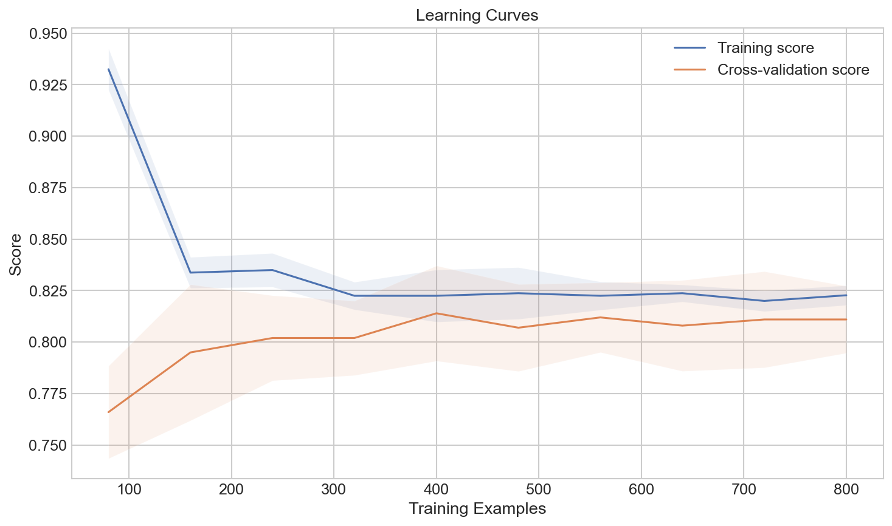
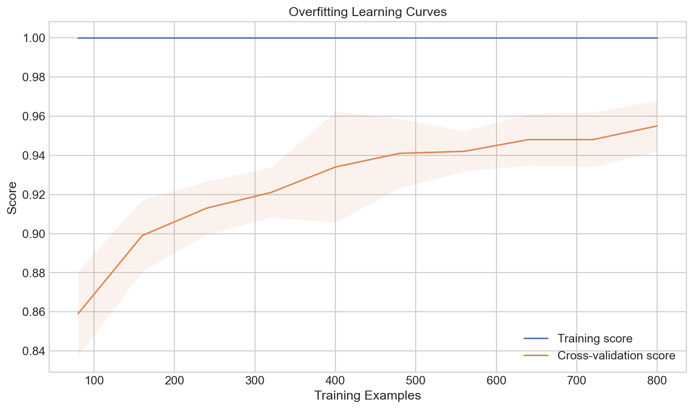
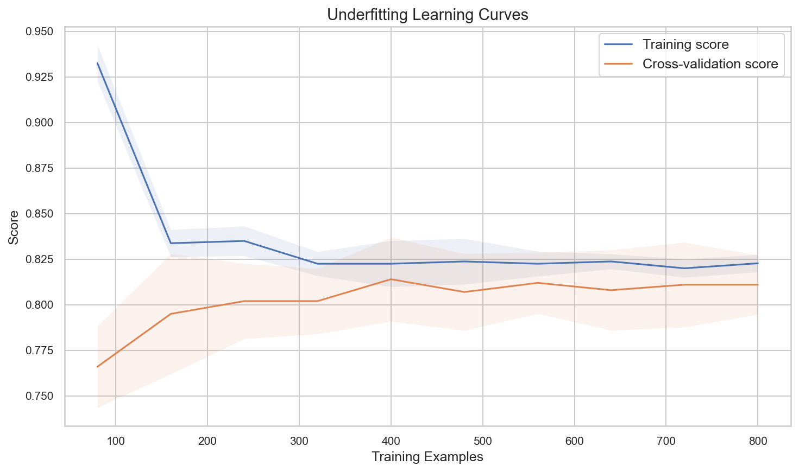

# Learning Curves

**After this lesson:** you can explain the core ideas in “Learning Curves” and reproduce the examples here in your own notebook or environment.

## Overview

**Learning curves**: training vs validation error vs sample size—diagnosing bias, variance, and data needs.

## Helpful video

StatQuest: why cross-validation matters for model evaluation.

<iframe width="560" height="315" src="https://www.youtube.com/embed/fSytzGwwBVw" title="Machine Learning Fundamentals: Cross Validation" frameborder="0" allow="accelerometer; autoplay; clipboard-write; encrypted-media; gyroscope; picture-in-picture" allowfullscreen></iframe>

## Introduction

Learning curves are powerful tools for diagnosing model performance and understanding how our model learns from data. They help us identify issues like overfitting and underfitting, and guide us in making better decisions about model complexity and data requirements.

## What are Learning Curves?

Learning curves plot the model's performance (e.g., accuracy or error) against the amount of training data. They show us how the model's performance changes as we add more training examples.

### Why Learning Curves Matter

1. Diagnose model performance issues
2. Determine if more data would help
3. Identify overfitting or underfitting
4. Guide model selection and tuning

## Real-World Analogies

### The Student Learning Analogy

Think of learning curves like a student's progress:

- Training curve: How well the student performs on practice problems
- Validation curve: How well the student performs on new problems
- Gap between curves: How well the student generalizes

### The Sports Training Analogy

Learning curves are like sports training:

- Training curve: Performance in practice
- Validation curve: Performance in games
- Gap between curves: Ability to apply skills in real situations

## Understanding Learning Curves



> **Figure (add screenshot or diagram):** Three side-by-side learning curve plots (x-axis = training set size, y-axis = error): underfitting (both curves high and close), good fit (both curves low and converging), overfitting (training curve low, validation curve high, large gap).

### 1. Ideal Learning Curve

#### `learning_curve` with logistic regression

- **Purpose:** Plot **training vs CV score** as training set size grows—**converging** curves with a small gap usually mean adequate model capacity and generalization.
- **Walkthrough:** `train_sizes` subsamples increasing fractions of `X`; each point is mean/std across **cv** folds (`axis=1` is folds).


import numpy as np
import matplotlib.pyplot as plt
from sklearn.model_selection import learning_curve
from sklearn.datasets import make_classification
from sklearn.linear_model import LogisticRegression

# Create sample dataset
X, y = make_classification(n_samples=1000, n_features=20,
                           n_informative=15, n_redundant=5,
                           random_state=42)

# Calculate learning curves
train_sizes, train_scores, val_scores = learning_curve(
    LogisticRegression(),
    X, y,
    cv=5,
    n_jobs=-1,
    train_sizes=np.linspace(0.1, 1.0, 10)
)

# Calculate mean and standard deviation
train_mean = np.mean(train_scores, axis=1)
train_std = np.std(train_scores, axis=1)
val_mean = np.mean(val_scores, axis=1)
val_std = np.std(val_scores, axis=1)

# Plot learning curves
plt.figure(figsize=(10, 6))
plt.plot(train_sizes, train_mean, label='Training score')
plt.plot(train_sizes, val_mean, label='Cross-validation score')
plt.fill_between(train_sizes, train_mean - train_std, train_mean + train_std, alpha=0.1)
plt.fill_between(train_sizes, val_mean - val_std, val_mean + val_std, alpha=0.1)
plt.xlabel('Training Examples')
plt.ylabel('Score')
plt.title('Learning Curves')
plt.legend(loc='best')
plt.grid(True)
plt.show()


<aside class="code-explainer__callouts" aria-label="Code walkthrough">
  

    

      
      Data and Setup
    

    

      
Generate a 1000-sample binary classification problem; <code>learning_curve</code> will subsample this at 10 increasing fractions from 10% to 100%.

    

  

  

    

      
      Compute Curves
    

    

      
<code>learning_curve</code> returns score arrays shaped (train_size, cv_folds); taking <code>mean(axis=1)</code> and <code>std(axis=1)</code> collapses folds into a single mean and spread per size.

    

  

  

    

      
      Plot with Confidence Bands
    

    

      
<code>fill_between</code> adds a ±1 std band around each curve; converging curves with a narrow gap indicate a well-generalizing model.

    

  

</aside>

### 2. Overfitting Learning Curve

#### Larger MLP (typical gap)

- **Purpose:** Show a **high-capacity** model: training score often stays high while validation lags, producing a **wide gap** (variance).
- **Walkthrough:** Same `learning_curve` call; **must** recompute `train_mean` / `val_mean` from `train_scores` / `val_scores` for this estimator.


from sklearn.neural_network import MLPClassifier

# Calculate learning curves for a complex model
train_sizes, train_scores, val_scores = learning_curve(
    MLPClassifier(hidden_layer_sizes=(100, 50)),
    X, y,
    cv=5,
    n_jobs=-1,
    train_sizes=np.linspace(0.1, 1.0, 10)
)

train_mean = np.mean(train_scores, axis=1)
train_std = np.std(train_scores, axis=1)
val_mean = np.mean(val_scores, axis=1)
val_std = np.std(val_scores, axis=1)

# Plot overfitting learning curves
plt.figure(figsize=(10, 6))
plt.plot(train_sizes, train_mean, label='Training score')
plt.plot(train_sizes, val_mean, label='Cross-validation score')
plt.fill_between(train_sizes, train_mean - train_std, train_mean + train_std, alpha=0.1)
plt.fill_between(train_sizes, val_mean - val_std, val_mean + val_std, alpha=0.1)
plt.xlabel('Training Examples')
plt.ylabel('Score')
plt.title('Overfitting Learning Curves')
plt.legend(loc='best')
plt.grid(True)
plt.show()


<aside class="code-explainer__callouts" aria-label="Code walkthrough">
  

    

      
      High-capacity Model
    

    

      
A two-hidden-layer MLP (100, 50 neurons) is more flexible than logistic regression; its training score typically stays high while validation lags, revealing overfitting.

    

  

  

    

      
      Compute Mean and Std
    

    

      
Same aggregation as the ideal-fit example — collapse CV fold scores into per-size mean and standard deviation for plotting.

    

  

  

    

      
      Overfitting Diagnostic
    

    

      
A large visible gap between the training and validation bands is the visual signature of overfitting — the model memorizes training patterns rather than generalizing.

    

  

</aside>

### 3. Underfitting Learning Curve

#### Dummy baseline (high bias)

- **Purpose:** A **majority-class** dummy shows **both** curves low and close—more data does not fix the wrong model family.
- **Walkthrough:** Recompute means/stds from the new `learning_curve` output.


from sklearn.dummy import DummyClassifier

# Calculate learning curves for a simple model
train_sizes, train_scores, val_scores = learning_curve(
    DummyClassifier(),
    X, y,
    cv=5,
    n_jobs=-1,
    train_sizes=np.linspace(0.1, 1.0, 10)
)

train_mean = np.mean(train_scores, axis=1)
train_std = np.std(train_scores, axis=1)
val_mean = np.mean(val_scores, axis=1)
val_std = np.std(val_scores, axis=1)

# Plot underfitting learning curves
plt.figure(figsize=(10, 6))
plt.plot(train_sizes, train_mean, label='Training score')
plt.plot(train_sizes, val_mean, label='Cross-validation score')
plt.fill_between(train_sizes, train_mean - train_std, train_mean + train_std, alpha=0.1)
plt.fill_between(train_sizes, val_mean - val_std, val_mean + val_std, alpha=0.1)
plt.xlabel('Training Examples')
plt.ylabel('Score')
plt.title('Underfitting Learning Curves')
plt.legend(loc='best')
plt.grid(True)
plt.show()


<aside class="code-explainer__callouts" aria-label="Code walkthrough">
  

    

      
      Dummy Baseline
    

    

      
<code>DummyClassifier</code> predicts the majority class regardless of input — a worst-case underfitter whose plateau score equals the class frequency.

    

  

  

    

      
      Aggregate Scores
    

    

      
Mean and std across folds collapse the raw score matrix to per-size statistics, consistent with the previous two examples.

    

  

  

    

      
      Underfitting Diagnostic
    

    

      
Both curves plateau at a low, flat score with a small gap — the characteristic shape of underfitting where more data provides no improvement.

    

  

</aside>

## Interpreting Learning Curves

### 1. High Bias (Underfitting)

- Both curves plateau at low performance
- Small gap between curves
- More data won't help much

### 2. High Variance (Overfitting)

- Training curve much higher than validation curve
- Large gap between curves
- More data might help

### 3. Good Fit

- Both curves plateau at high performance
- Small gap between curves
- Model generalizes well

## Best Practices

1. **Data Preparation**
   - Use sufficient training data
   - Clean and preprocess data
   - Handle outliers appropriately

2. **Model Selection**
   - Start with simple models
   - Gradually increase complexity
   - Use cross-validation

3. **Regularization**
   - Apply appropriate regularization
   - Tune regularization parameters
   - Monitor validation performance

4. **Monitoring**
   - Track training and validation metrics
   - Use learning curves
   - Implement early stopping

## Common Mistakes to Avoid

1. **Overfitting**
   - Using too complex models
   - Not using validation sets
   - Ignoring regularization

2. **Underfitting**
   - Using too simple models
   - Not considering feature engineering
   - Insufficient training time

## Additional Resources

1. Scikit-learn documentation
2. Research papers on model complexity
3. Online tutorials on regularization
