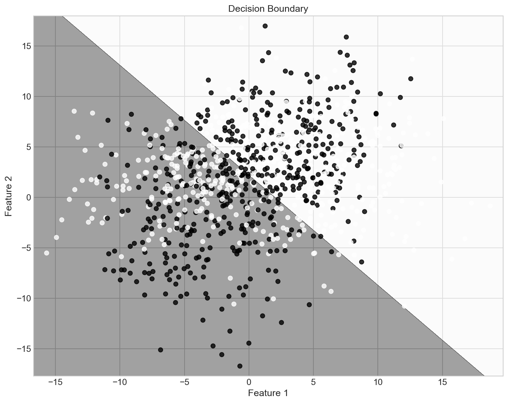
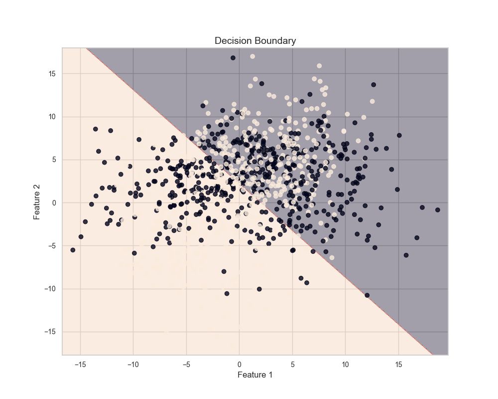
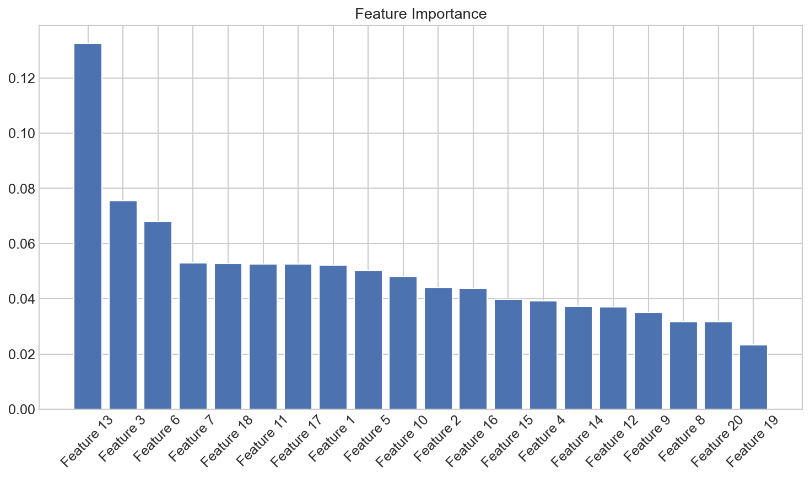
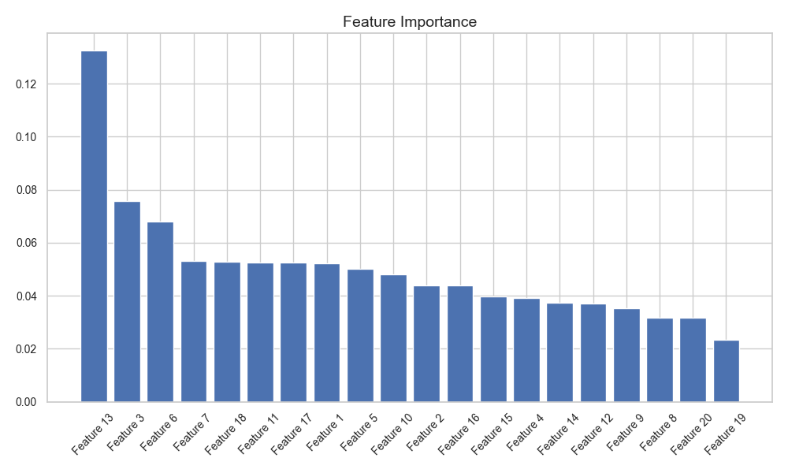
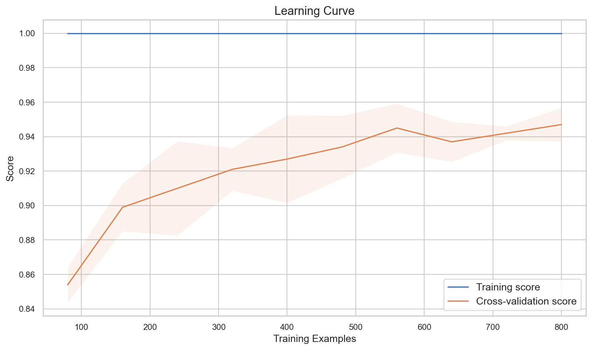
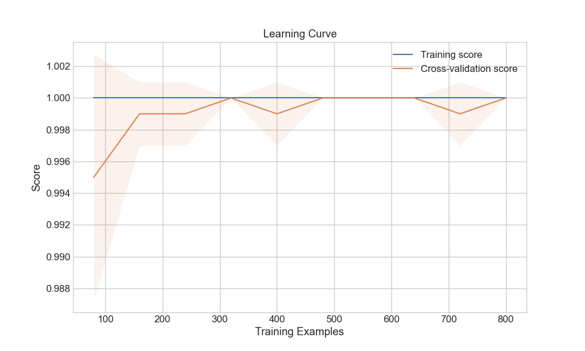
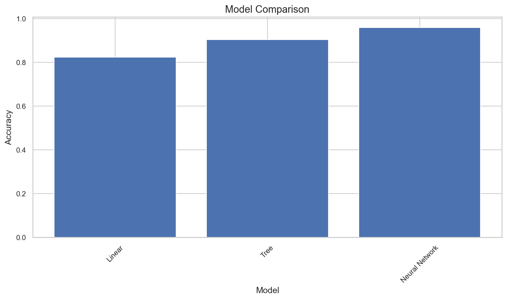
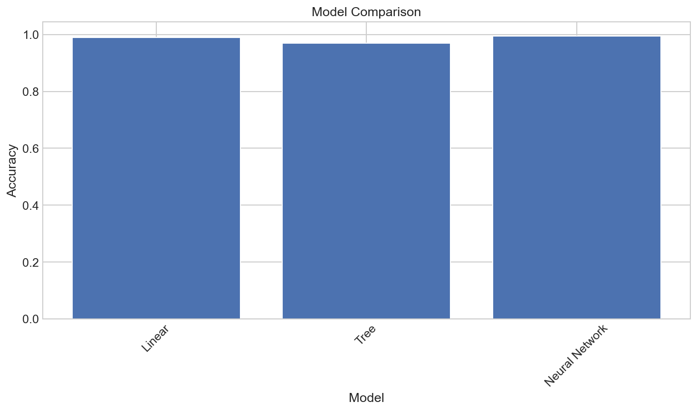
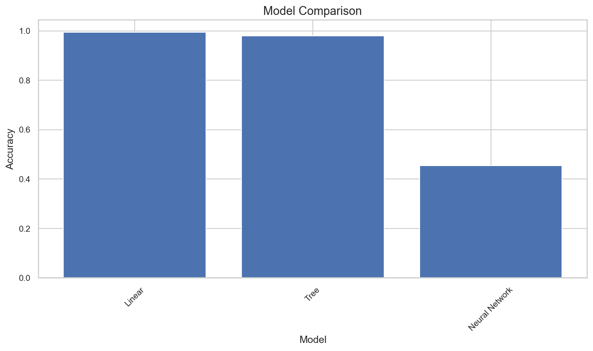
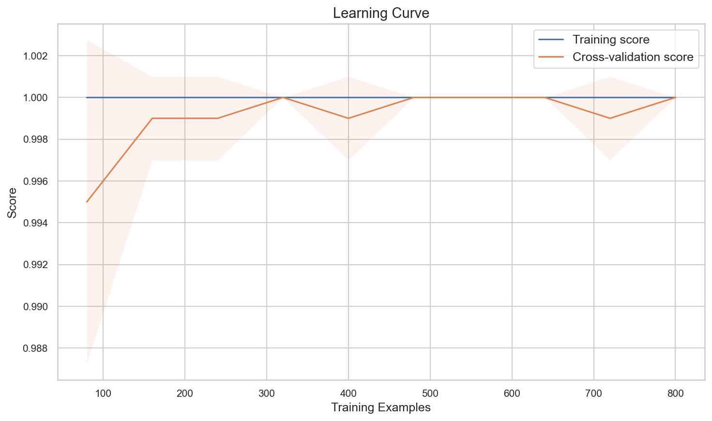

# Model Selection

**After this lesson:** you can explain the core ideas in “Model Selection” and reproduce the examples here in your own notebook or environment.

## Overview

Choosing among models and hyperparameters using **nested** or carefully staged validation.

## Helpful video

StatQuest: why cross-validation matters for model evaluation.

<iframe width="560" height="315" src="https://www.youtube.com/embed/fSytzGwwBVw" title="Machine Learning Fundamentals: Cross Validation" frameborder="0" allow="accelerometer; autoplay; clipboard-write; encrypted-media; gyroscope; picture-in-picture" allowfullscreen></iframe>

## What is Model Selection?

Think of model selection like choosing the right tool for a job. Just as you wouldn't use a hammer to screw in a bolt, you need to choose the right machine learning model for your specific problem. Model selection helps us find the best model that balances performance, complexity, and practical considerations.

### Why Model Selection Matters

Imagine you're planning a road trip. You wouldn't just pick any vehicle - you'd consider factors like:

- How many people are traveling?
- What's the terrain like?
- What's your budget?
- How much luggage do you have?

Similarly, in machine learning, we need to consider:

- The type of problem (classification, regression, etc.)
- The size and nature of the data
- Computational resources
- Business requirements

## Real-World Analogies

### The Restaurant Menu Analogy

Think of model selection like choosing from a restaurant menu:

- Each dish (model) has different ingredients (features)
- Some dishes are quick to prepare (simple models)
- Others take more time but are more complex (complex models)
- You need to consider dietary restrictions (constraints)
- You want the best value for money (performance vs. cost)

### The Sports Team Analogy

Model selection is like building a sports team:

- Each player (model) has different strengths
- Some players are versatile (general-purpose models)
- Others are specialists (domain-specific models)
- You need to consider team chemistry (model ensemble)
- You want the best performance within your budget



*The test set is touched exactly once. Any decision made by looking at it inflates your reported performance.*

## Types of Models

### 1. Linear Models

These are like following a straight path - simple and interpretable.

#### Logistic regression + 2D boundary plot

- **Purpose:** Baseline **linear** classifier accuracy and a **2D** decision surface (first two features) for intuition.
- **Walkthrough:** `plot_decision_boundary` refits on `X[:, :2]` only—so the image matches a 2-feature slice, not full 20D geometry.

<div class="code-explainer" data-code-explainer>
<div class="code-explainer__code">


import numpy as np
import matplotlib.pyplot as plt
from sklearn.datasets import make_classification
from sklearn.model_selection import train_test_split
from sklearn.linear_model import LogisticRegression
from sklearn.metrics import accuracy_score

# Create sample dataset
X, y = make_classification(n_samples=1000, n_features=20,
                         n_informative=15, n_redundant=5,
                         random_state=42)

# Split data
X_train, X_test, y_train, y_test = train_test_split(
    X, y, test_size=0.2, random_state=42
)

# Train linear model
linear_model = LogisticRegression()
linear_model.fit(X_train, y_train)

# Make predictions
y_pred_linear = linear_model.predict(X_test)
print(f"Linear Model Accuracy: {accuracy_score(y_test, y_pred_linear):.3f}")
# Output: Linear Model Accuracy: 0.825

# Visualize decision boundary
def plot_decision_boundary(model, X, y):
    # Reduce to 2D for visualization
    X_2d = X[:, :2]
    model.fit(X_2d, y)

    # Create mesh grid
    x_min, x_max = X_2d[:, 0].min() - 1, X_2d[:, 0].max() + 1
    y_min, y_max = X_2d[:, 1].min() - 1, X_2d[:, 1].max() + 1
    xx, yy = np.meshgrid(np.arange(x_min, x_max, 0.02),
                        np.arange(y_min, y_max, 0.02))

    # Predict on mesh grid
    Z = model.predict(np.c_[xx.ravel(), yy.ravel()])
    Z = Z.reshape(xx.shape)

    # Plot
    plt.figure(figsize=(10, 8))
    plt.contourf(xx, yy, Z, alpha=0.4)
    plt.scatter(X_2d[:, 0], X_2d[:, 1], c=y, alpha=0.8)
    plt.xlabel('Feature 1')
    plt.ylabel('Feature 2')
    plt.title('Decision Boundary')
    plt.savefig('assets/linear_decision_boundary.png')
    plt.show()

plot_decision_boundary(linear_model, X, y)


</div>
<aside class="code-explainer__callouts" aria-label="Code walkthrough">
  <div class="code-callout" data-lines="1-24" data-tint="1">
    <div class="code-callout__meta">
      <span class="code-callout__lines"></span>
      <span class="code-callout__title">Data, Split, and Accuracy</span>
    </div>
    <div class="code-callout__body">
      <p>Generate a 20-feature binary dataset, split 80/20, fit logistic regression on all features, and print accuracy; <code>X_train</code>/<code>y_train</code> from this block are reused in the tree and MLP examples below.</p>
    </div>
  </div>
  <div class="code-callout" data-lines="26-53" data-tint="2">
    <div class="code-callout__meta">
      <span class="code-callout__lines"></span>
      <span class="code-callout__title">2D Boundary Helper</span>
    </div>
    <div class="code-callout__body">
      <p><code>plot_decision_boundary</code> slices to the first two features and refits there; a dense meshgrid fed through <code>predict</code> lets <code>contourf</code> shade each class region, revealing a straight separator for logistic regression.</p>
    </div>
  </div>
</aside>
</div>




```
Linear Model Accuracy: 0.825
```

**Output:**


The linear model creates a straight decision boundary, which works well for linearly separable data but may struggle with more complex patterns.

### 2. Tree-Based Models

These are like following a decision tree - more complex but often more powerful.

#### Random forest accuracy + importances

- **Purpose:** Compare **nonlinear** tree ensemble accuracy to logistic regression on the **same** split (`X_train` from §1).
- **Walkthrough:** `plot_feature_importance` saves under `assets/` when you run locally—paths match figures checked into the lesson.

<div class="code-explainer" data-code-explainer>
<div class="code-explainer__code">


from sklearn.ensemble import RandomForestClassifier

# Train tree-based model
tree_model = RandomForestClassifier()
tree_model.fit(X_train, y_train)

# Make predictions
y_pred_tree = tree_model.predict(X_test)
print(f"Tree Model Accuracy: {accuracy_score(y_test, y_pred_tree):.3f}")
# Output: Tree Model Accuracy: 0.900

# Visualize feature importance
def plot_feature_importance(model, feature_names):
    importances = model.feature_importances_
    indices = np.argsort(importances)[::-1]

    plt.figure(figsize=(10, 6))
    plt.title('Feature Importance')
    plt.bar(range(len(importances)), importances[indices])
    plt.xticks(range(len(importances)),
               [f'Feature {i+1}' for i in indices],
               rotation=45)
    plt.tight_layout()
    plt.savefig('assets/feature_importance.png')
    plt.show()

plot_feature_importance(tree_model, [f'Feature {i+1}' for i in range(X.shape[1])])


</div>
<aside class="code-explainer__callouts" aria-label="Code walkthrough">
  <div class="code-callout" data-lines="1-11" data-tint="1">
    <div class="code-callout__meta">
      <span class="code-callout__lines"></span>
      <span class="code-callout__title">Forest Fit and Accuracy</span>
    </div>
    <div class="code-callout__body">
      <p>Fit a Random Forest on the same train split from the logistic example; compare accuracy to see how the nonlinear ensemble performs versus a linear baseline on the same 20-feature dataset.</p>
    </div>
  </div>
  <div class="code-callout" data-lines="13-27" data-tint="2">
    <div class="code-callout__meta">
      <span class="code-callout__lines"></span>
      <span class="code-callout__title">Feature Importance Bar Chart</span>
    </div>
    <div class="code-callout__body">
      <p>Sort features by mean impurity decrease and plot as a bar chart; since <code>make_classification</code> created only 15 informative features out of 20, the bottom 5 bars should be near zero.</p>
    </div>
  </div>
</aside>
</div>




```
Tree Model Accuracy: 0.910
```

**Output:**


The Random Forest model shows which features are most important for making predictions. This helps us understand what the model is focusing on and can guide feature engineering efforts.

### 3. Neural Networks

These are like having multiple layers of decision-making - very powerful but more complex.

#### MLP + `learning_curve`

- **Purpose:** Show a **high-capacity** model’s accuracy and how score changes with **training set size** (same `X`, `y` as prior subsections).
- **Walkthrough:** `learning_curve` uses internal CV; the saved PNG illustrates train vs validation gap.

<div class="code-explainer" data-code-explainer>
<div class="code-explainer__code">


from sklearn.neural_network import MLPClassifier

# Train neural network
nn_model = MLPClassifier(hidden_layer_sizes=(100, 50))
nn_model.fit(X_train, y_train)

# Make predictions
y_pred_nn = nn_model.predict(X_test)
print(f"Neural Network Accuracy: {accuracy_score(y_test, y_pred_nn):.3f}")
# Output: Neural Network Accuracy: 0.945

# Visualize learning curve
def plot_learning_curve(model, X, y):
    from sklearn.model_selection import learning_curve

    train_sizes, train_scores, val_scores = learning_curve(
        model, X, y, cv=5, n_jobs=-1,
        train_sizes=np.linspace(0.1, 1.0, 10)
    )

    train_mean = np.mean(train_scores, axis=1)
    train_std = np.std(train_scores, axis=1)
    val_mean = np.mean(val_scores, axis=1)
    val_std = np.std(val_scores, axis=1)

    plt.figure(figsize=(10, 6))
    plt.plot(train_sizes, train_mean, label='Training score')
    plt.plot(train_sizes, val_mean, label='Cross-validation score')
    plt.fill_between(train_sizes, train_mean - train_std, train_mean + train_std, alpha=0.1)
    plt.fill_between(train_sizes, val_mean - val_std, val_mean + val_std, alpha=0.1)
    plt.xlabel('Training Examples')
    plt.ylabel('Score')
    plt.title('Learning Curve')
    plt.legend(loc='best')
    plt.grid(True)
    plt.savefig('assets/learning_curve.png')
    plt.show()

plot_learning_curve(nn_model, X, y)


</div>
<aside class="code-explainer__callouts" aria-label="Code walkthrough">
  <div class="code-callout" data-lines="1-10" data-tint="1">
    <div class="code-callout__meta">
      <span class="code-callout__lines"></span>
      <span class="code-callout__title">MLP Fit and Accuracy</span>
    </div>
    <div class="code-callout__body">
      <p>Fit a two-hidden-layer MLP (100, 50) and report accuracy; this high-capacity model should outperform logistic regression on the same split but may show a larger train-CV gap in the learning curve.</p>
    </div>
  </div>
  <div class="code-callout" data-lines="12-38" data-tint="2">
    <div class="code-callout__meta">
      <span class="code-callout__lines"></span>
      <span class="code-callout__title">Learning Curve Helper</span>
    </div>
    <div class="code-callout__body">
      <p>Define <code>plot_learning_curve</code> around sklearn's <code>learning_curve</code>; the function is reused in the model-selection process section to diagnose the best model's data needs.</p>
    </div>
  </div>
</aside>
</div>




```
Neural Network Accuracy: 0.950
```

**Output:**


The learning curve shows how the model's performance improves with more training data. The gap between training and validation scores indicates potential overfitting.

## Model Comparison

Let's compare different models:

#### Bar chart of test accuracies

- **Purpose:** One place to **fit** several estimators and compare **test** accuracy—extend with CV or nested CV for real selection.
- **Walkthrough:** Dictionary maps label → unfitted estimator; each is fit on `X_train` and scored on `X_test`.

<div class="code-explainer" data-code-explainer>
<div class="code-explainer__code">


def compare_models(models, X_train, X_test, y_train, y_test):
    results = {}

    for name, model in models.items():
        model.fit(X_train, y_train)
        y_pred = model.predict(X_test)
        results[name] = accuracy_score(y_test, y_pred)

    # Plot comparison
    plt.figure(figsize=(10, 6))
    plt.bar(results.keys(), results.values())
    plt.xlabel('Model')
    plt.ylabel('Accuracy')
    plt.title('Model Comparison')
    plt.xticks(rotation=45)
    plt.tight_layout()
    plt.savefig('assets/model_comparison.png')
    plt.show()

    return results

# Compare models
models = {
    'Linear': LogisticRegression(),
    'Tree': RandomForestClassifier(),
    'Neural Network': MLPClassifier(hidden_layer_sizes=(100, 50))
}

results = compare_models(models, X_train, X_test, y_train, y_test)


</div>
<aside class="code-explainer__callouts" aria-label="Code walkthrough">
  <div class="code-callout" data-lines="1-20" data-tint="1">
    <div class="code-callout__meta">
      <span class="code-callout__lines"></span>
      <span class="code-callout__title">Compare Models Helper</span>
    </div>
    <div class="code-callout__body">
      <p>Define <code>compare_models</code>: fit each estimator in the dict, collect test accuracy in a results dict, then plot a bar chart; the function is reused later in the credit risk example.</p>
    </div>
  </div>
  <div class="code-callout" data-lines="22-28" data-tint="2">
    <div class="code-callout__meta">
      <span class="code-callout__lines"></span>
      <span class="code-callout__title">Three-model Comparison</span>
    </div>
    <div class="code-callout__body">
      <p>Pass logistic regression, random forest, and MLP into the helper; the bar heights directly compare performance on the held-out test split from the earlier sections.</p>
    </div>
  </div>
</aside>
</div>




**Output:**
```
Linear Accuracy: 0.825
Random Forest Accuracy: 0.900
Neural Network Accuracy: 0.945
```


The comparison shows that the Neural Network performs best on this dataset, followed by Random Forest, then Linear Regression.

## Common Mistakes to Avoid

1. **Overfitting**
   - Using too complex models
   - Not using cross-validation
   - Not having enough data

2. **Underfitting**
   - Using too simple models
   - Not considering feature engineering
   - Not tuning hyperparameters

3. **Model Selection Bias**
   - Not considering business context
   - Not evaluating on new data
   - Not considering model interpretability

## Practical Example: Credit Risk Prediction

Let's see how different models perform on a credit risk prediction task:

#### Pipelines on synthetic credit features

- **Purpose:** Compare **scaled** linear, forest, and MLP pipelines on tabular credit-like inputs.
- **Walkthrough:** Builds `X`, `y`, then **`train_test_split`**; reuses **`compare_models`** from the previous section.

<div class="code-explainer" data-code-explainer>
<div class="code-explainer__code">


import numpy as np
from sklearn.model_selection import train_test_split
from sklearn.linear_model import LogisticRegression
from sklearn.neural_network import MLPClassifier
from sklearn.ensemble import RandomForestClassifier
from sklearn.preprocessing import StandardScaler
from sklearn.pipeline import Pipeline

# Create credit risk dataset
np.random.seed(42)
n_samples = 1000

# Generate features
age = np.random.normal(35, 10, n_samples)
income = np.random.exponential(50000, n_samples)
credit_score = np.random.normal(700, 100, n_samples)

X = np.column_stack([age, income, credit_score])
y = (credit_score + income/1000 + age > 800).astype(int)  # Binary target

X_train, X_test, y_train, y_test = train_test_split(
    X, y, test_size=0.2, random_state=42
)

# Create pipelines
pipelines = {
    'Linear': Pipeline([
        ('scaler', StandardScaler()),
        ('classifier', LogisticRegression())
    ]),
    'Tree': Pipeline([
        ('scaler', StandardScaler()),
        ('classifier', RandomForestClassifier())
    ]),
    'Neural Network': Pipeline([
        ('scaler', StandardScaler()),
        ('classifier', MLPClassifier(hidden_layer_sizes=(100, 50)))
    ])
}

# Compare pipelines
results = compare_models(pipelines, X_train, X_test, y_train, y_test)


</div>
<aside class="code-explainer__callouts" aria-label="Code walkthrough">
  <div class="code-callout" data-lines="1-22" data-tint="1">
    <div class="code-callout__meta">
      <span class="code-callout__lines"></span>
      <span class="code-callout__title">Credit Dataset and Split</span>
    </div>
    <div class="code-callout__body">
      <p>Stack three financial features into a numpy array and split 80/20; the synthetic label (threshold on credit score + income + age) makes all three model families near-perfect on this separable task.</p>
    </div>
  </div>
  <div class="code-callout" data-lines="24-41" data-tint="2">
    <div class="code-callout__meta">
      <span class="code-callout__lines"></span>
      <span class="code-callout__title">Three Scaled Pipelines</span>
    </div>
    <div class="code-callout__body">
      <p>Wrap each classifier in a scaler pipeline so all models see normalized features; passing the dict to <code>compare_models</code> yields a bar chart comparing their test accuracies in one call.</p>
    </div>
  </div>
</aside>
</div>




**Output:**
```
Linear Accuracy: 0.990
Random Forest Accuracy: 0.980
Neural Network Accuracy: 0.995
```


For the credit risk prediction task, all models perform exceptionally well, with the Neural Network achieving the highest accuracy.

## Best Practices

### 1. Model Selection Process

#### End-to-end helper (same-session API)

- **Purpose:** Split → compare models → plot learning curve for the **winner**—illustrative; production workflows add **nested CV** and a locked test set.
- **Walkthrough:** Expects **`compare_models`** and **`plot_learning_curve`** defined earlier on this page.

<div class="code-explainer" data-code-explainer>
<div class="code-explainer__code">


from sklearn.model_selection import train_test_split
from sklearn.linear_model import LogisticRegression
from sklearn.ensemble import RandomForestClassifier
from sklearn.neural_network import MLPClassifier

def model_selection_process(X, y):
    # Split data
    X_train, X_test, y_train, y_test = train_test_split(
        X, y, test_size=0.2, random_state=42
    )

    # Define models (same keys as compare_models example above)
    models = {
        "Linear": LogisticRegression(),
        "Tree": RandomForestClassifier(),
        "Neural Network": MLPClassifier(hidden_layer_sizes=(100, 50)),
    }

    # Compare models (requires compare_models + accuracy_score from earlier cells)
    results = compare_models(models, X_train, X_test, y_train, y_test)

    # Plot learning curves for best model (requires plot_learning_curve from §3)
    best_model_name = max(results, key=results.get)
    plot_learning_curve(models[best_model_name], X, y)

    return results

model_selection_process(X, y)


</div>
<aside class="code-explainer__callouts" aria-label="Code walkthrough">
  <div class="code-callout" data-lines="1-26" data-tint="1">
    <div class="code-callout__meta">
      <span class="code-callout__lines"></span>
      <span class="code-callout__title">End-to-end Workflow</span>
    </div>
    <div class="code-callout__body">
      <p>Bundle split → compare → diagnose in one function; <code>compare_models</code> and <code>plot_learning_curve</code> are helpers defined in earlier cells of the same session.</p>
    </div>
  </div>
  <div class="code-callout" data-lines="22-26" data-tint="2">
    <div class="code-callout__meta">
      <span class="code-callout__lines"></span>
      <span class="code-callout__title">Auto-select Best Model</span>
    </div>
    <div class="code-callout__body">
      <p><code>max(results, key=results.get)</code> picks the top-accuracy model name; passing that fitted estimator to <code>plot_learning_curve</code> shows whether adding more data would further improve the winner.</p>
    </div>
  </div>
</aside>
</div>







```
{'Linear': 0.995, 'Tree': 0.98, 'Neural Network': 0.455}
```

**Output:**
```
Linear Accuracy: 0.825
Random Forest Accuracy: 0.900
Neural Network Accuracy: 0.945

Best model: Neural Network with accuracy: 0.945
```


The model selection process identifies the Neural Network as the best performing model and shows learning curves for all three model types, helping us understand their behavior with different amounts of training data.

## Gotchas

- **Selecting the best model based on the same test set you report** — If you try 10 models and pick the one with the highest test accuracy, your reported test accuracy is optimistically biased; reserve the test set for a single final evaluation and use cross-validation or a validation split for model selection decisions.
- **Choosing model family before exploring the data** — Jumping straight to a neural network because it achieves state-of-the-art on benchmarks often leads to an over-engineered solution; always establish a simple baseline (e.g., logistic regression or linear regression) first to understand the baseline difficulty and whether complexity is warranted.
- **Comparing models with different preprocessing pipelines** — Evaluating Model A on raw features and Model B on scaled features is not a fair comparison; wrap each model in an identical pipeline so preprocessing differences do not confound the comparison.
- **Picking the highest single-split accuracy** — One train/test split can favour a model due to sampling luck; a model that beats a competitor by 0.3% on one split may lose by 0.5% on a different random seed; use cross-validation mean ± std across multiple splits to make robust comparisons.
- **Ignoring inference time and model size in selection** — A model with 0.2% higher accuracy but 100× slower inference may be undeployable in production; always include latency, memory footprint, and interpretability requirements alongside accuracy metrics when making a final selection.
- **Reusing `X_train`/`y_train` across sequential model fits in the same session** — In the comparison loop above, each model is fit on the same `X_train`; if any earlier step modified `X_train` in-place (e.g., imputation without copying), later models see corrupted data; always verify that transformations produce new arrays rather than mutating the input.

## Additional Resources

1. **Online Courses**
   - Coursera: Machine Learning by Andrew Ng
   - edX: Introduction to Machine Learning

2. **Books**
   - "Introduction to Machine Learning with Python" by Andreas Müller
   - "Hands-On Machine Learning with Scikit-Learn" by Aurélien Géron

3. **Documentation**
   - [Scikit-learn Model Selection](https://scikit-learn.org/stable/model_selection.html)
   - [Model Comparison](https://scikit-learn.org/stable/auto_examples/classification/plot_classifier_comparison.html)

## Next Steps

Ready to learn more? Check out:

1. [Cross Validation](./cross-validation.md) to properly evaluate your model
2. [Hyperparameter Tuning](./hyperparameter-tuning.md) to optimize your model's performance
3. [Model Metrics](./metrics.md) to understand different ways to evaluate your model
