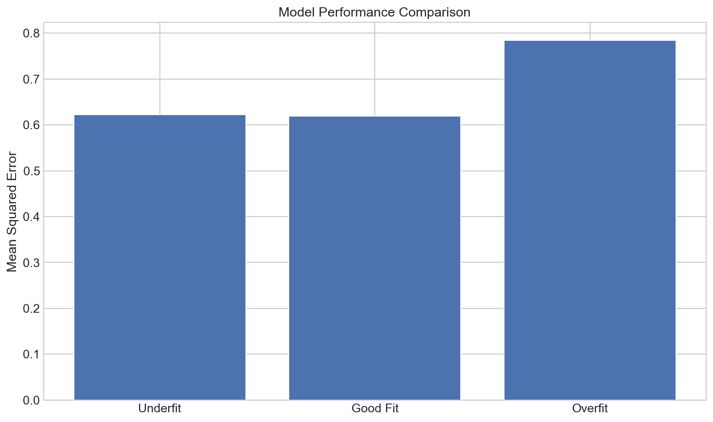

# Overfitting and Underfitting

**After this lesson:** you can explain the core ideas in “Overfitting and Underfitting” and reproduce the examples here in your own notebook or environment.

## Overview

Recognizing **over** vs **under**fitting from learning curves and error gaps—not only training loss.

## Helpful video

StatQuest: why cross-validation matters for model evaluation.

<iframe width="560" height="315" src="https://www.youtube.com/embed/fSytzGwwBVw" title="Machine Learning Fundamentals: Cross Validation" frameborder="0" allow="accelerometer; autoplay; clipboard-write; encrypted-media; gyroscope; picture-in-picture" allowfullscreen></iframe>

## Introduction

Understanding overfitting and underfitting is crucial for building effective machine learning models. These concepts help us diagnose model performance and make better decisions about model complexity.

## What is Overfitting?

Overfitting occurs when a model learns the training data too well, including its noise and outliers. Think of it like memorizing answers for a test without understanding the underlying concepts.

### Signs of Overfitting

1. High training accuracy but low test accuracy
2. Model performs poorly on new data
3. Model captures noise in the training data
4. Complex decision boundaries

## What is Underfitting?

Underfitting happens when a model is too simple to capture the underlying patterns in the data. It's like trying to solve a complex problem with an oversimplified approach.

### Signs of Underfitting

1. Low training accuracy
2. Low test accuracy
3. Model fails to capture important patterns
4. Simple decision boundaries



*The learning curve is the fastest diagnostic: plot train and validation error vs training set size. A large gap between the two curves signals overfitting; both curves high signals underfitting.*

## Real-World Analogies

### The Student Analogy

Think of overfitting and underfitting like different study approaches:

- Overfitting: Memorizing specific questions and answers
- Underfitting: Only learning basic concepts
- Good fit: Understanding concepts and applying them to new problems

### The Weather Forecast Analogy

Model fitting is like weather forecasting:

- Overfitting: Predicting exact temperatures for specific locations
- Underfitting: Always predicting the same temperature
- Good fit: Making accurate predictions based on patterns

## Solutions

### For Overfitting

1. Increase training data
2. Use regularization
3. Simplify the model
4. Use cross-validation
5. Apply early stopping

### For Underfitting

1. Add more features
2. Increase model complexity
3. Reduce regularization
4. Train for longer
5. Use more sophisticated algorithms

## Practical Example

#### Polynomial degree vs test MSE

- **Purpose:** On **noisy linear** data, compare **too-simple** (linear), **reasonable** (low-degree poly), and **too-flexible** (high-degree poly) models by **test MSE**.
- **Walkthrough:** `PolynomialFeatures` + `LinearRegression`; high degree fits training noise → larger error on `X_test`.


import numpy as np
import matplotlib.pyplot as plt
from sklearn.model_selection import train_test_split
from sklearn.linear_model import LinearRegression
from sklearn.preprocessing import PolynomialFeatures
from sklearn.metrics import mean_squared_error

# Generate sample data
np.random.seed(42)
X = np.linspace(0, 10, 100)
y = 2 * X + np.random.normal(0, 1, 100)

# Split data
X_train, X_test, y_train, y_test = train_test_split(
    X.reshape(-1, 1), y, test_size=0.2, random_state=42
)

# Create models of different complexities
models = {
    'Underfit': LinearRegression(),
    'Good Fit': PolynomialFeatures(degree=2),
    'Overfit': PolynomialFeatures(degree=15)
}

# Train and evaluate models
results = {}
for name, model in models.items():
    if name == 'Underfit':
        model.fit(X_train, y_train)
        y_pred = model.predict(X_test)
    else:
        X_train_poly = model.fit_transform(X_train)
        X_test_poly = model.transform(X_test)
        reg = LinearRegression()
        reg.fit(X_train_poly, y_train)
        y_pred = reg.predict(X_test_poly)

    results[name] = mean_squared_error(y_test, y_pred)

# Plot results
plt.figure(figsize=(10, 6))
plt.bar(results.keys(), results.values())
plt.title('Model Performance Comparison')
plt.ylabel('Mean Squared Error')
plt.show()


<aside class="code-explainer__callouts" aria-label="Code walkthrough">
  

    

      
      Data Generation
    

    

      
Create 100 points from the linear function <code>2x</code> with Gaussian noise, then split 80/20 to measure out-of-sample performance for each model.

    

  

  

    

      
      Model Complexity Spectrum
    

    

      
Three models span the complexity range: linear (underfitting), degree-2 polynomial (good fit), and degree-15 polynomial (overfitting to noise).

    

  

  

    

      
      Fit and Evaluate
    

    

      
For polynomial models, features are expanded with <code>fit_transform</code> (train only), then a fresh <code>LinearRegression</code> fits the expanded training set and scores on test.

    

  

  

    

      
      MSE Bar Chart
    

    

      
A bar chart of test MSE across the three models visually confirms that degree-15 produces the largest error despite fitting training data perfectly.

    

  

</aside>

## Best Practices

1. **Data Preparation**
   - Use sufficient training data
   - Clean and preprocess data
   - Handle outliers appropriately

2. **Model Selection**
   - Start with simple models
   - Gradually increase complexity
   - Use cross-validation

3. **Regularization**
   - Apply appropriate regularization
   - Tune regularization parameters
   - Monitor validation performance

4. **Monitoring**
   - Track training and validation metrics
   - Use learning curves
   - Implement early stopping

## Common Mistakes to Avoid

1. **Overfitting**
   - Using too complex models
   - Not using validation sets
   - Ignoring regularization

2. **Underfitting**
   - Using too simple models
   - Not considering feature engineering
   - Insufficient training time

## Gotchas

- **Diagnosing overfitting from training accuracy alone** — A training accuracy of 99% is only concerning if validation accuracy is significantly lower; high training accuracy combined with high, similar validation accuracy is a sign of a good model, not overfitting; always compare both curves before drawing conclusions.
- **Treating small training sets as underfitting** — If you have 50 samples and a complex model memorises them perfectly (training accuracy 100%), that is overfitting, not good generalisation; the symptom is a large train-validation gap, not low training accuracy; diagnose from the gap, not the absolute training score.
- **Fixing underfitting by adding training epochs alone** — For gradient-based models, training longer can improve a truly underfit model, but continuing past convergence causes overfitting; monitor validation loss and stop when it stops improving rather than training for a fixed epoch budget.
- **Polynomial degree overfitting is subtler with real data** — The degree-15 polynomial example clearly overfits because the ground truth is linear; in real datasets the "true" function is unknown and a degree-3 or degree-5 polynomial might already overfit; use cross-validation to pick degree rather than relying on visual inspection of a single train/test plot.
- **Assuming regularisation always fixes overfitting** — Regularisation shrinks coefficients and can reduce overfitting, but if the model is structurally wrong for the problem (e.g., linear model on highly non-linear data), regularisation only reduces variance without improving bias; you also need to consider the model family.
- **Ignoring data leakage as a source of apparent overfitting** — A large gap between train and test performance is not always caused by model complexity; if preprocessing was fit on the full dataset or test labels accidentally influenced training, the gap may reflect leakage rather than overfitting, and increasing regularisation will not help.

## Additional Resources

1. Scikit-learn documentation
2. Research papers on model complexity
3. Online tutorials on regularization
