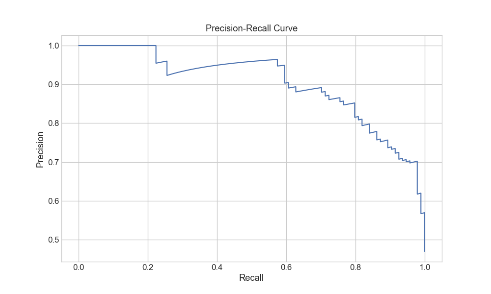
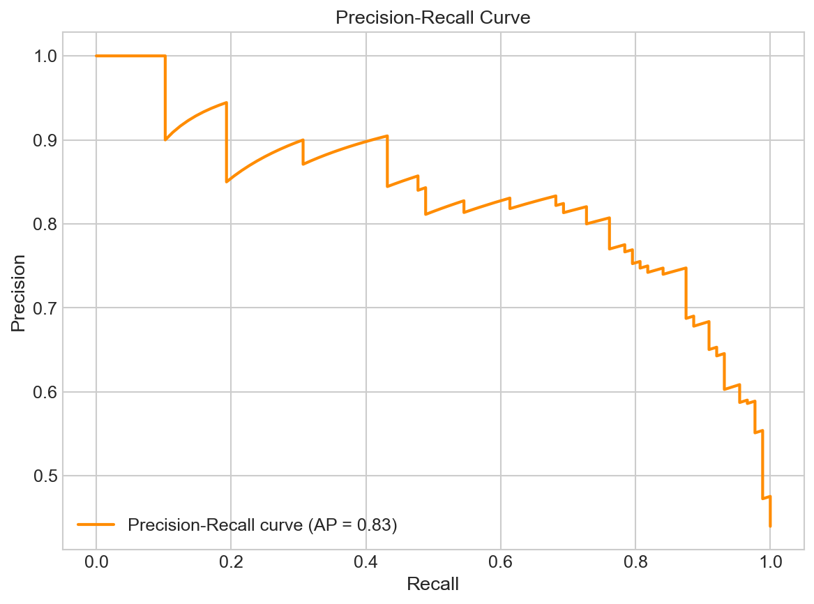
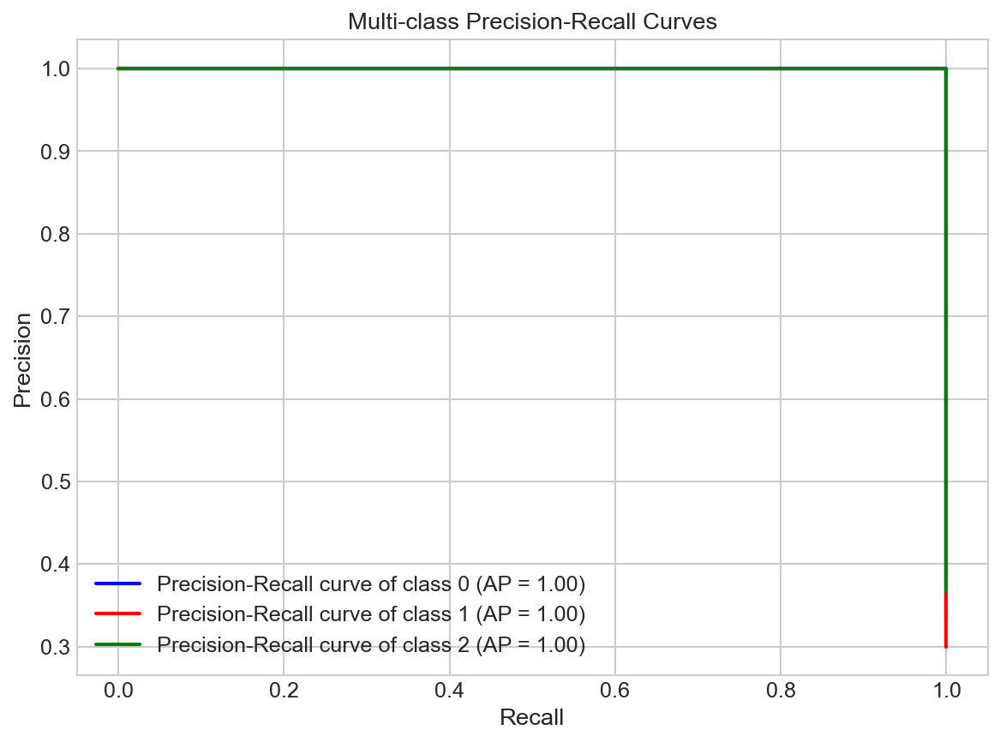
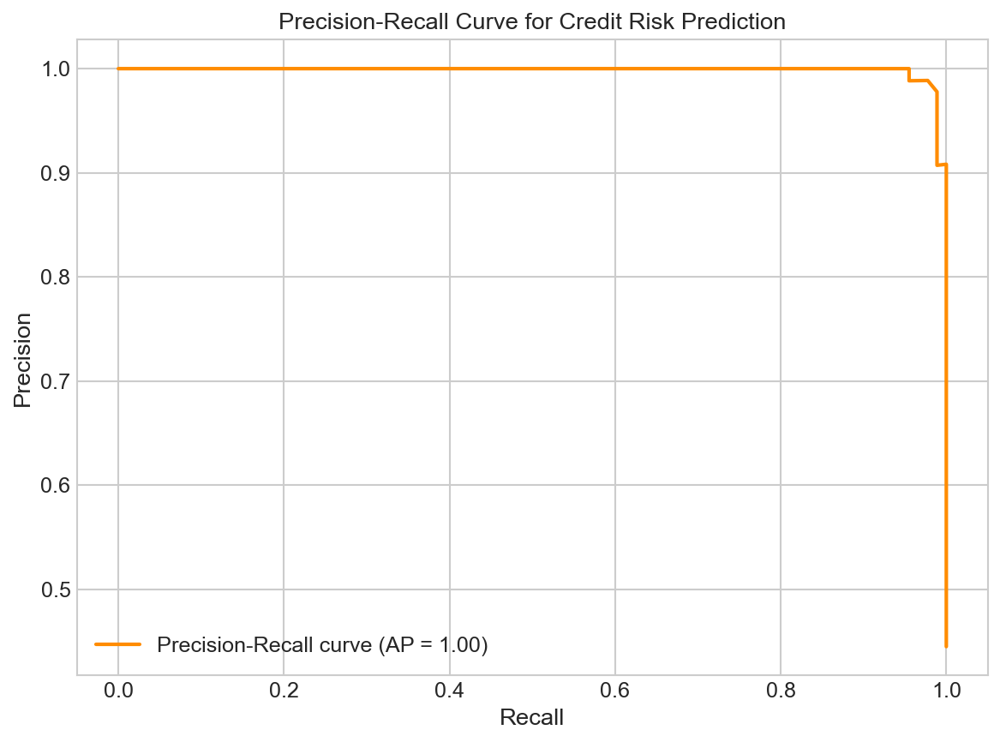

# Precision and Recall

**After this lesson:** you can explain the core ideas in “Precision and Recall” and reproduce the examples here in your own notebook or environment.

## Overview

**Precision** vs **recall**, tradeoffs, and **F1**—especially under imbalance or asymmetric error costs.

## Introduction

Precision and Recall are fundamental metrics in machine learning for evaluating classification models. They provide insights into a model's performance in terms of accuracy and completeness.

### Video Tutorial: Precision and Recall Explained

<iframe width="560" height="315" src="https://www.youtube.com/embed/vP06aMoz4v8" frameborder="0" allow="accelerometer; autoplay; clipboard-write; encrypted-media; gyroscope; picture-in-picture" allowfullscreen></iframe>

*StatQuest: Machine Learning Fundamentals: Sensitivity and Specificity by Josh Starmer*

## What are Precision and Recall?



> **Figure (add screenshot or diagram):** A Precision-Recall curve (x-axis = Recall 0–1, y-axis = Precision 0–1) for a classification model, showing the area under the PR curve (PR-AUC) shaded, with the operating threshold point marked.

### Precision

- **Definition**: Ratio of true positives to all predicted positives
- **Formula**: TP / (TP + FP)
- **Interpretation**: "Of all the cases I predicted as positive, how many were actually positive?"
- **Range**: 0 to 1 (higher is better)
- **Focus**: Quality of positive predictions

### Recall (Sensitivity)

- **Definition**: Ratio of true positives to all actual positives  
- **Formula**: TP / (TP + FN)
- **Interpretation**: "Of all the actual positive cases, how many did I correctly identify?"
- **Range**: 0 to 1 (higher is better)
- **Focus**: Completeness of positive detection

### The Precision-Recall Trade-off

There's typically a trade-off between precision and recall:

- **High Precision, Low Recall**: Very conservative model - when it says "positive," it's usually right, but it misses many positive cases
- **Low Precision, High Recall**: Very liberal model - catches most positive cases but also flags many false positives
- **Balanced**: Moderate precision and recall - good overall performance

### Real-World Examples

**Medical Diagnosis (Cancer Screening):**
- **High Recall Priority**: Don't miss any cancer cases (even if some false alarms)
- **High Precision Priority**: Avoid unnecessary anxiety and procedures

**Email Spam Detection:**
- **High Precision Priority**: Don't block important emails
- **High Recall Priority**: Catch all spam emails

**Fraud Detection:**
- **High Recall Priority**: Catch all fraudulent transactions
- **High Precision Priority**: Don't block legitimate transactions

## Types of Precision-Recall Curves

### 1. Binary Classification

#### PR curve and average precision

- **Purpose:** Plot **precision vs recall** from **predicted probabilities** (not hard labels) and report **average precision** (area-like summary under the PR curve).
- **Walkthrough:** `precision_recall_curve` returns aligned arrays; `average_precision_score` integrates the step function—strong when positives are rare ([ROC](roc-and-auc.md) can look optimistic).


import numpy as np
import matplotlib.pyplot as plt
from sklearn.metrics import precision_recall_curve, average_precision_score
from sklearn.datasets import make_classification
from sklearn.model_selection import train_test_split
from sklearn.linear_model import LogisticRegression

# Generate sample data
X, y = make_classification(n_samples=1000, n_features=20, n_informative=15, random_state=42)
X_train, X_test, y_train, y_test = train_test_split(X, y, test_size=0.2, random_state=42)

# Train model
model = LogisticRegression(random_state=42)
model.fit(X_train, y_train)

# Get prediction probabilities
y_pred_proba = model.predict_proba(X_test)[:, 1]

# Calculate precision-recall curve
precision, recall, thresholds = precision_recall_curve(y_test, y_pred_proba)
average_precision = average_precision_score(y_test, y_pred_proba)

# Plot precision-recall curve
plt.figure(figsize=(8, 6))
plt.plot(recall, precision, color='darkorange', lw=2, label=f'Precision-Recall curve (AP = {average_precision:.2f})')
plt.xlabel('Recall')
plt.ylabel('Precision')
plt.title('Precision-Recall Curve')
plt.legend(loc="lower left")
plt.grid(True)
plt.show()


<figure>

<figcaption>Figure 1: Precision-Recall Curve</figcaption>
</figure>

<aside class="code-explainer__callouts" aria-label="Code walkthrough">
  

    

      
      Data, Model, and Probabilities
    

    

      
Fit logistic regression and extract <code>predict_proba[:, 1]</code> — the positive-class probabilities needed to sweep the threshold for the PR curve.

    

  

  

    

      
      Compute PR Curve
    

    

      
<code>precision_recall_curve</code> returns aligned precision/recall arrays at every unique probability threshold; <code>average_precision_score</code> summarizes the area in one number.

    

  

  

    

      
      Plot Curve
    

    

      
Plot recall on x and precision on y; the AP score in the legend gives a quick summary of the curve's area without reading the shape manually.

    

  

</aside>

### 2. Multi-class Classification

#### One-vs-rest PR curves (Iris)

- **Purpose:** For **multiclass**, draw one PR curve per class by binarizing labels **per class** vs rest—same pattern as multiclass ROC.
- **Walkthrough:** `label_binarize` on `y_test`; loop pairs `y_test_bin[:, i]` with `y_pred_proba[:, i]`; legend shows **AP** per class.


import matplotlib.pyplot as plt
from itertools import cycle
from sklearn.datasets import load_iris
from sklearn.ensemble import RandomForestClassifier
from sklearn.model_selection import train_test_split
from sklearn.preprocessing import label_binarize
from sklearn.metrics import precision_recall_curve, average_precision_score

# Load iris dataset
iris = load_iris()
X, y = iris.data, iris.target
X_train, X_test, y_train, y_test = train_test_split(X, y, test_size=0.2, random_state=42)

# Binarize the output
y_test_bin = label_binarize(y_test, classes=[0, 1, 2])
n_classes = y_test_bin.shape[1]

# Train model
model = RandomForestClassifier(random_state=42)
model.fit(X_train, y_train)

# Get prediction probabilities
y_pred_proba = model.predict_proba(X_test)

# Calculate precision-recall curve for each class
precision = dict()
recall = dict()
average_precision = dict()
for i in range(n_classes):
    precision[i], recall[i], _ = precision_recall_curve(y_test_bin[:, i], y_pred_proba[:, i])
    average_precision[i] = average_precision_score(y_test_bin[:, i], y_pred_proba[:, i])

# Plot precision-recall curves
plt.figure(figsize=(8, 6))
colors = cycle(['blue', 'red', 'green'])
for i, color in zip(range(n_classes), colors):
    plt.plot(recall[i], precision[i], color=color, lw=2,
             label=f'Precision-Recall curve of class {i} (AP = {average_precision[i]:.2f})')
plt.xlabel('Recall')
plt.ylabel('Precision')
plt.title('Multi-class Precision-Recall Curves')
plt.legend(loc="lower left")
plt.grid(True)
plt.show()


<figure>

<figcaption>Figure 2: Multi-class Precision-Recall Curves</figcaption>
</figure>

<aside class="code-explainer__callouts" aria-label="Code walkthrough">
  

    

      
      Binarize Labels
    

    

      
<code>label_binarize</code> converts the three-class integer labels to a 3-column binary matrix; each column is the one-vs-rest indicator for that class.

    

  

  

    

      
      Per-class PR Curves
    

    

      
Loop over each class, pairing the binarized true labels with the model's predicted probability for that column; store precision, recall, and AP per class in dicts.

    

  

  

    

      
      Overlay Three Curves
    

    

      
Cycle through three colors to draw each class's PR curve on the same axes; the AP in the legend lets you compare performance per class at a glance.

    

  

</aside>

## Interpreting Precision-Recall Curves

### 1. Binary Classification

- Area Under Curve (AUC): Overall model performance
- Perfect classifier: AUC = 1.0
- Random classifier: AUC = 0.5
- Good classifier: AUC > 0.8
- Poor classifier: AUC < 0.6

### 2. Multi-class Classification

- One curve per class
- Micro-average: Overall performance
- Macro-average: Class-wise average
- Weighted average: Class-weighted performance

### 3. Average Precision

- Range: 0 to 1
- 0.5: Random classifier
- 1.0: Perfect classifier
- 0.7-0.8: Good classifier
- 0.8-0.9: Very good classifier
- 0.9+: Excellent classifier

## Best Practices

1. **Choose Appropriate Threshold**
   - Consider business costs
   - Balance precision and recall
   - Use domain knowledge
   - Validate with stakeholders

2. **Handle Class Imbalance**
   - Use appropriate sampling
   - Consider class weights
   - Apply cost-sensitive learning
   - Use balanced metrics

3. **Validate Results**
   - Use cross-validation
   - Check for overfitting
   - Compare with baseline
   - Consider multiple metrics

4. **Visualize Effectively**
   - Clear labels and title
   - Proper color scheme
   - Informative legend
   - Grid lines

## Common Mistakes to Avoid

1. **Ignoring Threshold Selection**
   - Using default threshold
   - Not considering costs
   - Missing business context
   - Overlooking trade-offs

2. **Poor Visualization**
   - Unclear labels
   - Wrong color scheme
   - Missing context
   - Incomplete information

3. **Misinterpretation**
   - Focusing on AUC alone
   - Ignoring class imbalance
   - Overlooking costs
   - Missing patterns

## Practical Example: Credit Risk Prediction

Let's analyze precision-recall curves for a credit risk prediction model:

#### Credit pipeline + PR plot

- **Purpose:** Combine **tabular** features, **scaled RandomForest**, and a **precision–recall** plot with **AP** for a skew-sensitive view of a scoring model.
- **Walkthrough:** Same synthetic target idea as other 5.5 “credit” snippets; `[:, 1]` is probability of the positive class.


import numpy as np
import pandas as pd
import matplotlib.pyplot as plt
from sklearn.preprocessing import StandardScaler
from sklearn.pipeline import Pipeline
from sklearn.ensemble import RandomForestClassifier
from sklearn.model_selection import train_test_split
from sklearn.metrics import precision_recall_curve, average_precision_score

# Create credit risk dataset
np.random.seed(42)
n_samples = 1000

# Generate features
data = {
    'age': np.random.normal(35, 10, n_samples),
    'income': np.random.exponential(50000, n_samples),
    'credit_score': np.random.normal(700, 100, n_samples),
    'debt_ratio': np.random.beta(2, 5, n_samples),
    'employment_length': np.random.exponential(5, n_samples)
}

X = pd.DataFrame(data)
y = (X['credit_score'] + X['income']/1000 + X['age'] > 800).astype(int)

# Split data
X_train, X_test, y_train, y_test = train_test_split(X, y, test_size=0.2, random_state=42)

# Create pipeline
pipeline = Pipeline([
    ('scaler', StandardScaler()),
    ('classifier', RandomForestClassifier(random_state=42))
])

# Train model
pipeline.fit(X_train, y_train)

# Get prediction probabilities
y_pred_proba = pipeline.predict_proba(X_test)[:, 1]

# Calculate precision-recall curve
precision, recall, thresholds = precision_recall_curve(y_test, y_pred_proba)
average_precision = average_precision_score(y_test, y_pred_proba)

# Plot precision-recall curve
plt.figure(figsize=(8, 6))
plt.plot(recall, precision, color='darkorange', lw=2, label=f'Precision-Recall curve (AP = {average_precision:.2f})')
plt.xlabel('Recall')
plt.ylabel('Precision')
plt.title('Precision-Recall Curve for Credit Risk Prediction')
plt.legend(loc="lower left")
plt.grid(True)
plt.show()


<figure>

<figcaption>Figure 3: Precision-Recall Curve for Credit Risk Prediction</figcaption>
</figure>

<aside class="code-explainer__callouts" aria-label="Code walkthrough">
  

    

      
      Credit Dataset
    

    

      
Generate five financial features with realistic distributions and derive a binary approval label from a linear threshold — reusing the same synthetic credit setup as other 5.5 examples.

    

  

  

    

      
      Pipeline and Probabilities
    

    

      
A scaler+forest pipeline avoids leakage; <code>predict_proba[:, 1]</code> gives the positive-class score needed to sweep the PR threshold.

    

  

  

    

      
      PR Curve and Plot
    

    

      
Compute and plot the precision–recall curve; the AP score tells lenders whether the model reliably ranks high-risk applicants above low-risk ones.

    

  

</aside>

## Gotchas

- **Calling `precision_recall_curve` with hard predictions instead of probabilities** — `precision_recall_curve` requires continuous probability scores from `predict_proba[:, 1]`, not binary `predict` output; with hard labels the function returns only two operating points and the resulting "curve" cannot guide threshold selection.
- **Average Precision is not the same as area under a smoothed PR curve** — `average_precision_score` uses a step-function interpolation (trapezoidal with right endpoints), which is slightly different from integrating a smooth curve; do not compare AP scores computed by different libraries that may interpolate differently.
- **Precision is undefined when the model predicts zero positives** — If your threshold is so high that the model never predicts the positive class, `TP + FP = 0` and precision is undefined (sklearn returns 0 with a warning); this silent 0 can mislead if you scan thresholds programmatically without checking prediction counts.
- **F1 score hides severe imbalance in precision and recall** — An F1 of 0.67 could represent precision=1.0, recall=0.5 (never wrong but misses half) or precision=0.5, recall=1.0 (catches everything but half are false alarms); always report precision and recall separately in addition to F1 so the direction of the tradeoff is visible.
- **Interpreting a high-recall model as "safe" for all use cases** — A spam filter with recall=0.99 for spam sounds great, but if precision=0.30 then 70% of flagged emails are legitimate; high recall at low precision is only acceptable when the cost of false negatives vastly outweighs false positives.
- **Using the default 0.5 threshold without justification** — sklearn's `predict` uses 0.5 as the decision boundary, which is optimal only for balanced classes with equal misclassification costs; for fraud detection, medical screening, or any asymmetric-cost problem, plot the full PR curve and choose the threshold that minimises your actual cost function.

## Additional Resources

1. Scikit-learn documentation on precision-recall curves
2. Research papers on classification metrics
3. Online tutorials on model evaluation
4. Books on machine learning evaluation
