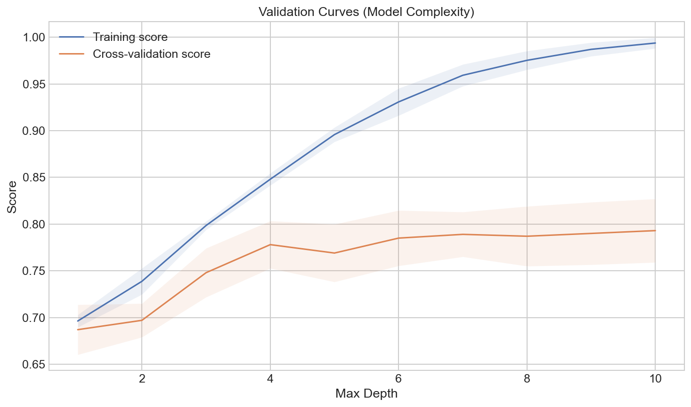
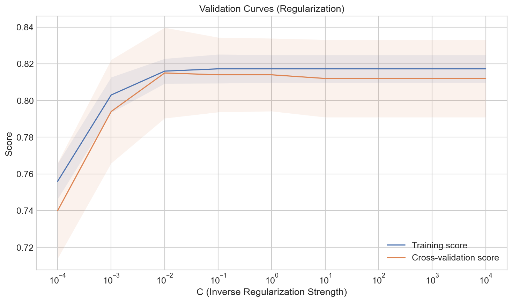
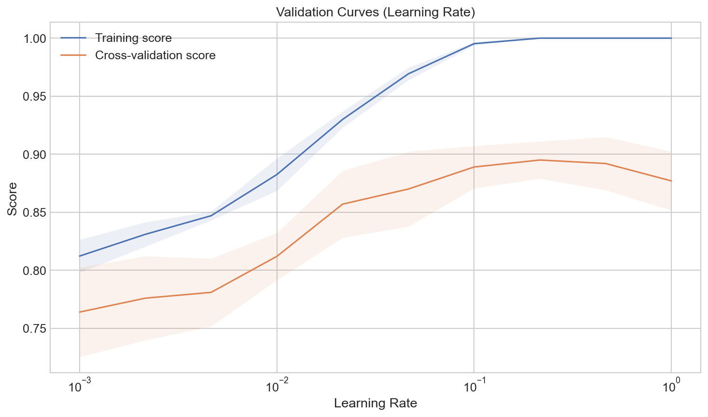
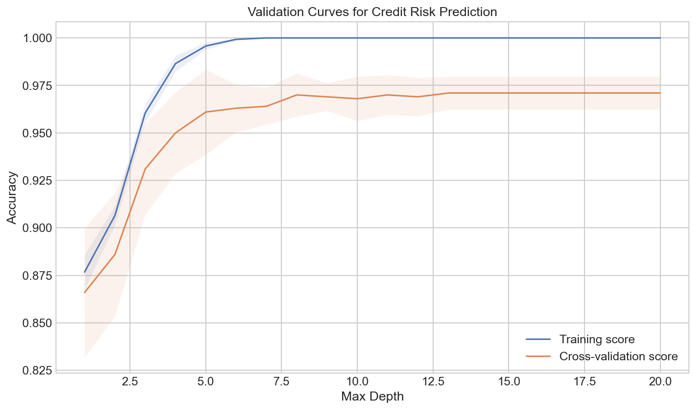

# Validation Curves

**After this lesson:** you can explain the core ideas in “Validation Curves” and reproduce the examples here in your own notebook or environment.

## Overview

**Validation curves** for a single hyperparameter: where the train/CV gap blows up (overfitting onset).

## Helpful video

StatQuest: why cross-validation matters for model evaluation.

<iframe width="560" height="315" src="https://www.youtube.com/embed/fSytzGwwBVw" title="Machine Learning Fundamentals: Cross Validation" frameborder="0" allow="accelerometer; autoplay; clipboard-write; encrypted-media; gyroscope; picture-in-picture" allowfullscreen></iframe>

## Introduction

Validation curves are essential tools in machine learning for understanding how a model's performance changes with different hyperparameter values. They help us find the optimal hyperparameter settings and diagnose issues like overfitting and underfitting.

## What are Validation Curves?

Validation curves plot the model's performance (typically error or accuracy) against different values of a hyperparameter. They show:

1. Training score
2. Validation score
3. The relationship between them



> **Figure (add screenshot or diagram):** A validation curve for tree `max_depth` (x-axis 1–20): training score (blue, stays high) and CV score (orange, peaks around depth 5–8 then drops), showing where overfitting starts.

## Types of Validation Curves

### 1. Model Complexity

#### `validation_curve` for tree depth

- **Purpose:** Sweep **`max_depth`** on a decision tree and plot **mean ± std** train vs CV scores—gap widening means overfitting as complexity grows.
- **Walkthrough:** `validation_curve` fits `cv` folds per depth; `axis=1` aggregates folds; `fill_between` shows variance across splits.


import numpy as np
import matplotlib.pyplot as plt
from sklearn.model_selection import validation_curve
from sklearn.tree import DecisionTreeClassifier
from sklearn.datasets import make_classification

# Generate sample data
X, y = make_classification(n_samples=1000, n_features=20, n_informative=15, random_state=42)

# Calculate validation curves
param_range = np.arange(1, 11)
train_scores, val_scores = validation_curve(
    DecisionTreeClassifier(random_state=42), X, y,
    param_name="max_depth", param_range=param_range,
    cv=5, scoring="accuracy", n_jobs=-1)

# Calculate mean and std
train_mean = np.mean(train_scores, axis=1)
train_std = np.std(train_scores, axis=1)
val_mean = np.mean(val_scores, axis=1)
val_std = np.std(val_scores, axis=1)

# Plot validation curves
plt.figure(figsize=(10, 6))
plt.plot(param_range, train_mean, label='Training score')
plt.plot(param_range, val_mean, label='Cross-validation score')
plt.fill_between(param_range, train_mean - train_std, train_mean + train_std, alpha=0.1)
plt.fill_between(param_range, val_mean - val_std, val_mean + val_std, alpha=0.1)
plt.xlabel('Max Depth')
plt.ylabel('Score')
plt.title('Validation Curves (Model Complexity)')
plt.legend(loc='best')
plt.grid(True)
plt.show()


<figure>

<figcaption>Figure 1: Validation Curves (Model Complexity)</figcaption>
</figure>

<aside class="code-explainer__callouts" aria-label="Code walkthrough">
  

    

      
      Sweep Max Depth
    

    

      
<code>validation_curve</code> fits 5 CV folds at each of 10 depth values; the output matrices (n_depths × n_folds) capture how score varies with complexity and split randomness.

    

  

  

    

      
      Aggregate and Plot
    

    

      
Take mean and std across folds (<code>axis=1</code>), then plot both curves with <code>fill_between</code> bands; a widening gap between training and CV scores signals the onset of overfitting.

    

  

</aside>

### 2. Regularization Strength

#### Logistic `C` on a log scale

- **Purpose:** See how **inverse regularization** `C` trades off bias and variance; uses the **same** `X, y` as the tree example above.
- **Walkthrough:** `semilogx` matches log-spaced `C`; smaller `C` = stronger L2 penalty in sklearn’s `LogisticRegression`.


from sklearn.linear_model import LogisticRegression

# Calculate validation curves
param_range = np.logspace(-4, 4, 9)
train_scores, val_scores = validation_curve(
    LogisticRegression(random_state=42), X, y,
    param_name="C", param_range=param_range,
    cv=5, scoring="accuracy", n_jobs=-1)

# Calculate mean and std
train_mean = np.mean(train_scores, axis=1)
train_std = np.std(train_scores, axis=1)
val_mean = np.mean(val_scores, axis=1)
val_std = np.std(val_scores, axis=1)

# Plot validation curves
plt.figure(figsize=(10, 6))
plt.semilogx(param_range, train_mean, label='Training score')
plt.semilogx(param_range, val_mean, label='Cross-validation score')
plt.fill_between(param_range, train_mean - train_std, train_mean + train_std, alpha=0.1)
plt.fill_between(param_range, val_mean - val_std, val_mean + val_std, alpha=0.1)
plt.xlabel('C (Inverse Regularization Strength)')
plt.ylabel('Score')
plt.title('Validation Curves (Regularization)')
plt.legend(loc='best')
plt.grid(True)
plt.show()


<figure>

<figcaption>Figure 2: Validation Curves (Regularization)</figcaption>
</figure>

<aside class="code-explainer__callouts" aria-label="Code walkthrough">
  

    

      
      Log-scale C Sweep
    

    

      
<code>logspace(-4, 4, 9)</code> generates nine values from 0.0001 to 10000; small <code>C</code> applies strong L2 regularization while large <code>C</code> approaches an unregularized fit.

    

  

  

    

      
      Semilog Plot
    

    

      
<code>semilogx</code> places the log-spaced <code>C</code> values evenly on the x-axis; the convergence of train and CV scores in the middle shows where regularization stops hurting and starts helping.

    

  

</aside>

### 3. Learning Rate

#### Gradient boosting `learning_rate`

- **Purpose:** Illustrate validation curves for **`learning_rate`** in `GradientBoostingClassifier`—too high can overfit; too low needs more trees.
- **Walkthrough:** Same `validation_curve` API with `param_name="learning_rate"`; compare train vs CV gap across rates.


from sklearn.ensemble import GradientBoostingClassifier

# Calculate validation curves
param_range = np.logspace(-3, 0, 10)
train_scores, val_scores = validation_curve(
    GradientBoostingClassifier(random_state=42), X, y,
    param_name="learning_rate", param_range=param_range,
    cv=5, scoring="accuracy", n_jobs=-1)

# Calculate mean and std
train_mean = np.mean(train_scores, axis=1)
train_std = np.std(train_scores, axis=1)
val_mean = np.mean(val_scores, axis=1)
val_std = np.std(val_scores, axis=1)

# Plot validation curves
plt.figure(figsize=(10, 6))
plt.semilogx(param_range, train_mean, label='Training score')
plt.semilogx(param_range, val_mean, label='Cross-validation score')
plt.fill_between(param_range, train_mean - train_std, train_mean + train_std, alpha=0.1)
plt.fill_between(param_range, val_mean - val_std, val_mean + val_std, alpha=0.1)
plt.xlabel('Learning Rate')
plt.ylabel('Score')
plt.title('Validation Curves (Learning Rate)')
plt.legend(loc='best')
plt.grid(True)
plt.show()


<figure>

<figcaption>Figure 3: Validation Curves (Learning Rate)</figcaption>
</figure>

<aside class="code-explainer__callouts" aria-label="Code walkthrough">
  

    

      
      Learning Rate Range
    

    

      
Sweep learning rate from 0.001 to 1.0 on a log scale; a very low rate needs more trees to converge while a very high rate can overfit with the default number of estimators.

    

  

  

    

      
      Gap Analysis
    

    

      
The same semilog plot pattern as the regularization example; a large train-CV gap at high learning rates identifies the overfitting regime for gradient boosting.

    

  

</aside>

## Interpreting Validation Curves

### 1. Overfitting

- Training score increases
- Validation score decreases
- Large gap between curves
- Need more regularization

### 2. Underfitting

- Both scores are low
- Small gap between curves
- Need more complexity
- More features might help

### 3. Good Fit

- Both scores are high
- Small gap between curves
- Optimal parameter found
- Model is well-tuned

## Best Practices

1. **Choose Appropriate Range**
   - Wide enough to see trends
   - Fine enough for precision
   - Log scale when needed

2. **Use Cross-Validation**
   - Multiple folds
   - Stratified sampling
   - Appropriate metrics

3. **Plot Confidence Intervals**
   - Show standard deviation
   - Multiple runs
   - Clear visualization

4. **Consider Multiple Parameters**
   - Grid search
   - Random search
   - Bayesian optimization

## Common Mistakes to Avoid

1. **Insufficient Range**
   - Too narrow
   - Missing optimal point
   - Wrong conclusions

2. **Poor Cross-Validation**
   - Not enough folds
   - Data leakage
   - Inappropriate metrics

3. **Misinterpretation**
   - Ignoring variance
   - Overlooking trends
   - Wrong conclusions

## Practical Example: Credit Risk Prediction

Let's analyze validation curves for a credit risk prediction model:

#### Pipeline + `classifier__max_depth` sweep

- **Purpose:** Tune **nested** hyperparameters: the forest lives inside a **Pipeline**, so use **`classifier__max_depth`** as `param_name`.
- **Walkthrough:** `validation_curve` clones the pipeline per depth; no manual train/test split here—the function does **internal CV** on `(X, y)`.


import numpy as np
import pandas as pd
import matplotlib.pyplot as plt
from sklearn.preprocessing import StandardScaler
from sklearn.pipeline import Pipeline
from sklearn.ensemble import RandomForestClassifier
from sklearn.model_selection import validation_curve

# Create credit risk dataset
np.random.seed(42)
n_samples = 1000

# Generate features
data = {
    'age': np.random.normal(35, 10, n_samples),
    'income': np.random.exponential(50000, n_samples),
    'credit_score': np.random.normal(700, 100, n_samples),
    'debt_ratio': np.random.beta(2, 5, n_samples),
    'employment_length': np.random.exponential(5, n_samples)
}

X = pd.DataFrame(data)
y = (X['credit_score'] + X['income']/1000 + X['age'] > 800).astype(int)

# Create pipeline
pipeline = Pipeline([
    ('scaler', StandardScaler()),
    ('classifier', RandomForestClassifier(random_state=42))
])

# Calculate validation curves
param_range = np.arange(1, 21)
train_scores, val_scores = validation_curve(
    pipeline, X, y,
    param_name="classifier__max_depth", param_range=param_range,
    cv=5, scoring="accuracy", n_jobs=-1)

# Calculate mean and std
train_mean = np.mean(train_scores, axis=1)
train_std = np.std(train_scores, axis=1)
val_mean = np.mean(val_scores, axis=1)
val_std = np.std(val_scores, axis=1)

# Plot validation curves
plt.figure(figsize=(10, 6))
plt.plot(param_range, train_mean, label='Training score')
plt.plot(param_range, val_mean, label='Cross-validation score')
plt.fill_between(param_range, train_mean - train_std, train_mean + train_std, alpha=0.1)
plt.fill_between(param_range, val_mean - val_std, val_mean + val_std, alpha=0.1)
plt.xlabel('Max Depth')
plt.ylabel('Accuracy')
plt.title('Validation Curves for Credit Risk Prediction')
plt.legend(loc='best')
plt.grid(True)
plt.show()


<figure>

<figcaption>Figure 4: Validation Curves for Credit Risk Prediction</figcaption>
</figure>

<aside class="code-explainer__callouts" aria-label="Code walkthrough">
  

    

      
      Credit Dataset and Pipeline
    

    

      
Generate the synthetic credit dataset and wrap a scaler+forest in a <code>Pipeline</code>; the pipeline object is passed directly to <code>validation_curve</code> so preprocessing runs correctly inside each fold.

    

  

  

    

      
      Nested Parameter Name
    

    

      
Use <code>classifier__max_depth</code> (double underscore) to reach through the pipeline and set the forest's depth; this pattern works for any nested step parameter in sklearn pipelines.

    

  

  

    

      
      Plot and Interpret
    

    

      
Plot mean ± std bands across depths 1–20; the depth where CV score peaks and the train-CV gap starts growing is the recommended operating depth for this credit model.

    

  

</aside>

## Gotchas

- **Misreading the y-axis direction** — `validation_curve` returns scores (higher is better), not errors; a rising training curve that diverges from a flat validation curve signals overfitting, but learners who expect an error plot may reverse their interpretation and increase complexity when they should reduce it.
- **Sweeping a linear range for parameters that need a log scale** — Regularization parameters like `C` in logistic regression span orders of magnitude; a linear sweep from 1 to 10 misses the critical low-`C` region where the model underfits; always use `np.logspace` for parameters whose effect is multiplicative.
- **Confusing the validation curve peak with the final model** — The hyperparameter value where the CV score peaks on a validation curve was selected by looking at validation data; that score is optimistic; use a separate test set or nested CV to get an unbiased performance estimate for the chosen setting.
- **Passing the full dataset to `validation_curve` and then also evaluating on a held-out test set drawn from the same data** — `validation_curve` uses internal cross-validation on whatever `X, y` you pass; if `X` already excludes your test split, this is fine, but passing all data and later claiming a separate test set breaks the independence requirement.
- **Drawing conclusions from noisy `fill_between` bands** — Wide standard-deviation bands across folds indicate the validation curve estimate is unreliable (often due to small datasets); increasing `cv` folds or dataset size before reading the curve will give cleaner, more actionable results.
- **Forgetting to use the `classifier__` prefix for pipeline parameters** — When the estimator is wrapped in a `Pipeline`, the `param_name` argument must use the double-underscore notation (e.g., `"classifier__max_depth"`); omitting the step prefix raises a `ValueError` that is easy to misread as a data problem.

## Additional Resources

1. Scikit-learn documentation on validation curves
2. Research papers on hyperparameter tuning
3. Online tutorials on model evaluation
4. Books on machine learning optimization
